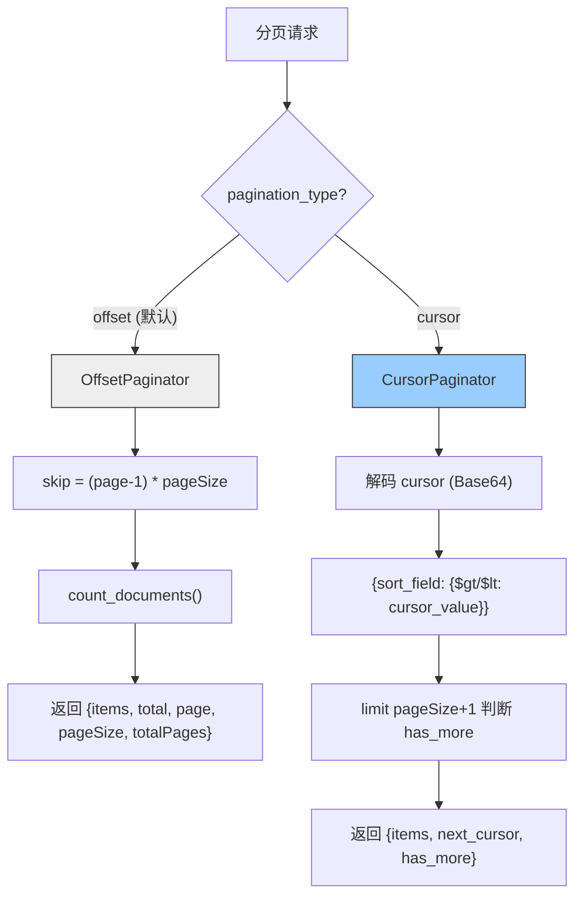

---

doc_type: module
prd_task_id: "YA-09-50"
title: "YA-09-50: 统一分页规范 — offset + cursor 两种模式 — 开发方案"
status: 需求已编写
priority: P2
owner: 陈铭
roles: [engineer]
created: 2026-09-11
updated: 2026-09-23
project: YiAi
project_id: yiai
prd_month: "202609"
estimate_frontend: 1.0
source_prd: "64-需求-统一分页规范.md"
source_okr: [yiai-001]

type: task
---

# YA-09-50: 统一分页规范 — offset + cursor 两种模式 — 开发方案

> **文档职责**：本文档定义**怎么做、为什么这么做、实际做成什么样**（HOW），不含产品目标与测试用例。

> 来源 PRD：[64-需求-统一分页规范.md](../../prds/2026-09/64-需求-统一分页规范.md)
> 需求编号：YA-09-50 · 优先级：P2 · 人天：1.0d · 状态：需求已编写

---

<a id="sec-1"></a>
## 一、架构总览

YiAi 当前所有查询统一使用 Offset 分页（`page` + `pageSize`），在大数据集和实时数据场景下存在翻页漂移和性能退化问题（`skip(10000)` 耗时 200ms+）。引入 Cursor 游标分页作为 Offset 的补充方案，通过 `pagination_type` 参数按场景选择。管理后台/静态数据用 Offset（支持跳页、总数），实时数据/无限滚动用 Cursor（无漂移、O(1) 定位）。



**选择策略**：静态数据/管理后台（需要跳页功能）用 Offset，实时数据（sessions/通知/审计日志）/大数据集（> 1000 条）用 Cursor。前端通过参数选择最适合场景的分页方式。

---

<a id="sec-2"></a>
## 二、文件清单

| 文件 | 操作 | 说明 |
|------|------|------|
| `YiAi/src/shared/pagination.py` | 新增 | OffsetPaginator + CursorPaginator + PaginationFactory |
| `YiAi/src/domain/data/repository.py` | 修改 | 使用统一分页模块替代内联分页逻辑 |
| `YiAi/tests/test_pagination.py` | 新增 | 分页 8+ 场景测试 |

---

<a id="sec-3"></a>
## 三、模块设计

### 3.1 数据模型

```python
# YiAi/src/shared/pagination.py
from dataclasses import dataclass, field
from enum import Enum
from typing import Optional, Any

class PaginationType(str, Enum):
    OFFSET = 'offset'
    CURSOR = 'cursor'

@dataclass
class PaginationParams:
    """分页请求参数。"""
    type: PaginationType = PaginationType.OFFSET
    page: int = 1                    # Offset: 页码 (1-based)
    page_size: int = 20              # 每页条数
    cursor: Optional[str] = None     # Cursor: 上一页最后一条的游标
    sort_field: str = '_id'          # Cursor: 排序字段
    sort_order: int = -1             # -1=降序, 1=升序
    include_total: bool = False      # Cursor: 是否返回总数（开销大）

@dataclass
class PageResponse:
    """统一分页响应。Offset 和 Cursor 使用不同字段子集。"""
    items: list[dict]
    pagination: dict
    total: Optional[int] = None       # Offset: 总条数
    page: Optional[int] = None        # Offset: 当前页码
    page_size: Optional[int] = None   # 通用: 每页条数
    total_pages: Optional[int] = None # Offset: 总页数
    next_cursor: Optional[str] = None # Cursor: 下一页游标
    has_more: Optional[bool] = None   # Cursor: 是否有下一页
```

### 3.2 OffsetPaginator

```python
class OffsetPaginator:
    """Offset 分页——适合静态数据和管理后台。

    特性: 支持跳页、显示总数、传统分页 UI。
    限制: pageSize 上限 200，大 skip 值性能差。
    """

    MAX_PAGE_SIZE = 200

    async def paginate(self, collection, filter: dict = None,
                       sort: list = None, params: PaginationParams = None) -> PageResponse:
        """skip = (page-1)*pageSize, count_documents, limit 查询。
        返回 {items, total, page, pageSize, totalPages, pagination: {type: 'offset'}}
        """
```

### 3.3 CursorPaginator

```python
class CursorPaginator:
    """Cursor 游标分页——适合实时数据和无限滚动。

    特性: 无翻页漂移、O(1) 定位不随偏移量退化、适合大数据集。
    限制: 不支持跳页、排序字段建议有索引、游标不可跨排序字段。
    游标编码: Base64 JSON 格式 {v: cursor_value}，防止前端直接依赖内部格式。
    """

    MAX_PAGE_SIZE = 100

    async def paginate(self, collection, filter: dict = None,
                       params: PaginationParams = None) -> PageResponse:
        """解码 cursor → sort_field {$gt/$lt cursor_value} → limit pageSize+1 → 判断 has_more。
        返回 {items, next_cursor, has_more, pagination: {type: 'cursor', sort_field}}
        """
        ...

    def _encode_cursor(self, value: Any) -> str:
        """Base64(urlsafe) 编码游标值。兼容 ObjectId 和 datetime。"""
        ...

    def _decode_cursor(self, cursor: str) -> Any:
        """Base64 解码游标值。无效游标抛 ValueError。"""
        ...
```

### 3.4 PaginationFactory

```python
class PaginationFactory:
    """分页工厂——按 pagination_type 自动选择分页器。"""

    def __init__(self):
        self._offset = OffsetPaginator()
        self._cursor = CursorPaginator()

    def get_paginator(self, params: PaginationParams):
        return self._cursor if params.type == PaginationType.CURSOR else self._offset

    async def paginate(self, collection, filter=None, sort=None,
                       params: PaginationParams = None) -> PageResponse:
        """统一分页入口。"""
```

### 3.5 统一响应格式

```typescript
// Offset 分页响应
{ items: [...], total: 150, page: 2, pageSize: 20, totalPages: 8, pagination: { type: "offset" } }

// Cursor 分页响应
{ items: [...], next_cursor: "eyJ2IjoiNjc4...", has_more: true, pagination: { type: "cursor", sort_field: "_id" } }
```

---

<a id="sec-4"></a>
## 四、数据流

```
分页请求 (PaginationParams)
  → PaginationFactory.paginate(collection, filter, sort, params)
    → params.type == 'offset':
      → OffsetPaginator:
        skip = (page-1) * pageSize
        total = await count_documents(filter)
        items = await find(filter).sort(sort).skip(skip).limit(pageSize).to_list()
        totalPages = ceil(total / pageSize)
      → PageResponse{items, total, page, pageSize, totalPages}

    → params.type == 'cursor':
      → CursorPaginator:
        cursor_value = decode(cursor) if cursor else None
        filter[sort_field] = {$gt: cursor_value} if sort_order == 1 else {$lt: cursor_value}
        items = await find(filter).sort(sort_field, sort_order).limit(pageSize+1).to_list()
        has_more = len(items) > pageSize
        items = items[:pageSize]
        next_cursor = encode(items[-1][sort_field]) if has_more else None
      → PageResponse{items, next_cursor, has_more}
```

---

<a id="sec-5"></a>
## 五、实施路线

| # | 步骤 | 产出 | 验证 | 人天 |
|---|------|------|------|------|
| 1 | 创建分页数据模型 + OffsetPaginator | `pagination.py` | 单元测试：Offset 分页逻辑 | 0.2 |
| 2 | 创建 CursorPaginator + 游标编解码 | `pagination.py` | 游标 encode/decode 往返测试 | 0.25 |
| 3 | 创建 PaginationFactory | `pagination.py` | 按 type 自动选择分页器 | 0.1 |
| 4 | 重构 repository 使用统一分页 | `repository.py` | 现有 Offset 分页功能不变 | 0.15 |
| 5 | 为实时数据 (sessions) 添加 Cursor 分页 | `repository.py` | sessions 列表使用 Cursor 模式 | 0.1 |
| 6 | 测试用例 | `tests/test_pagination.py` | 8+ 场景：Offset/Cursor/翻页/末页/漂移/超限/无效游标 | 0.1 |
| 7 | 端到端验证 | 全栈 | YiVad 分页功能正常 | 0.1 |

**合计：1.0d**

---

<a id="sec-6"></a>
## 六、代码审查检查清单

- [ ] 统一分页参数：`page`（1-based）+ `pageSize`（默认 20）
- [ ] Offset 响应：`{items, total, page, pageSize, totalPages, pagination}`
- [ ] Cursor 响应：`{items, next_cursor, has_more, pagination}`
- [ ] Cursor 模式用 `pageSize+1` 判断 `has_more`，不额外 count
- [ ] 游标 Base64 编码（不暴露原始 ObjectId）
- [ ] 无效游标返回明确 ValueError（非 500）
- [ ] `pageSize` 上限 Offset 200 / Cursor 100
- [ ] 排序字段无索引时日志提示（INFO 级别）
- [ ] 响应 `pagination.type` 字段区分 Offset/Cursor
- [ ] 单元测试覆盖：Offset/Cursor/翻页/末页/漂移/超限/无效游标/编解码往返

---

<a id="sec-7"></a>
## 七、风险评估

| 风险 | 概率 | 影响 | 缓解措施 |
|------|------|------|----------|
| 旧前端不识别 Cursor 响应格式 | 中 | 中 | Offset 保持默认，前端选择性使用 Cursor |
| 游标分页在数据变更时丢数据 | 低 | 中 | 文档注明 Cursor 适用场景和限制 |
| 排序字段无索引导致 Cursor 性能差 | 中 | 中 | 文档建议排序字段加索引，日志提示 |
| 游标编解码往返不一致 | 低 | 中 | 编解码往返单元测试 |
| 大偏移量 Offset 查询超时 | 低 | 中 | 监控 skip > 1000 时建议改用 Cursor |

**回滚**：前端请求不传 `pagination_type: cursor`，退回到 Offset 分页。Cursor 模块独立不影响现有逻辑。