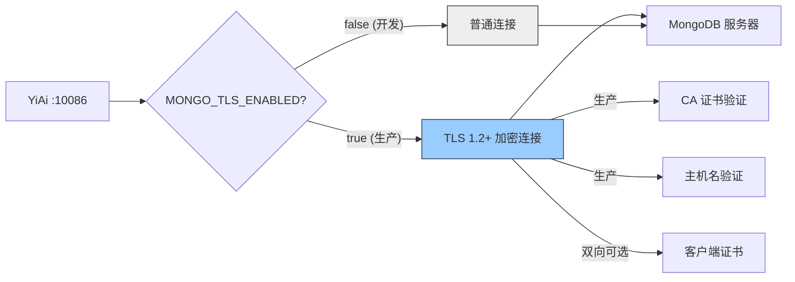

---

doc_type: module
prd_task_id: "YA-09-63"
title: "YA-09-63: 数据库 TLS 加密 — 传输层安全 + 证书管理 — 开发方案"
status: 需求已编写
priority: P2
owner: 陈铭
roles: [engineer]
created: 2026-09-11
updated: 2026-09-23
project: YiAi
project_id: yiai
prd_month: "202609"
estimate_frontend: 0.5
source_prd: "65-需求-数据库TLS加密.md"
source_okr: [yiai-001]

type: task
---

# YA-09-63: 数据库 TLS 加密 — 传输层安全 + 证书管理 — 开发方案

> **文档职责**：本文档定义**怎么做、为什么这么做、实际做成什么样**（HOW），不含产品目标与测试用例。

> 来源 PRD：[65-需求-数据库TLS加密.md](../../prds/2026-09/65-需求-数据库TLS加密.md)
> 需求编号：YA-09-63 · 优先级：P2 · 人天：0.5d · 状态：需求已编写
> 依赖：YA-09-39（敏感信息加密）

---

<a id="sec-1"></a>
## 一、架构总览

YiAi 与 MongoDB 之间的连接当前默认不加密，所有数据（用户聊天内容、Agent 决策数据、认证凭证）以明文传输。在生产环境和云部署场景下，存在中间人窃听和数据篡改风险。通过为 MongoDB 连接启用 TLS 1.2+ 传输加密，按环境分层配置证书验证策略。



**环境分层策略**：开发环境默认 TLS 禁用（localhost 无风险），可通过 `MONGO_TLS_ENABLED=true` 启用；生产环境强制启用 TLS，`MONGO_TLS_INSECURE` 仅在开发环境允许跳过证书验证。

---

<a id="sec-2"></a>
## 二、文件清单

| 文件 | 操作 | 说明 |
|------|------|------|
| `YiAi/src/domain/data/database.py` | 修改 | 添加 `_get_tls_config()` + `check_tls_status()` |
| `YiAi/.env.example` | 修改 | 添加 TLS 相关环境变量 |
| `YiAi/scripts/generate_mongo_certs.sh` | 新增 | 开发环境自签名证书生成脚本 |
| `YiAi/tests/test_database_tls.py` | 新增 | TLS 连接 5+ 场景测试 |

---

<a id="sec-3"></a>
## 三、模块设计

### 3.1 TLS 配置函数

```python
# YiAi/src/domain/data/database.py
import os, ssl

def _get_tls_config() -> dict:
    """获取 MongoDB TLS 配置——按环境分层。

    环境变量:
        MONGO_TLS_ENABLED: 启用 TLS ('true'/'1')
        MONGO_TLS_CA_FILE: CA 证书路径（PEM 格式）
        MONGO_TLS_CERT_FILE: 客户端证书路径（双向 TLS，可选）
        MONGO_TLS_INSECURE: 不安全模式（跳过验证，仅开发环境）

    返回: Motor AsyncIOMotorClient 的 tls 相关 kwargs
    """
    if os.environ.get('MONGO_TLS_ENABLED', '').lower() not in ('true', '1'):
        return {}

    config = {
        'tls': True,
        'tlsAllowInvalidHostnames': False,
        'tlsAllowInvalidCertificates': False,
    }

    ca_file = os.environ.get('MONGO_TLS_CA_FILE')
    if ca_file:
        config['tlsCAFile'] = ca_file

    cert_file = os.environ.get('MONGO_TLS_CERT_FILE')
    if cert_file:
        config['tlsCertificateKeyFile'] = cert_file

    # 开发环境宽松模式
    if os.environ.get('MONGO_TLS_INSECURE', '').lower() in ('true', '1'):
        config['tlsAllowInvalidHostnames'] = True
        config['tlsAllowInvalidCertificates'] = True
        logger.warning('[Database] TLS 不安全模式——仅用于开发环境')

    return config
```

### 3.2 MongoDB 客户端构造

```python
# 集成 TLS 配置到 AsyncIOMotorClient
client = AsyncIOMotorClient(
    os.environ.get('MONGODB_URI', 'mongodb://localhost:27017'),
    minPoolSize=10,
    maxPoolSize=100,
    serverSelectionTimeoutMS=5000,
    connectTimeoutMS=5000,
    **_get_tls_config(),
)
```

### 3.3 TLS 状态检查

```python
async def check_tls_status() -> dict:
    """检查当前连接 TLS 状态——用于 /health/debug。

    返回:
        {tls_enabled: bool, server_version: str, authenticated_users: list}
    """
    try:
        result = await client.admin.command('connectionStatus')
        conn_info = result.get('connectionStatus', {})
        return {
            'tls_enabled': 'SSL' in str(conn_info) or 'TLS' in str(conn_info),
            'server_version': result.get('version', 'unknown'),
            'authenticated_users': result.get('authInfo', {}).get('authenticatedUsers', []),
        }
    except Exception as e:
        return {'tls_enabled': False, 'error': str(e)}
```

### 3.4 自签名证书生成脚本

```bash
#!/bin/bash
# YiAi/scripts/generate_mongo_certs.sh
# 为开发环境生成 MongoDB TLS 自签名证书

openssl req -newkey rsa:2048 -nodes -keyout mongo-key.pem \
  -x509 -days 365 -out mongo-cert.pem \
  -subj "/CN=localhost"

cat mongo-key.pem mongo-cert.pem > mongo.pem
echo "证书已生成: mongo.pem (开发环境)"
echo "设置环境变量: export MONGO_TLS_CA_FILE=./mongo.pem"
echo "设置环境变量: export MONGO_TLS_INSECURE=true  # 跳过验证"
```

---

<a id="sec-4"></a>
## 四、数据流

```
YiAi 启动
  → database.py 加载 _get_tls_config()
    → MONGO_TLS_ENABLED == 'true'/'1':
      → 构造 AsyncIOMotorClient(..., tls=True, tlsCAFile=..., ...)
      → MongoDB 连接建立时完成 TLS 握手（+10ms 首次延迟）
      → 连接池复用期间无额外开销
    → MONGO_TLS_ENABLED 未设置或 false:
      → 构造 AsyncIOMotorClient(uri) 无 TLS 参数
      → 普通 TCP 连接
  → /health/debug → check_tls_status() → 返回 TLS 状态
```

**TLS 开销**：首次连接握手 +10ms，连接池复用后查询延迟无增加。数据传输量增加约 5%（TLS 记录层开销），CPU 增加 2-5%。

---

<a id="sec-5"></a>
## 五、实施路线

| # | 步骤 | 产出 | 验证 | 人天 |
|---|------|------|------|------|
| 1 | 实现 `_get_tls_config()` | `database.py` | 环境变量控制 TLS 开关 | 0.1 |
| 2 | 集成到 AsyncIOMotorClient 构造 | `database.py` | `tls=true` 连接成功 | 0.1 |
| 3 | 实现 `check_tls_status()` | `database.py` | `/health/debug` 查看 TLS 状态 | 0.05 |
| 4 | 编写证书生成脚本 | `scripts/generate_mongo_certs.sh` | 自签名证书可成功连接 | 0.05 |
| 5 | 配置环境变量文档 | `.env.example` | 生产环境 TLS 配置说明 | 0.05 |
| 6 | 测试用例 | `tests/test_database_tls.py` | 5+ 场景：启用/禁用/不安全/证书失败/双向TLS | 0.1 |
| 7 | 端到端验证 | 全栈 | TLS 连接 + 数据传输正常 | 0.05 |

**合计：0.5d**

---

<a id="sec-6"></a>
## 六、代码审查检查清单

- [ ] MongoDB 连接支持 TLS/SSL 加密（通过环境变量控制）
- [ ] 生产环境证书验证：`tlsAllowInvalidCertificates=false`
- [ ] 生产环境主机名验证：`tlsAllowInvalidHostnames=false`
- [ ] TLS 版本最低 1.2（由 MongoDB 驱动和服务器协商）
- [ ] 开发环境支持不安全模式（`MONGO_TLS_INSECURE=true`）
- [ ] 不安全模式仅限开发环境使用（生产环境部署时禁止设置）
- [ ] 证书路径通过环境变量配置（不硬编码）
- [ ] TLS 状态可在 `/health/debug` 查询
- [ ] 连接池复用后 TLS 无额外延迟
- [ ] 测试覆盖：启用/禁用/不安全模式/证书验证失败/双向 TLS

---

<a id="sec-7"></a>
## 七、风险评估

| 风险 | 概率 | 影响 | 缓解措施 |
|------|------|------|----------|
| 自签名证书在开发环境被拒 | 中 | 低 | `MONGO_TLS_INSECURE=true` 跳过验证 |
| TLS 握手增加首次连接延迟 | 高 | 低 | 连接池复用避免重复握手，+10ms 仅首次 |
| 证书过期导致生产服务中断 | 低 | 高 | 健康检查返回证书有效期，到期前 30 天告警 |
| 生产环境误用不安全模式 | 低 | 高 | 部署脚本检查 `MONGO_TLS_INSECURE` 未设置 |
| 与旧版 MongoDB (< 3.0) 不兼容 | 低 | 中 | 要求 MongoDB >= 4.0 |

**回滚**：设置 `MONGO_TLS_ENABLED=false` 并重启服务，恢复非加密连接。TLS 配置通过环境变量控制，零代码变更。