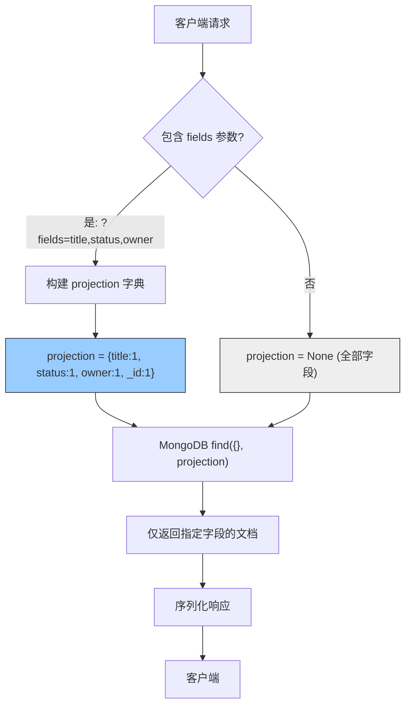

---

doc_type: module
prd_task_id: "YA-09-76"
title: "YA-09-76: 响应字段裁剪 — Sparse Fieldsets 按需返回 — 开发方案"
status: 需求已编写
priority: P2
owner: 陈铭
roles: [engineer]
created: 2026-09-11
updated: 2026-09-23
project: YiAi
project_id: yiai
prd_month: "202609"
estimate_frontend: 0.5
source_prd: "66-需求-响应字段裁剪.md"
source_okr: [yiai-001]

type: task
---

# YA-09-76: 响应字段裁剪 — Sparse Fieldsets 按需返回 — 开发方案

> **文档职责**：本文档定义**怎么做、为什么这么做、实际做成什么样**（HOW），不含产品目标与测试用例。

> 来源 PRD：[66-需求-响应字段裁剪.md](../../prds/2026-09/66-需求-响应字段裁剪.md)
> 需求编号：YA-09-76 · 优先级：P2 · 人天：0.5d · 状态：需求已编写

---

<a id="sec-1"></a>
## 一、架构总览

YiAi 当前 API 响应返回完整的 MongoDB 文档（包括 `_id`、`created_at`、`updated_at`、大段文本等所有字段），在列表场景中大量无用字段浪费带宽和解析时间。引入 Sparse Fieldsets 机制，允许客户端通过 `fields` 参数指定返回字段子集。底层利用 MongoDB 的 `projection` 能力，在查询阶段就裁剪字段，避免传输和序列化无用数据。



**核心收益**：列表查询（sessions 20KB/doc → 200B/doc）节省 99% 带宽，详情页可选择返回全部字段。利用 MongoDB projection 在存储层裁剪，而非应用层过滤。

---

<a id="sec-2"></a>
## 二、文件清单

| 文件 | 操作 | 说明 |
|------|------|------|
| `YiAi/src/shared/fieldsets.py` | 新增 | FieldsetProjection 构建器 + 白名单校验 |
| `YiAi/src/services/data/data_service.py` | 修改 | `query_documents` 接受 `fields` 参数 |
| `YiAi/src/domain/data/repository.py` | 修改 | `find` 查询传入 `projection` |
| `YiAi/tests/test_fieldsets.py` | 新增 | 字段裁剪 6+ 场景测试 |

---

<a id="sec-3"></a>
## 三、模块设计

### 3.1 FieldsetProjection

```python
# YiAi/src/shared/fieldsets.py
from typing import Optional

class FieldsetProjection:
    """Sparse Fieldsets 投影构建器。

    将客户端 fields 字符串解析为 MongoDB projection 字典。
    支持按集合自定义字段白名单（防止查询无索引字段影响性能）。
    """

    # 每个集合的推荐字段（有索引，查询高效）
    COLLECTION_FIELDS: dict[str, set[str]] = {
        'bugs': {'title', 'severity', 'status', 'project', 'owner', 'created_at', 'updated_at'},
        'sessions': {'title', 'tags', 'created_at', 'updated_at', 'message_count'},
        'knowledge_files': {'title', 'tags', 'category', 'path', 'created_at', 'updated_at'},
    }

    @staticmethod
    def build_projection(fields: Optional[str], collection: str = None) -> Optional[dict]:
        """解析 fields 参数为 MongoDB projection。

        Args:
            fields: 逗号分隔的字段名，如 "title,status,owner"
            collection: 集合名（可选，用于字段白名单校验）

        Returns:
            MongoDB projection dict，如 {title: 1, status: 1, _id: 1}
            非法字段被静默忽略，至少返回 _id
        """
        if not fields:
            return None

        field_list = [f.strip() for f in fields.split(',') if f.strip()]

        # 字段白名单过滤（可选）
        if collection and collection in cls.COLLECTION_FIELDS:
            allowed = cls.COLLECTION_FIELDS[collection]
            field_list = [f for f in field_list if f in allowed]

        projection = {f: 1 for f in field_list}
        projection['_id'] = 1  # 始终返回 _id

        return projection

    @staticmethod
    def build_exclude(fields: Optional[str]) -> Optional[dict]:
        """反向模式：排除指定字段（如排除 large_content）。

        使用方式: ?exclude=content,embedding  → projection = {content:0, embedding:0}
        """
        if not fields:
            return None
        field_list = [f.strip() for f in fields.split(',') if f.strip()]
        return {f: 0 for f in field_list}
```

### 3.2 data_service 集成

```python
# YiAi/src/services/data/data_service.py
from shared.fieldsets import FieldsetProjection

async def query_documents(self, cname: str, filter: dict = None,
                          fields: str = None,  # 新增参数
                          page: int = 1, pageSize: int = 20):
    projection = FieldsetProjection.build_projection(fields, collection=cname)
    return await self.repo.query(cname, filter, projection, page, pageSize)
```

### 3.3 典型收益

| 端点 | 完整字段数 | 裁剪后字段数 | 单文档体积 | 节省 |
|------|----------|------------|----------|------|
| `GET /sessions?fields=title,updated` | 15+ | 2 | 20KB → 200B | 99% |
| `GET /bugs?fields=title,severity,status` | 20+ | 3 | 3KB → 300B | 90% |
| `GET /knowledge/list?fields=title,tags` | 12+ | 2 | 5KB → 500B | 90% |

---

<a id="sec-4"></a>
## 四、数据流

```
客户端请求: POST / {module: "services.data.data_service", method: "query_documents",
                     params: {cname: "sessions", fields: "title,tags,created_at"}}

  → data_service.query_documents(cname, filter, fields)
    → FieldsetProjection.build_projection("title,tags,created_at", "sessions")
      → 按 sessions 白名单过滤: [title, tags, created_at]
      → 构建 projection: {title: 1, tags: 1, created_at: 1, _id: 1}
    → repository.query(cname, filter, projection)
      → collection.find(filter, projection=projection)  ← MongoDB 层面裁剪
    → 返回仅含指定字段的文档列表
```

**MongoDB 层面裁剪**：`projection` 传递给 `find()`，MongoDB 在读取文档时就裁剪字段，网络传输和内存占用同步减少。

---

<a id="sec-5"></a>
## 五、实施路线

| # | 步骤 | 产出 | 验证 | 人天 |
|---|------|------|------|------|
| 1 | 创建 FieldsetProjection | `fieldsets.py` | 单元测试：字段解析 + 白名单过滤 | 0.1 |
| 2 | 定义各集合推荐字段白名单 | `fieldsets.py` | `COLLECTION_FIELDS` 覆盖主要集合 | 0.05 |
| 3 | 集成 `fields` 参数到 `query_documents` | `data_service.py` | RPC 传入 fields 参数 → 裁剪响应 | 0.1 |
| 4 | modification repository 传递 projection | `repository.py` | MongoDB projection 生效 | 0.05 |
| 5 | 添加 `exclude` 反向模式 | `fieldsets.py` | `?exclude=content` 排除大字段 | 0.05 |
| 6 | 测试用例 | `tests/test_fieldsets.py` | 6+ 场景：单字段/多字段/白名单/非法字段/exclude | 0.1 |
| 7 | 端到端验证 | 全栈 | YiVad 列表页响应体积明显减小 | 0.05 |

**合计：0.5d**

---

<a id="sec-6"></a>
## 六、代码审查检查清单

- [ ] `fields` 参数解析：逗号分隔 → projection dict
- [ ] `_id` 字段始终包含在 projection 中
- [ ] 按集合白名单过滤非法字段（防止无索引字段查询）
- [ ] `fields` 为空时 projection=None（返回全部字段，向后兼容）
- [ ] 支持 `exclude` 反向模式（排除大字段如 content/embedding）
- [ ] MongoDB `projection` 在 `find()` 阶段生效（非应用层过滤）
- [ ] 单元测试覆盖：单字段/多字段/白名单/非法字段/exclude/空 fields
- [ ] 前端（YiVad/YiPet）列表请求可选择性使用 fields 参数

---

<a id="sec-7"></a>
## 七、风险评估

| 风险 | 概率 | 影响 | 缓解措施 |
|------|------|------|----------|
| 客户端字段名拼写错误导致空响应 | 中 | 低 | 静默忽略无效字段，至少返回 _id |
| 白名单遗漏新增字段 | 低 | 低 | `COLLECTION_FIELDS` 非强制，无白名单时不校验 |
| projection 与索引不匹配导致性能下降 | 低 | 中 | 白名单只包含有索引的字段 |
| 前端误用 fields 导致 UI 数据缺失 | 中 | 中 | 不传 fields 时返回全部字段（向后兼容） |

**回滚**：前端不传 `fields` 参数，恢复返回全部字段。`FieldsetProjection` 模块可安全保留不影响现有逻辑。