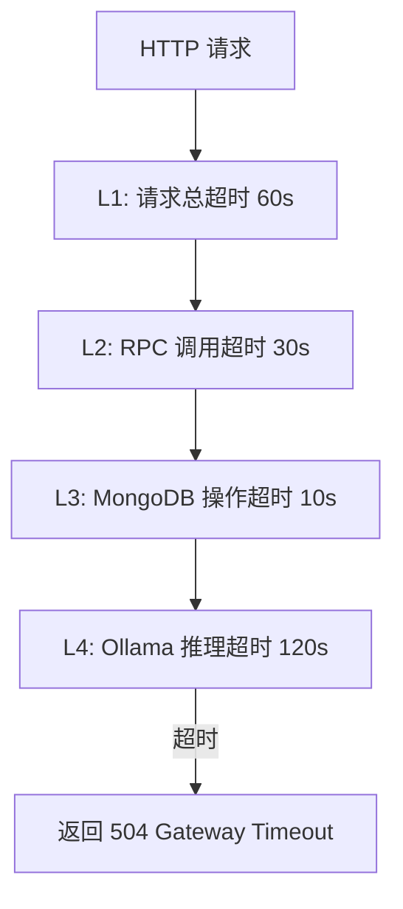

# YA-09-19: 全局超时控制 — 分层超时 + 断路器 — 开发方案

> **文档职责**：本文档定义**怎么做、为什么这么做、实际做成什么样**（HOW），不含产品目标与测试用例。

> 来源 PRD：[67-需求-全局超时控制.md](../../prds/2026-09/67-需求-全局超时控制.md)
> 需求编号：YA-09-19 · 优先级：P1 · 人天：1.0d · 状态：需求已编写

---

<a id="sec-1"></a>
## 一、方案

FastAPI 中间件层统一超时控制——每层设定硬超时，防止单点阻塞扩散。



### 超时配置

| 层级 | 默认值 | 配置键 |
|------|--------|--------|
| HTTP 请求总超时 | 60s | `timeout.request_total` |
| RPC 方法调用 | 30s | `timeout.rpc_method` |
| MongoDB 操作 | 10s | `timeout.mongodb_operation` |
| Ollama 推理 | 120s | `timeout.ollama_inference` |

### 中间件实现

```python
@app.middleware("http")
async def timeout_middleware(request, call_next):
    try:
        return await asyncio.wait_for(call_next(request), timeout=60)
    except asyncio.TimeoutError:
        return JSONResponse(status_code=504, content={"error": "Request timeout"})
```

---

<a id="sec-2"></a>
## 二、实施步骤

| 步骤 | 验证 | 人天 |
|------|------|------|
| 1 | `asyncio.wait_for` 中间件 | 超时请求返回 504 | 0.5 |
| 2 | 分层超时 + 配置化 + 测试 | 各层超时独立生效 | 0.5 |

**合计：1.0d**。

---

<a id="sec-3"></a>
## 三、关联模块

- 集成：[YA-09-02 Agent 超时保护](./07-prd-task-Agent可靠性.md)
- 关联：[请求超时取消传播](./115-prd-task-请求超时取消传播.md)