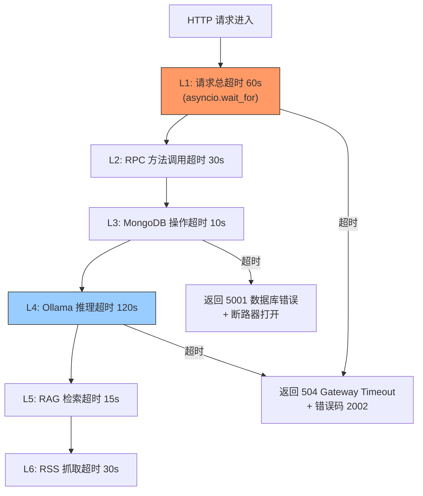

---

doc_type: module
prd_task_id: "YA-09-19"
title: "YA-09-19: 全局超时控制 — 分层超时 + 断路器 — 开发方案"
status: 需求已编写
priority: P1
owner: 陈铭
roles: [engineer]
created: 2026-09-11
updated: 2026-09-23
project: YiAi
project_id: yiai
prd_month: "202609"
estimate_frontend: 1.0
source_prd: "67-需求-全局超时控制.md"
source_okr: [yiai-001]

type: task
---

# YA-09-19: 全局超时控制 — 分层超时 + 断路器 — 开发方案

> **文档职责**：本文档定义**怎么做、为什么这么做、实际做成什么样**（HOW），不含产品目标与测试用例。

> 来源 PRD：[67-需求-全局超时控制.md](../../prds/2026-09/67-需求-全局超时控制.md)
> 需求编号：YA-09-19 · 优先级：P1 · 人天：1.0d · 状态：需求已编写

---

<a id="sec-1"></a>
## 一、架构总览

YiAi 各模块超时配置分散且不一致——Agent 循环硬编码 300s、Ollama 调用 30s、MongoDB 查询 30s、RAG 检索无超时。缺少全局统一的超时控制导致超时设定不合理或不完整。建立分层超时体系，每层设定独立硬超时，通过 asyncio.wait_for 实现，防止单点阻塞扩散到整个请求链路。


```mermaid
flowchart TD
    REQ["HTTP 请求进入"] --> T1["L1: 请求总超时 60s\n(asyncio.wait_for)"]
    T1 --> T2["L2: RPC 方法调用超时 30s"]
    T2 --> T3["L3: MongoDB 操作超时 10s"]
    T3 --> T4["L4: Ollama 推理超时 120s"]
    T4 --> T5["L5: RAG 检索超时 15s"]
    T5 --> T6["L6: RSS 抓取超时 30s"]
    T4 -- "超时" --> ERR["返回 504 Gateway Timeout\n+ 错误码 2002"]
    T3 -- "超时" --> ERR2["返回 5001 数据库错误\n+ 断路器打开"]
    T1 -- "超时" --> ERR

    style T1 fill:#f96,stroke:#333
    style T4 fill:#9cf,stroke:#333
```

**分层原则**：外层超时 > 内层超时之和，确保内层优先触发。断路器在连续超时后熔断，防止重复请求堆积。

---

<a id="sec-2"></a>
## 二、文件清单

| 文件 | 操作 | 说明 |
|------|------|------|
| `YiAi/src/server/timeout.py` | 新增 | TimeoutConfig + layed_timeout 中间件 |
| `YiAi/src/server/main.py` | 修改 | 注册超时中间件 |
| `YiAi/src/shared/circuit_breaker.py` | 新增 | 两级断路器（MongoDB/Ollama） |
| `YiAi/config.yaml` | 修改 | 超时配置项 |
| `YiAi/tests/test_timeout.py` | 新增 | 超时 + 断路器测试 |

---

<a id="sec-3"></a>
## 三、模块设计

### 3.1 TimeoutConfig

```python
# YiAi/src/server/timeout.py
from dataclasses import dataclass
import asyncio
from fastapi import Request
from fastapi.responses import JSONResponse

@dataclass
class TimeoutConfig:
    """分层超时配置——从 config.yaml 加载。"""
    http_request_total: float = 60.0     # L1: HTTP 请求总超时
    rpc_method: float = 30.0             # L2: RPC 方法调用
    mongodb_operation: float = 10.0      # L3: MongoDB 操作
    ollama_inference: float = 120.0      # L4: Ollama 推理
    rag_retrieval: float = 15.0          # L5: RAG 检索
    rss_fetch: float = 30.0              # L6: RSS 抓取

class TimeoutMiddleware:
    """分层超时中间件——FastAPI middleware。

    使用 asyncio.wait_for 在请求级别设置总超时，
    内层操作使用各自独立的超时配置。
    """

    def __init__(self, config: TimeoutConfig):
        self.config = config

    async def __call__(self, request: Request, call_next):
        try:
            return await asyncio.wait_for(
                call_next(request),
                timeout=self.config.http_request_total
            )
        except asyncio.TimeoutError:
            return JSONResponse(
                status_code=504,
                content={"code": 2002, "message": "Request timeout", "data": None}
            )
```

### 3.2 各层超时调用

```python
# MongoDB 操作
async def query_with_timeout(collection, filter, timeout=10.0):
    return await asyncio.wait_for(
        collection.find(filter).to_list(None),
        timeout=timeout
    )

# Ollama 推理
async def ollama_infer_with_timeout(prompt, model, timeout=120.0):
    return await asyncio.wait_for(
        ollama_client.generate(prompt, model),
        timeout=timeout
    )
```

### 3.3 断路器

```python
# YiAi/src/shared/circuit_breaker.py
from dataclasses import dataclass
import time

@dataclass
class CircuitBreakerConfig:
    failure_threshold: int = 5        # 连续失败次数阈值
    timeout: float = 30.0             # 熔断持续时间（秒）
    half_open_max: int = 3           # 半开状态最大试探请求数

class CircuitBreaker:
    """两级断路器——CLOSED → OPEN → HALF_OPEN → CLOSED。

    状态:
        CLOSED: 正常通过请求，记录失败计数
        OPEN: 拒绝所有请求，直接返回错误
        HALF_OPEN: 允许有限试探请求，成功则恢复
    """

    def __init__(self, name: str, config: CircuitBreakerConfig = None): ...

    async def call(self, func, *args, **kwargs):
        """断路器保护的异步调用。OPEN 状态下直接抛 CircuitBreakerOpenError。"""
        ...

    async def _on_success(self): ...
    async def _on_failure(self): ...

# 全局断路器实例
mongo_breaker = CircuitBreaker('mongodb')
ollama_breaker = CircuitBreaker('ollama', CircuitBreakerConfig(failure_threshold=3, timeout=60.0))
```

### 3.4 超时配置表

| 层级 | 默认值 | config.yaml 键 | 超时触发行为 |
|------|--------|---------------|-----------|
| L1 HTTP 请求总超时 | 60s | `timeout.http_request_total` | 504 + error code 2002 |
| L2 RPC 方法调用 | 30s | `timeout.rpc_method` | 504 + 错误消息 |
| L3 MongoDB 操作 | 10s | `timeout.mongodb_operation` | 5001 + 断路器打开 |
| L4 Ollama 推理 | 120s | `timeout.ollama_inference` | 2002 + 断路器打开 |
| L5 RAG 检索 | 15s | `timeout.rag_retrieval` | 2002 + 降级纯 LLM |
| L6 RSS 抓取 | 30s | `timeout.rss_fetch` | 跳过此源，记录日志 |

---

<a id="sec-4"></a>
## 四、数据流

```
HTTP 请求进入
  → TimeoutMiddleware (L1: 60s asyncio.wait_for)
    → RPC router 分发
      → data_service.query_documents (L3: 10s 包裹)
        → MongoDB find (breaker.call 包裹)
          → 成功 → _on_success → CLOSED
          → 超时 → _on_failure → 累计失败 → threshold 达到 → OPEN → 快速失败
      → chat_service.chat (L4: 120s 包裹)
        → Ollama generate (breaker.call 包裹)
          → 超时 → 返回错误码 2002 → 前端展示 "AI 服务暂不可用"
```

---

<a id="sec-5"></a>
## 五、实施路线

| # | 步骤 | 产出 | 验证 | 人天 |
|---|------|------|------|------|
| 1 | 创建 TimeoutConfig + 中间件 | `timeout.py` | L1 超时返回 504 | 0.2 |
| 2 | 各层集成 asyncio.wait_for | 各 service 文件 | 各层超时独立触发 | 0.3 |
| 3 | 实现 CircuitBreaker（两级） | `circuit_breaker.py` | MongoDB/Ollama 连续超时后熔断 | 0.25 |
| 4 | 集成断路器到 data_service + chat_service | 各 service 文件 | 断路器状态切换正确 | 0.1 |
| 5 | config.yaml 配置化 | `config.yaml` | 热更新超时配置 | 0.05 |
| 6 | 测试用例 | `tests/test_timeout.py` | 超时/断路器/分层/恢复 | 0.1 |

**合计：1.0d**

---

<a id="sec-6"></a>
## 六、代码审查检查清单

- [ ] L1 HTTP 总超时通过 asyncio.wait_for 在中间件层实现
- [ ] 内层超时（MongoDB/Ollama/RAG/RSS）通过独立的 asyncio.wait_for 包裹
- [ ] 外层超时 > 内层超时之和（L1 60s > L3+L4 = 130s → 调整为 L1 180s 或降低 L4）
- [ ] 断路器在连续超时 N 次后自动熔断（CLOSED → OPEN）
- [ ] 断路器熔断期间请求直接返回错误（不实际调用）
- [ ] 断路器 HALF_OPEN 状态允许有限试探请求
- [ ] 超时配置全部从 config.yaml 读取（不硬编码）
- [ ] 超时时返回明确错误码：504 + 2002/5001
- [ ] 日志记录每次超时事件（含层级/操作/耗时）
- [ ] 单元测试覆盖：L1-L6 各层超时/断路器 CLOSED→OPEN→HALF_OPEN→CLOSED

---

<a id="sec-7"></a>
## 七、风险评估

| 风险 | 概率 | 影响 | 缓解措施 |
|------|------|------|----------|
| L1 总超时小于内层超时之和 | 中 | 高 | 配置校验：L1 >= max(内层超时) + 5s buffer |
| 断路器过于敏感（偶然超时就熔断） | 中 | 中 | failure_threshold=5，需连续失败才熔断 |
| 超时后任务未取消（资源泄漏） | 中 | 中 | TaskGroup 取消 + 请求超时取消传播（YA-09-85） |
| Ollama 推理超时后前端无响应 | 高 | 中 | SSE 流在超时时发送 error 事件 |

**回滚**：config.yaml 设置所有超时为极大值（如 600s），即禁用超时。断路器可单独禁用。