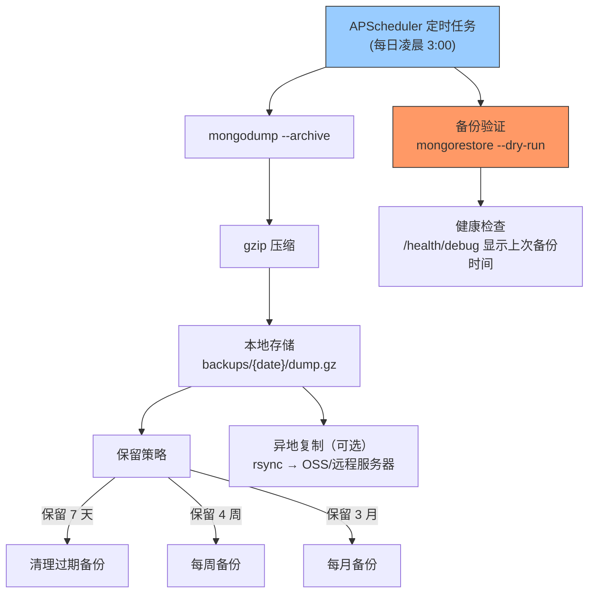

---

doc_type: module
prd_task_id: "YA-09-64"
title: "YA-09-64: 数据备份自动化 — MongoDB 定时快照与异地容灾 — 开发方案"
status: 需求已编写
priority: P2
owner: 陈铭
roles: [engineer]
created: 2026-09-11
updated: 2026-09-23
project: YiAi
project_id: yiai
prd_month: "202609"
estimate_frontend: 0.5
source_prd: "68-需求-数据备份自动化.md"
source_okr: [yiai-001]

type: task
---

# YA-09-64: 数据备份自动化 — MongoDB 定时快照与异地容灾 — 开发方案

> **文档职责**：本文档定义**怎么做、为什么这么做、实际做成什么样**（HOW），不含产品目标与测试用例。

> 来源 PRD：[68-需求-数据备份自动化.md](../../prds/2026-09/68-需求-数据备份自动化.md)
> 需求编号：YA-09-64 · 优先级：P2 · 人天：0.5d · 状态：需求已编写

---

<a id="sec-1"></a>
## 一、架构总览

YiAi 当前无任何 MongoDB 自动化备份机制——sessions、bugs、audit_logs、users 等核心数据一旦丢失将不可恢复。通过 mongodump 定时全量快照 + 异地复制 + 保留策略，建立基本的灾备能力。



**备份策略**：每日全量 mongodump（凌晨低峰期），保留 7 天日备份 + 4 周周备份 + 3 月月备份。备份完成后自动验证（--dry-run restore），验证失败企微告警。

---

<a id="sec-2"></a>
## 二、文件清单

| 文件 | 操作 | 说明 |
|------|------|------|
| `YiAi/src/services/backup/backup_service.py` | 新增 | BackupService 定时任务 + 验证逻辑 |
| `YiAi/src/services/backup/backup_config.py` | 新增 | 备份配置（时间/保留策略/异地目标） |
| `YiAi/config.yaml` | 修改 | 添加 backup 配置节 |
| `YiAi/scripts/restore.sh` | 新增 | 数据库恢复脚本 |
| `YiAi/tests/test_backup.py` | 新增 | 备份任务测试 |

---

<a id="sec-3"></a>
## 三、模块设计

### 3.1 BackupService

```python
# YiAi/src/services/backup/backup_service.py
import subprocess, gzip, os, shutil
from datetime import datetime, timedelta
from apscheduler.schedulers.asyncio import AsyncIOScheduler

class BackupConfig:
    """备份配置——从 config.yaml 加载。"""
    backup_dir: str = './backups'
    schedule: str = '0 3 * * *'          # 每日凌晨 3:00
    retention_daily: int = 7              # 保留 7 天日备份
    retention_weekly: int = 4             # 保留 4 周周备份
    retention_monthly: int = 3            # 保留 3 月月备份
    mongo_uri: str = 'mongodb://localhost:27017'
    remote_target: str = None             # rsync 远程目标
    verify_after_backup: bool = True      # 备份后自动验证

class BackupService:
    """MongoDB 数据备份服务。

    特性:
        - mongodump 全量快照 + gzip 压缩
        - 分层保留策略（日/周/月）
        - 备份后自动验证（--dry-run restore）
        - 可选异地复制
        - 备份状态上报 /health/debug
    """

    def __init__(self, config: BackupConfig): ...

    async def run_backup(self) -> dict:
        """执行一次全量备份。

        流程:
            1. mongodump --uri={mongo_uri} --archive --gzip > backup.gz
            2. 验证: mongorestore --archive=backup.gz --dry-run
            3. 移动到 backups/{date}/dump.gz
            4. 清理过期备份
            5. 可选: rsync 到远程目标

        返回: {status, file, size, duration}
        """
        ...

    async def verify_backup(self, backup_file: str) -> bool:
        """验证备份文件——mongorestore --dry-run。"""
        ...

    async def cleanup_old_backups(self):
        """根据保留策略清理过期备份。"""
        ...

    async def get_backup_status(self) -> dict:
        """获取备份状态——用于 /health/debug。"""
        ...

    def setup_scheduler(self, scheduler: AsyncIOScheduler):
        """注册定时备份任务到 APScheduler。"""
        ...
```

### 3.2 备份文件结构

```
backups/
├── daily/
│   ├── 2026-09-23/
│   │   └── dump.gz           (今日备份)
│   ├── 2026-09-22/
│   └── ...                   (保留 7 天)
├── weekly/
│   ├── 2026-W38/
│   │   └── dump.gz           (本周日备份)
│   └── ...                   (保留 4 周)
└── monthly/
    ├── 2026-09/
    │   └── dump.gz           (当月 1 号备份)
    └── ...                   (保留 3 月)
```

---

<a id="sec-4"></a>
## 四、数据流

```
APScheduler 触发 (每日 3:00)
  → BackupService.run_backup()
    → subprocess: mongodump --uri=MONGO_URI --archive --gzip
    → 输出: backup.gz
    → verify_backup(): mongorestore --archive=backup.gz --dry-run
      → 成功: 移动到 backups/daily/{date}/dump.gz
      → 失败: 企业微信告警 + 不移动文件
    → cleanup_old_backups(): 按日/周/月策略删除过期文件
    → 可选: subprocess: rsync backup.gz remote_target
    → 更新 /health/debug 备份状态
```

---

<a id="sec-5"></a>
## 五、实施路线

| # | 步骤 | 产出 | 验证 | 人天 |
|---|------|------|------|------|
| 1 | 创建 BackupService + mongodump 封装 | `backup_service.py` | 手动触发备份，生成 dump.gz | 0.15 |
| 2 | 实现备份验证（--dry-run restore） | `backup_service.py` | 备份后自动验证成功 | 0.05 |
| 3 | 实现分层保留策略 + cleanup | `backup_service.py` | 过期备份被正确清理 | 0.1 |
| 4 | 注册 APScheduler 定时任务 | `backup_service.py` | 每日 3:00 自动执行 | 0.05 |
| 5 | 恢复脚本 restore.sh | `scripts/restore.sh` | 可恢复指定日期的备份 | 0.05 |
| 6 | 健康检查集成 | `/health/debug` | 显示上次备份时间和状态 | 0.05 |
| 7 | 测试用例 | `tests/test_backup.py` | 备份/验证/清理/恢复 | 0.05 |

**合计：0.5d**

---

<a id="sec-6"></a>
## 六、代码审查检查清单

- [ ] mongodump 使用 --archive --gzip 参数（单文件输出）
- [ ] 备份后自动验证（mongorestore --dry-run）
- [ ] 验证失败时企微告警 + 不覆盖上次成功备份
- [ ] 分层保留策略：7 天日备份 + 4 周周备份 + 3 月月备份
- [ ] 备份目录自动创建（不存在时 mkdir -p）
- [ ] mongodump 进程超时控制（30min）
- [ ] 备份期间不影响正常数据库操作（mongodump 使用 secondary 节点读）
- [ ] /health/debug 可查看备份状态
- [ ] 恢复脚本有清晰的使用说明

---

<a id="sec-7"></a>
## 七、风险评估

| 风险 | 概率 | 影响 | 缓解措施 |
|------|------|------|----------|
| mongodump 期间数据库性能下降 | 中 | 中 | 凌晨低峰期执行，读 Secondary 节点 |
| 备份文件损坏未被发现 | 低 | 高 | 备份后自动 --dry-run 验证 |
| 磁盘空间不足导致备份失败 | 中 | 中 | 备份前检查磁盘空间，不足时告警 |
| 异地复制失败（网络问题） | 中 | 低 | rsync 失败仅告警，不阻断本地备份 |
| 恢复脚本过时/不可用 | 低 | 高 | 每季度演练一次恢复流程 |

**回滚**：禁用 APScheduler 备份任务即可。已生成的备份文件不受影响。