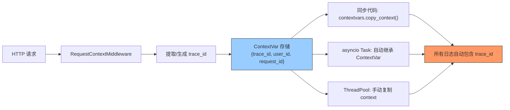

---

doc_type: module
prd_task_id: "YA-09-65"
title: "YA-09-65: 请求上下文传播 — ContextVar 异步透传 TraceID 与用户信息 — 开发方案"
status: 需求已编写
priority: P2
owner: 陈铭
roles: [engineer]
created: 2026-09-11
updated: 2026-09-23
project: YiAi
project_id: yiai
prd_month: "202609"
estimate_frontend: 0.5
source_prd: "69-需求-请求上下文传播.md"
source_okr: [yiai-001]

type: task
---

# YA-09-65: 请求上下文传播 — ContextVar 异步透传 TraceID 与用户信息 — 开发方案

> **文档职责**：本文档定义**怎么做、为什么这么做、实际做成什么样**（HOW），不含产品目标与测试用例。

> 来源 PRD：[69-需求-请求上下文传播.md](../../prds/2026-09/69-需求-请求上下文传播.md)
> 需求编号：YA-09-65 · 优先级：P2 · 人天：0.5d · 状态：需求已编写

---

<a id="sec-1"></a>
## 一、架构总览

YiAi 引入 BackgroundTaskQueue 后，异步任务脱离了原始 HTTP 请求的上下文——后台任务日志中无法关联 request_id、user_id 和 trace_id，故障排查时只能看到孤立错误日志。利用 Python `contextvars.ContextVar` 实现请求上下文的自动跨异步边界传播，零侵入注入 trace_id 到所有日志。



**核心挑战**：`asyncio.create_task` 默认隔离 ContextVar，`run_in_executor` 的线程池不继承 asyncio 上下文。需要手动复制 context 传递给新 Task/线程。

---

<a id="sec-2"></a>
## 二、文件清单

| 文件 | 操作 | 说明 |
|------|------|------|
| `YiAi/src/server/context.py` | 新增 | RequestContext + ContextVar 管理 |
| `YiAi/src/server/main.py` | 修改 | 注册 RequestContextMiddleware |
| `YiAi/src/server/middleware.py` | 修改 | 中间件提取请求头 → ContextVar |
| `YiAi/src/shared/logger.py` | 修改 | LogRecord 自动注入 trace_id |
| `YiAi/src/services/queue/background_task.py` | 修改 | 创建 Task 时复制 context |
| `YiAi/tests/test_context.py` | 新增 | ContextVar 跨边界传播测试 |

---

<a id="sec-3"></a>
## 三、模块设计

### 3.1 RequestContext

```python
# YiAi/src/server/context.py
from contextvars import ContextVar
from dataclasses import dataclass, field
import uuid

@dataclass
class RequestContext:
    """请求上下文——通过 ContextVar 跨异步边界传播。"""
    trace_id: str = field(default_factory=lambda: str(uuid.uuid4())[:8])
    user_id: str = 'anonymous'
    request_id: str = field(default_factory=lambda: str(uuid.uuid4())[:8])
    client_ip: str = 'unknown'

# 全局 ContextVar（每个 asyncio Task 自动继承）
_request_context: ContextVar[RequestContext] = ContextVar('request_context')

def get_request_context() -> RequestContext:
    """获取当前请求上下文。无上下文时返回默认值。"""
    try:
        return _request_context.get()
    except LookupError:
        return RequestContext()

def set_request_context(ctx: RequestContext):
    """设置当前请求上下文。"""
    _request_context.set(ctx)

def copy_context_for_task() -> dict:
    """复制当前上下文用于传给异步 Task/线程。
    返回 contextvars.copy_context() 的 Context 对象。
    """
    import contextvars
    return contextvars.copy_context()
```

### 3.2 RequestContextMiddleware

```python
# YiAi/src/server/middleware.py
from fastapi import Request

class RequestContextMiddleware:
    """请求上下文中间件——从 HTTP 请求头提取上下文信息。

    提取:
        X-Trace-Id: 上游传入的 trace_id（或自动生成）
        X-User-Id: 用户 ID
        X-Request-Id: 请求 ID
    """

    async def __call__(self, request: Request, call_next):
        ctx = RequestContext(
            trace_id=request.headers.get('X-Trace-Id', str(uuid.uuid4())[:8]),
            user_id=request.headers.get('X-User-Id', 'anonymous'),
            request_id=request.headers.get('X-Request-Id', str(uuid.uuid4())[:8]),
            client_ip=request.client.host if request.client else 'unknown',
        )
        set_request_context(ctx)

        response = await call_next(request)
        response.headers['X-Trace-Id'] = ctx.trace_id
        return response
```

### 3.3 日志自动注入

```python
# YiAi/src/shared/logger.py
import logging

class ContextFilter(logging.Filter):
    """日志过滤器——自动注入 trace_id 和 user_id。"""

    def filter(self, record):
        ctx = get_request_context()
        record.trace_id = ctx.trace_id
        record.user_id = ctx.user_id
        return True

# 日志格式
# [2026-09-23 10:30:00] [INFO] [trace:a1b2c3d4] [user:user123] [ReqCtx] 消息内容
```

### 3.4 异步 Task 上下文传播

```python
# YiAi/src/services/queue/background_task.py
import contextvars

class BackgroundTaskQueue:
    async def submit(self, task_type: str, func, *args, **kwargs):
        # 复制当前上下文
        ctx = contextvars.copy_context()

        async def wrapped():
            # 在新 Task 中恢复上下文
            for var, value in ctx.items():
                var.set(value)
            await func(*args, **kwargs)

        asyncio.create_task(wrapped())
```

---

<a id="sec-4"></a>
## 四、数据流

```
HTTP 请求进入 (X-Trace-Id: ext_abc, X-User-Id: user_001)
  → RequestContextMiddleware
    → 提取请求头 → RequestContext{trace_id: ext_abc, user_id: user_001}
    → _request_context.set(ctx)
  → 业务处理 (RPC 路由 → service → repository)
    → 每处 get_request_context() 都返回同一 ctx
    → 日志自动包含 [trace:ext_abc] [user:user_001]
  → 异步操作 (BackgroundTaskQueue.submit)
    → ctx_copy = contextvars.copy_context()
    → asyncio.create_task(wrapped)  # 在新 Task 中恢复所有 ContextVar
    → 后台任务日志同样包含 [trace:ext_abc] [user:user_001]
  → 响应: X-Trace-Id: ext_abc (透传回客户端)
```

---

<a id="sec-5"></a>
## 五、实施路线

| # | 步骤 | 产出 | 验证 | 人天 |
|---|------|------|------|------|
| 1 | 创建 RequestContext + ContextVar | `context.py` | 单请求内 get_request_context 一致性 | 0.1 |
| 2 | 创建 RequestContextMiddleware | `middleware.py` | X-Trace-Id 头自动提取和注入 | 0.1 |
| 3 | 集成 ContextFilter 到日志 | `logger.py` | 所有日志自动包含 trace_id | 0.1 |
| 4 | 异步 Task 上下文传播 | `background_task.py` | 后台任务日志包含原始请求 trace_id | 0.1 |
| 5 | ThreadPool 上下文传播 | `context.py` | run_in_executor 中日志有上下文 | 0.05 |
| 6 | 测试用例 | `tests/test_context.py` | 同步/异步/线程池/缺失上下文 | 0.05 |

**合计：0.5d**

---

<a id="sec-6"></a>
## 六、代码审查检查清单

- [ ] ContextVar 全局单例（`_request_context`），每个请求独立的 context 副本
- [ ] 中间件在所有请求处理前设置 context，响应中包含 X-Trace-Id
- [ ] `get_request_context()` 无上下文时返回默认值（不抛异常）
- [ ] 日志 Filter 自动注入 trace_id 和 user_id 到每行日志
- [ ] `asyncio.create_task` 前调用 `contextvars.copy_context()` 复制上下文
- [ ] 新 Task 中恢复所有 ContextVar（`ctx.items()` 遍历）
- [ ] `run_in_executor` 调用前复制 context，线程中恢复
- [ ] 上游 X-Trace-Id 头透传（不重新生成）

---

<a id="sec-7"></a>
## 七、风险评估

| 风险 | 概率 | 影响 | 缓解措施 |
|------|------|------|----------|
| ContextVar 在特定 asyncio 环境中泄漏 | 低 | 中 | 每个请求开始时显式 set，使用 contextvars 标准库 |
| copy_context 性能开销 | 低 | 低 | 仅在异步 Task 创建时复制（低频操作） |
| 第三方库不遵守 ContextVar | 中 | 低 | 对关键第三方调用包裹 context 恢复 |
| 线程池中 context 丢失 | 中 | 低 | run_in_executor 调用前显式复制 context |

**回滚**：移除 ContextFilter 日志注入，后台任务日志不再包含 trace_id。不影响核心业务。