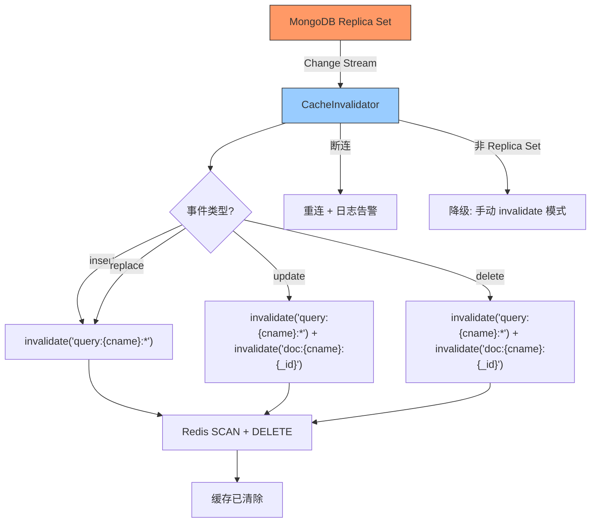

---

doc_type: module
prd_task_id: "YA-09-66"
title: "YA-09-66: 缓存智能失效 — MongoDB Change Streams 驱动淘汰 — 开发方案"
status: 需求已编写
priority: P2
owner: 陈铭
roles: [engineer]
created: 2026-09-11
updated: 2026-09-23
project: YiAi
project_id: yiai
prd_month: "202609"
estimate_frontend: 0.5
source_prd: "70-需求-缓存智能失效.md"
source_okr: [yiai-001]

type: task
---

# YA-09-66: 缓存智能失效 — MongoDB Change Streams 驱动淘汰 — 开发方案

> **文档职责**：本文档定义**怎么做、为什么这么做、实际做成什么样**（HOW），不含产品目标与测试用例。

> 来源 PRD：[70-需求-缓存智能失效.md](../../prds/2026-09/70-需求-缓存智能失效.md)
> 需求编号：YA-09-66 · 优先级：P2 · 人天：0.5d · 状态：需求已编写
> 依赖：YA-09-59（Redis 分布式缓存）

---

<a id="sec-1"></a>
## 一、架构总览

Redis 分布式缓存（YA-09-59）依赖写操作时手动调用 `cache.invalidate()` 来失效缓存。这种模式存在遗漏风险（新增写路径忘记 invalidate）、外部修改盲区（Compass/脚本直接修改 MongoDB 不触发失效）、批量任务盲区（定时任务批量更新）。引入 MongoDB Change Streams 监听集合级别的变更事件（insert/update/delete），自动触发对应缓存模式的失效。



**核心收益**：写操作路径无需手动 invalidate，缓存失效由数据库变更事件自动驱动，消除遗漏风险。延迟 < 100ms（Change Stream 事件到达 + Redis delete 时间）。

---

<a id="sec-2"></a>
## 二、文件清单

| 文件 | 操作 | 说明 |
|------|------|------|
| `YiAi/src/shared/cache_invalidator.py` | 新增 | CacheInvalidator + Change Stream 监听 |
| `YiAi/src/shared/redis_cache.py` | 修改 | 注册集合到 invalidator |
| `YiAi/src/server/main.py` | 修改 | 启动时初始化 invalidator |
| `YiAi/config.yaml` | 修改 | 缓存失效配置 |
| `YiAi/tests/test_cache_invalidator.py` | 新增 | Change Stream 失效测试 |

---

<a id="sec-3"></a>
## 三、模块设计

### 3.1 CacheInvalidator

```python
# YiAi/src/shared/cache_invalidator.py
from motor.motor_asyncio import AsyncIOMotorClient
import asyncio

class CacheInvalidator:
    """基于 MongoDB Change Streams 的自动缓存失效。

    监听指定集合的 insert/update/delete/replace 事件，
    自动清除对应的 Redis 缓存模式。

    特性:
        - 集合级别监听（ns.coll → 缓存模式映射）
        - 断连自动重连（指数退避）
        - 非 Replica Set 降级手动模式
        - 批量事件去重（1s 窗口合并）
    """

    def __init__(self, mongo_client: AsyncIOMotorClient, redis_cache):
        self._client = mongo_client
        self._cache = redis_cache
        self._watched: dict[str, list[str]] = {}  # {collection: [cache_patterns]}
        self._running = False

    def register_collection(self, collection: str, cache_patterns: list[str]):
        """注册集合的缓存失效模式。

        示例:
            invalidator.register_collection('bugs', ['query:bugs:*', 'dashboard:bugs_*'])
            invalidator.register_collection('sessions', ['query:sessions:*'])
        """
        self._watched[collection] = cache_patterns

    async def start(self):
        """启动 Change Stream 监听——每个集合一个 watch 协程。"""
        try:
            # 检查是否是 Replica Set
            await self._client.admin.command('replSetGetStatus')
        except Exception:
            logger.warning('[CacheInvalidator] 非 Replica Set，降级手动模式')
            return

        self._running = True
        for collection, patterns in self._watched.items():
            asyncio.create_task(self._watch_collection(collection, patterns))

    async def _watch_collection(self, collection: str, patterns: list[str]):
        """监听单个集合的变更事件（含断连重连）。"""
        db = self._client.get_default_database()
        retry_delay = 1

        while self._running:
            try:
                async with db[collection].watch(
                    [{'$match': {'operationType': {'$in': ['insert', 'update', 'replace', 'delete']}}}],
                    full_document='updateLookup'
                ) as stream:
                    retry_delay = 1  # 重置退避
                    async for change in stream:
                        await self._handle_change(collection, patterns, change)
            except Exception as e:
                logger.error(f'[CacheInvalidator] {collection} 断连: {e}，{retry_delay}s 后重连')
                await asyncio.sleep(retry_delay)
                retry_delay = min(retry_delay * 2, 60)

    async def _handle_change(self, collection: str, patterns: list[str], change: dict):
        """处理单条变更事件——失效对应缓存模式。"""
        for pattern in patterns:
            await self._cache.invalidate(pattern)
        logger.debug(f'[CacheInvalidator] {collection} 变更，失效 {len(patterns)} 个模式')

    async def stop(self):
        """停止所有监听。"""
        self._running = False
```

### 3.2 集合与缓存模式映射

| MongoDB 集合 | 缓存模式 | 失效范围 |
|------------|---------|---------|
| `bugs` | `query:bugs:*`, `dashboard:bugs_*` | 所有 bugs 查询 + Dashboard |
| `sessions` | `query:sessions:*`, `session:{id}` | 所有 sessions 查询 + 单条缓存 |
| `knowledge_files` | `query:knowledge_files:*`, `rag:*` | 知识库查询 + RAG 检索 |
| `users` | `perm:{user_id}` | 单个用户权限 |
| `audit_logs` | —（不缓存） | 审计日志不缓存 |

---

<a id="sec-4"></a>
## 四、数据流

```
MongoDB 数据变更 (insert/update/delete)
  → Change Stream 事件
    → CacheInvalidator._handle_change(collection, patterns, change)
      → 遍历 patterns
        → redis_cache.invalidate(pattern)
          → SCAN match: yiai:cache:{pattern}
          → DELETE all matched keys
    → 日志: [CacheInvalidator] bugs 变更，失效 2 个模式

断连场景:
  → Exception → 指数退避重连 (1s → 2s → 4s → ... → 60s)
  → 重连成功 → 从断点恢复（Change Stream resume token）
  → 断连期间写入的数据在重连后可能短暂不一致（< 重连间隔）
```

---

<a id="sec-5"></a>
## 五、实施路线

| # | 步骤 | 产出 | 验证 | 人天 |
|---|------|------|------|------|
| 1 | 创建 CacheInvalidator 类 | `cache_invalidator.py` | Change Stream 监听 insert → 缓存被清除 | 0.15 |
| 2 | 注册各集合的缓存模式映射 | `redis_cache.py` | 所有缓存集合都已注册 | 0.05 |
| 3 | 实现断连重连（指数退避） | `cache_invalidator.py` | 断连后自动重连并从断点恢复 | 0.1 |
| 4 | 集成到应用启动流程 | `main.py` | 启动时自动开始监听 | 0.05 |
| 5 | 副本集检测 + 降级逻辑 | `cache_invalidator.py` | 非 Replica Set 降级手动模式 | 0.05 |
| 6 | 添加缓存命中率监控 | 监控 | Redis 缓存命中率 > 80% | 0.05 |
| 7 | 测试用例 | `tests/test_cache_invalidator.py` | insert/update/delete/断连/降级 | 0.05 |

**合计：0.5d**

---

<a id="sec-6"></a>
## 六、代码审查检查清单

- [ ] Change Stream 监听 insert/update/delete/replace 四种事件
- [ ] 集合 → 缓存模式映射完整（所有缓存集合都已注册）
- [ ] 断连自动重连（指数退避 1s → 60s max）
- [ ] 使用 resume token 从断点恢复（避免遗漏断连期间的事件）
- [ ] 非 Replica Set 环境降级为手动 invalidate 模式
- [ ] Change Stream 过滤条件仅包含关注的 operationType
- [ ] 批量事件去重（1s 窗口内同一 key 的多次失效合并为一次）
- [ ] 缓存失效日志 DEBUG 级别（高频事件）
- [ ] 断连事件 ERROR 级别 + 企微告警

---

<a id="sec-7"></a>
## 七、风险评估

| 风险 | 概率 | 影响 | 缓解措施 |
|------|------|------|----------|
| Change Stream 仅 Replica Set 支持 | 高 | 高 | 启动时检测，非 RS 降级手动模式 |
| 断连期间缓存不一致 | 中 | 中 | 重连后从 resume token 恢复，立即失效 |
| Change Stream 事件延迟（> 100ms） | 低 | 中 | 业务可容忍短暂不一致 |
| 高频写入导致大量 invalidate 操作 | 低 | 中 | 1s 窗口去重 + Redis pipeline 批量 DELETE |
| 新增集合忘记注册 → 缓存不失效 | 中 | 中 | CI 检查：所有集合必须在 CacheInvalidator 注册 |

**回滚**：禁用 Change Stream 监听，回退到手写 invalidate 模式。缓存层正常工作不受影响。