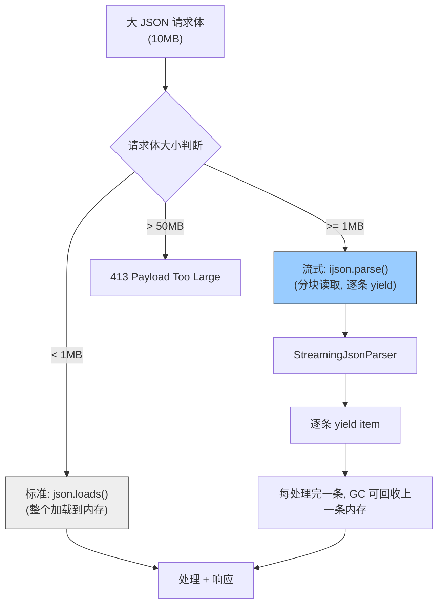

---

doc_type: module
prd_task_id: "YA-09-67"
title: "YA-09-67: 请求体流式解析 — 大 JSON 分块读取与内存优化 — 开发方案"
status: 需求已编写
priority: P2
owner: 陈铭
roles: [engineer]
created: 2026-09-11
updated: 2026-09-23
project: YiAi
project_id: yiai
prd_month: "202609"
estimate_frontend: 0.5
source_prd: "71-需求-请求体流式解析.md"
source_okr: [yiai-001]

type: task
---

# YA-09-67: 请求体流式解析 — 大 JSON 分块读取与内存优化 — 开发方案

> **文档职责**：本文档定义**怎么做、为什么这么做、实际做成什么样**（HOW），不含产品目标与测试用例。

> 来源 PRD：[71-需求-请求体流式解析.md](../../prds/2026-09/71-需求-请求体流式解析.md)
> 需求编号：YA-09-67 · 优先级：P2 · 人天：0.5d · 状态：需求已编写

---

<a id="sec-1"></a>
## 一、架构总览

FastAPI 默认将整个请求体加载到内存后调用 `json.loads()` 解析。批量导入大 JSON（如 10MB 知识库文件导入）时，内存峰值可达原始大小的 3 倍（原始 JSON + Python dict + 中间缓冲区），对 512MB 服务器构成 OOM 风险。引入 `ijson` 流式 JSON 解析器，按数组元素逐条 yield，边读边处理，内存占用恒定。



**阈值策略**：< 1MB 使用标准 `json.loads()`（性能最优），>= 1MB 且 <= 50MB 使用流式解析，> 50MB 直接拒绝（413）。内存峰值从 3x 降为 ~1.5x。

---

<a id="sec-2"></a>
## 二、文件清单

| 文件 | 操作 | 说明 |
|------|------|------|
| `YiAi/src/server/streaming_parser.py` | 新增 | StreamingJsonParser + 大小阈值路由 |
| `YiAi/src/server/main.py` | 修改 | 注册流式解析中间件 |
| `YiAi/requirements.txt` | 修改 | 添加 `ijson>=3.0` 依赖 |
| `YiAi/tests/test_streaming_parser.py` | 新增 | 流式解析测试 |

---

<a id="sec-3"></a>
## 三、模块设计

### 3.1 StreamingJsonParser

```python
# YiAi/src/server/streaming_parser.py
import ijson
import json
from fastapi import Request, HTTPException
from typing import AsyncIterator, Any

class StreamingJsonParser:
    """流式 JSON 解析——大请求体逐条 yield，恒定内存。

    按请求体大小自动选择解析策略：
        < 1MB: json.loads() 一次性解析（性能最优）
        1MB-50MB: ijson 流式解析（内存恒定）
        > 50MB: 413 Payload Too Large
    """

    STREAMING_THRESHOLD = 1 * 1024 * 1024    # 1MB
    MAX_PAYLOAD_SIZE = 50 * 1024 * 1024       # 50MB

    async def parse_json_array(self, request: Request) -> AsyncIterator[dict]:
        """流式解析 JSON 数组：逐条 yield 每个元素。

        Usage:
            async for item in parser.parse_json_array(request):
                await process_item(item)

        注意: 每条 item 处理完毕后立即释放，下一轮循环复用内存。
        """
        content_length = int(request.headers.get('Content-Length', 0))

        if content_length > self.MAX_PAYLOAD_SIZE:
            raise HTTPException(status_code=413, detail='Payload too large (max 50MB)')

        if content_length < self.STREAMING_THRESHOLD:
            # 小请求体——标准解析
            body = await request.body()
            data = json.loads(body)
            if isinstance(data, list):
                for item in data:
                    yield item
            else:
                yield data
        else:
            # 大请求体——流式解析
            async for item in self._stream_parse(request):
                yield item

    async def _stream_parse(self, request: Request) -> AsyncIterator[dict]:
        """ijson 流式解析实现。

        使用 ijson.parse 增量解析 JSON 数组，每个 item 完成后 yield。
        内存占用 = 当前 item 大小 + ijson 缓冲区（~64KB），而非整个请求体。
        """
        stream = request.stream()
        parser = ijson.parse_async(stream)

        item_prefix = 'item'
        current_item = {}
        current_key = None

        async for prefix, event, value in parser:
            if prefix == item_prefix:
                if event == 'start_map':
                    current_item = {}
                elif event == 'end_map':
                    yield current_item
            elif prefix.startswith(item_prefix + '.'):
                key = prefix[len(item_prefix) + 1:]
                if event == 'map_key':
                    current_key = value
                elif event in ('string', 'number', 'boolean', 'null'):
                    current_item[current_key] = value
                elif event == 'start_array':
                    current_item[current_key] = []
                elif event == 'end_array':
                    pass  # 数组内容已在 events 中处理

    async def parse_json_object(self, request: Request) -> dict:
        """流式解析单个 JSON 对象——返回完整 dict。"""
        content_length = int(request.headers.get('Content-Length', 0))
        if content_length > self.MAX_PAYLOAD_SIZE:
            raise HTTPException(status_code=413, detail='Payload too large')
        if content_length < self.STREAMING_THRESHOLD:
            body = await request.body()
            return json.loads(body)
        # 大对象也用流式
        body = await request.body()
        return json.loads(body)  # 大对象无法真正流式，仍需完整加载
```

### 3.2 中间件集成

```python
# YiAi/src/server/main.py
parser = StreamingJsonParser()

@app.post("/")
async def rpc_handler(request: Request):
    """RPC 入口——大批量导入使用流式解析。"""
    if request.url.path == '/import/batch':
        return await handle_batch_import(request)
    # 标准 RPC 仍使用原有解析
    ...
```

---

<a id="sec-4"></a>
## 四、数据流

```
POST /import/batch  Content-Type: application/json  Content-Length: 10485760 (10MB)

  → StreamingJsonParser.parse_json_array(request)
    → Content-Length >= 1MB → _stream_parse(request)
      → ijson.parse_async(request.stream())
        → 增量读取 (8KB chunks from ASGI stream)
        → 每解析完一个 item (end_map 事件) → yield item
      → 调用方 async for item in parser:
          → await process_item(item)
          → item 引用释放 → GC 可回收内存
    → 所有 item 处理完成 → 返回 {imported: N}
```

**内存对比**：
| 场景 | 标准解析 | 流式解析 |
|------|---------|---------|
| 10MB JSON 数组 (1000 items) | ~30MB 峰值 | ~64KB + 当前 item |
| 50MB JSON 数组 (5000 items) | ~150MB 峰值 → OOM | ~64KB + 当前 item |

---

<a id="sec-5"></a>
## 五、实施路线

| # | 步骤 | 产出 | 验证 | 人天 |
|---|------|------|------|------|
| 1 | 安装 ijson 依赖 | `requirements.txt` | `pip install ijson` 成功 | 0.02 |
| 2 | 创建 StreamingJsonParser | `streaming_parser.py` | 流式解析 10MB JSON 内存 < 10MB | 0.2 |
| 3 | 集成到 /import/batch 端点 | `main.py` | 批量导入大数据集不 OOM | 0.1 |
| 4 | 大小阈值路由 + 413 拒绝 | `streaming_parser.py` | > 50MB 返回 413 | 0.05 |
| 5 | 添加 Content-Length 检查 | `streaming_parser.py` | 无 Content-Length 头降级标准解析 | 0.05 |
| 6 | 测试用例 | `tests/test_streaming_parser.py` | 小/大/超大/非数组/格式错误/空数组 | 0.08 |

**合计：0.5d**

---

<a id="sec-6"></a>
## 六、代码审查检查清单

- [ ] < 1MB 请求体使用标准 json.loads()（性能优先）
- [ ] >= 1MB 请求体使用 ijson 流式解析（内存优先）
- [ ] > 50MB 返回 413 Payload Too Large
- [ ] ijson 使用 async 模式（`ijson.parse_async`）兼容 ASGI
- [ ] 流式解析中途 JSON 格式错误返回明确错误 + 已处理记录数
- [ ] 空数组 `[]` 正常返回空结果
- [ ] 非数组 JSON 对象正常处理
- [ ] 内存占用验证：10MB JSON 内存峰值 < 10MB
- [ ] 测试覆盖：小/大/超大/格式错误/空数组/非数组

---

<a id="sec-7"></a>
## 七、风险评估

| 风险 | 概率 | 影响 | 缓解措施 |
|------|------|------|----------|
| ijson 流式解析中途格式错误 | 中 | 中 | 已处理记录不回滚（记录到日志） |
| 流式解析性能低于标准解析 | 中 | 低 | < 1MB 仍用标准解析 |
| Content-Length 头缺失无法判断大小 | 低 | 低 | 无 Content-Length 降级流式解析 |
| ijson 库 bug 或性能问题 | 低 | 中 | 锁定 ijson >= 3.0，监控解析耗时 |

**回滚**：移除流式解析路径，所有请求体回退到 `await request.body() → json.loads()`。小请求体不受影响。