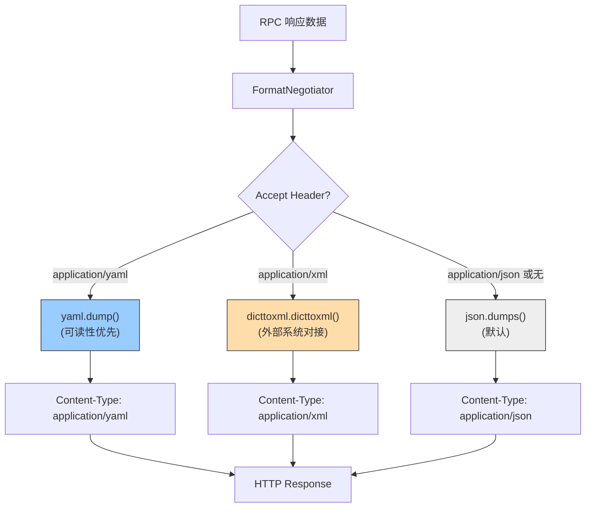

---

doc_type: module
prd_task_id: "YA-09-112"
title: "YA-09-112: 响应格式协商 — Accept 头驱动的 JSON/YAML/XML — 开发方案"
status: 需求已编写
priority: P2
owner: 陈铭
roles: [engineer]
created: 2026-09-11
updated: 2026-09-23
project: YiAi
project_id: yiai
prd_month: "202609"
estimate_frontend: 0.5
source_prd: "72-需求-响应格式协商.md"
source_okr: [yiai-001]

type: task
---

# YA-09-112: 响应格式协商 — Accept 头驱动的 JSON/YAML/XML — 开发方案

> **文档职责**：本文档定义**怎么做、为什么这么做、实际做成什么样**（HOW），不含产品目标与测试用例。

> 来源 PRD：[72-需求-响应格式协商.md](../../prds/2026-09/72-需求-响应格式协商.md)
> 需求编号：YA-09-112 · 优先级：P2 · 人天：0.5d · 状态：需求已编写

---

<a id="sec-1"></a>
## 一、架构总览

YiAi 所有 RPC 响应固定为 JSON。引入基于 HTTP Accept Header 的格式协商，支持 JSON（默认）、YAML（调试可读）、XML（外部系统对接）。在不同使用场景下提供最优格式：开发调试用 YAML 获得更好可读性，第三方对接用 XML 兼容遗留系统。



---

<a id="sec-2"></a>
## 二、文件清单

| 文件 | 操作 | 说明 |
|------|------|------|
| `YiAi/src/server/format_negotiator.py` | 新增 | FormatNegotiator 中间件 |
| `YiAi/src/server/main.py` | 修改 | 注册格式协商中间件 |
| `YiAi/requirements.txt` | 修改 | 添加 `pyyaml`, `dicttoxml` |
| `YiAi/tests/test_format_negotiator.py` | 新增 | 三格式输出测试 |

---

<a id="sec-3"></a>
## 三、模块设计

### 3.1 FormatNegotiator

```python
# YiAi/src/server/format_negotiator.py
import json, yaml
from dicttoxml import dicttoxml
from fastapi import Request
from fastapi.responses import Response

class FormatNegotiator:
    """基于 Accept Header 的多格式响应协商。

    支持格式:
        application/json  (默认)——程序消费
        application/yaml  ——调试/人工阅读
        application/xml   ——外部系统对接
    """

    FORMATS = {
        'application/json': {'serialize': json.dumps, 'name': 'JSON'},
        'application/yaml': {'serialize': lambda d: yaml.dump(d, allow_unicode=True, default_flow_style=False), 'name': 'YAML'},
        'application/xml': {'serialize': lambda d: dicttoxml(d, custom_root='response', attr_type=False).decode(), 'name': 'XML'},
    }

    DEFAULT_FORMAT = 'application/json'

    async def __call__(self, request: Request, call_next):
        response = await call_next(request)
        accept = request.headers.get('Accept', self.DEFAULT_FORMAT)

        # 确定目标格式
        target_format = self.DEFAULT_FORMAT
        for fmt in self.FORMATS:
            if fmt in accept:
                target_format = fmt
                break

        if target_format != 'application/json':
            data = json.loads(response.body)
            serializer = self.FORMATS[target_format]['serialize']
            body = serializer(data)
            if isinstance(body, str):
                body = body.encode('utf-8')
            return Response(content=body, media_type=target_format)

        return response
```

### 3.2 使用场景

| 格式 | Accept Header | 使用场景 | 特点 |
|------|-------------|---------|------|
| JSON | `application/json` 或无 | 程序消费（默认） | 体积小、解析快 |
| YAML | `application/yaml` | 调试、人工阅读 | 高可读性、无括号 |
| XML | `application/xml` | 外部企业系统对接 | SOAP/旧系统兼容 |

### 3.3 注意事项

- YAML/XML 模式下需要先将 JSON bytes 反序列化为 dict，再重新序列化（增加一次 roundtrip）
- 仅影响响应格式，请求格式始终为 JSON
- YAML 输出使用 `allow_unicode=True` 保留中文原文

---

<a id="sec-4"></a>
## 四、数据流

```
RPC 返回: {code: 0, data: {items: [...]}}
  → FastAPI JSONResponse
  → FormatNegotiator 中间件拦截
    → Accept: application/yaml
      → json.loads(response.body) → Python dict
      → yaml.dump(dict) → YAML 字符串
      → Response(content=bytes, media_type='application/yaml')
```

---

<a id="sec-5"></a>
## 五、实施路线

| # | 步骤 | 产出 | 验证 | 人天 |
|---|------|------|------|------|
| 1 | 安装依赖 pyyaml + dicttoxml | `requirements.txt` | `pip install` 成功 | 0.05 |
| 2 | 创建 FormatNegotiator 中间件 | `format_negotiator.py` | Accept 头驱动格式切换 | 0.15 |
| 3 | 集成到 FastAPI | `main.py` | 三种格式均正常响应 | 0.1 |
| 4 | 处理边界（中文/特殊字符/大数字） | `format_negotiator.py` | YAML 中文不转义、XML 合法 | 0.1 |
| 5 | 测试用例 | `tests/test_format_negotiator.py` | JSON/YAML/XML/默认/无效格式 | 0.1 |

**合计：0.5d**

---

<a id="sec-6"></a>
## 六、代码审查检查清单

- [ ] Accept Header 正确解析三种格式（json/yaml/xml）
- [ ] 无 Accept Header 时默认 JSON（向后兼容）
- [ ] YAML 输出使用 `allow_unicode=True` 保留中文
- [ ] XML 输出根元素命名规范（`custom_root='response'`）
- [ ] 不支持格式时降级默认 JSON
- [ ] 格式协商仅影响响应、不影响请求（请求始终 JSON）
- [ ] 特殊字符在三种格式中正确处理

---

<a id="sec-7"></a>
## 七、风险评估

| 风险 | 概率 | 影响 | 缓解措施 |
|------|------|------|----------|
| YAML/XML 序列化大响应耗时长 | 低 | 低 | 大响应仍推荐 JSON |
| 特殊字符在 XML 中不合法 | 中 | 低 | dicttoxml 自动处理 HTML 实体 |
| YAML 中 Python 对象泄漏安全问题 | 低 | 高 | 使用 `yaml.dump`（非 `yaml.safe_dump` 的逆操作） |

**回滚**：移除中间件，所有响应恢复 JSON。YAML/XML 支持不影响核心业务。