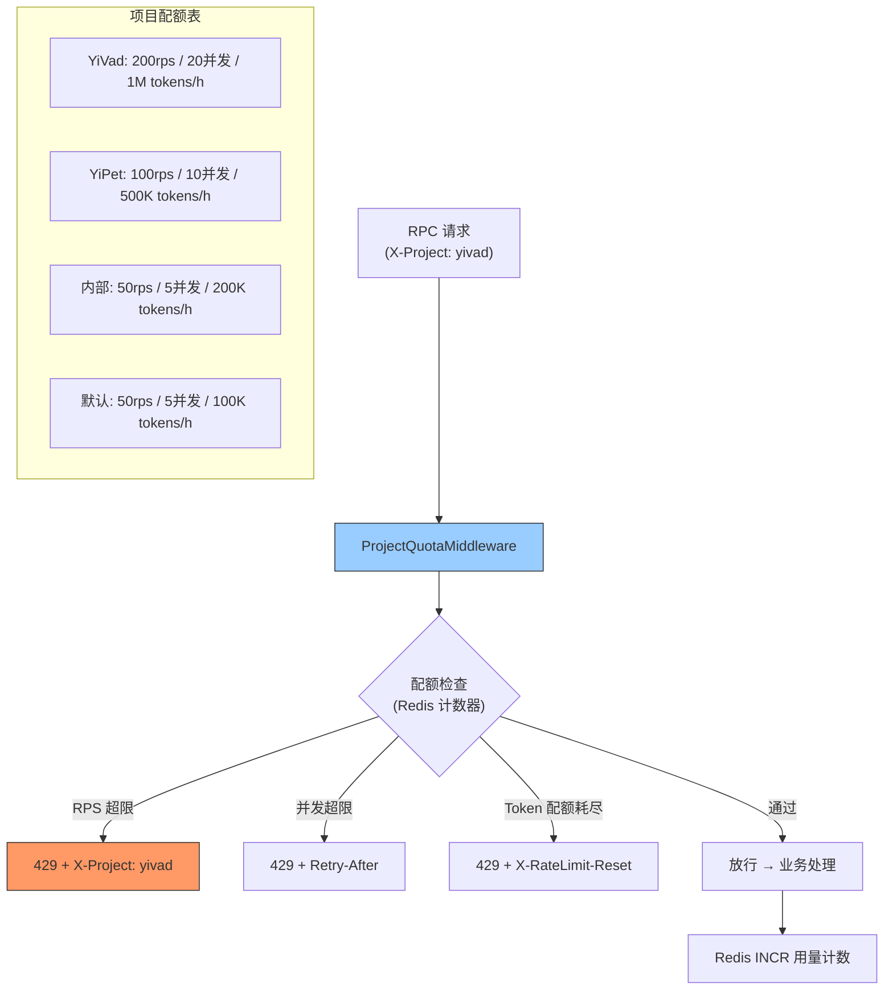

---

doc_type: module
prd_task_id: "YA-09-106"
title: "YA-09-106: 资源配额隔离 — 多项目公平分配 — 开发方案"
status: 需求已编写
priority: P2
owner: 陈铭
roles: [engineer]
created: 2026-09-11
updated: 2026-09-23
project: YiAi
project_id: yiai
prd_month: "202609"
estimate_frontend: 1.0
source_prd: "73-需求-资源配额隔离.md"
source_okr: [yiai-001]

type: task
---

# YA-09-106: 资源配额隔离 — 多项目公平分配 — 开发方案

> **文档职责**：本文档定义**怎么做、为什么这么做、实际做成什么样**（HOW），不含产品目标与测试用例。

> 来源 PRD：[73-需求-资源配额隔离.md](../../prds/2026-09/73-需求-资源配额隔离.md)
> 需求编号：YA-09-106 · 优先级：P2 · 人天：1.0d · 状态：需求已编写

---

<a id="sec-1"></a>
## 一、架构总览

4 个项目（YiVad/YiPet/YiAi 内部调度/外部调用）共享同一个 YiAi 后端。当前无限流隔离，任一项目的高频请求（如 YiVad Dashboard 自动刷新）可能耗尽 Ollama 推理资源，影响 YiPet 用户聊天体验。引入项目维度的配额体系，按 RPS、并发数、Token 消耗、存储空间四个维度公平分配。



---

<a id="sec-2"></a>
## 二、文件清单

| 文件 | 操作 | 说明 |
|------|------|------|
| `YiAi/src/server/project_quota.py` | 新增 | ProjectQuota + 中间件 |
| `YiAi/src/server/main.py` | 修改 | 注册配额中间件 |
| `YiAi/config.yaml` | 修改 | 项目配额配置 |
| `YiAi/tests/test_project_quota.py` | 新增 | 配额测试 |

---

<a id="sec-3"></a>
## 三、模块设计

### 3.1 ProjectQuota

```python
# YiAi/src/server/project_quota.py
from dataclasses import dataclass
import redis.asyncio as aioredis

@dataclass
class ProjectQuota:
    """项目级资源配额。"""
    max_rps: int = 50                # 最大请求速率 (req/s)
    max_concurrent: int = 5          # 最大并发请求数
    max_tokens_per_hour: int = 100_000  # LLM Token 消耗/小时
    max_storage_mb: int = 100        # 存储配额 (MB)

class ProjectQuotaManager:
    """项目配额管理——基于 Redis 的实时计数 + 限流。

    配额维度:
        1. RPS: 滑动窗口 1s 内请求数
        2. 并发: Redis INCR/DECR 请求中计数
        3. Token: 小时窗口累计 Token 数
        4. 存储: MongoDB count_documents 计算占用

    默认配额（可在 config.yaml 覆盖）:
        YiVad:  200rps / 20并发 / 1M tokens/h / 500MB
        YiPet:  100rps / 10并发 / 500K tokens/h / 200MB
        内部:    50rps /  5并发 / 200K tokens/h / 100MB
        默认:    50rps /  5并发 / 100K tokens/h / 100MB
    """

    DEFAULT_QUOTAS = {
        'yivad': ProjectQuota(200, 20, 1_000_000, 500),
        'yipet': ProjectQuota(100, 10, 500_000, 200),
        'yiai':  ProjectQuota(50,  5,  200_000, 100),
        'default': ProjectQuota(50, 5, 100_000, 100),
    }

    def __init__(self, redis_client, mongo_db, config: dict = None): ...

    async def check_rps(self, project: str) -> tuple[bool, float]:
        """检查 RPS——1s 滑动窗口。

        Redis Key: quota:{project}:rps:{timestamp_second}
        使用 INCR + EXPIRE 1s 实现。
        """
        ...

    async def check_concurrent(self, project: str) -> tuple[bool, int]:
        """检查并发数——当前正在处理的请求数。

        Redis Key: quota:{project}:concurrent
        """
        ...

    async def check_token_quota(self, project: str, tokens: int) -> bool:
        """检查 Token 配额——小时窗口累计。

        Redis Key: quota:{project}:tokens:{hour_key}
        """
        ...

    async def get_all_usage(self) -> dict:
        """获取所有项目的用量——用于 Dashboard 面板。

        Returns: {yivad: {rps, concurrent, tokens, storage}, ...}
        """
        ...
```

### 3.2 ProjectQuotaMiddleware

```python
class ProjectQuotaMiddleware:
    """项目配额中间件——请求进入时提取项目名 → 检查配额 → 超限拒绝。

    项目名提取优先级:
        1. X-Project HTTP 头
        2. RPC module_name 首段 ('yivad' from 'services.yivad.chat')
        3. 'default'
    """

    async def __call__(self, request: Request, call_next):
        project = self._extract_project(request)
        quota = self.manager.DEFAULT_QUOTAS.get(project, self.manager.DEFAULT_QUOTAS['default'])

        ok, wait = await self.manager.check_rps(project)
        if not ok:
            return JSONResponse(status_code=429, content={
                'code': 4002, 'message': f'Project {project} RPS quota exceeded',
                'data': {'project': project, 'retry_after': wait}
            }, headers={'Retry-After': str(int(wait) + 1)})

        # 并发控制
        await self.manager.acquire_concurrent(project)
        try:
            return await call_next(request)
        finally:
            await self.manager.release_concurrent(project)

    def _extract_project(self, request: Request) -> str:
        """从请求中提取项目名。"""
        header = request.headers.get('X-Project', '')
        if header in self.manager.DEFAULT_QUOTAS:
            return header
        return 'default'
```

---

<a id="sec-4"></a>
## 四、数据流

```
请求进入 (X-Project: yivad, data_service.query_documents)
  → ProjectQuotaMiddleware
    → _extract_project → 'yivad'
    → check_rps('yivad')
      → Redis INCR quota:yivad:rps:1695430000 (当前秒时间戳)
      → EXPIRE 1s
      → value > 200 → 429
      → value <= 200 → 通过
    → acquire_concurrent('yivad') → Redis INCR quota:yivad:concurrent
    → 业务处理
      → LLM 调用后 consume_tokens('yivad', 2048)
        → Redis INCRBY quota:yivad:tokens:2026-09-23T10 2048
        → EXPIRE 3600
    → release_concurrent('yivad') → Redis DECR quota:yivad:concurrent
```

---

<a id="sec-5"></a>
## 五、实施路线

| # | 步骤 | 产出 | 验证 | 人天 |
|---|------|------|------|------|
| 1 | 定义 ProjectQuota 数据模型 + 默认配额 | `project_quota.py` | 配额配置正确加载 | 0.15 |
| 2 | 实现 RPS + 并发 + Token 计数（Redis） | `project_quota.py` | Redis 原子操作正确 | 0.3 |
| 3 | 创建 ProjectQuotaMiddleware | `project_quota.py` | 超配额返回 429 | 0.2 |
| 4 | 集成到 FastAPI + config.yaml 配置 | `main.py` | 各项目配额独立生效 | 0.1 |
| 5 | Dashboard 配额面板（YiVad） | YiVad 前端 | 可查看各项目配额使用情况 | 0.15 |
| 6 | 测试用例 | `tests/test_project_quota.py` | 超限/未超限/多项目隔离/并发释放 | 0.1 |

**合计：1.0d**

---

<a id="sec-6"></a>
## 六、代码审查检查清单

- [ ] 四维度配额：RPS / 并发 / Token 消耗 / 存储
- [ ] 默认配额为最低等级（50rps / 5 并发），显式配置的项目可更高
- [ ] 项目名从 X-Project 头提取，无头时降级 'default'
- [ ] 并发计数使用 finally 块确保 DECR（防止泄漏）
- [ ] RPS 使用秒级 Redis key + EXPIRE 1s（自动过期）
- [ ] Token 使用小时级 Redis key + EXPIRE 3600（自动重置）
- [ ] 超配额返回 429 + 项目名 + Retry-After
- [ ] Dashboard 可查看所有项目的实时配额使用情况

---

<a id="sec-7"></a>
## 七、风险评估

| 风险 | 概率 | 影响 | 缓解措施 |
|------|------|------|----------|
| Redis DECR 遗漏导致并发计数泄漏 | 中 | 中 | finally 块 DECR + 定期清理旧计数 |
| 新项目未注册配额被限制为 default | 中 | 低 | 日志记录新项目首次访问，管理员添加配额 |
| Token 计数延迟（流式响应） | 中 | 低 | 流式结束后一次性统计总 Token |

**回滚**：禁用 ProjectQuotaMiddleware，所有项目无配额限制。