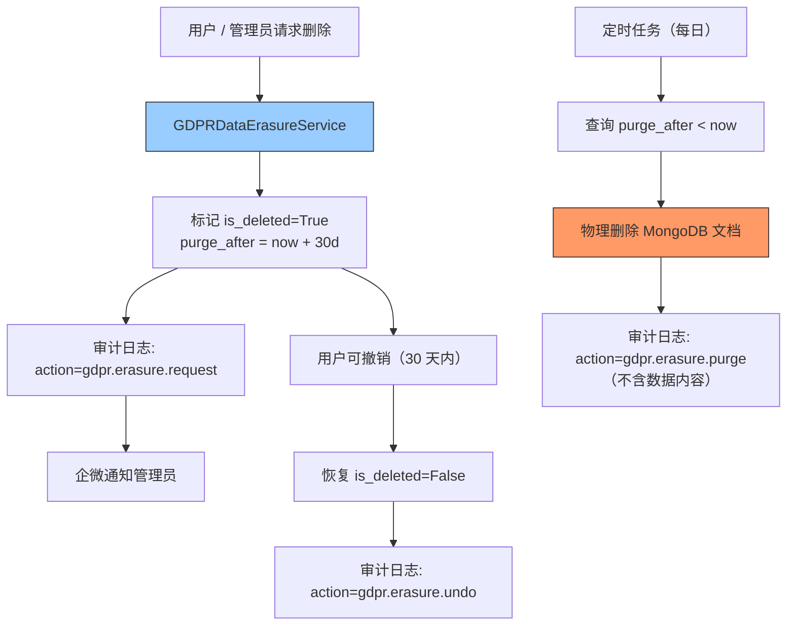

---

doc_type: module
prd_task_id: "YA-09-70"
title: "YA-09-70: GDPR 数据清除 — 软删除 + 30 天保留期 + 审计日志 — 开发方案"
status: 需求已编写
priority: P2
owner: 陈铭
roles: [engineer]
created: 2026-09-11
updated: 2026-09-23
project: YiAi
project_id: yiai
prd_month: "202609"
estimate_frontend: 0.5
source_prd: "74-需求-GDPR数据清除.md"
source_okr: [yiai-001]

type: task
---

# YA-09-70: GDPR 数据清除 — 软删除 + 30 天保留期 + 审计日志 — 开发方案

> **文档职责**：本文档定义**怎么做、为什么这么做、实际做成什么样**（HOW），不含产品目标与测试用例。

> 来源 PRD：[74-需求-GDPR数据清除.md](../../prds/2026-09/74-需求-GDPR数据清除.md)
> 需求编号：YA-09-70 · 优先级：P2 · 人天：0.5d · 状态：需求已编写

---

<a id="sec-1"></a>
## 一、架构总览

YiAi 当前数据删除不可逆且无审计记录。为满足 GDPR"被遗忘权"合规要求，引入软删除机制：用户数据标记为已删除后保留 30 天缓冲期，期间可恢复；到期后定时任务物理删除。审计日志永久保留操作记录但不含被删数据内容。



**受影响的集合**：sessions（聊天记录）、bugs（缺陷追踪）、users（用户账户）。audit_logs 中的用户操作记录在清除时保留元数据但匿名化用户标识。

---

<a id="sec-2"></a>
## 二、文件清单

| 文件 | 操作 | 说明 |
|------|------|------|
| `YiAi/src/services/gdpr/gdpr_service.py` | 新增 | GDPR 服务：软删除/撤销/物理清除/数据导出 |
| `YiAi/src/domain/data/repository.py` | 修改 | 添加 soft_delete / undo_delete / purge 方法 |
| `YiAi/src/domain/data/models.py` | 修改 | 添加软删除字段（is_deleted, deleted_at, purge_after） |
| `YiAi/src/services/audit/audit_service.py` | 修改 | GDPR 操作审计日志 |
| `YiAi/tests/test_gdpr.py` | 新增 | GDPR 合规测试 |

---

<a id="sec-3"></a>
## 三、模块设计

### 3.1 软删除数据模型

```python
# 所有用户相关集合添加软删除字段
{
    "_id": ObjectId,
    "...": "...",
    "is_deleted": False,          # 软删除标记
    "deleted_at": None,           # ISO datetime，标记删除时间
    "deleted_by": None,           # 操作人 ID
    "purge_after": None,          # 计划物理删除时间 = deleted_at + 30d
}
```

### 3.2 GDPRDataErasureService

```python
# YiAi/src/services/gdpr/gdpr_service.py

class GDPRDataErasureService:
    """GDPR 数据清除服务——用户数据合规删除与恢复。

    流程:
        1. 请求删除 → 软删除标记（30 天保留）
        2. 撤销删除 → 30 天内恢复
        3. 定时清除 → 到期后物理删除
        4. 数据导出 → 用户下载所有个人数据

    审计: 所有操作记录到 audit_logs（不含被删数据内容）
    """

    USER_COLLECTIONS = ['sessions', 'bugs', 'users']

    async def request_erasure(self, user_id: str, operator: str) -> dict:
        """软删除用户数据——标记 is_deleted=True。

        Returns: {status, affected_collections, doc_count, purge_date, can_undo}
        """
        ...

    async def undo_erasure(self, user_id: str, operator: str) -> dict:
        """撤销删除——恢复 is_deleted=False（仅 30 天内有效）。"""
        ...

    async def purge_expired(self) -> dict:
        """定时任务——物理删除过期数据。

        删除 purge_after < now 的文档。
        审计日志仅保留：用户ID（匿名化）、删除时间、操作人。
        """
        ...

    async def export_user_data(self, user_id: str) -> dict:
        """GDPR 数据导出——返回用户所有数据的 JSON。"""
        ...
```

### 3.3 审计日志

```python
# 每次 GDPR 操作写入：
{
    "_id": ObjectId,
    "action": "gdpr.erasure.request",   # request / undo / purge / export
    "user_id": "user_001",              # 被操作的用户
    "operator": "admin",                # 操作人
    "affected_collections": ["sessions", "bugs"],
    "document_count": 42,
    "timestamp": ISODate,
    "purge_date": ISODate,              # 计划清除日期
    "status": "pending"                 # pending / completed / undone
}
```

---

<a id="sec-4"></a>
## 四、数据流

```
管理员请求: POST /gdpr/erase { user_id: "user_001" }
  → GDPRDataErasureService.request_erasure('user_001', 'admin')
    → for each collection in ['sessions', 'bugs', 'users']:
        db.{coll}.update_many(
          {user_id: 'user_001', is_deleted: False},
          {$set: {is_deleted: True, deleted_at: now(), deleted_by: 'admin',
                  purge_after: now() + 30d}}
        )
    → 审计日志 + 企微通知

定时清理 (每日 2:00 UTC):
  → GDPRDataErasureService.purge_expired()
    → for each collection:
        expired = db.{coll}.find({purge_after: {$lt: now()}})
        doc_ids = [doc._id for doc in expired]
        db.{coll}.delete_many({_id: {$in: doc_ids}})
    → 审计日志: action=gdpr.erasure.purge, doc_count=N
```

---

<a id="sec-5"></a>
## 五、实施路线

| # | 步骤 | 产出 | 验证 | 人天 |
|---|------|------|------|------|
| 1 | 添加软删除字段到数据模型 | `models.py` | 所有用户集合支持软删除 | 0.05 |
| 2 | 创建 GDPRDataErasureService | `gdpr_service.py` | 软删除 + 撤销 + 导出功能 | 0.15 |
| 3 | 实现物理清除定时任务 | `gdpr_service.py` | 30 天后自动清除 | 0.1 |
| 4 | 集成审计日志 + 企微通知 | `audit_service.py` | 所有操作有审计记录 | 0.1 |
| 5 | 测试用例 | `tests/test_gdpr.py` | 软删除/撤销/清除/导出/审计 | 0.1 |

**合计：0.5d**

---

<a id="sec-6"></a>
## 六、代码审查检查清单

- [ ] 数据删除必须走软删除流程（30 天保护期），不直接物理删除
- [ ] 30 天保护期内用户/管理员可撤销删除
- [ ] 到期物理删除双重条件检查（is_deleted=True AND purge_after < now）
- [ ] 审计日志不含被删数据内容（仅元数据）
- [ ] 数据导出包含用户所有关联数据
- [ ] GDPR 操作全部记录审计日志
- [ ] 物理清除在低峰期执行（每日凌晨）

---

<a id="sec-7"></a>
## 七、风险评估

| 风险 | 概率 | 影响 | 缓解措施 |
|------|------|------|----------|
| 数据被提前物理删除（bug） | 低 | 高 | 双重条件 + 30 天保护期硬编码 |
| 审计日志意外包含数据内容 | 低 | 中 | 审计仅记录元数据，不含业务字段 |
| GDPR 数据导出请求耗时长 | 中 | 低 | 导出转为后台任务 + 完成后通知 |

**回滚**：停止定时清除任务，软删除数据保留不变。手动恢复可通过 `undo_erasure` 随时执行。