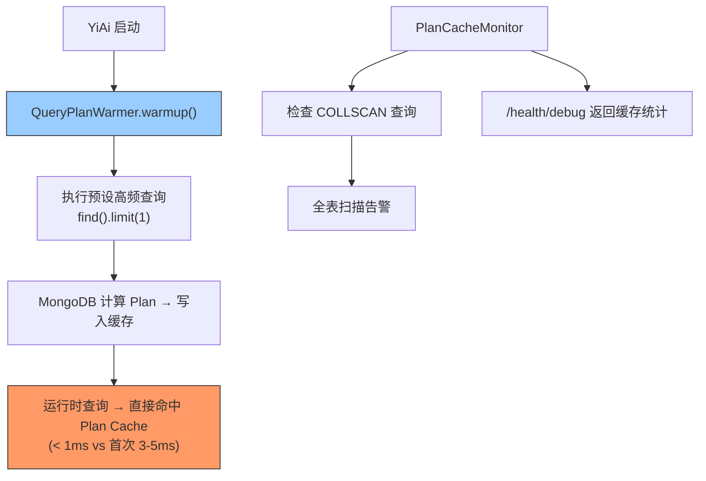

---

doc_type: module
prd_task_id: "YA-09-71"
title: "YA-09-71: 查询计划缓存优化 — MongoDB Plan Cache 预热与监控 — 开发方案"
status: 需求已编写
priority: P2
owner: 陈铭
roles: [engineer]
created: 2026-09-11
updated: 2026-09-23
project: YiAi
project_id: yiai
prd_month: "202609"
estimate_frontend: 0.5
source_prd: "75-需求-查询计划缓存优化.md"
source_okr: [yiai-001]

type: task
---

# YA-09-71: 查询计划缓存优化 — MongoDB Plan Cache 预热与监控 — 开发方案

> **文档职责**：本文档定义**怎么做、为什么这么做、实际做成什么样**（HOW），不含产品目标与测试用例。

> 来源 PRD：[75-需求-查询计划缓存优化.md](../../prds/2026-09/75-需求-查询计划缓存优化.md)
> 需求编号：YA-09-71 · 优先级：P2 · 人天：0.5d · 状态：需求已编写

---

<a id="sec-1"></a>
## 一、架构总览

MongoDB 首次执行查询时需要评估候选索引成本来计算 Query Plan，首次查询耗时比后续高 2-5x。服务重启或索引变更后，所有查询的 Plan Cache 被清空，出现"冷启动"性能退化。在应用启动时对高频查询执行预热 + 监控 Plan Cache 命中率。



**预热策略**：服务启动时对已知高频查询执行一次 `find().limit(1)`，触发 MongoDB 计算并缓存 Query Plan。运行时查询首次执行即命中缓存。

---

<a id="sec-2"></a>
## 二、文件清单

| 文件 | 操作 | 说明 |
|------|------|------|
| `YiAi/src/server/query_plan_warmer.py` | 新增 | QueryPlanWarmer + PlanCacheMonitor |
| `YiAi/src/server/main.py` | 修改 | 启动时执行预热 |
| `YiAi/tests/test_query_plan_warmer.py` | 新增 | 预热测试 |

---

<a id="sec-3"></a>
## 三、模块设计

### 3.1 QueryPlanWarmer

```python
# YiAi/src/server/query_plan_warmer.py
import time
from motor.motor_asyncio import AsyncIOMotorDatabase

class QueryPlanWarmer:
    """MongoDB Query Plan Cache 预热。

    启动时执行预设的高频查询（limit 1），触发 Plan 计算并缓存。
    """

    # 预设高频查询——按集合和典型过滤条件
    WARMUP_QUERIES = [
        ('bugs', {'status': 'open'}),
        ('bugs', {'severity': 'critical'}),
        ('sessions', {'is_deleted': False}),
        ('sessions', {}),                     # Dashboard 全量统计
        ('knowledge_files', {'status': 'active'}),
        ('knowledge_files', {}),              # 知识库列表
        ('users', {}),                         # 用户管理
        ('rss_entries', {'status': 'active'}),
    ]

    def __init__(self, db: AsyncIOMotorDatabase): ...

    async def warmup(self) -> dict:
        """执行预热——每个查询执行 limit(1) 触发 Plan 缓存。

        Returns: {warmed: N, errors: N, duration_ms: N}
        """
        results = {'warmed': 0, 'errors': 0, 'duration_ms': 0}
        start = time.time()
        for coll, filter in self.WARMUP_QUERIES:
            try:
                await self.db[coll].find(filter).limit(1).to_list(length=1)
                results['warmed'] += 1
            except Exception as e:
                logger.warning(f'[QueryPlanWarmer] {coll} 预热失败: {e}')
                results['errors'] += 1
        results['duration_ms'] = int((time.time() - start) * 1000)
        return results

    async def get_query_shapes(self) -> list[dict]:
        """通过 planCacheListQueryShapes 获取缓存的查询 Shape 列表。"""
        try:
            return await self.db.command({'planCacheListQueryShapes': 'bugs'})
        except Exception:
            return []
```

### 3.2 PlanCacheMonitor

```python
class PlanCacheMonitor:
    """Plan Cache 监控——检测 COLLSCAN 查询和缓存统计。"""

    async def get_cache_stats(self, collection: str = None) -> dict:
        """获取 Plan Cache 统计。

        通过 $planCacheStats 聚合阶段获取缓存信息。
        """
        ...

    async def check_collscan_queries(self) -> list[dict]:
        """检测全表扫描查询——通过 currentOp 检查 planSummary。"""
        ...

    async def get_status(self) -> dict:
        """返回监控状态用于 /health/debug。"""
        ...
```

---

<a id="sec-4"></a>
## 四、数据流

```
YiAi 启动
  → QueryPlanWarmer.warmup()
    → db.bugs.find({status: 'open'}).limit(1).to_list(1)
    → db.sessions.find({}).limit(1).to_list(1)
    → ... (8 个高频查询)
    → MongoDB 为每个查询计算 Plan → 写入 Plan Cache
    → 日志: [QueryPlanWarmer] 预热完成: 8/8, 耗时 45ms

运行时查询:
  → db.bugs.find({status: 'open'}).skip(0).limit(20)
    → MongoDB: Plan Cache 命中 → 直接执行 → < 1ms 规划阶段
```

---

<a id="sec-5"></a>
## 五、实施路线

| # | 步骤 | 产出 | 验证 | 人天 |
|---|------|------|------|------|
| 1 | 创建 QueryPlanWarmer | `query_plan_warmer.py` | 启动后查询规划耗时显著下降 | 0.15 |
| 2 | 定义预热查询列表 | `query_plan_warmer.py` | 覆盖所有高频 CRUD 操作 | 0.1 |
| 3 | 实施 PlanCacheMonitor | `query_plan_warmer.py` | 全表扫描检测 + 缓存统计 | 0.1 |
| 4 | 集成到启动流程 + /health/debug | `main.py` | 启动日志显示预热结果 | 0.05 |
| 5 | 测试用例 | `tests/test_query_plan_warmer.py` | 预热覆盖率 + 监控告警 | 0.1 |

**合计：0.5d**

---

<a id="sec-6"></a>
## 六、代码审查检查清单

- [ ] 启动时自动执行预热（非阻塞，不影响服务就绪）
- [ ] 预热查询使用 limit(1)（避免大结果集）
- [ ] 预热失败不阻塞启动（WARNING 日志）
- [ ] 预热查询列表覆盖主要 CRUD 操作
- [ ] PlanCacheMonitor 定期检测 COLLSCAN 查询并告警
- [ ] /health/debug 返回 Plan Cache 统计

---

<a id="sec-7"></a>
## 七、风险评估

| 风险 | 概率 | 影响 | 缓解措施 |
|------|------|------|----------|
| 预热查询列表不完整（新查询 Shape 仍冷启动） | 中 | 低 | 运行时首次慢但后续命中缓存 |
| 预热在大型集合上耗时较长 | 低 | 低 | limit(1) + 异步并行执行 |
| COLLSCAN 检测误报 | 低 | 低 | 仅 WARNING 级别，人工判断 |

**回滚**：跳过预热步骤，运行时查询首次稍慢但不影响功能。