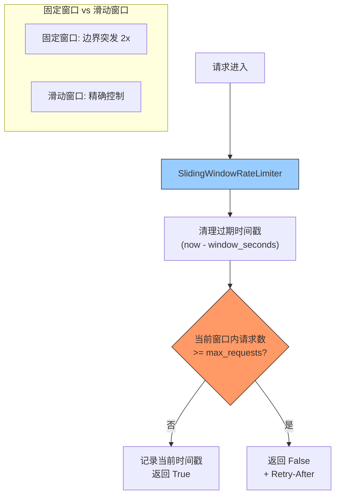

---

doc_type: module
prd_task_id: "YA-09-21"
title: "YA-09-21: 滑动窗口限流 — 消除固定窗口边界突发 — 开发方案"
status: 需求已编写
priority: P2
owner: 陈铭
roles: [engineer]
created: 2026-09-11
updated: 2026-09-23
project: YiAi
project_id: yiai
prd_month: "202609"
estimate_frontend: 1.0
source_prd: "76-需求-滑动窗口限流.md"
source_okr: [yiai-001]

type: task
---

# YA-09-21: 滑动窗口限流 — 消除固定窗口边界突发 — 开发方案

> **文档职责**：本文档定义**怎么做、为什么这么做、实际做成什么样**（HOW），不含产品目标与测试用例。

> 来源 PRD：[76-需求-滑动窗口限流.md](../../prds/2026-09/76-需求-滑动窗口限流.md)
> 需求编号：YA-09-21 · 优先级：P2 · 人天：1.0d · 状态：需求已编写

---

<a id="sec-1"></a>
## 一、架构总览

固定窗口限流（Token Bucket 基础版）在窗口边界存在突发问题——前一窗口末尾和后一窗口开头的请求可叠加，实际速率可达限额 2 倍。引入滑动窗口算法，用时间戳列表替代简单计数器，在任意时间点精确控制速率，消除边界突发。



**算法对比**：固定窗口 60s/100req → 59s 发 100 + 下窗口 1s 发 100 = 实际 200req（2x 突发）。滑动窗口任意 60s 窗口内最多 100req，精确控制。

---

<a id="sec-2"></a>
## 二、文件清单

| 文件 | 操作 | 说明 |
|------|------|------|
| `YiAi/src/server/sliding_window.py` | 新增 | SlidingWindowRateLimiter |
| `YiAi/src/server/rate_limiter.py` | 修改 | 集成滑动窗口作为限流策略选项 |
| `YiAi/config.yaml` | 修改 | 滑动窗口参数配置 |
| `YiAi/tests/test_sliding_window.py` | 新增 | 滑动窗口测试 |

---

<a id="sec-3"></a>
## 三、模块设计

### 3.1 SlidingWindowRateLimiter

```python
# YiAi/src/server/sliding_window.py
import time
from collections import defaultdict
from typing import Optional

class SlidingWindowConfig:
    """滑动窗口配置。"""
    def __init__(self, max_requests: int = 100, window_seconds: int = 60):
        self.max_requests = max_requests
        self.window_seconds = window_seconds

class SlidingWindowRateLimiter:
    """滑动窗口限流——基于时间戳列表的精确速率控制。

    与固定窗口/令牌桶的区别:
        固定窗口: 窗口边界可突发 2x 限额
        令牌桶: 平滑但不精确（桶容量允许突发）
        滑动窗口: 任意窗口内请求数精确控制，无边界突发

    使用方式:
        limiter = SlidingWindowRateLimiter(max_requests=100, window_seconds=60)
        ok, retry_after = limiter.is_allowed('user_001')
    """

    def __init__(self, config: SlidingWindowConfig = None):
        self.config = config or SlidingWindowConfig()
        self._windows: dict[str, list[float]] = defaultdict(list)

    def is_allowed(self, key: str) -> tuple[bool, Optional[float]]:
        """检查是否允许请求。返回 (允许?, 需等待秒数)。

        实现: 清理过期时间戳 → 检查窗口内计数 → 追加当前时间戳。
        时间复杂度: O(N) where N = 窗口内请求数（通常 < 100）。
        """
        now = time.monotonic()
        window = self._windows[key]
        cutoff = now - self.config.window_seconds

        # 清理过期时间戳（滑动窗口核心）
        # 使用二分查找优化清理
        idx = 0
        for i, ts in enumerate(window):
            if ts >= cutoff:
                idx = i
                break
        else:
            idx = len(window)
        self._windows[key] = window[idx:]

        if len(self._windows[key]) >= self.config.max_requests:
            # 计算下次可用时间
            oldest_valid = self._windows[key][0]
            wait = oldest_valid + self.config.window_seconds - now
            return False, max(wait, 0.1)

        self._windows[key].append(now)
        return True, None

    def cleanup_inactive(self, max_age_seconds: int = 300):
        """清理超过 5 分钟未使用的 key（定时调用）。"""
        now = time.monotonic()
        inactive = []
        for key, timestamps in self._windows.items():
            if not timestamps or (now - timestamps[-1]) > max_age_seconds:
                inactive.append(key)
        for key in inactive:
            del self._windows[key]

    def get_stats(self, key: str) -> dict:
        """获取当前窗口统计。"""
        window = self._windows.get(key, [])
        return {
            'current_count': len(window),
            'limit': self.config.max_requests,
            'window_seconds': self.config.window_seconds,
            'remaining': max(0, self.config.max_requests - len(window)),
        }
```

### 3.2 与 Token Bucket 的切换

```python
# YiAi/src/server/rate_limiter.py
from .sliding_window import SlidingWindowRateLimiter

class RateLimiter:
    """限流入口——支持 Token Bucket 和 Sliding Window 两种策略。

    config.yaml:
        rate_limit:
          algorithm: sliding_window  # token_bucket | sliding_window
          sliding_window:
            max_requests: 100
            window_seconds: 60
    """

    def __init__(self, config: dict):
        algorithm = config.get('algorithm', 'token_bucket')
        if algorithm == 'sliding_window':
            self._limiter = SlidingWindowRateLimiter(
                SlidingWindowConfig(**config.get('sliding_window', {}))
            )
        else:
            self._limiter = TokenBucketLimiter(BucketConfig(**config.get('token_bucket', {})))
```

### 3.3 性能对比

| 维度 | 固定窗口 | 滑动窗口 |
|------|---------|---------|
| 边界突发 | 最高 2x 限额 | 精确控制 |
| 内存 | 整数计数器（8 bytes） | 时间戳列表（N * 8 bytes） |
| 精度 | 窗口粒度 | 请求粒度 |
| CPU | O(1) | O(N) 清理 + O(1) 追加 |
| 适用场景 | 宽松限流 | 严格速率控制 |

---

<a id="sec-4"></a>
## 四、数据流

```
请求序列 (max=100, window=60s):
  t=0:   99 个请求 → 全部通过 (窗口 [0]: 99 < 100)
  t=59:  第 100 个 → 通过 (窗口 [0..59]: 100 个)
  t=60:  第 101 个 → 清理 t<0 的时间戳 → 窗口 [0..60]: 99 个 → 通过
  t=61:  第 102 个 → 窗口: 99 个 → 通过

固定窗口对比 (同一序列):
  t=0..59:   99 个 → 通过 (窗口 1: 99/100)
  t=59:      第 100 个 → 通过 (窗口 1: 100/100)
  t=60:      第 101 个 → 窗口 2 开始 → 通过 (窗口 2: 1/100)
  t=60..61:  第 102 个 → 通过 (窗口 2: 2/100)
  → 1 秒内实际通过 102 个请求 (超出限额 2%)
```

---

<a id="sec-5"></a>
## 五、实施路线

| # | 步骤 | 产出 | 验证 | 人天 |
|---|------|------|------|------|
| 1 | 实现 SlidingWindowRateLimiter | `sliding_window.py` | 窗口边界无突发，精确控制 | 0.3 |
| 2 | 实现 cleanup_inactive 定时清理 | `sliding_window.py` | 不活跃 key 被清除 | 0.1 |
| 3 | 集成到 RateLimiter 作为策略选项 | `rate_limiter.py` | 可通过 config 切换算法 | 0.2 |
| 4 | config.yaml 添加滑动窗口配置 | `config.yaml` | 可视化配置窗口大小和限额 | 0.1 |
| 5 | 测试用例 | `tests/test_sliding_window.py` | 边界/正常/突发/清理/并发/统计 | 0.3 |

**合计：1.0d**

---

<a id="sec-6"></a>
## 六、代码审查检查清单

- [ ] 滑动窗口使用时间戳列表（非计数器），支持任意时间点精确检查
- [ ] 过期时间戳清理使用二分查找优化（O(N) → O(log N)）
- [ ] `cleanup_inactive` 定时任务清理 5 min 未活跃 key
- [ ] 与 Token Bucket 可通过 config.yaml 切换
- [ ] `is_allowed` 返回 `(bool, Optional[float])` 包含 Retry-After
- [ ] 429 响应包含 X-RateLimit-Remaining 和 Retry-After
- [ ] 窗口边界测试：t=59+61s 场景验证无 2x 突发

---

<a id="sec-7"></a>
## 七、风险评估

| 风险 | 概率 | 影响 | 缓解措施 |
|------|------|------|----------|
| 高流量下时间戳列表内存膨胀 | 中 | 中 | 限制每 key 最多保留 max_requests 条 + cleanup_inactive |
| 计时使用 time.monotonic() 不跨进程 | 低 | 低 | 单进程部署，monotonic 足够 |
| O(N) 清理在大量请求时变慢 | 低 | 低 | N 受限于 max_requests（通常 < 100），可接受 |

**回滚**：config.yaml 改回 algorithm=tokken_bucket，恢复固定窗口限流。