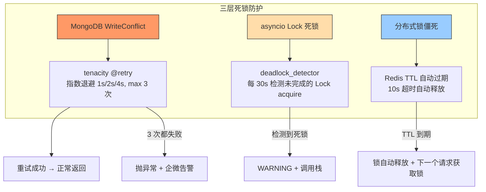

---

doc_type: module
prd_task_id: "YA-09-45"
title: "YA-09-45: 死锁检测与恢复 — 分布式锁超时 + 自动重试 — 开发方案"
status: 需求已编写
priority: P2
owner: 陈铭
roles: [engineer]
created: 2026-09-11
updated: 2026-09-23
project: YiAi
project_id: yiai
prd_month: "202609"
estimate_frontend: 1.0
source_prd: "77-需求-死锁检测与恢复.md"
source_okr: [yiai-001]

type: task
---

# YA-09-45: 死锁检测与恢复 — 分布式锁超时 + 自动重试 — 开发方案

> **文档职责**：本文档定义**怎么做、为什么这么做、实际做成什么样**（HOW），不含产品目标与测试用例。

> 来源 PRD：[77-需求-死锁检测与恢复.md](../../prds/2026-09/77-需求-死锁检测与恢复.md)
> 需求编号：YA-09-45 · 优先级：P2 · 人天：1.0d · 状态：需求已编写

---

<a id="sec-1"></a>
## 一、架构总览

MongoDB WriteConflict 和 asyncio 锁死锁在高并发场景下可能导致请求阻塞数秒甚至永久挂起。建立三层死锁防护：MongoDB 写冲突指数退避重试、asyncio Lock 死锁检测与超时解除、分布式锁 TTL 自动过期。



---

<a id="sec-2"></a>
## 二、文件清单

| 文件 | 操作 | 说明 |
|------|------|------|
| `YiAi/src/shared/retry.py` | 新增 | MongoDB 重试装饰器 + asyncio 死锁检测 |
| `YiAi/src/shared/distributed_lock.py` | 新增 | Redis 分布式锁 + TTL 自动过期 |
| `YiAi/src/domain/data/repository.py` | 修改 | 写操作使用重试装饰器 |
| `YiAi/tests/test_retry.py` | 新增 | 死锁检测与恢复测试 |

---

<a id="sec-3"></a>
## 三、模块设计

### 3.1 MongoDB 写冲突重试

```python
# YiAi/src/shared/retry.py
from tenacity import retry, stop_after_attempt, wait_exponential, retry_if_exception_type
from pymongo.errors import WriteConflict, WriteError

@retry(
    stop=stop_after_attempt(3),
    wait=wait_exponential(multiplier=1, min=1, max=10),
    retry=retry_if_exception_type(WriteConflict, WriteError),
    before_sleep=lambda retry_state: logger.warning(
        f"[Retry] MongoDB 写冲突重试 {retry_state.attempt_number}/3"
    ),
)
async def safe_write(collection, operation_fn):
    """MongoDB 写操作——自动重试 WriteConflict。

    使用方式:
        result = await safe_write(collection, lambda: collection.update_one(...))
    """
    return await operation_fn()
```

### 3.2 asyncio 死锁检测器

```python
import asyncio

class DeadlockDetector:
    """asyncio Lock 死锁检测——定期扫描所有 Task 的调用栈。"""

    def __init__(self, check_interval: float = 30.0):
        self._interval = check_interval
        self._running = False

    async def start(self):
        """启动死锁检测协程。"""
        self._running = True
        while self._running:
            await asyncio.sleep(self._interval)
            await self._check_deadlocks()

    async def _check_deadlocks(self):
        """检查所有 asyncio Task 是否可能死锁。"""
        for task in asyncio.all_tasks():
            if task.done():
                continue
            stack = task.get_stack()
            for frame in stack:
                code = frame.f_code
                if '_acquire' in code.co_name or 'Lock.acquire' in str(frame):
                    wait_time = (asyncio.get_event_loop().time() -
                                 getattr(task, '_start_time', 0))
                    if wait_time > 10:
                        logger.warning(
                            f"[DeadlockDetector] 疑似死锁: task={task.get_name()}, "
                            f"wait={wait_time:.1f}s, lock={code.co_name}"
                        )
                        # 可选：强制取消长时间等待的 task
                        # task.cancel()

    async def stop(self):
        self._running = False
```

### 3.3 Redis 分布式锁

```python
# YiAi/src/shared/distributed_lock.py
import redis.asyncio as aioredis
import uuid

class RedisLock:
    """Redis 分布式锁——带 TTL 自动过期。

    使用 Redlock 简化版: SET NX + TTL + Lua 释放脚本。
    """

    def __init__(self, redis_client, name: str, ttl: int = 10):
        self._redis = redis_client
        self._name = f'lock:{name}'
        self._ttl = ttl
        self._token = str(uuid.uuid4())

    async def acquire(self, timeout: float = 5.0) -> bool:
        """获取锁——带超时。SET lock:name token NX EX ttl。"""
        ...

    async def release(self):
        """释放锁——Lua 脚本保证原子性。

        仅当 token 匹配时才释放（防止释放他人的锁）。
        """
        script = """
        if redis.call('GET', KEYS[1]) == ARGV[1] then
            return redis.call('DEL', KEYS[1])
        end
        return 0
        """
        ...

    async def __aenter__(self):
        acquired = await self.acquire()
        if not acquired:
            raise LockAcquireError(f'无法获取锁: {self._name}')
        return self

    async def __aexit__(self, *args):
        await self.release()
```

---

<a id="sec-4"></a>
## 四、数据流

```
MongoDB 写操作:
  → safe_write(collection, lambda: collection.update_one(...))
    → WriteConflict 异常
      → @retry: wait 1s → retry
      → 再次冲突: wait 2s → retry
      → 再次冲突: wait 4s → retry
      → 3 次都失败 → 抛出异常 + 企微通知

asyncio Lock:
  → _acquire_lock() 等待超过 10s
    → DeadlockDetector._check_deadlocks()
      → 检测到等待超时 → WARNING + 调用栈

Redis 分布式锁:
  → lock = RedisLock(redis, 'knowledge_sync', ttl=10)
  → async with lock:
      → SET lock:knowledge_sync {token} NX EX 10
      → 执行业务逻辑
    → Lua 脚本验证 token → DEL lock:knowledge_sync
```

---

<a id="sec-5"></a>
## 五、实施路线

| # | 步骤 | 产出 | 验证 | 人天 |
|---|------|------|------|------|
| 1 | MongoDB 写冲突重试装饰器 | `retry.py` | WriteConflict 自动通过重试恢复 | 0.3 |
| 2 | asyncio 死锁检测器 | `retry.py` | 死锁 Task 被识别并记录调用栈 | 0.25 |
| 3 | Redis 分布式锁 + TTL + Lua 释放 | `distributed_lock.py` | 锁僵死后 TTL 自动过期 | 0.25 |
| 4 | 集成到 repository + 知识库同步 | `repository.py` | 写操作自动重试 | 0.1 |
| 5 | 测试用例 | `tests/test_retry.py` | 写冲突/死锁检测/分布式锁/Lua 释放 | 0.1 |

**合计：1.0d**

---

<a id="sec-6"></a>
## 六、代码审查检查清单

- [ ] MongoDB WriteConflict 使用 tenacity 指数退避重试（1s/2s/4s, max 3 次）
- [ ] 重试前记录 WARNING 日志（含重试次数和原因）
- [ ] 死锁检测器仅扫描未完成的 Task（`not task.done()`）
- [ ] 等待超过 10s 的 Lock acquire 判定为疑似死锁
- [ ] Redis 分布式锁必须有 TTL 自动过期
- [ ] 释放锁使用 Lua 脚本验证 token（防止释放他人锁）
- [ ] 锁获取失败时抛明确异常（非阻塞等待）

---

<a id="sec-7"></a>
## 七、风险评估

| 风险 | 概率 | 影响 | 缓解措施 |
|------|------|------|----------|
| 重试导致写操作延迟增加 | 低 | 低 | 最多 3 次重试（1+2+4=7s 总等待） |
| 死锁检测误判（正常长时间操作） | 中 | 低 | 仅 WARNING，不做自动取消 |
| Redis 分布式锁 token 碰撞 | 低 | 中 | UUID token + Lua 脚本验证 |

**回滚**：移除 retry 装饰器和死锁检测器。写冲突直接抛异常（原有行为）。