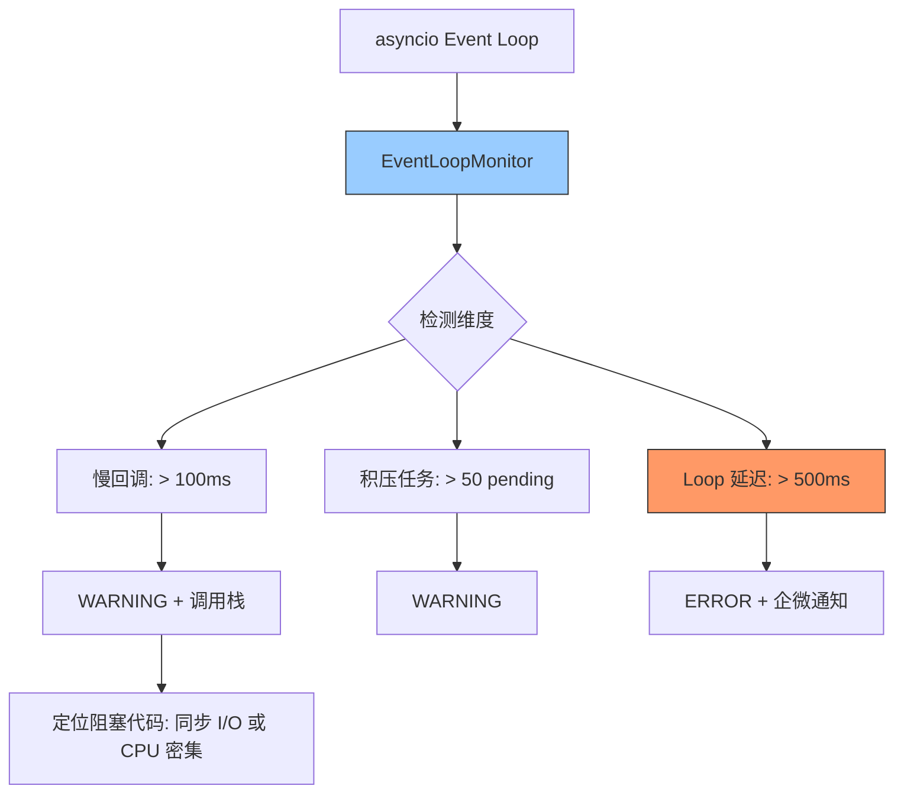

---

doc_type: module
prd_task_id: "YA-09-51"
title: "YA-09-51: Event Loop 阻塞检测 — asyncio 慢回调监控与积压告警 — 开发方案"
status: 需求已编写
priority: P2
owner: 陈铭
roles: [engineer]
created: 2026-09-11
updated: 2026-09-23
project: YiAi
project_id: yiai
prd_month: "202609"
estimate_frontend: 0.5
source_prd: "78-需求-EventLoop阻塞检测.md"
source_okr: [yiai-001]

type: task
---

# YA-09-51: Event Loop 阻塞检测 — asyncio 慢回调监控与积压告警 — 开发方案

> **文档职责**：本文档定义**怎么做、为什么这么做、实际做成什么样**（HOW），不含产品目标与测试用例。

> 来源 PRD：[78-需求-EventLoop阻塞检测.md](../../prds/2026-09/78-需求-EventLoop阻塞检测.md)
> 需求编号：YA-09-51 · 优先级：P2 · 人天：0.5d · 状态：需求已编写

---

<a id="sec-1"></a>
## 一、架构总览

同步阻塞代码（如 `open()` 未用 `aiofiles`、CPU 密集型计算未放入 ThreadPool）会卡住整个 asyncio Event Loop，导致所有并发请求延迟飙升。通过 `asyncio.loop.slow_callback_duration` 自动检测慢回调 + 定期监控积压任务数 + Event Loop 延迟测量，及时发现并告警阻塞来源。



**核心机制**：`loop.slow_callback_duration` 设置 100ms 阈值，超过时 Python 自动记录。辅以定期 loop 延迟测量（记录时间戳 → sleep 100ms → 计算实际耗时 → 偏差即阻塞时长）。

---

<a id="sec-2"></a>
## 二、文件清单

| 文件 | 操作 | 说明 |
|------|------|------|
| `YiAi/src/server/event_loop_monitor.py` | 新增 | EventLoopMonitor + 告警逻辑 |
| `YiAi/src/server/main.py` | 修改 | 启动时初始化监控器 |
| `YiAi/tests/test_event_loop_monitor.py` | 新增 | 阻塞检测测试 |

---

<a id="sec-3"></a>
## 三、模块设计

### 3.1 EventLoopMonitor

```python
# YiAi/src/server/event_loop_monitor.py
import asyncio
import time
import traceback

class EventLoopMonitor:
    """asyncio Event Loop 阻塞检测——三层面监控。

    层面:
        1. slow_callback_duration: Python 3.x 内置，超过阈值自动记录
        2. pending_task_count: 定期检查积压的未完成 Task 数量
        3. loop_latency: 定期测量 Event Loop 实际延迟
    """

    def __init__(self,
                 slow_callback_ms: float = 100,       # 慢回调阈值
                 pending_task_threshold: int = 50,     # 积压任务阈值
                 latency_threshold_ms: float = 500):   # Loop 延迟告警阈值

        self.slow_callback_ms = slow_callback_ms
        self.pending_task_threshold = pending_task_threshold
        self.latency_threshold_ms = latency_threshold_ms
        self._running = False

    def setup(self, loop: asyncio.AbstractEventLoop = None):
        """设置 slow_callback_duration。"""
        loop = loop or asyncio.get_event_loop()
        loop.slow_callback_duration = self.slow_callback_ms / 1000.0
        loop.set_debug(True)

        def log_slow_callback(task_name: str, duration: float):
            logger.warning(
                f"[EventLoop] SLOW CALLBACK: {task_name} blocked event loop for {duration:.2f}s\n"
                f"Stack: {''.join(traceback.format_stack())}"
            )
        loop.slow_callback_log = log_slow_callback

    async def start_monitoring(self):
        """启动监控协程——两层面监控。"""
        self._running = True
        await asyncio.gather(
            self._monitor_pending_tasks(),
            self._monitor_loop_latency(),
        )

    async def _monitor_pending_tasks(self):
        """监控积压任务数。"""
        while self._running:
            await asyncio.sleep(5)
            tasks = asyncio.all_tasks()
            pending = sum(1 for t in tasks if not t.done())
            if pending > self.pending_task_threshold:
                logger.warning(
                    f"[EventLoop] 积压任务: {pending}/{len(tasks)}, "
                    f"threshold={self.pending_task_threshold}"
                )
            # 上报 Prometheus 指标
            loop_pending_tasks_gauge.set(pending)

    async def _monitor_loop_latency(self):
        """监控 Event Loop 延迟（测量实际 sleep 偏差）。"""
        while self._running:
            start = time.monotonic()
            await asyncio.sleep(0.1)
            elapsed = time.monotonic() - start
            delay = elapsed - 0.1  # 额外延迟 = 实际耗时 - 预期睡眠

            if delay > self.latency_threshold_ms / 1000.0:
                logger.error(
                    f"[EventLoop] LOOP DELAY: {delay:.3f}s, "
                    f"threshold={self.latency_threshold_ms}ms"
                )
                await self._send_alert(f'Event Loop 延迟 {delay:.3f}s')

            loop_latency_gauge.set(delay * 1000)  # Prometheus 指标

    async def stop(self):
        self._running = False

    async def _send_alert(self, message: str):
        """企微通知 + Prometheus 告警指标。"""
        ...
```

### 3.2 检测维度

| 指标 | 阈值 | 检测方式 | 动作 |
|------|------|---------|------|
| 慢回调 | > 100ms | `loop.slow_callback_duration` | WARNING + 完整调用栈 |
| 积压任务 | > 50 pending | `asyncio.all_tasks()` 计数 | WARNING |
| Event Loop 延迟 | > 500ms | sleep(0.1) 计时偏差 | ERROR + 企微通知 |

---

<a id="sec-4"></a>
## 四、数据流

```
YiAi 启动
  → EventLoopMonitor.setup(loop)
    → loop.slow_callback_duration = 0.1 (100ms)
    → loop.set_debug(True)
  → start_monitoring()
    → _monitor_pending_tasks: 每 5s 检查积压数
    → _monitor_loop_latency: 每 100ms 测量 loop 延迟

运行时:
  → 同步 I/O 阻塞 → loop 延迟飙升
    → _monitor_loop_latency 检测到 delay > 500ms
    → ERROR 日志 + 企微通知
  → 同时 slow_callback_duration 触发
    → WARNING + 阻塞代码调用栈
```

---

<a id="sec-5"></a>
## 五、实施路线

| # | 步骤 | 产出 | 验证 | 人天 |
|---|------|------|------|------|
| 1 | 实现 EventLoopMonitor | `event_loop_monitor.py` | 同步阻塞代码被检测 | 0.15 |
| 2 | slow_callback_duration + 调用栈记录 | `event_loop_monitor.py` | 阻塞代码位置可追溯 | 0.1 |
| 3 | 积压任务 + Loop 延迟监控 | `event_loop_monitor.py` | 三层面监控全部生效 | 0.1 |
| 4 | 集成到 FastAPI 启动流程 | `main.py` | 服务启动时自动开启监控 | 0.05 |
| 5 | Prometheus 指标上报 | `event_loop_monitor.py` | Grafana 可查看 loop 延迟趋势 | 0.05 |
| 6 | 测试用例 | `tests/test_event_loop_monitor.py` | 阻塞检测/积压/延迟/告警 | 0.05 |

**合计：0.5d**

---

<a id="sec-6"></a>
## 六、代码审查检查清单

- [ ] `loop.slow_callback_duration` 设置为 100ms
- [ ] 慢回调记录包含完整调用栈（`traceback.format_stack()`）
- [ ] 积压任务监控间隔 5s（非高频）
- [ ] Loop 延迟测量使用 `sleep(0.1)` 计时偏差法
- [ ] 严重延迟（> 500ms）触发企微通知
- [ ] Prometheus 指标：`loop_latency_ms`, `loop_pending_tasks`
- [ ] 监控器异常不影响业务请求

---

<a id="sec-7"></a>
## 七、风险评估

| 风险 | 概率 | 影响 | 缓解措施 |
|------|------|------|----------|
| `loop.set_debug(True)` 性能开销 | 低 | 低 | 仅开发/测试环境开启 debug |
| sleep(0.1) 延迟测量不够精确 | 低 | 低 | 仅用于趋势判断，非精确计时 |
| 慢回调日志过多淹没重要信息 | 中 | 低 | WARNING 级别 + 限频（每分钟最多 10 条） |

**回滚**：跳过 EventLoopMonitor 初始化，Event Loop 恢复正常行为。