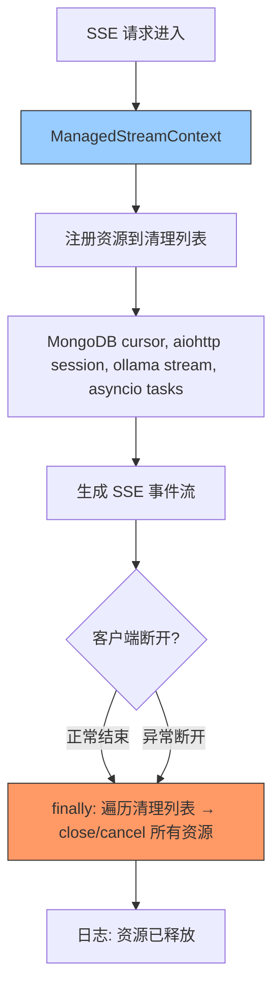

---

doc_type: module
prd_task_id: "YA-09-113"
title: "YA-09-113: 异步生成器资源管理 — SSE 连接完善清理 — 开发方案"
status: 需求已编写
priority: P2
owner: 陈铭
roles: [engineer]
created: 2026-09-11
updated: 2026-09-23
project: YiAi
project_id: yiai
prd_month: "202609"
estimate_frontend: 0.5
source_prd: "79-需求-异步生成器资源管理.md"
source_okr: [yiai-001]

type: task
---

# YA-09-113: 异步生成器资源管理 — SSE 连接完善清理 — 开发方案

> **文档职责**：本文档定义**怎么做、为什么这么做、实际做成什么样**（HOW），不含产品目标与测试用例。

> 来源 PRD：[79-需求-异步生成器资源管理.md](../../prds/2026-09/79-需求-异步生成器资源管理.md)
> 需求编号：YA-09-113 · 优先级：P2 · 人天：0.5d · 状态：需求已编写

---

<a id="sec-1"></a>
## 一、架构总览

SSE 流式响应的 async generator 在客户端断开连接时可能未正确清理底层资源——MongoDB cursor 未关闭、aiohttp session 未释放、Ollama 推理流未取消、asyncio Task 泄漏。引入统一的资源管理上下文，确保无论正常结束还是异常断开，所有资源都被正确释放。



---

<a id="sec-2"></a>
## 二、文件清单

| 文件 | 操作 | 说明 |
|------|------|------|
| `YiAi/src/server/managed_stream.py` | 新增 | ManagedStreamContext 通用上下文管理器 |
| `YiAi/src/services/ai/chat_service.py` | 修改 | SSE 端点使用 ManagedStreamContext |
| `YiAi/src/services/ai/rag_service.py` | 修改 | RAG SSE 端点使用 ManagedStreamContext |
| `YiAi/tests/test_managed_stream.py` | 新增 | 资源清理测试 |

---

<a id="sec-3"></a>
## 三、模块设计

### 3.1 ManagedStreamContext

```python
# YiAi/src/server/managed_stream.py
from contextlib import asynccontextmanager
from typing import AsyncIterator, Any
import asyncio

class ManagedStreamContext:
    """SSE 异步生成器资源管理——确保所有资源正确释放。

    管理资源类型:
        - MongoDB cursor → cursor.close()
        - aiohttp ClientSession → session.close()
        - Ollama async generator → generator.aclose()
        - asyncio Task → task.cancel()

    使用方式:
        ctx = ManagedStreamContext()
        async with ctx:
            cursor = ctx.track(db.collection.find(...))
            async for doc in cursor:
                yield format_sse(doc)
        # 退出时自动释放所有资源
    """

    def __init__(self):
        self._resources: list[tuple[str, Any, callable]] = []

    def track(self, resource: Any, cleanup_fn: callable = None, label: str = '') -> Any:
        """注册资源到清理列表。返回资源本身以支持链式调用。

        cleanup_fn 为 None 时自动推测:
            - Motor Cursor/AggregationCursor → .close()
            - aiohttp ClientSession → .close()
            - AsyncGenerator → .aclose()
            - asyncio.Task → .cancel()
        """
        if cleanup_fn is None:
            cleanup_fn = self._infer_cleanup(resource)
        self._resources.append((label or type(resource).__name__, resource, cleanup_fn))
        return resource

    def _infer_cleanup(self, resource: Any) -> callable:
        """自动推测资源清理方法。"""
        name = type(resource).__name__
        if 'Cursor' in name or 'CommandCursor' in name:
            return lambda r: r.close()
        if 'ClientSession' in name:
            return lambda r: asyncio.ensure_future(r.close())
        if hasattr(resource, 'aclose'):
            return lambda r: asyncio.ensure_future(r.aclose())
        if isinstance(resource, asyncio.Task):
            return lambda r: r.cancel()
        return lambda r: None  # 未知类型，静默跳过

    async def cleanup(self):
        """释放所有已注册资源（按注册反序）。"""
        for label, resource, cleanup_fn in reversed(self._resources):
            try:
                result = cleanup_fn(resource)
                if asyncio.iscoroutine(result):
                    await result
                logger.debug(f'[ManagedStream] 释放 {label}')
            except Exception as e:
                logger.warning(f'[ManagedStream] 释放 {label} 失败: {e}')
        self._resources.clear()

    async def __aenter__(self):
        self._resources = []
        return self

    async def __aexit__(self, *args):
        await self.cleanup()
        return False  # 不吞异常
```

### 3.2 SSE 端点集成

```python
# YiAi/src/services/ai/chat_service.py
from server.managed_stream import ManagedStreamContext

async def chat_stream(query: str, session_id: str):
    ctx = ManagedStreamContext()
    async with ctx:
        # 注册 MongoDB cursor
        cursor = ctx.track(
            db.sessions.find({'key': session_id}),
            label='session_cursor'
        )

        # 注册 Ollama 流
        ollama_stream = ctx.track(
            ollama_client.generate_stream(query),
            label='ollama_stream'
        )

        # 注册后台任务
        heartbeat_task = ctx.track(
            asyncio.create_task(heartbeat()),
            label='heartbeat_task'
        )

        async def event_stream():
            try:
                async for chunk in ollama_stream:
                    yield f'data: {json.dumps(chunk)}\n\n'
                yield 'data: {"done": true}\n\n'
            except asyncio.CancelledError:
                yield 'data: {"error": "cancelled"}\n\n'
                raise
            finally:
                await ctx.cleanup()

        return StreamingResponse(
            event_stream(),
            media_type='text/event-stream',
            headers={'Cache-Control': 'no-store', 'X-Accel-Buffering': 'no'}
        )
```

---

<a id="sec-4"></a>
## 四、数据流

```
SSE 连接建立
  → ManagedStreamContext.__aenter__
  → track(cursor), track(session), track(task)
  → event_stream() 开始 yield SSE 事件

正常结束:
  → event_stream() 完成
  → __aexit__ → cleanup()
    → asc close: heartbeat_task.cancel()
    → asc close: ollama_stream.aclose()
    → asc close: session_cursor.close()

异常断开 (客户端关闭连接):
  → asyncio.CancelledError 抛出
  → except CancelledError → yield error event
  → finally → ctx.cleanup()
    → 所有资源释放
```

---

<a id="sec-5"></a>
## 五、实施路线

| # | 步骤 | 产出 | 验证 | 人天 |
|---|------|------|------|------|
| 1 | 创建 ManagedStreamContext | `managed_stream.py` | 资源注册 + 自动清理 | 0.15 |
| 2 | 实现自动推测清理方法 | `managed_stream.py` | 各种资源类型清理正确 | 0.1 |
| 3 | 集成到 chat_service SSE 端点 | `chat_service.py` | 断开后 cursor 和 ollama 流关闭 | 0.1 |
| 4 | 集成到 rag_service SSE 端点 | `rag_service.py` | RAG 断开后资源释放 | 0.05 |
| 5 | 测试用例 | `tests/test_managed_stream.py` | 正常/异常/断开/资源类型推测 | 0.1 |

**合计：0.5d**

---

<a id="sec-6"></a>
## 六、代码审查检查清单

- [ ] 所有 SSE 端点使用 ManagedStreamContext 管理资源
- [ ] MongoDB cursor 正确注册到清理列表（Cursor, AggregationCursor, CommandCursor）
- [ ] aiohttp session 注册并异步关闭
- [ ] asyncio Task 注册并在退出时 cancel
- [ ] 清理按注册反序执行（后注册先释放）
- [ ] 清理失败不阻塞其他资源的释放（catch exception）
- [ ] 日志记录清理操作（DEBUG 级别）

---

<a id="sec-7"></a>
## 七、风险评估

| 风险 | 概率 | 影响 | 缓解措施 |
|------|------|------|----------|
| 自动推测清理方法失败 | 低 | 中 | 手动指定 cleanup_fn 作为 fallback |
| 清理耗时过长阻塞请求 | 低 | 低 | 异步清理 + 超时控制 |
| 新增 SSE 端点忘记使用 ManagedStreamContext | 中 | 中 | 代码审查检查清单覆盖 |

**回滚**：移除 ManagedStreamContext，恢复原有 finally 清理逻辑。