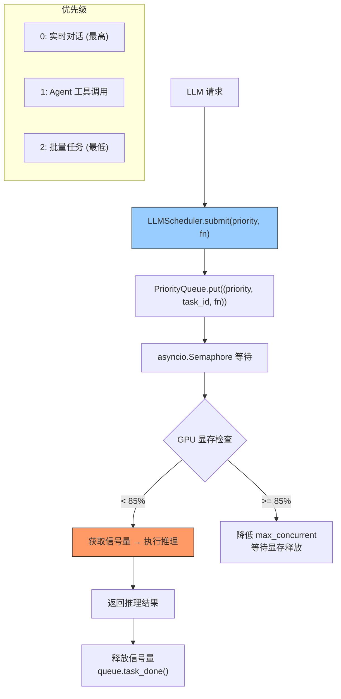

---

doc_type: module
prd_task_id: "YA-09-114"
title: "YA-09-114: LLM 并发调度 — 动态信号量 + 优先级队列 — 开发方案"
status: 需求已编写
priority: P2
owner: 陈铭
roles: [engineer]
created: 2026-09-11
updated: 2026-09-23
project: YiAi
project_id: yiai
prd_month: "202609"
estimate_frontend: 0.5
source_prd: "80-需求-LLM并发调度优化.md"
source_okr: [yiai-002]

type: task
---

# YA-09-114: LLM 并发调度 — 动态信号量 + 优先级队列 — 开发方案

> **文档职责**：本文档定义**怎么做、为什么这么做、实际做成什么样**（HOW），不含产品目标与测试用例。

> 来源 PRD：[80-需求-LLM并发调度优化.md](../../prds/2026-09/80-需求-LLM并发调度优化.md)
> 需求编号：YA-09-114 · 优先级：P2 · 人天：0.5d · 状态：需求已编写

---

<a id="sec-1"></a>
## 一、架构总览

Ollama 自托管 GPU 显存有限，多个并发推理请求同时执行可能导致 OOM（显存不足）或推理质量下降。引入 LLMScheduler：根据 GPU 显存使用率动态调整并发信号量 + 优先级队列（实时对话优先于 Agent 工具调用优先于批量任务）。



---

<a id="sec-2"></a>
## 二、文件清单

| 文件 | 操作 | 说明 |
|------|------|------|
| `YiAi/src/services/ai/llm_scheduler.py` | 新增 | LLMScheduler + 优先级调度 |
| `YiAi/src/services/ai/chat_service.py` | 修改 | 使用 LLMScheduler 提交推理 |
| `YiAi/src/services/ai/agent_service.py` | 修改 | Agent 工具调用使用调度器 |
| `YiAi/tests/test_llm_scheduler.py` | 新增 | LLM 调度测试 |

---

<a id="sec-3"></a>
## 三、模块设计

### 3.1 LLMScheduler

```python
# YiAi/src/services/ai/llm_scheduler.py
import asyncio
import subprocess
from enum import IntEnum

class TaskPriority(IntEnum):
    """LLM 任务优先级——数字越小优先级越高。"""
    REALTIME_CHAT = 0      # 实时对话
    AGENT_TOOL = 1          # Agent 工具调用
    BATCH_TASK = 2          # 批量/后台任务

class LLMScheduler:
    """LLM 并发调度器——动态信号量 + 优先级队列。

    策略:
        1. GPU 显存 < 85%: max_concurrent 个并发推理
        2. GPU 显存 >= 85%: 降低 max_concurrent 直到显存释放
        3. PriorityQueue 按优先级分发（低数字 = 高优先）
    """

    def __init__(self, max_concurrent: int = 3, gpu_memory_threshold: float = 0.85):
        self._max_concurrent = max_concurrent
        self._gpu_threshold = gpu_memory_threshold
        self._sem = asyncio.Semaphore(max_concurrent)
        self._queue = asyncio.PriorityQueue()

    async def submit(self, priority: int, fn, *args, **kwargs):
        """提交 LLM 推理任务——按优先级排队 + 动态信号量控制。

        Args:
            priority: TaskPriority 值（0 最高）
            fn: 推理函数（async callable）
        """
        task_id = id(fn)
        await self._queue.put((priority, task_id, fn, args, kwargs))
        await self._adjust_concurrency()
        async with self._sem:
            _, _, task_fn, task_args, task_kwargs = await self._queue.get()
            try:
                return await task_fn(*task_args, **task_kwargs)
            finally:
                self._queue.task_done()

    async def _adjust_concurrency(self):
        """根据 GPU 显存动态调整并发信号量。"""
        memory_usage = await self._get_gpu_memory_usage()
        if memory_usage >= self._gpu_threshold:
            # 降低并发
            new_max = max(1, self._max_concurrent - 1)
            if new_max != self._max_concurrent:
                logger.warning(
                    f'[LLMScheduler] GPU 显存 {memory_usage:.1%} >= {self._gpu_threshold}, '
                    f'降低并发 {self._max_concurrent} → {new_max}'
                )
                self._max_concurrent = new_max
        elif memory_usage < 0.5 and self._max_concurrent < 3:
            # 恢复并发
            self._max_concurrent = min(3, self._max_concurrent + 1)

    async def _get_gpu_memory_usage(self) -> float:
        """获取 GPU 显存使用率——通过 nvidia-smi 或 Ollama API。"""
        try:
            result = await asyncio.to_thread(
                subprocess.run,
                ['nvidia-smi', '--query-gpu=memory.used,memory.total', '--format=csv,noheader,nounits'],
                capture_output=True, text=True, timeout=5
            )
            used, total = map(int, result.stdout.strip().split(','))
            return used / total if total > 0 else 0.0
        except Exception:
            return 0.0  # 无 GPU 或 nvidia-smi 不可用，不限制

    def get_status(self) -> dict:
        """获取调度器状态——queue 大小、当前并发数。"""
        return {
            'max_concurrent': self._max_concurrent,
            'queue_size': self._queue.qsize(),
            'gpu_threshold': self._gpu_threshold,
        }
```

### 3.2 优先级使用

```python
# 实时对话
result = await scheduler.submit(TaskPriority.REALTIME_CHAT, ollama_chat, prompt)

# Agent 工具调用
result = await scheduler.submit(TaskPriority.AGENT_TOOL, ollama_tool_call, tool_name, params)

# 批量摘要
result = await scheduler.submit(TaskPriority.BATCH_TASK, ollama_summarize, document)
```

---

<a id="sec-4"></a>
## 四、数据流

```
请求 1 (REALTIME_CHAT): scheduler.submit(0, chat_fn, "hello")
  → queue.put((0, id1, chat_fn))
  → adjust_concurrency: GPU 60% → OK
  → sem.acquire() → 获得信号量
  → queue.get() → 取出 (0, id1, chat_fn) → 执行

请求 2 (BATCH_TASK): scheduler.submit(2, batch_fn, doc)
  → queue.put((2, id2, batch_fn))
  → 等待 sem.acquire()（已被请求 1 占用）

请求 3 (REALTIME_CHAT): scheduler.submit(0, chat_fn, "hi")
  → queue.put((0, id3, chat_fn))
  → 请求 1 释放 sem → sem.release()
  → PriorityQueue.get() → (0, id3, chat_fn) 优先于 (2, id2, batch_fn)
  → 请求 3 先执行
```

---

<a id="sec-5"></a>
## 五、实施路线

| # | 步骤 | 产出 | 验证 | 人天 |
|---|------|------|------|------|
| 1 | 创建 LLMScheduler + asyncio.PriorityQueue | `llm_scheduler.py` | 优先级排序正确 | 0.15 |
| 2 | GPU 显存监控 + 动态调整并发 | `llm_scheduler.py` | GPU 超阈值时降低并发 | 0.1 |
| 3 | 集成到 chat_service + agent_service | 各 service | 所有 LLM 调用走调度器 | 0.1 |
| 4 | 添加调度器状态监控 | `llm_scheduler.py` | /health/debug 查看队列状态 | 0.05 |
| 5 | 测试用例 | `tests/test_llm_scheduler.py` | 优先级/GPU 阈值/并发限制 | 0.1 |

**合计：0.5d**

---

<a id="sec-6"></a>
## 六、代码审查检查清单

- [ ] PriorityQueue 按优先级排序（低数字 = 高优先）
- [ ] asyncio.Semaphore 控制最大并发推理数
- [ ] GPU 显存 >= 85% 时动态降低 max_concurrent
- [ ] GPU 显存 < 50% 时恢复 max_concurrent
- [ ] nvidia-smi 不可用时默认不限制（max_concurrent 保持不变）
- [ ] TaskPriority 枚举值明确定义：REALTIME_CHAT(0) > AGENT_TOOL(1) > BATCH_TASK(2)
- [ ] 调度器异常不影响请求处理（降级直接执行）

---

<a id="sec-7"></a>
## 七、风险评估

| 风险 | 概率 | 影响 | 缓解措施 |
|------|------|------|----------|
| 低优先级任务可能饥饿 | 中 | 中 | 设置超时 + 超时后提升优先级 |
| nvidia-smi 调用失败 | 中 | 低 | 失败时返回 0，不限制并发 |
| PriorityQueue 非线程安全 | 低 | 低 | asyncio 单线程，无需加锁 |

**回滚**：移除 LLMScheduler，直接调用 ollama_client（原有行为，无并发控制）。