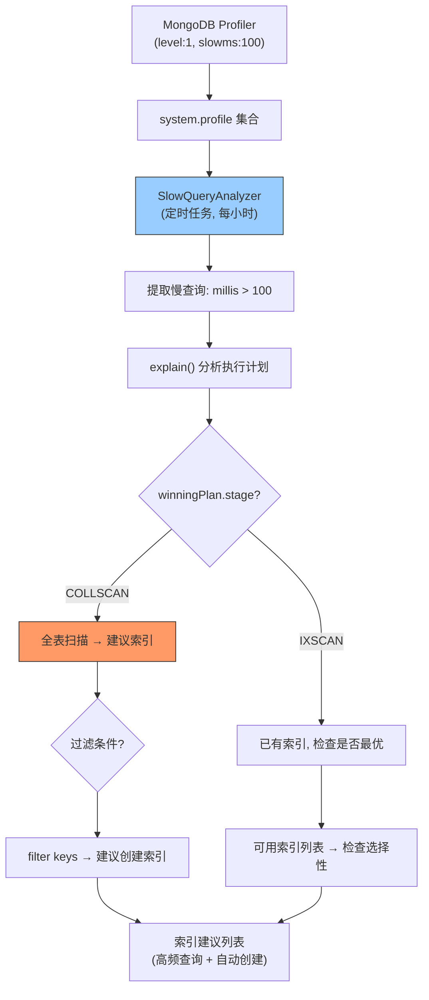

---

doc_type: module
prd_task_id: "YA-09-64"
title: "YA-09-64: 慢查询索引建议 — MongoDB profiler + explain 分析 — 开发方案"
status: 需求已编写
priority: P2
owner: 陈铭
roles: [engineer]
created: 2026-09-11
updated: 2026-09-23
project: YiAi
project_id: yiai
prd_month: "202609"
estimate_frontend: 1.0
source_prd: "81-需求-慢查询索引建议.md"
source_okr: [yiai-001]

type: task
---

# YA-09-64: 慢查询索引建议 — MongoDB profiler + explain 分析 — 开发方案

> **文档职责**：本文档定义**怎么做、为什么这么做、实际做成什么样**（HOW），不含产品目标与测试用例。

> 来源 PRD：[81-需求-慢查询索引建议.md](../../prds/2026-09/81-需求-慢查询索引建议.md)
> 需求编号：YA-09-64 · 优先级：P2 · 人天：1.0d · 状态：需求已编写

---

<a id="sec-1"></a>
## 一、架构总览

YiAi 当前无慢查询分析能力——哪些查询使用了全表扫描（COLLSCAN）、哪些查询需要创建索引完全不可见。启用 MongoDB Profiler（level:1, slowms:100），定期分析 `system.profile` 集合中的慢查询，通过 `explain()` 分析执行计划，自动建议缺失索引。



**决策矩阵**：COLLSCAN + 查询频率 > 10次/天 → 建议创建索引。简单单字段索引自动创建（< 100MB），复合 3+ 字段索引需人工确认。

---

<a id="sec-2"></a>
## 二、文件清单

| 文件 | 操作 | 说明 |
|------|------|------|
| `YiAi/src/services/monitor/slow_query_analyzer.py` | 新增 | SlowQueryAnalyzer + 索引建议 |
| `YiAi/src/services/monitor/index_manager.py` | 新增 | 索引自动创建与管理 |
| `YiAi/config.yaml` | 修改 | Profiler 和慢查询配置 |
| `YiAi/tests/test_slow_query.py` | 新增 | 慢查询分析测试 |

---

<a id="sec-3"></a>
## 三、模块设计

### 3.1 SlowQueryAnalyzer

```python
# YiAi/src/services/monitor/slow_query_analyzer.py
from motor.motor_asyncio import AsyncIOMotorDatabase

class SlowQueryAnalyzer:
    """MongoDB 慢查询分析器——分析 system.profile 并建议索引。

    配置:
        profiler_level: 1 (仅慢查询)
        slowms: 100ms
        analysis_interval: 3600s (每小时)
    """

    def __init__(self, db: AsyncIOMotorDatabase, config: dict = None): ...

    async def enable_profiler(self):
        """启用 MongoDB Profiler——仅记录慢查询（level=1）。"""
        await self.db.command('profile', 1, slowms=100)

    async def analyze(self) -> list[dict]:
        """分析 system.profile 中的慢查询，返回索引建议列表。

        流程:
            1. 查询 system.profile (millis > 100, 最近 1 小时)
            2. 按 collection 分类
            3. 对每个 collection 的去重查询执行 explain()
            4. 检测 COLLSCAN → 提取 filter keys → 建议索引
            5. 检测已有索引的选择性 → 建议优化

        Returns: [{collection, query, duration_ms, stage, suggested_index, auto_create}]
        """
        profiles = await self.db.system.profile.find({
            'millis': {'$gt': 100},
            'ts': {'$gt': datetime.utcnow() - timedelta(hours=1)}
        }).sort('ts', -1).limit(200).to_list(length=200)

        suggestions = []
        seen_queries = set()

        for entry in profiles:
            if 'command' not in entry or 'filter' not in entry['command']:
                continue

            query_key = self._query_signature(entry)
            if query_key in seen_queries:
                continue
            seen_queries.add(query_key)

            explain = await self._explain_query(entry)
            stage = explain.get('queryPlanner', {}).get('winningPlan', {}).get('stage', 'UNKNOWN')

            if stage == 'COLLSCAN':
                filter_keys = list(entry['command'].get('filter', {}).keys())
                # 去掉 _id（MongoDB 自带索引）
                filter_keys = [k for k in filter_keys if k != '_id']

                suggestions.append({
                    'collection': entry['ns'].split('.')[-1],
                    'query_sample': entry['command'].get('filter', {}),
                    'duration_ms': entry['millis'],
                    'stage': 'COLLSCAN',
                    'suggested_index': filter_keys,
                    'frequency': self._count_similar(profiles, entry),
                    'auto_create': len(filter_keys) <= 2,
                })

        return suggestions

    def _query_signature(self, entry: dict) -> str:
        """生成查询签名——用于去重相似的查询。"""
        ns = entry.get('ns', '')
        filter_keys = tuple(sorted(entry.get('command', {}).get('filter', {}).keys()))
        sort_keys = tuple(sorted((entry.get('command', {}).get('sort', {}) or {}).keys()))
        return f'{ns}:{filter_keys}:{sort_keys}'

    async def _explain_query(self, entry: dict) -> dict:
        """对慢查询执行 explain() 获取执行计划。"""
        try:
            coll_name = entry['ns'].split('.')[-1]
            command = {'explain': {'find': coll_name,
                                    'filter': entry['command'].get('filter', {})}}
            return await self.db.command(command)
        except Exception as e:
            return {'error': str(e)}

    def _count_similar(self, profiles: list, entry: dict) -> int:
        """统计相似查询的频率（用于决策是否自动创建索引）。"""
        sig = self._query_signature(entry)
        return sum(1 for p in profiles if self._query_signature(p) == sig)
```

### 3.2 IndexManager

```python
# YiAi/src/services/monitor/index_manager.py

class IndexManager:
    """索引管理器——保守自动创建索引。

    自动创建条件:
        - COLLSCAN 查询
        - 单字段或双字段索引
        - 查询频率 > 10 次/天
        - 索引预计大小 < 100MB
        - 非唯一索引（unique index 需人工确认）

    不自动创建:
        - 复合索引 >= 3 字段
        - 唯一索引（可能影响数据完整性）
        - 大索引（预计 > 100MB）
    """

    async def create_index(self, collection: str, keys: list[str]) -> dict:
        """创建索引——单个或复合。

        返回创建结果 + 索引大小 + 耗时。
        """
        ...

    async def list_indexes(self, collection: str) -> list[dict]:
        """列出集合的所有索引。"""
        ...

    async def drop_unused_index(self, collection: str, index_name: str):
        """删除未使用的索引（需人工确认）。"""
        ...
```

### 3.3 索引建议示例

```python
# 分析输出示例
[
    {
        'collection': 'bugs',
        'query_sample': {'severity': 'critical', 'status': 'open'},
        'duration_ms': 250,
        'stage': 'COLLSCAN',
        'suggested_index': ['severity', 'status'],
        'frequency': 45,  # 每小时 45 次
        'auto_create': True,  # 双字段，可以自动创建
    },
    {
        'collection': 'sessions',
        'query_sample': {'is_deleted': False},
        'duration_ms': 150,
        'stage': 'COLLSCAN',
        'suggested_index': ['is_deleted'],
        'frequency': 120,
        'auto_create': True,
    },
]
```

---

<a id="sec-4"></a>
## 四、数据流

```
MongoDB Profiler 后台记录慢查询 → system.profile 集合

定时任务 (每小时):
  → SlowQueryAnalyzer.analyze()
    → 读取 system.profile (最近 1 小时, millis > 100ms)
    → 去重相似查询 → explain() 分析执行计划
    → 检测 COLLSCAN → 提取 filter keys

  → 对建议列表决策:
    → auto_create == True → IndexManager.create_index()
      → db.{collection}.create_index([('severity', 1), ('status', 1)])
    → auto_create == False → 企微通知管理员确认

  → 报告: /health/debug 查看最近索引建议
```

---

<a id="sec-5"></a>
## 五、实施路线

| # | 步骤 | 产出 | 验证 | 人天 |
|---|------|------|------|------|
| 1 | 启用 MongoDB Profiler (level:1, slowms:100) | `config.yaml` | slow queries 写入 system.profile | 0.1 |
| 2 | 创建 SlowQueryAnalyzer | `slow_query_analyzer.py` | 慢查询被识别和 explain | 0.3 |
| 3 | 实现 IndexManager + 自动创建决策 | `index_manager.py` | COLLSCAN → 自动创建索引 | 0.25 |
| 4 | 集成定时任务 | `slow_query_analyzer.py` | 每小时分析一次 | 0.1 |
| 5 | 索引建议通知（企微） | `index_manager.py` | 人工确认的索引通知管理员 | 0.1 |
| 6 | 测试用例 | `tests/test_slow_query.py` | Profiler/explain/索引建议/自动创建 | 0.15 |

**合计：1.0d**

---

<a id="sec-6"></a>
## 六、代码审查检查清单

- [ ] MongoDB Profiler 仅开启 level:1（不记录所有查询）
- [ ] slowms 阈值 100ms（开发环境可调低）
- [ ] 查询去重基于签名（ns + filter keys + sort keys）
- [ ] COLLSCAN 检测后提取 filter keys 建议索引
- [ ] 简化单/双字段索引自动创建
- [ ] 复合 3+ 字段索引需人工确认
- [ ] 自动创建的索引添加 background:true（不阻塞数据库）
- [ ] /health/debug 返回最近索引建议列表

---

<a id="sec-7"></a>
## 七、风险评估

| 风险 | 概率 | 影响 | 缓解措施 |
|------|------|------|----------|
| Profiler 开销影响数据库性能 | 中 | 低 | level:1 仅记录慢查询，影响极小 |
| 自动创建过多索引（写性能下降） | 低 | 中 | 仅单/双字段自动创建 + 频率阈值 |
| explain() 在大集合上耗时长 | 低 | 低 | 使用 limit 1 的 explain |
| 索引建议误报（profiler 中的一次性查询） | 中 | 低 | 频率阈值 > 10 次/天才创建 |

**回滚**：关闭 Profiler (`db.setProfilingLevel(0)`)，停止自动创建索引。已创建的索引保留。