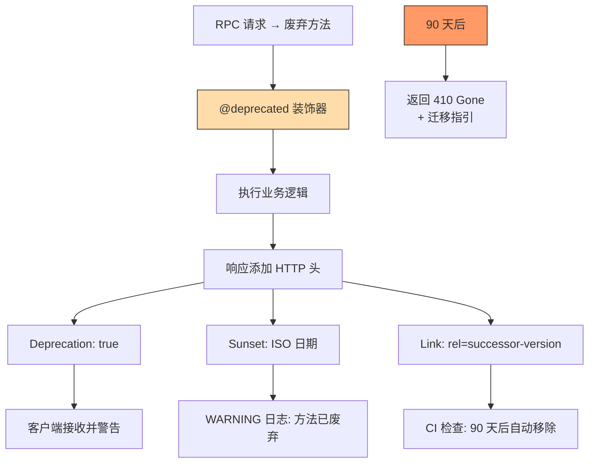

---

doc_type: module
prd_task_id: "YA-09-46"
title: "YA-09-46: API 废弃管理 — Deprecation 头 + 迁移时间线 — 开发方案"
status: 需求已编写
priority: P2
owner: 陈铭
roles: [engineer]
created: 2026-09-11
updated: 2026-09-23
project: YiAi
project_id: yiai
prd_month: "202609"
estimate_frontend: 1.0
source_prd: "82-需求-API废弃迁移指引.md"
source_okr: [yiai-002]

type: task
---

# YA-09-46: API 废弃管理 — Deprecation 头 + 迁移时间线 — 开发方案

> **文档职责**：本文档定义**怎么做、为什么这么做、实际做成什么样**（HOW），不含产品目标与测试用例。

> 来源 PRD：[82-需求-API废弃迁移指引.md](../../prds/2026-09/82-需求-API废弃迁移指引.md)
> 需求编号：YA-09-46 · 优先级：P2 · 人天：1.0d · 状态：需求已编写

---

<a id="sec-1"></a>
## 一、架构总览

YiAi 的 RPC API 变更（重命名 method、修改参数契约）时，直接删除旧方法会导致前端（YiVad/YiPet）报错。引入标准化 API 废弃流程：通过 `@deprecated` 装饰器标记废弃方法，响应添加 `Deprecation`/`Sunset` HTTP 头，90 天宽限期后自动返回 410 Gone。



**废弃生命周期**：Active (正常) → 添加 `@deprecated` (第 0 天) → 客户端适配 (第 1-90 天) → 返回 410 Gone (第 91 天)。

---

<a id="sec-2"></a>
## 二、文件清单

| 文件 | 操作 | 说明 |
|------|------|------|
| `YiAi/src/server/deprecation.py` | 新增 | @deprecated 装饰器 + 时间线管理 |
| `YiAi/src/services/*/router.py` | 修改 | 废弃方法加上装饰器 |
| `YiAi/tests/test_deprecation.py` | 新增 | 废弃流程测试 |

---

<a id="sec-3"></a>
## 三、模块设计

### 3.1 @deprecated 装饰器

```python
# YiAi/src/server/deprecation.py
from datetime import datetime, timedelta
from functools import wraps
from fastapi.responses import JSONResponse

class DeprecationInfo:
    """API 废弃信息——以数据类管理时间线。"""

    def __init__(self, since: str, sunset: str, alternative: str, reason: str = ''):
        self.since = datetime.fromisoformat(since)
        self.sunset_date = datetime.fromisoformat(sunset)
        self.alternative = alternative
        self.reason = reason

    @property
    def is_sunset(self) -> bool:
        return datetime.now() > self.sunset_date

    @property
    def days_until_sunset(self) -> int:
        return max(0, (self.sunset_date - datetime.now()).days)

# 全局注册表
_DEPRECATED_METHODS: dict[str, DeprecationInfo] = {}

def deprecated(since: str, sunset: str, alternative: str, reason: str = ''):
    """标记 API 方法为废弃——在响应中自动添加 Deprecation/Sunset 头。

    使用方式:
        @deprecated(since="2026-09-01", sunset="2026-12-01",
                    alternative="services.data.data_service_v2.query_documents",
                    reason="参数 filter 改为标准格式")
        async def old_method(params): ...

    行为:
        第 0-90 天: 正常执行 + 响应头标记 + WARNING 日志
        第 91 天起: 返回 410 Gone + 迁移指引
    """

    def decorator(fn):
        info = DeprecationInfo(since, sunset, alternative, reason)
        method_key = fn.__name__
        _DEPRECATED_METHODS[method_key] = info

        @wraps(fn)
        async def wrapper(*args, **kwargs):
            if info.is_sunset:
                logger.warning(f'[Deprecation] {method_key} 已移除（Sunset: {sunset}）')
                return {
                    'code': 410, 'message': f'API 已移除。请使用: {alternative}',
                    'data': {'deprecated_since': since, 'sunset': sunset, 'migrate_to': alternative}
                }

            result = await fn(*args, **kwargs)

            # 如果返回值已经是 RPC 信封格式，在 data 中添加 deprecated 信息
            if isinstance(result, dict) and 'code' in result:
                result['data'] = {
                    **(result.get('data') or {}),
                    '_deprecated': {
                        'since': since, 'sunset': sunset,
                        'alternative': alternative, 'days_until_sunset': info.days_until_sunset,
                    }
                }
                logger.info(f'[Deprecation] {method_key} 被调用，{info.days_until_sunset} 天后移除')

            return result
        return wrapper
    return decorator

def get_deprecated_methods() -> dict:
    """获取所有已废弃方法的列表（用于文档生成）。"""
    return {
        name: {
            'since': info.since.isoformat(),
            'sunset': info.sunset_date.isoformat(),
            'alternative': info.alternative,
            'days_until_sunset': info.days_until_sunset,
            'is_sunset': info.is_sunset,
        }
        for name, info in _DEPRECATED_METHODS.items()
    }

def check_sunset_expired():
    """CI 检查——是否有已过 Sunset 日期但仍未移除的方法。"""
    expired = []
    for name, info in _DEPRECATED_METHODS.items():
        if info.is_sunset:
            expired.append(f'{name} (Sunset: {info.sunset_date.date()})')
    if expired:
        raise RuntimeError(f'以下方法已过 Sunset 日期，请立即移除:\n' + '\n'.join(expired))
```

### 3.2 废弃时间线策略

| 阶段 | 时间 | 行为 | 响应 |
|------|------|------|------|
| Active | 正常服务期 | 无标记 | 标准 RPC 响应 |
| Deprecated | 标记日起 (0 天) | 正常执行 + 响应标记 | `_deprecated` 在 data 中 |
| Warning | 第 60 天 | WARNING 日志升级为 ERROR | 同上 |
| Sunset | 第 91 天 | 返回 410 Gone | `{code: 410, message, data: {migrate_to}}` |

---

<a id="sec-4"></a>
## 四、数据流

```
请求: POST / {module: "services.data.old_service", method: "legacy_query"}

  → @deprecated 装饰器
    → info.is_sunset? → 否 (第 30 天)
    → 执行 legacy_query 逻辑
    → 在返回的 data 中注入 _deprecated 信息
    → 日志: [Deprecation] legacy_query 被调用，60 天后移除

  → 客户端收到响应:
    {code: 0, data: {items: [...], _deprecated: {since: "2026-09-01", sunset: "2026-12-01",
      alternative: "services.data.v2.query", days_until_sunset: 60}}}
```

---

<a id="sec-5"></a>
## 五、实施路线

| # | 步骤 | 产出 | 验证 | 人天 |
|---|------|------|------|------|
| 1 | 创建 DeprecationInfo + @deprecated 装饰器 | `deprecation.py` | 装饰器注入废弃信息 | 0.3 |
| 2 | 实现 Sunset 检测 + 410 响应 | `deprecation.py` | 过期方法返回 410 | 0.2 |
| 3 | 实现 check_sunset_expired CI 检查 | `deprecation.py` | CI 检测到过期方法时失败 | 0.15 |
| 4 | 标记已有废弃方法 | `router.py` | 旧方法加上 @deprecated | 0.15 |
| 5 | 迁移指引文档 | YiKnowledge | 废弃 API 列表 + 迁移步骤 | 0.1 |
| 6 | 测试用例 | `tests/test_deprecation.py` | Active/Deprecated/Sunset/CI 检查 | 0.1 |

**合计：1.0d**

---

<a id="sec-6"></a>
## 六、代码审查检查清单

- [ ] 所有废弃方法使用 @deprecated 装饰器标记
- [ ] since/sunset 日期使用 ISO 8601 格式
- [ ] alternative 参数指向准确的新方法路径
- [ ] Sunset 后返回 410（非 404）
- [ ] CI 检查 `check_sunset_expired()` 阻止过期方法残留
- [ ] `/health/debug` 返回废弃方法列表
- [ ] 废弃方法日志记录调用者（DEBUG 级别）

---

<a id="sec-7"></a>
## 七、风险评估

| 风险 | 概率 | 影响 | 缓解措施 |
|------|------|------|----------|
| 客户端忽略 _deprecated 字段 | 高 | 中 | Deprecation 头 + WARNING 日志双通知 |
| 忘记设定 Sunset 日期导致永久 Deprecated | 中 | 低 | CI 检查所有废弃方法都有合理 Sunset |
| 90 天太久导致废弃方法堆积 | 中 | 低 | 每两周检查废弃列表 |

**回滚**：移除 @deprecated 装饰器，方法恢复正常状态。已废弃方法的移除需单独 PR。