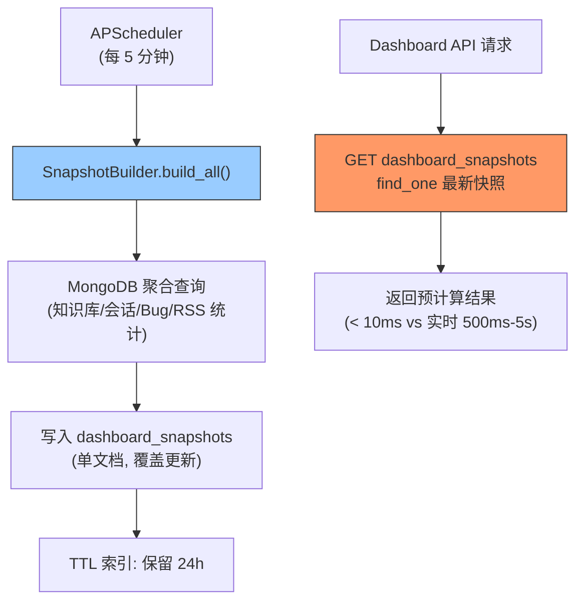

---

doc_type: module
prd_task_id: "YA-09-75"
title: "YA-09-75: Dashboard 预聚合快照 — 定时物化视图替代实时查询 — 开发方案"
status: 需求已编写
priority: P2
owner: 陈铭
roles: [engineer]
created: 2026-09-11
updated: 2026-09-23
project: YiAi
project_id: yiai
prd_month: "202609"
estimate_frontend: 1.0
source_prd: "83-需求-Dashboard预聚合快照.md"
source_okr: [yiai-001]

type: task
---

# YA-09-75: Dashboard 预聚合快照 — 定时物化视图替代实时查询 — 开发方案

> **文档职责**：本文档定义**怎么做、为什么这么做、实际做成什么样**（HOW），不含产品目标与测试用例。

> 来源 PRD：[83-需求-Dashboard预聚合快照.md](../../prds/2026-09/83-需求-Dashboard预聚合快照.md)
> 需求编号：YA-09-75 · 优先级：P2 · 人天：1.0d · 状态：需求已编写

---

<a id="sec-1"></a>
## 一、架构总览

Dashboard 面板每次加载都执行实时聚合查询（`$group`、`$count`），在大数据集下延迟高达数秒，且对 MongoDB 造成不必要的重复负载。采用定时预计算快照方案：APScheduler 每 5 分钟执行一次聚合，结果存入 `dashboard_snapshots` 集合，Dashboard API 只需读取单个快照文档（< 10ms）。



**性能对比**：实时聚合 500ms-5s（随数据量增长）→ 预计算快照 < 10ms（恒定），MongoDB 负载从每次请求 N 次聚合 → 每 5 分钟 1 次。

---

<a id="sec-2"></a>
## 二、文件清单

| 文件 | 操作 | 说明 |
|------|------|------|
| `YiAi/src/services/dashboard/snapshot_builder.py` | 新增 | SnapshotBuilder + 快照计算逻辑 |
| `YiAi/src/services/dashboard/dashboard_service.py` | 新增 | Dashboard API（读快照） |
| `YiAi/src/server/main.py` | 修改 | 注册 APScheduler 任务 |
| `YiAi/tests/test_dashboard_snapshot.py` | 新增 | 快照构建与读取测试 |

---

<a id="sec-3"></a>
## 三、模块设计

### 3.1 SnapshotBuilder

```python
# YiAi/src/services/dashboard/snapshot_builder.py
from datetime import datetime, timedelta
from motor.motor_asyncio import AsyncIOMotorDatabase

class SnapshotBuilder:
    """Dashboard 预聚合快照构建器。

    每 5 分钟执行一次，计算各面板的聚合指标并存入 dashboard_snapshots 集合。

    快照面板:
        - knowledge_stats: 知识库文件统计（总数/按类型/按状态）
        - session_stats: 会话统计（总数/24h 活跃/按标签）
        - bug_stats: Bug 统计（总数/按严重度/按状态/按项目）
        - rss_stats: RSS 统计（总订阅/24h 新增/错误率）
        - user_stats: 用户统计（总数/7d 活跃/角色分布）
    """

    def __init__(self, db: AsyncIOMotorDatabase): ...

    async def build_all(self) -> dict:
        """构建所有面板快照。

        使用 MongoDB 聚合管道批量计算，减少网络往返。
        每个面板的聚合独立执行（互不依赖），失败不影响其他面板。

        Returns: {panels_built: N, failures: N, duration_ms: N}
        """
        snapshots = {
            'type': 'dashboard_snapshot',
            'timestamp': datetime.utcnow(),
            'expires_at': datetime.utcnow() + timedelta(hours=24),
        }

        # 知识库统计
        snapshots['knowledge_stats'] = await self._build_knowledge_stats()

        # 会话统计
        snapshots['session_stats'] = await self._build_session_stats()

        # Bug 统计
        snapshots['bug_stats'] = await self._build_bug_stats()

        # RSS 统计
        snapshots['rss_stats'] = await self._build_rss_stats()

        # 用户统计
        snapshots['user_stats'] = await self._build_user_stats()

        # 覆盖写入（每个时间点只保留最新快照）
        await self.db.dashboard_snapshots.update_one(
            {'type': 'dashboard_snapshot'},
            {'$set': snapshots},
            upsert=True
        )

        return snapshots

    async def _build_knowledge_stats(self) -> dict:
        """知识库文件统计——总数 + 按类型/状态分布。"""
        pipeline = [
            {'$group': {
                '_id': {'type': '$type', 'status': '$status'},
                'count': {'$sum': 1}
            }}
        ]
        results = await self.db.knowledge_files.aggregate(pipeline).to_list(None)

        total = sum(r['count'] for r in results)
        by_type = {}
        by_status = {}
        for r in results:
            by_type[r['_id']['type']] = by_type.get(r['_id']['type'], 0) + r['count']
            by_status[r['_id']['status']] = by_status.get(r['_id']['status'], 0) + r['count']

        return {'total': total, 'by_type': by_type, 'by_status': by_status}

    async def _build_session_stats(self) -> dict:
        """会话统计——总数 + 24h 活跃 + 按标签。"""
        now = datetime.utcnow()
        total = await self.db.sessions.count_documents({'is_deleted': False})
        active_24h = await self.db.sessions.count_documents({
            'is_deleted': False,
            'updated_at': {'$gte': now - timedelta(hours=24)}
        })
        return {'total': total, 'active_24h': active_24h}

    async def _build_bug_stats(self) -> dict:
        """Bug 统计——按严重度/状态/项目。"""
        ...

    async def get_latest_snapshot(self) -> dict:
        """读取最新快照——Dashboard API 直接调用。"""
        return await self.db.dashboard_snapshots.find_one(
            {'type': 'dashboard_snapshot'},
            sort=[('timestamp', -1)]
        ) or {}
```

### 3.2 快照文档结构

```json
{
  "type": "dashboard_snapshot",
  "timestamp": "2026-09-23T10:30:00Z",
  "expires_at": "2026-09-24T10:30:00Z",
  "knowledge_stats": {"total": 156, "by_type": {"需求": 80, "bug": 45, "task": 31}, "by_status": {...}},
  "session_stats": {"total": 2340, "active_24h": 156},
  "bug_stats": {"total": 89, "by_severity": {"critical": 5, "major": 23, "minor": 61}},
  "rss_stats": {"total_sources": 12, "new_24h": 45, "error_count_24h": 2},
  "user_stats": {"total": 18, "active_7d": 12, "by_role": {"admin": 3, "user": 15}}
}
```

---

<a id="sec-4"></a>
## 四、数据流

```
APScheduler 触发 (每 5 分钟)
  → SnapshotBuilder.build_all()
    → 并行聚合: knowledge_stats + session_stats + bug_stats + rss_stats + user_stats
    → 合并为单个快照文档
    → db.dashboard_snapshots.update_one({type: 'dashboard_snapshot'}, {$set: ...}, upsert=True)

Dashboard API 请求:
  → SnapshotBuilder.get_latest_snapshot()
    → db.dashboard_snapshots.find_one({type: 'dashboard_snapshot'}, sort=[('timestamp', -1)])
    → 返回 (缓存命中 < 10ms)

若快照过期 (> 24h):
  → 返回过期快照 + _stale_warning: true
  → 触发异步重建
```

---

<a id="sec-5"></a>
## 五、实施路线

| # | 步骤 | 产出 | 验证 | 人天 |
|---|------|------|------|------|
| 1 | 创建 SnapshotBuilder + 5 个聚合面板 | `snapshot_builder.py` | 快照正确生成 | 0.35 |
| 2 | 注册 APScheduler 定时任务 | `main.py` | 每 5 分钟自动刷新快照 | 0.15 |
| 3 | 创建 Dashboard API（读快照） | `dashboard_service.py` | Dashboard API 延迟 < 10ms | 0.2 |
| 4 | 添加快照过期检测 + TTL 索引 | `snapshot_builder.py` | 过期快照自动清理 | 0.1 |
| 5 | 测试用例 | `tests/test_dashboard_snapshot.py` | 快照构建/读取/过期/并行 | 0.2 |

**合计：1.0d**

---

<a id="sec-6"></a>
## 六、代码审查检查清单

- [ ] 快照每 5 分钟刷新一次（APScheduler interval=300）
- [ ] 各面板聚合独立执行（失败不影响其他面板）
- [ ] 使用 update_one upsert 覆盖写入（不堆积历史快照）
- [ ] Dashboard API 仅读取快照（不触发实时聚合）
- [ ] 快照过期（> 24h）时返回警告 + 触发异步重建
- [ ] TTL 索引：`expires_at` 字段 24h 自动清理
- [ ] 快照字段命名统一（`*_stats` 后缀）

---

<a id="sec-7"></a>
## 七、风险评估

| 风险 | 概率 | 影响 | 缓解措施 |
|------|------|------|----------|
| 快照构建失败导致过期数据 | 低 | 中 | 保留上次成功快照 + 企微告警 |
| 5 分钟延迟影响数据实时性 | 高 | 低 | Dashboard 场景可接受（非实时需求） |
| 聚合查询在大数据集变慢 | 中 | 中 | 超过 10s 时拆分为增量更新 |

**回滚**：Dashboard API 降级为实时聚合查询。`dashboard_snapshots` 集合保留不清理。