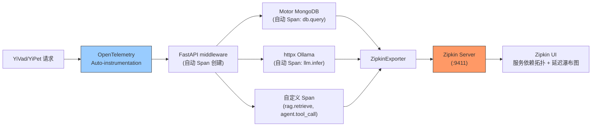

---

doc_type: module
prd_task_id: "YA-09-80"
title: "YA-09-80: OpenTelemetry + Zipkin 链路追踪 — 跨服务 Trace 导出 — 开发方案"
status: 需求已编写
priority: P2
owner: 陈铭
roles: [engineer]
created: 2026-09-11
updated: 2026-09-23
project: YiAi
project_id: yiai
prd_month: "202609"
estimate_frontend: 0.5
source_prd: "84-需求-Zipkin链路导出.md"
source_okr: [yiai-001]

type: task
---

# YA-09-80: OpenTelemetry + Zipkin 链路追踪 — 跨服务 Trace 导出 — 开发方案

> **文档职责**：本文档定义**怎么做、为什么这么做、实际做成什么样**（HOW），不含产品目标与测试用例。

> 来源 PRD：[84-需求-Zipkin链路导出.md](../../prds/2026-09/84-需求-Zipkin链路导出.md)
> 需求编号：YA-09-80 · 优先级：P2 · 人天：0.5d · 状态：需求已编写

---

<a id="sec-1"></a>
## 一、架构总览

YiAi 当前无语链路追踪——请求从 YiVad/YiPet 进入后的 MongoDB 查询、LLM 推理、RAG 检索等子操作的耗时分布不可见。引入 OpenTelemetry SDK 自动插桩 FastAPI + Motor + httpx，将 Trace 数据导出到 Zipkin，实现端到端请求延迟分解。



**自动插桩**：Zero-code 集成 FastAPI、Motor、httpx 等库的 Span 自动创建。只需添加自定义 Span 标记关键业务逻辑。

---

<a id="sec-2"></a>
## 二、文件清单

| 文件 | 操作 | 说明 |
|------|------|------|
| `YiAi/src/server/tracing.py` | 新增 | OpenTelemetry 初始化 + Zipkin 导出配置 |
| `YiAi/src/server/main.py` | 修改 | 启动时初始化 Tracer |
| `YiAi/requirements.txt` | 修改 | 添加 OpenTelemetry 依赖 |
| `YiAi/docker-compose.yml` | 修改 | 添加 Zipkin 服务 |
| `YiAi/tests/test_tracing.py` | 新增 | Trace 生成验证 |

---

<a id="sec-3"></a>
## 三、模块设计

### 3.1 Tracer 初始化

```python
# YiAi/src/server/tracing.py
from opentelemetry import trace
from opentelemetry.sdk.trace import TracerProvider
from opentelemetry.sdk.trace.export import BatchSpanProcessor
from opentelemetry.exporter.zipkin.json import ZipkinExporter
from opentelemetry.instrumentation.fastapi import FastAPIInstrumentor
from opentelemetry.instrumentation.httpx import HTTPXClientInstrumentor
from opentelemetry.instrumentation.pymongo import PymongoInstrumentor

def setup_tracing(app, service_name: str = 'yiai', zipkin_url: str = None):
    """初始化 OpenTelemetry + Zipkin 导出。

    自动插桩:
        - FastAPI: 请求 Span (method, path, status_code)
        - Motor/PyMongo: MongoDB 查询 Span (db.statement, db.name)
        - httpx: HTTP 调用 Span (url, method, status)

    手动 Span:
        - RAG 检索: rag.retrieve (query, num_docs)
        - Agent 工具调用: agent.tool_call (tool_name, duration)
        - 知识库同步: knowledge.sync (files_count)
    """
    if not zipkin_url:
        zipkin_url = os.environ.get('ZIPKIN_URL', 'http://localhost:9411/api/v2/spans')

    # 1. 创建 TracerProvider + Zipkin Exporter
    provider = TracerProvider()
    exporter = ZipkinExporter(endpoint=zipkin_url)
    provider.add_span_processor(BatchSpanProcessor(exporter))
    trace.set_tracer_provider(provider)

    # 2. 自动插桩
    FastAPIInstrumentor.instrument_app(app, tracer_provider=provider)
    HTTPXClientInstrumentor().instrument(tracer_provider=provider)
    # PyMongo 自动插桩（Motor 基于 PyMongo）
    PymongoInstrumentor().instrument(tracer_provider=provider)

    # 3. 获取 Tracer 用于手动 Span
    return trace.get_tracer(service_name)
```

### 3.2 自定义 Span（业务关键路径）

```python
# 使用示例：RAG 检索 Span
tracer = trace.get_tracer('yiai')

async def rag_retrieve(query: str):
    with tracer.start_as_current_span('rag.retrieve') as span:
        span.set_attribute('rag.query', query[:100])
        span.set_attribute('rag.top_k', 10)

        docs = await vector_store.similarity_search(query, k=10)

        span.set_attribute('rag.num_docs', len(docs))
        span.set_attribute('rag.max_score', max(d.score for d in docs) if docs else 0)
        return docs

# Agent 工具调用 Span
async def agent_tool_call(tool_name: str, params: dict):
    with tracer.start_as_current_span(f'agent.tool.{tool_name}') as span:
        span.set_attribute('agent.tool.name', tool_name)
        result = await execute_tool(tool_name, params)
        span.set_attribute('agent.tool.success', result.get('success', False))
        return result
```

---

<a id="sec-4"></a>
## 四、数据流

```
请求: POST / {module: "services.ai.chat_service", method: "chat"}
  → FastAPI auto-span: HTTP POST / (trace_id, span_id)
    → RPC router span: services.ai.chat_service.chat
      → MongoDB query span: db.sessions.find (auto-instrumented)
      → RAG retrieve span: rag.retrieve (manual, query, num_docs)
      → LLM infer span: httpx POST ollama:11434 (auto-instrumented)
    → All spans exported to Zipkin via BatchSpanProcessor

Zipkin UI:
  → 服务依赖拓扑图
  → 单次请求瀑布图（各 span 耗时分解）
  → 可搜索 trace_id 定位慢请求
```

---

<a id="sec-5"></a>
## 五、实施路线

| # | 步骤 | 产出 | 验证 | 人天 |
|---|------|------|------|------|
| 1 | 安装 OpenTelemetry 依赖 | `requirements.txt` | otel SDK 可用 | 0.05 |
| 2 | 创建 setup_tracing + Zipkin export | `tracing.py` | Zipkin UI 收到 Trace | 0.15 |
| 3 | 自动插桩 FastAPI/Motor/httpx | `tracing.py` | HTTP/Mongo/HTTP 调用自动有 Span | 0.1 |
| 4 | 添加业务自定义 Span（RAG/Agent） | `chat_service.py` | 关键路径有自定义 Span | 0.1 |
| 5 | docker-compose 添加 Zipkin 服务 | `docker-compose.yml` | `docker-compose up` 即启动 Zipkin | 0.05 |
| 6 | 测试用例 | `tests/test_tracing.py` | Trace 生成/导出/自定义 Span | 0.05 |

**合计：0.5d**

---

<a id="sec-6"></a>
## 六、代码审查检查清单

- [ ] OpenTelemetry 初始化在应用启动时（非请求时）
- [ ] BatchSpanProcessor 异步批量导出（不阻塞请求）
- [ ] Zipkin URL 从环境变量 `ZIPKIN_URL` 读取
- [ ] 自动插桩覆盖 FastAPI + Motor/PyMongo + httpx
- [ ] 自定义 Span 覆盖关键业务路径（RAG/Agent/知识库同步）
- [ ] Span 属性有意义（不包含敏感数据如密码/token）
- [ ] 非生产环境可关闭（`TRACING_ENABLED=false`）

---

<a id="sec-7"></a>
## 七、风险评估

| 风险 | 概率 | 影响 | 缓解措施 |
|------|------|------|----------|
| OpenTelemetry 依赖版本冲突 | 低 | 中 | 锁定版本范围 |
| Zipkin 不可用时 Blocking | 低 | 中 | BatchSpanProcessor 异步，超时丢弃 |
| Span 数量过多导致 Zipkin 存储爆炸 | 中 | 低 | 采样率 10%（开发 100%） |

**回滚**：环境变量 `TRACING_ENABLED=false`，跳过 OpenTelemetry 初始化。不影响业务。