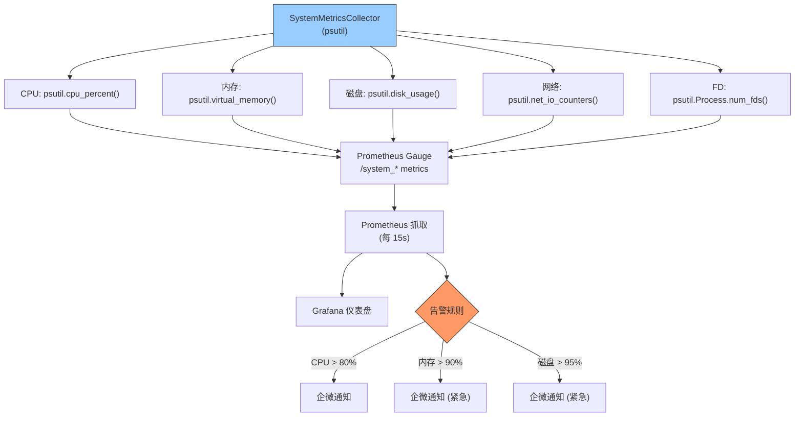

---

doc_type: module
prd_task_id: "YA-09-65"
title: "YA-09-65: 系统资源监控 — psutil + Prometheus + 趋势告警 — 开发方案"
status: 需求已编写
priority: P2
owner: 陈铭
roles: [engineer]
created: 2026-09-11
updated: 2026-09-23
project: YiAi
project_id: yiai
prd_month: "202609"
estimate_frontend: 0.5
source_prd: "85-需求-系统资源监控告警.md"
source_okr: [yiai-001]

type: task
---

# YA-09-65: 系统资源监控 — psutil + Prometheus + 趋势告警 — 开发方案

> **文档职责**：本文档定义**怎么做、为什么这么做、实际做成什么样**（HOW），不含产品目标与测试用例。

> 来源 PRD：[85-需求-系统资源监控告警.md](../../prds/2026-09/85-需求-系统资源监控告警.md)
> 需求编号：YA-09-65 · 优先级：P2 · 人天：0.5d · 状态：需求已编写

---

<a id="sec-1"></a>
## 一、架构总览

YiAi 当前无可观测性基础设施——无法知道 CPU/内存/磁盘/文件描述符是否接近极限。通过 psutil 采集系统级指标（CPU、内存、磁盘、网络、FD），暴露为 Prometheus Gauge，集成到监控告警体系。



---

<a id="sec-2"></a>
## 二、文件清单

| 文件 | 操作 | 说明 |
|------|------|------|
| `YiAi/src/server/system_metrics.py` | 新增 | SystemMetricsCollector + Prometheus 指标 |
| `YiAi/src/server/main.py` | 修改 | 启动时注册指标采集 |
| `YiAi/deploy/prometheus/alerts.yml` | 修改 | 系统级告警规则 |
| `YiAi/tests/test_system_metrics.py` | 新增 | 指标采集测试 |

---

<a id="sec-3"></a>
## 三、模块设计

### 3.1 SystemMetricsCollector

```python
# YiAi/src/server/system_metrics.py
import psutil
from prometheus_client import Gauge

# 定义 Prometheus 指标
cpu_percent = Gauge('system_cpu_percent', 'CPU 使用率 (%)')
memory_bytes = Gauge('system_memory_bytes', '内存使用 (bytes)', ['type'])
disk_bytes = Gauge('system_disk_bytes', '磁盘使用 (bytes)', ['mountpoint', 'type'])
network_bytes = Gauge('system_network_bytes_total', '网络 IO 累计 (bytes)', ['direction'])
fd_count = Gauge('system_fd_count', '文件描述符数量', ['type'])  # open/max
process_count = Gauge('system_process_count', '进程数')

class SystemMetricsCollector:
    """系统资源指标采集器——通过 psutil 获取系统级指标。

    采集频率: 每 15s (与 Prometheus 抓取频率一致)

    指标:
        - CPU: 使用率百分比
        - 内存: used/available/total（bytes）
        - 磁盘: 每个挂载点的 used/free/total（bytes）
        - 网络: sent/received 累计 bytes
        - FD: 当前打开数/最大限制
        - 进程: 进程总数
    """

    async def collect(self):
        """采集所有系统指标——供 Prometheus /metrics 端点使用。"""
        self._collect_cpu()
        self._collect_memory()
        self._collect_disk()
        self._collect_network()
        self._collect_fd()
        self._collect_process()

    def _collect_cpu(self):
        cpu_percent.set(psutil.cpu_percent(interval=1))

    def _collect_memory(self):
        mem = psutil.virtual_memory()
        memory_bytes.labels('used').set(mem.used)
        memory_bytes.labels('available').set(mem.available)
        memory_bytes.labels('total').set(mem.total)

    def _collect_disk(self):
        for part in psutil.disk_partitions():
            try:
                usage = psutil.disk_usage(part.mountpoint)
                disk_bytes.labels(part.mountpoint, 'used').set(usage.used)
                disk_bytes.labels(part.mountpoint, 'free').set(usage.free)
                disk_bytes.labels(part.mountpoint, 'total').set(usage.total)
            except PermissionError:
                pass

    def _collect_network(self):
        net = psutil.net_io_counters()
        network_bytes.labels('sent').set(net.bytes_sent)
        network_bytes.labels('received').set(net.bytes_recv)

    def _collect_fd(self):
        proc = psutil.Process()
        fd_count.labels('open').set(proc.num_fds())
        try:
            import resource
            fd_count.labels('max').set(resource.getrlimit(resource.RLIMIT_NOFILE)[0])
        except Exception:
            pass

    def _collect_process(self):
        process_count.set(len(psutil.pids()))

    def get_status(self) -> dict:
        """获取当前系统状态摘要（用于 /health/debug）。"""
        return {
            'cpu_percent': psutil.cpu_percent(interval=0.1),
            'memory': {k: getattr(psutil.virtual_memory(), k)
                       for k in ['total', 'available', 'percent']},
            'disk': [{'mountpoint': p.mountpoint,
                      'usage_percent': psutil.disk_usage(p.mountpoint).percent}
                     for p in psutil.disk_partitions()],
            'fd': psutil.Process().num_fds(),
        }
```

### 3.2 告警阈值

| 指标 | 警告 (WARNING) | 紧急 (CRITICAL) | 持续时间 |
|------|---------------|----------------|---------|
| CPU 使用率 | > 80% | > 95% | 5min |
| 内存使用率 | > 80% | > 90% | 5min |
| 磁盘使用率 | > 85% | > 95% | 即时 |
| FD 使用数 | > 10000 | > 50000 | 即时 |
| 进程数 | > 500 | > 1000 | 5min |

---

<a id="sec-4"></a>
## 四、数据流

```
Prometheus /metrics 端点被访问 (每 15s)
  → SystemMetricsCollector.collect()
    → cpu_percent.set(psutil.cpu_percent(1))
    → memory_bytes.labels('used').set(mem.used)
    → disk_bytes.labels('/', 'used').set(usage.used)
    → network_bytes.labels('sent').set(net.bytes_sent)
    → fd_count.labels('open').set(proc.num_fds())
    → process_count.set(len(psutil.pids()))

Prometheus 抓取后:
  → Grafana: 系统资源仪表盘（CPU/内存/磁盘/网络 趋势图）
  → Alertmanager: 评估告警规则
    → CPU > 80% 持续 5min → WARNING 企微通知
    → 内存 > 90% → CRITICAL 企微通知
```

---

<a id="sec-5"></a>
## 五、实施路线

| # | 步骤 | 产出 | 验证 | 人天 |
|---|------|------|------|------|
| 1 | 创建 SystemMetricsCollector | `system_metrics.py` | psutil 指标正确暴露 | 0.15 |
| 2 | 定义 Prometheus Gauge 指标 | `system_metrics.py` | /metrics 含系统指标 | 0.1 |
| 3 | 配置 Grafana 仪表盘 JSON | Grafana | CPU/内存/磁盘/网络仪表盘可用 | 0.1 |
| 4 | 配置告警规则 | `alerts.yml` | CPU > 80% 触发企微通知 | 0.1 |
| 5 | 测试用例 | `tests/test_system_metrics.py` | 指标采集/告警触发 | 0.05 |

**合计：0.5d**

---

<a id="sec-6"></a>
## 六、代码审查检查清单

- [ ] 使用 psutil 原生命令采集（不依赖外部 agent）
- [ ] Prometheus Gauge 指标名符合 `system_*` 命名规范
- [ ] 磁盘采集捕获 PermissionError（某些挂载点不可访问）
- [ ] FD 最大限制仅在 Linux/macOS 可用
- [ ] /health/debug 返回系统资源状态快照
- [ ] 告警规则区分 WARNING 和 CRITICAL 两级

---

<a id="sec-7"></a>
## 七、风险评估

| 风险 | 概率 | 影响 | 缓解措施 |
|------|------|------|----------|
| psutil 在容器环境中指标不准确 | 中 | 低 | 配置 cgroup 感知的 psutil 选项 |
| disk_partitions 遍历卡住（NFS 挂载） | 低 | 中 | 设置 timeout=1，捕获所有异常 |

**回滚**：移除 SystemMetricsCollector，Prometheus 指标消失。不影响业务。