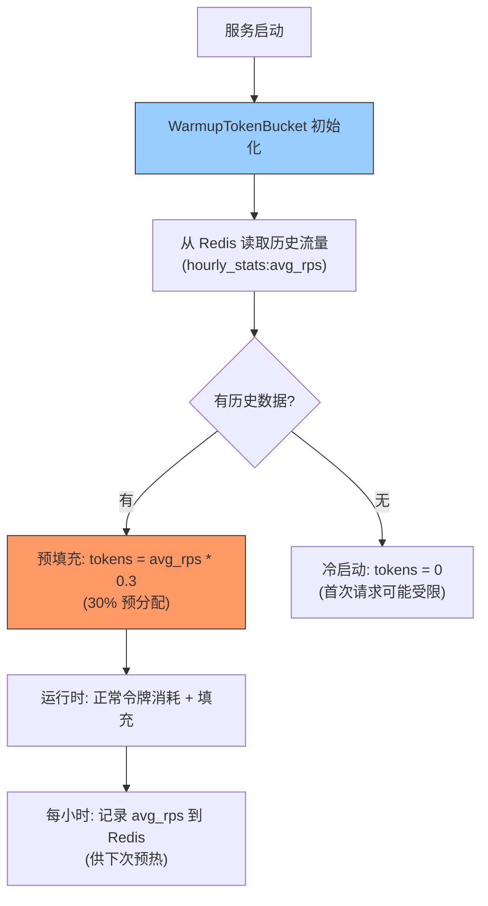

---

doc_type: module
prd_task_id: "YA-09-79"
title: "YA-09-79: 限流令牌预热 — 历史流量模式预分配 — 开发方案"
status: 需求已编写
priority: P2
owner: 陈铭
roles: [engineer]
created: 2026-09-11
updated: 2026-09-23
project: YiAi
project_id: yiai
prd_month: "202609"
estimate_frontend: 0.5
source_prd: "86-需求-限流令牌预热.md"
source_okr: [yiai-002]

type: task
---

# YA-09-79: 限流令牌预热 — 历史流量模式预分配 — 开发方案

> **文档职责**：本文档定义**怎么做、为什么这么做、实际做成什么样**（HOW），不含产品目标与测试用例。

> 来源 PRD：[86-需求-限流令牌预热.md](../../prds/2026-09/86-需求-限流令牌预热.md)
> 需求编号：YA-09-79 · 优先级：P2 · 人天：0.5d · 状态：需求已编写

---

<a id="sec-1"></a>
## 一、架构总览

Token Bucket 限流器冷启动时令牌桶为空，首批请求可能被误限——尤其服务重启后的前几秒。根据历史同时段流量模式预填充令牌桶：从 Redis 读取过去 N 天同时段的平均请求速率，服务启动时按比例预填充令牌，消除冷启动误限。



**预热策略**：30% 预填充（保守，防止异常流量被误放），后续通过正常令牌填充追上真实速率。

---

<a id="sec-2"></a>
## 二、文件清单

| 文件 | 操作 | 说明 |
|------|------|------|
| `YiAi/src/server/warmup_limiter.py` | 新增 | WarmupTokenBucket + 历史流量采集 |
| `YiAi/src/server/rate_limiter.py` | 修改 | 集成 WarmupTokenBucket |
| `YiAi/tests/test_warmup_limiter.py` | 新增 | 预热测试 |

---

<a id="sec-3"></a>
## 三、模块设计

### 3.1 WarmupTokenBucket

```python
# YiAi/src/server/warmup_limiter.py
import time, json
from collections import defaultdict
from .rate_limiter import TokenBucket

class TrafficHistory:
    """历史流量采集——每小时记录 avg_rps 到 Redis。

    Key: traffic_history:{hour}:{weekday}
    Value: avg_rps (float)
    Retention: 30 天
    """

    def __init__(self, redis_client): ...

    async def record_hourly_traffic(self, hour: int, avg_rps: float):
        """记录最近一小时的流量统计。"""
        from datetime import datetime
        weekday = datetime.now().weekday()
        key = f'traffic_history:{hour}:{weekday}'
        # 存储最近 30 天的平均值
        await self.redis.set(key, json.dumps({
            'avg_rps': avg_rps,
            'updated_at': time.time()
        }), ex=30 * 86400)

    async def get_historical_rps(self, hour: int = None) -> float:
        """获取历史同时段的平均 RPS。

        hour: 当前小时 (0-23)，默认当前时间。
        返回: 历史平均 RPS，无数据时返回 0。
        """
        from datetime import datetime
        now = datetime.now()
        hour = hour if hour is not None else now.hour
        weekday = now.weekday()

        key = f'traffic_history:{hour}:{weekday}'
        data = await self.redis.get(key)
        if data:
            return json.loads(data).get('avg_rps', 0)
        return 0.0


class WarmupTokenBucket(TokenBucket):
    """带预热功能的 Token Bucket——启动时根据历史流量预填充。

    预填充策略: tokens = min(capacity, avg_rps * warmup_ratio)
    warmup_ratio: 默认 0.3（30% 保守预分配，防异常流量被误放）
    """

    def __init__(self, config, history: TrafficHistory = None,
                 warmup_ratio: float = 0.3):
        super().__init__(config)
        self.history = history
        self.warmup_ratio = warmup_ratio
        self._warmed_up = False

    async def warmup(self):
        """启动时根据历史流量预填充令牌。

        仅在 bucket 创建时调用一次。
        """
        if self._warmed_up:
            return
        self._warmed_up = True

        if not self.history:
            return

        avg_rps = await self.history.get_historical_rps()
        if avg_rps > 0:
            warmup_tokens = min(self.capacity, int(avg_rps * self.warmup_ratio))
            self.tokens = float(warmup_tokens)
            logger.info(
                f'[WarmupTokenBucket] 预热完成: avg_rps={avg_rps:.1f}, '
                f'warmup_tokens={warmup_tokens}/{self.capacity}'
            )
        else:
            logger.info('[WarmupTokenBucket] 无历史数据，跳过预热')
```

### 3.2 峰值检测

```python
class PeakDetector:
    """异常流量检测——防止预热期间异常流量被误放。

    策略: 如果当前 1min 内的请求数超过历史同时段平均值的 3x，
    判定为异常流量，降低预热比率。
    """

    def __init__(self, threshold_multiplier: float = 3.0): ...

    def is_anomalous(self, current_rps: float, historical_rps: float) -> bool:
        """检测当前流量是否异常。"""
        if historical_rps == 0:
            return False  # 无历史数据，不做判断
        return current_rps > historical_rps * self.threshold_multiplier
```

---

<a id="sec-4"></a>
## 四、数据流

```
服务启动:
  → WarmupTokenBucket.warmup()
    → TrafficHistory.get_historical_rps(hour=10, weekday=3)
      → Redis GET traffic_history:10:3 → {avg_rps: 42.5}
    → warmup_tokens = min(100, int(42.5 * 0.3)) = 12
    → tokens = 12.0 (启动即可通过 12 个请求)
    → 日志: 预热完成: avg_rps=42.5, warmup_tokens=12/100

运行时 (每小时记录):
  → TrafficHistory.record_hourly_traffic(hour=10, avg_rps=43.2)
    → Redis SET traffic_history:10:3 → {avg_rps: 43.2, updated_at: ...}
    → EXPIRE 30d
```

---

<a id="sec-5"></a>
## 五、实施路线

| # | 步骤 | 产出 | 验证 | 人天 |
|---|------|------|------|------|
| 1 | 创建 TrafficHistory + Redis 存储 | `warmup_limiter.py` | 历史流量正确记录和读取 | 0.15 |
| 2 | 创建 WarmupTokenBucket | `warmup_limiter.py` | 启动时预填充令牌 | 0.15 |
| 3 | 集成到 RateLimiter | `rate_limiter.py` | 冷启动首批请求不误限 | 0.1 |
| 4 | 异常流量检测 | `warmup_limiter.py` | 异常流量降低预热比例 | 0.05 |
| 5 | 测试用例 | `tests/test_warmup_limiter.py` | 预热/冷启动/异常检测 | 0.05 |

**合计：0.5d**

---

<a id="sec-6"></a>
## 六、代码审查检查清单

- [ ] WarmupTokenBucket 仅在启动时预填充一次（`_warmed_up` 标志）
- [ ] 预热比率保守（30%），防止异常流量被误放
- [ ] 历史流量按小时 + 星期几分组（工作日/周末区分）
- [ ] Redis 中历史数据 30 天自动过期
- [ ] 无历史数据时跳过预热（非错误）
- [ ] 异常流量检测作为可选模块（不影响正常预热）

---

<a id="sec-7"></a>
## 七、风险评估

| 风险 | 概率 | 影响 | 缓解措施 |
|------|------|------|----------|
| 预热过高（历史流量异常）导致实际超限 | 低 | 中 | 30% 保守比率 + 异常流量检测 |
| Redis 不可用导致无法预热 | 中 | 低 | 跳过预热，冷启动正常（首几秒稍慢） |
| 新部署无历史数据 | 高 | 低 | 跳过预热，逐步积累数据 |

**回滚**：移除 WarmupTokenBucket，回退到普通 TokenBucket。冷启动稍慢但不影响功能。