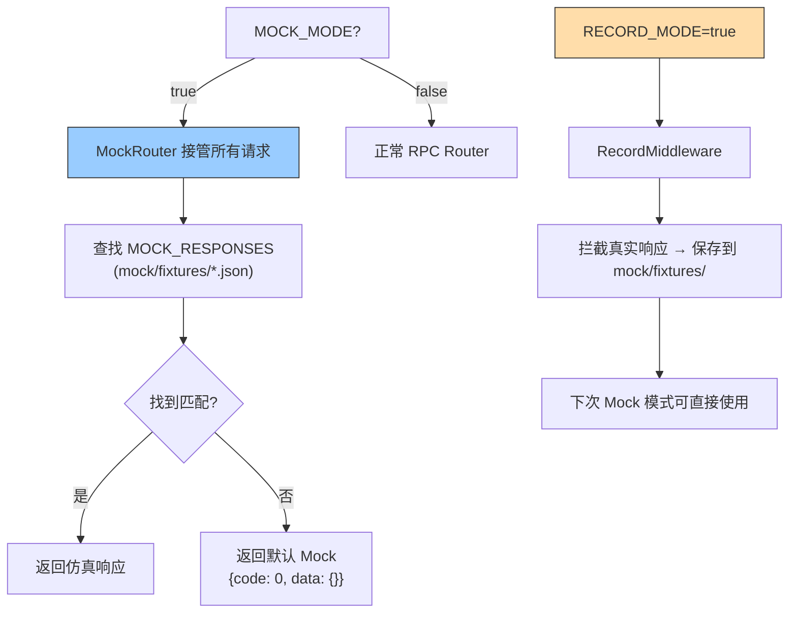

---

doc_type: module
prd_task_id: "YA-09-110"
title: "YA-09-110: API Mock 服务 — 前端独立开发仿真后端 — 开发方案"
status: 需求已编写
priority: P2
owner: 陈铭
roles: [engineer]
created: 2026-09-11
updated: 2026-09-23
project: YiAi
project_id: yiai
prd_month: "202609"
estimate_frontend: 0.5
source_prd: "87-需求-API-Mock服务.md"
source_okr: [yiai-002]

type: task
---

# YA-09-110: API Mock 服务 — 前端独立开发仿真后端 — 开发方案

> **文档职责**：本文档定义**怎么做、为什么这么做、实际做成什么样**（HOW），不含产品目标与测试用例。

> 来源 PRD：[87-需求-API-Mock服务.md](../../prds/2026-09/87-需求-API-Mock服务.md)
> 需求编号：YA-09-110 · 优先级：P2 · 人天：0.5d · 状态：需求已编写

---

<a id="sec-1"></a>
## 一、架构总览

YiVad/YiPet 前端开发强依赖 YiAi 后端运行。当后端因调试/重构不可用时，前端完全无法联调。引入 Mock 模式：通过环境变量 `MOCK_MODE=true` 启动轻量 Mock 服务，根据预定义的 JSON fixture 返回仿真 RPC 响应。额外支持 Record 模式——录制真实后端响应保存为 Mock 数据。



**三种模式**：Normal（真实 MongoDB + Ollama）、Mock（JSON fixture）、Record（录制真实响应保存为 fixture）。

---

<a id="sec-2"></a>
## 二、文件清单

| 文件 | 操作 | 说明 |
|------|------|------|
| `YiAi/src/server/mock_router.py` | 新增 | MockRouter + 数据加载 |
| `YiAi/src/server/record_middleware.py` | 新增 | RecordMiddleware 录制真实响应 |
| `YiAi/mock/fixtures/*.json` | 新增 | Mock 数据文件 |
| `YiAi/src/server/main.py` | 修改 | Mock 模式路由切换 |
| `YiAi/tests/test_mock.py` | 新增 | Mock 模式测试 |

---

<a id="sec-3"></a>
## 三、模块设计

### 3.1 MockRouter

```python
# YiAi/src/server/mock_router.py
import json, os, glob
from typing import Optional

class MockRouter:
    """Mock 模式路由器——根据 module_name.method_name 返回仿真响应。

    Mock 数据文件:
        mock/fixtures/<service_name>.json
        格式: {"<module>.<method>": <response>}

    使用方式:
        MOCK_MODE=true uvicorn app:app --port 10086
    """

    def __init__(self, fixtures_dir: str = 'mock/fixtures'):
        self._fixtures = self._load_all_fixtures(fixtures_dir)

    def _load_all_fixtures(self, dir_path: str) -> dict:
        """加载所有 mock/fixtures/*.json 文件，合并为查找表。"""
        fixtures = {}
        pattern = os.path.join(dir_path, '*.json')
        for file_path in glob.glob(pattern):
            try:
                with open(file_path, 'r', encoding='utf-8') as f:
                    data = json.load(f)
                    fixtures.update(data)
            except Exception as e:
                logger.warning(f'[MockRouter] 加载失败: {file_path}: {e}')
        return fixtures

    def get_response(self, module_name: str, method_name: str, params: dict = None) -> dict:
        """获取 Mock 响应。

        查找优先级:
            1. 精确匹配: "{module}.{method}"
            2. 前缀匹配: "{module}.*" (通配符)
            3. 默认响应: {code: 0, data: {}}
        """
        key = f'{module_name}.{method_name}'
        if key in self._fixtures:
            return self._fixtures[key]

        # 通配符匹配: services.data.*
        wildcard = f'{module_name}.*'
        if wildcard in self._fixtures:
            return self._fixtures[wildcard]

        # 默认空响应
        return {'code': 0, 'message': 'mock', 'data': {}}

    def list_fixtures(self) -> dict:
        """列出所有已加载的 fixture（用于调试）。"""
        return {k: type(v).__name__ for k, v in self._fixtures.items()}
```

### 3.2 RecordMiddleware

```python
# YiAi/src/server/record_middleware.py

class RecordMiddleware:
    """录制模式——截获真实响应并保存为 Mock fixture。

    使用方式:
        RECORD_MODE=true MOCK_RECORD_TARGET=data_service

    仅录制指定前缀的 module_name 的响应。
    """

    def __init__(self, output_dir: str = 'mock/fixtures',
                 record_target: str = None): ...

    async def __call__(self, request: Request, call_next):
        response = await call_next(request)
        if self._should_record(request):
            body = json.loads(response.body) if response.body else {}
            self._save_fixture(
                module_name=...,
                method_name=...,
                response=body
            )
        return response

    def _save_fixture(self, module_name: str, method_name: str, response: dict):
        """保存 fixture——追加到现有 JSON 文件。"""
        ...
```

### 3.3 Mock Fixture 示例

```json
// mock/fixtures/data_service.json
{
  "services.data.data_service.query_documents": {
    "code": 0,
    "data": {
      "items": [
        {"_id": "mock-001", "title": "Mock Project Alpha", "status": "active"},
        {"_id": "mock-002", "title": "Mock Project Beta", "status": "archived"}
      ],
      "total": 2,
      "page": 1,
      "pageSize": 20,
      "totalPages": 1,
      "pagination": {"type": "offset"}
    }
  },
  "services.data.data_service.*": {
    "code": 0,
    "data": {"items": [], "total": 0}
  }
}
```

---

<a id="sec-4"></a>
## 四、数据流

```
MOCK_MODE=true:
  → 请求: POST / {module: "services.data.data_service", method: "query_documents", params: {...}}
    → MockRouter.get_response("services.data.data_service", "query_documents", params)
      → 查找 fixtures: "services.data.data_service.query_documents" → 命中
      → 返回 {code: 0, data: {items: [...], total: 2}}

RECORD_MODE=true:
  → 正常 RPC 路由 → 真实 MongoDB 查询 → 响应
    → RecordMiddleware 截获响应
    → 保存到 mock/fixtures/data_service.json
    → 日志: [Record] 已保存 fixture: services.data.data_service.query_documents
```

---

<a id="sec-5"></a>
## 五、实施路线

| # | 步骤 | 产出 | 验证 | 人天 |
|---|------|------|------|------|
| 1 | 创建 MockRouter + fixture 加载 | `mock_router.py` | MOCK_MODE 返回仿真数据 | 0.15 |
| 2 | 编写核心 fixture 数据 | `mock/fixtures/*.json` | 基础 CRUD + 菜单 fixture | 0.1 |
| 3 | 创建 RecordMiddleware | `record_middleware.py` | 录制真实响应保存为 fixture | 0.1 |
| 4 | 集成到 main.py + 模式切换 | `main.py` | 三种模式可切换 | 0.05 |
| 5 | 支持 SSE Mock（聊天） | `mock_router.py` | Mock 流式响应 | 0.05 |
| 6 | 测试用例 | `tests/test_mock.py` | Mock/Record/默认/SSE | 0.05 |

**合计：0.5d**

---

<a id="sec-6"></a>
## 六、代码审查检查清单

- [ ] Mock 模式通过 `MOCK_MODE=true` 环境变量启用
- [ ] Mock fixture 格式与 RPC envelope 一致（{code, message, data}）
- [ ] 通配符匹配 `*` 作为 fallback（未定义方法的默认响应）
- [ ] Record 模式仅录制指定 target（避免录制所有请求）
- [ ] fixture JSON 文件名与 module 对应（`data_service.json` 对应 `services.data.*`）
- [ ] SSE 端点 Mock 支持（返回预设的 event 流）

---

<a id="sec-7"></a>
## 七、风险评估

| 风险 | 概率 | 影响 | 缓解措施 |
|------|------|------|----------|
| Mock 数据过时（与真实 API 不一致） | 中 | 中 | Record 模式定期同步真实数据 |
| 生产环境误启用 Mock 模式 | 低 | 高 | 生产环境禁止设置 MOCK_MODE=true |

**回滚**：不设置 MOCK_MODE，服务正常运行。