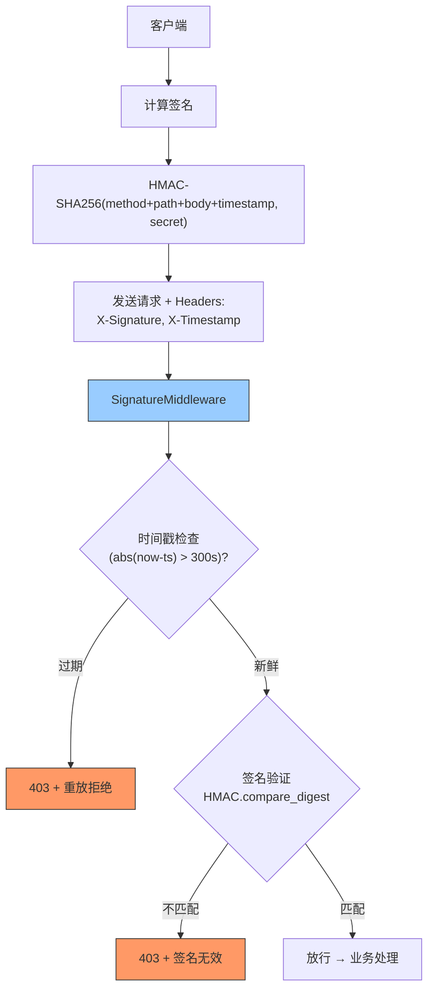

---

doc_type: module
prd_task_id: "YA-09-43"
title: "YA-09-43: 请求签名验证 — HMAC + 时间戳防重放 — 开发方案"
status: 需求已编写
priority: P2
owner: 陈铭
roles: [engineer]
created: 2026-09-11
updated: 2026-09-23
project: YiAi
project_id: yiai
prd_month: "202609"
estimate_frontend: 1.0
source_prd: "89-需求-请求签名验证.md"
source_okr: [yiai-001]

type: task
---

# YA-09-43: 请求签名验证 — HMAC + 时间戳防重放 — 开发方案

> **文档职责**：本文档定义**怎么做、为什么这么做、实际做成什么样**（HOW），不含产品目标与测试用例。

> 来源 PRD：[89-需求-请求签名验证.md](../../prds/2026-09/89-需求-请求签名验证.md)
> 需求编号：YA-09-43 · 优先级：P2 · 人天：1.0d · 状态：需求已编写

---

<a id="sec-1"></a>
## 一、架构总览

YiAi 当前无请求完整性保护——敏感操作（文件写入、数据创建、配置修改）可能被中间人篡改或重放攻击。引入 HMAC-SHA256 请求签名验证：客户端用预共享密钥对请求内容签名，服务端验证签名有效性 + 时间戳新鲜度（5 分钟窗口）。



**签名算法**：`HMAC-SHA256(method\npath\nbody\ntimestamp, secret)`。使用 `hmac.compare_digest` 防止时序攻击。时间戳 5 分钟窗口防重放。

---

<a id="sec-2"></a>
## 二、文件清单

| 文件 | 操作 | 说明 |
|------|------|------|
| `YiAi/src/server/signature.py` | 新增 | SignatureMiddleware + sign/verify 函数 |
| `YiAi/src/server/main.py` | 修改 | 注册签名中间件（仅敏感端点） |
| `YiAi/config.yaml` | 修改 | 签名密钥 + 受保护端点列表 |
| `YiAi/tests/test_signature.py` | 新增 | 签名验证测试 |

---

<a id="sec-3"></a>
## 三、模块设计

### 3.1 签名生成与验证

```python
# YiAi/src/server/signature.py
import hmac, hashlib, time
from fastapi import Request, HTTPException

def sign_request(method: str, path: str, body: str,
                 secret: str, timestamp: int) -> str:
    """生成 HMAC-SHA256 请求签名。

    签名字符串: "METHOD\nPATH\nBODY\nTIMESTAMP"
    算法: HMAC-SHA256, hex digest

    Args:
        method: HTTP 方法 (POST, GET)
        path: 请求路径
        body: 请求体字符串
        secret: 预共享密钥
        timestamp: Unix 时间戳（秒）
    """
    message = f'{method}\n{path}\n{body}\n{timestamp}'
    return hmac.new(
        secret.encode('utf-8'),
        message.encode('utf-8'),
        hashlib.sha256
    ).hexdigest()

def verify_request(method: str, path: str, body: str,
                   secret: str, timestamp: int, signature: str) -> bool:
    """验证请求签名的真实性和时效性。

    两步验证:
        1. 时间戳新鲜度: |now - timestamp| <= 300s (5分钟)
        2. 签名匹配: HMAC.compare_digest 防止时序攻击
    """
    # 1. 时间戳检查
    now = int(time.time())
    if abs(now - timestamp) > 300:
        logger.warning(f'[Signature] 重放攻击检测: ts={timestamp}, now={now}, diff={abs(now - timestamp)}s')
        return False

    # 2. 签名验证
    expected = sign_request(method, path, body, secret, timestamp)
    return hmac.compare_digest(expected, signature)
```

### 3.2 SignatureMiddleware

```python
class SignatureMiddleware:
    """请求签名验证中间件——仅对配置的敏感端点生效。

    配置:
        signature:
          enabled: true
          secret: "${SIGNATURE_SECRET}"  # 从环境变量读取
          protected_endpoints:
            - "services.data.data_service.create_document"
            - "services.data.data_service.update_document"
            - "services.data.data_service.delete_document"
            - "/write-file"
            - "/admin/*"  # 通配符支持

    Headers:
        X-Signature: HMAC-SHA256 签名
        X-Timestamp: Unix 时间戳（秒）
    """

    def __init__(self, secret: str, protected_endpoints: list[str]): ...

    async def __call__(self, request: Request, call_next):
        # 仅验证受保护的端点
        if not self._should_protect(request):
            return await call_next(request)

        headers = request.headers

        # 提取签名参数
        signature = headers.get('X-Signature')
        timestamp = headers.get('X-Timestamp')

        if not signature or not timestamp:
            return JSONResponse(status_code=403, content={
                'code': 4001, 'message': '缺少签名参数 (X-Signature, X-Timestamp)',
                'data': None
            })

        # 验证
        body = await request.body()
        body_str = body.decode('utf-8') if body else ''

        if not verify_request(
            request.method, request.url.path, body_str,
            self._secret, int(timestamp), signature
        ):
            return JSONResponse(status_code=403, content={
                'code': 4001, 'message': '签名验证失败——签名无效或请求已过期',
                'data': {'hint': '检查 X-Signature 和 X-Timestamp 头部'}
            })

        return await call_next(request)

    def _should_protect(self, request: Request) -> bool:
        """判断当前请求是否需要签名保护。"""
        ...
```

---

<a id="sec-4"></a>
## 四、数据流

```
客户端:
  → ts = int(time.time())
  → body = json.dumps(request_params)
  → signature = sign_request("POST", "/", body, secret, ts)
  → Headers: X-Signature: abc123..., X-Timestamp: 1695...

服务端:
  → SignatureMiddleware
    → 提取 X-Signature, X-Timestamp
    → |int(time.time()) - ts| <= 300 → 新鲜，继续验证
    → verify = sign_request("POST", "/", await body(), secret, ts)
    → hmac.compare_digest(verify, X-Signature) → True/False
    → True: 放行
    → False: 403 + "签名无效"
```

---

<a id="sec-5"></a>
## 五、实施路线

| # | 步骤 | 产出 | 验证 | 人天 |
|---|------|------|------|------|
| 1 | 实现 sign/verify 函数 | `signature.py` | HMAC 验证正确 | 0.2 |
| 2 | 创建 SignatureMiddleware | `signature.py` | 签名错误返回 403 | 0.25 |
| 3 | 配置受保护端点列表 | `config.yaml` | 仅敏感端点需签名 | 0.15 |
| 4 | 集成到 FastAPI + 密钥管理 | `main.py` | SIGATURE_SECRET 从环境变量读取 | 0.1 |
| 5 | 添加前端签名支持（YiVad/YiPet） | YiVad/YiPet | 前端自动生成签名头 | 0.2 |
| 6 | 测试用例 | `tests/test_signature.py` | 正确/错误/过期/缺头/重放 | 0.1 |

**合计：1.0d**

---

<a id="sec-6"></a>
## 六、代码审查检查清单

- [ ] 使用 `hmac.compare_digest()` 防时序攻击（非 `==` 比较）
- [ ] 时间戳窗口 5 分钟（300s）防重放
- [ ] 签名字符串包含 method + path + body + timestamp（防篡改）
- [ ] 密钥从环境变量 `SIGNATURE_SECRET` 读取（不硬编码）
- [ ] 仅敏感端点启用签名（非所有请求）
- [ ] 签名验证失败时记录 WARNING 日志 + 远程 IP
- [ ] 前端 YiVad/YiPet 请求自动附加签名头

---

<a id="sec-7"></a>
## 七、风险评估

| 风险 | 概率 | 影响 | 缓解措施 |
|------|------|------|----------|
| 时钟偏差导致合法请求被拒绝 | 中 | 中 | 5 分钟窗口足够宽容（NTP 同步） |
| 密钥泄露（日志中暴露） | 低 | 高 | 密钥从环境变量读取，日志不记录 |
| 前端忘记附加签名头 | 中 | 中 | 仅敏感端点需签名，非敏感可正常访问 |

**回滚**：`config.yaml` 设置 `signature.enabled=false`，所有请求免除签名验证。