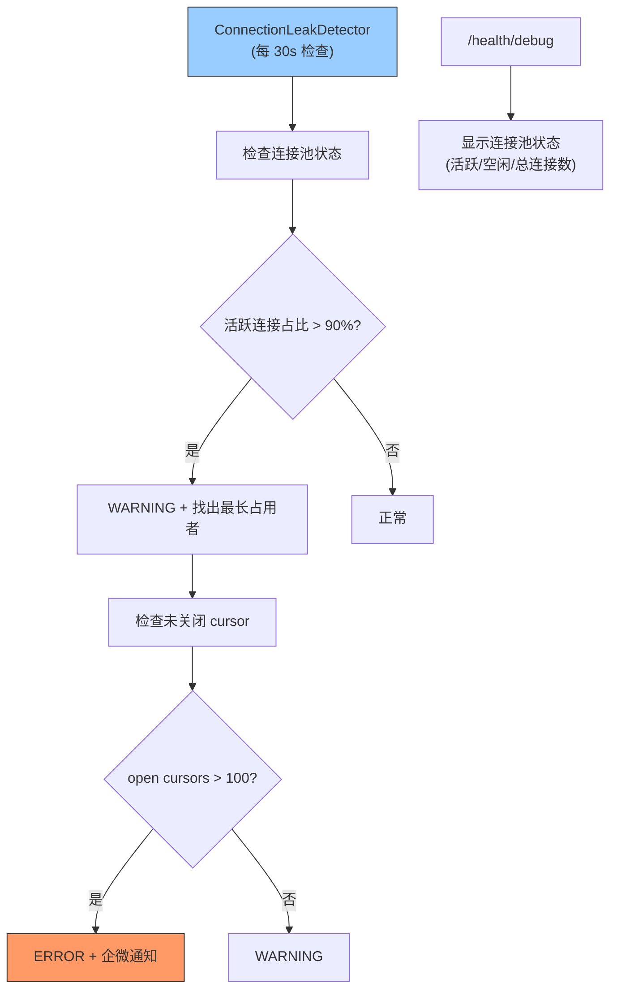

---

doc_type: module
prd_task_id: "YA-09-86"
title: "YA-09-86: 数据库连接泄漏检测 — Cursor/连接池定时扫描告警 — 开发方案"
status: 需求已编写
priority: P2
owner: 陈铭
roles: [engineer]
created: 2026-09-11
updated: 2026-09-23
project: YiAi
project_id: yiai
prd_month: "202609"
estimate_frontend: 0.5
source_prd: "90-需求-数据库连接泄漏检测.md"
source_okr: [yiai-001]

type: task
---

# YA-09-86: 数据库连接泄漏检测 — Cursor/连接池定时扫描告警 — 开发方案

> **文档职责**：本文档定义**怎么做、为什么这么做、实际做成什么样**（HOW），不含产品目标与测试用例。

> 来源 PRD：[90-需求-数据库连接泄漏检测.md](../../prds/2026-09/90-需求-数据库连接泄漏检测.md)
> 需求编号：YA-09-86 · 优先级：P2 · 人天：0.5d · 状态：需求已编写

---

<a id="sec-1"></a>
## 一、架构总览

MongoDB Motor 连接池连接泄漏（cursor 未关闭、连接未归还池）会导致连接池耗尽，后续请求无可用连接而超时。引入 ConnectionLeakDetector：定期检查连接池状态（活跃/空闲连接数）、未关闭 cursor 数、长时间占用连接的请求。超过阈值时告警并强制回收。



---

<a id="sec-2"></a>
## 二、文件清单

| 文件 | 操作 | 说明 |
|------|------|------|
| `YiAi/src/server/connection_leak_detector.py` | 新增 | ConnectionLeakDetector |
| `YiAi/src/domain/data/database.py` | 修改 | 暴露连接池状态查询 |
| `YiAi/src/server/main.py` | 修改 | 启动时初始化检测器 |
| `YiAi/tests/test_leak_detector.py` | 新增 | 泄漏检测测试 |

---

<a id="sec-3"></a>
## 三、模块设计

### 3.1 ConnectionLeakDetector

```python
# YiAi/src/server/connection_leak_detector.py
import asyncio
from motor.motor_asyncio import AsyncIOMotorClient

class ConnectionLeakDetector:
    """MongoDB 连接池泄漏检测——定期扫描连接状态和未关闭 cursor。

    检查维度:
        1. 连接池水位: active vs idle vs total
        2. 未关闭 cursor: MongoClient.nodes[].cursors 统计
        3. 长时间占用: 连接获取时间 > 30s
    """

    def __init__(self, mongo_client: AsyncIOMotorClient,
                 check_interval: float = 30.0,
                 pool_usage_threshold: float = 0.9,
                 cursor_threshold: int = 100):
        self._client = mongo_client
        self._interval = check_interval
        self._pool_threshold = pool_usage_threshold
        self._cursor_threshold = cursor_threshold
        self._running = False

    async def start(self):
        self._running = True
        while self._running:
            await asyncio.sleep(self._interval)
            await self._check()

    async def _check(self) -> dict:
        """执行泄漏检查。"""
        status = await self.get_pool_status()

        # 1. 连接池水位检查
        if status['active'] / max(status['total'], 1) > self._pool_threshold:
            logger.warning(
                f'[LeakDetector] 连接池接近耗尽: '
                f'active={status["active"]}/{status["total"]} '
                f'({status["active"]/max(status["total"],1)*100:.0f}%)'
            )

        # 2. 未关闭 cursor 检查
        cursors = await self._get_open_cursors()
        if cursors > self._cursor_threshold:
            logger.error(
                f'[LeakDetector] 未关闭 cursor 过多: {cursors} > {self._cursor_threshold}'
            )
            await self._send_alert(f'MongoDB 连接泄漏: {cursors} 个未关闭 cursor')

        # 3. 上报 Prometheus 指标
        mongo_pool_active.set(status['active'])
        mongo_pool_idle.set(status['idle'])
        mongo_open_cursors.set(cursors)

        return {'pool': status, 'cursors': cursors}

    async def get_pool_status(self) -> dict:
        """获取连接池状态。

        通过 serverStatus 命令和 PyMongo pool 属性获取。
        """
        try:
            server_status = await self._client.admin.command('serverStatus')
            connections = server_status.get('connections', {})

            return {
                'current': connections.get('current', 0),
                'available': connections.get('available', 0),
                'active': connections.get('active', 0),
                'total': connections.get('totalCreated', 0),
            }
        except Exception as e:
            return {'error': str(e)}

    async def _get_open_cursors(self) -> int:
        """获取当前未关闭的 cursor 数量。

        通过 currentOp 命令检查 type=idleCursor 的操作。
        """
        try:
            ops = await self._client.admin.command(
                'currentOp',
                {'type': 'idleCursor'}
            )
            return len(ops.get('inprog', []))
        except Exception:
            return -1

    async def _send_alert(self, message: str):
        """企微通知。"""
        ...

    async def stop(self):
        self._running = False

    async def force_recycle_idle_cursors(self) -> int:
        """强制回收空闲 cursor——超过 60s 未活动的 cursor 被关闭。

        执行: db.adminCommand({killCursors: ..., cursors: [...]})
        """
        ...
```

---

<a id="sec-4"></a>
## 四、数据流

```
定时任务 (每 30s):
  → ConnectionLeakDetector._check()
    → get_pool_status()
      → db.adminCommand('serverStatus')
      → 提取 connections.current/available/active
    → _get_open_cursors()
      → db.adminCommand('currentOp', {type: 'idleCursor'})
      → 计数 inprog 中的 idleCursor

  → 活跃连接 > 90% → WARNING 日志
  → 未关闭 cursor > 100 → ERROR + 企微通知
  → Prometheus 指标更新: mongo_pool_active/idle, mongo_open_cursors
```

---

<a id="sec-5"></a>
## 五、实施路线

| # | 步骤 | 产出 | 验证 | 人天 |
|---|------|------|------|------|
| 1 | 创建 ConnectionLeakDetector | `connection_leak_detector.py` | 连接池状态正确读取 | 0.15 |
| 2 | 实现 cursor 数量统计 | `connection_leak_detector.py` | 未关闭 cursor 被检测 | 0.1 |
| 3 | 配置告警阈值 + 企微通知 | `connection_leak_detector.py` | 超阈值企微通知 | 0.1 |
| 4 | /health/debug 集成 | `database.py` | 连接池状态可查看 | 0.05 |
| 5 | Prometheus 指标上报 | `connection_leak_detector.py` | Grafana 可查看连接池趋势 | 0.05 |
| 6 | 测试用例 | `tests/test_leak_detector.py` | 正常/高水位/cursor 超限 | 0.05 |

**合计：0.5d**

---

<a id="sec-6"></a>
## 六、代码审查检查清单

- [ ] 连接池检查间隔 30s（非高频）
- [ ] 活跃连接 > 90% 时 WARNING，cursor > 100 时 ERROR
- [ ] serverStatus 命令失败时不阻塞检查（返回 error dict）
- [ ] Prometheus Gauge: mongo_pool_active/idle/total
- [ ] Prometheus Gauge: mongo_open_cursors
- [ ] 强制回收 idle cursor 作为最后手段

---

<a id="sec-7"></a>
## 七、风险评估

| 风险 | 概率 | 影响 | 缓解措施 |
|------|------|------|----------|
| serverStatus 命令增加数据库负载 | 低 | 低 | 30s 间隔，命令开销极小 |
| 未关闭 cursor 检测依赖 currentOp 权限 | 低 | 低 | 无权限时静默跳过 |

**回滚**：停止 ConnectionLeakDetector 定时任务，连接池恢复正常监控模式。