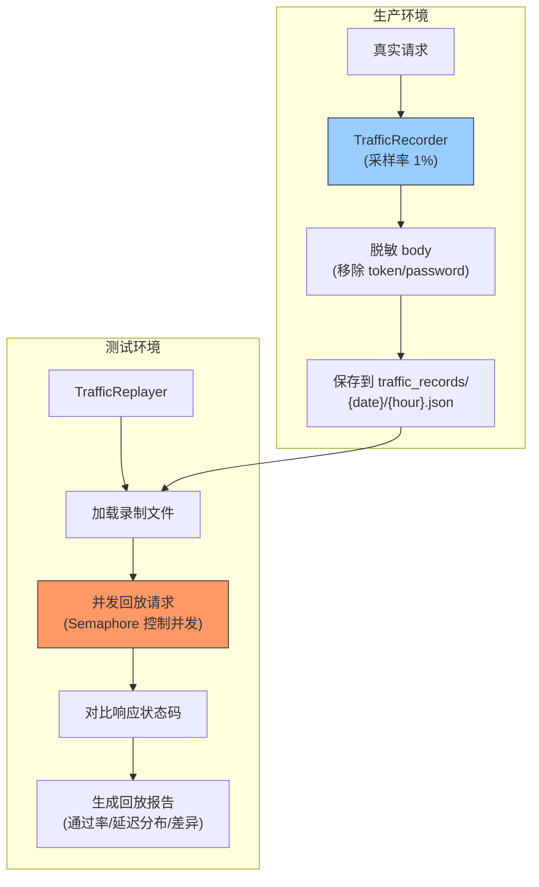

---

doc_type: module
prd_task_id: "YA-09-58"
title: "YA-09-58: 流量录制与回放 — 生产流量镜像 → 测试压测 — 开发方案"
status: 需求已编写
priority: P2
owner: 陈铭
roles: [engineer]
created: 2026-09-11
updated: 2026-09-23
project: YiAi
project_id: yiai
prd_month: "202609"
estimate_frontend: 1.0
source_prd: "91-需求-流量录制与回放.md"
source_okr: [yiai-001]

type: task
---

# YA-09-58: 流量录制与回放 — 生产流量镜像 → 测试压测 — 开发方案

> **文档职责**：本文档定义**怎么做、为什么这么做、实际做成什么样**（HOW），不含产品目标与测试用例。

> 来源 PRD：[91-需求-流量录制与回放.md](../../prds/2026-09/91-需求-流量录制与回放.md)
> 需求编号：YA-09-58 · 优先级：P2 · 人天：1.0d · 状态：需求已编写

---

<a id="sec-1"></a>
## 一、架构总览

手工编写测试数据和压测脚本覆盖不全且维护成本高。通过中间件层录制生产流量（采样 + 脱敏），保存为 JSON fixture，测试环境回放进行回归验证和压力测试。录制基于采样率（默认 1%），自动脱敏敏感字段。



**录制策略**：按采样率（默认 1%）录制生产流量，自动脱敏敏感字段（token/password/secret）。按小时分文件，保留 7 天。

---

<a id="sec-2"></a>
## 二、文件清单

| 文件 | 操作 | 说明 |
|------|------|------|
| `YiAi/src/server/traffic_recorder.py` | 新增 | TrafficRecorder + 脱敏 |
| `YiAi/src/server/traffic_replayer.py` | 新增 | TrafficReplayer + 报告生成 |
| `YiAi/src/server/main.py` | 修改 | 注册录制中间件 |
| `YiAi/traffic_records/` | 新增 | 录制文件存储目录 |
| `YiAi/tests/test_traffic.py` | 新增 | 录制回放测试 |

---

<a id="sec-3"></a>
## 三、模块设计

### 3.1 TrafficRecorder

```python
# YiAi/src/server/traffic_recorder.py
import json, os, random, time
from datetime import datetime

SENSITIVE_FIELDS = {'token', 'password', 'secret', 'api_key', 'authorization',
                     'x-token', 'cookie', 'jwt'}

class TrafficRecorder:
    """流量录制中间件——采样生产请求，脱敏后保存为 JSON fixture。

    配置:
        TRAFFIC_RECORD_ENABLED: 是否启用录制
        TRAFFIC_RECORD_RATE: 采样率 (0.0-1.0, 默认 0.01)
        TRAFFIC_RECORD_DIR: 存储目录 (默认 traffic_records)
    """

    def __init__(self, sample_rate: float = 0.01, output_dir: str = 'traffic_records'):
        self.sample_rate = sample_rate
        self.output_dir = output_dir
        self._records: list[dict] = []
        self._flush_interval = 60  # 每 60s 持久化一次

    async def record(self, request, response, duration_ms: float):
        """录制一条请求——仅在采样率范围内。"""
        if random.random() > self.sample_rate:
            return

        body = await self._safe_read_body(request)
        sanitized_body = self._sanitize(body)

        record = {
            'timestamp': datetime.utcnow().isoformat(),
            'method': request.method,
            'path': request.url.path,
            'headers': self._sanitize_headers(dict(request.headers)),
            'body': sanitized_body,
            'response_status': response.status_code,
            'duration_ms': duration_ms,
        }
        self._records.append(record)

        if len(self._records) >= 100:
            await self._flush()

    def _sanitize(self, data: dict) -> dict:
        """脱敏——移除或遮蔽敏感字段。"""
        if not isinstance(data, dict):
            return data
        result = {}
        for key, value in data.items():
            if any(s in key.lower() for s in SENSITIVE_FIELDS):
                result[key] = '***REDACTED***'
            elif isinstance(value, dict):
                result[key] = self._sanitize(value)
            elif isinstance(value, list):
                result[key] = [self._sanitize(v) if isinstance(v, dict) else v for v in value]
            else:
                result[key] = value
        return result

    def _sanitize_headers(self, headers: dict) -> dict:
        """脱敏请求头部。"""
        return {k: '***' if any(s in k.lower() for s in SENSITIVE_FIELDS) else v
                for k, v in headers.items()}

    async def _flush(self):
        """持久化录制数据到文件。"""
        if not self._records:
            return
        now = datetime.utcnow()
        dir_path = os.path.join(self.output_dir, now.strftime('%Y-%m-%d'))
        os.makedirs(dir_path, exist_ok=True)
        file_path = os.path.join(dir_path, f'{now.strftime("%H")}.json')

        with open(file_path, 'a') as f:
            for record in self._records:
                f.write(json.dumps(record, ensure_ascii=False) + '\n')

        self._records.clear()
```

### 3.2 TrafficReplayer

```python
# YiAi/src/server/traffic_replayer.py
import asyncio, json, time
from collections import Counter

class TrafficReplayer:
    """流量回放引擎——加载录制文件，并发回放到测试环境。

    使用方式:
        replayer = TrafficReplayer(base_url='http://localhost:10087')
        report = await replayer.replay('traffic_records/2026-09-23/14.json', concurrency=10)
    """

    def __init__(self, base_url: str):
        self.base_url = base_url

    async def replay(self, record_file: str, concurrency: int = 10) -> dict:
        """回放录制文件中的所有请求。

        Args:
            record_file: 录制文件路径（JSON Lines 格式）
            concurrency: 并发数

        Returns:
            {total, passed, failed, duration_ms, latency_p50, latency_p95, errors}
        """
        with open(record_file) as f:
            records = [json.loads(line) for line in f if line.strip()]

        sem = asyncio.Semaphore(concurrency)
        results = []

        async def replay_one(rec):
            async with sem:
                start = time.monotonic()
                try:
                    async with httpx.AsyncClient() as client:
                        resp = await client.request(
                            rec['method'], f"{self.base_url}{rec['path']}",
                            json=rec.get('body', {}),
                            headers=rec.get('headers', {}),
                            timeout=30
                        )
                        latency = time.monotonic() - start
                        return {
                            'passed': resp.status_code == rec['response_status'],
                            'expected_status': rec['response_status'],
                            'actual_status': resp.status_code,
                            'latency_ms': latency * 1000,
                        }
                except Exception as e:
                    return {
                        'passed': False,
                        'error': str(e),
                        'latency_ms': (time.monotonic() - start) * 1000,
                    }

        tasks = [replay_one(rec) for rec in records]
        results = await asyncio.gather(*tasks)

        # 生成报告
        passed = sum(1 for r in results if r.get('passed'))
        failed = len(results) - passed
        latencies = sorted([r['latency_ms'] for r in results])
        errors = Counter(r.get('error', '') for r in results if not r.get('passed'))

        return {
            'total': len(results),
            'passed': passed,
            'failed': failed,
            'pass_rate': passed / len(results) if results else 0,
            'latency_p50': latencies[len(latencies)//2] if latencies else 0,
            'latency_p95': latencies[int(len(latencies)*0.95)] if latencies else 0,
            'duration_ms': max(latencies) if latencies else 0,
            'errors': dict(errors),
        }
```

---

<a id="sec-4"></a>
## 四、数据流

```
生产环境录制:
  请求进入 → TrafficRecorder.record()
    → 采样判断: random < 0.01?
    → 脱敏 body & headers
    → 记录: {timestamp, method, path, body, response_status, duration}
    → 每 100 条或每 60s → _flush() → traffic_records/{date}/{hour}.json

测试环境回放:
  → TrafficReplayer.replay('traffic_records/2026-09-23/14.json', concurrency=10)
    → 读取 JSON Lines 文件
    → 并发回放 (asyncio.Semaphore 控制并发)
    → 对比响应状态码
    → 生成报告: {total, passed, failed, pass_rate, p50, p95, errors}
```

---

<a id="sec-5"></a>
## 五、实施路线

| # | 步骤 | 产出 | 验证 | 人天 |
|---|------|------|------|------|
| 1 | 创建 TrafficRecorder + 脱敏 | `traffic_recorder.py` | 录制文件正确生成 | 0.3 |
| 2 | 创建 TrafficReplayer + 并发控制 | `traffic_replayer.py` | 回放结果正确对比 | 0.25 |
| 3 | 实现回放报告（通过率/延迟分布） | `traffic_replayer.py` | 报告格式清晰 | 0.15 |
| 4 | 集成到测试流程 | 测试 | 测试环境回放 1000+ 请求 | 0.15 |
| 5 | 录制文件保留策略（7 天自动清理） | `traffic_recorder.py` | 过期文件被清理 | 0.1 |
| 6 | 测试用例 | `tests/test_traffic.py` | 录制/回放/脱敏/并发 | 0.05 |

**合计：1.0d**

---

<a id="sec-6"></a>
## 六、代码审查检查清单

- [ ] 录制采样率可配置（默认 1%，生产环境不冲击性能）
- [ ] 敏感字段自动脱敏（token/password/secret/cookie/jwt）
- [ ] 录制文件按日期/小时分文件存储（JSON Lines 格式）
- [ ] 回放 Semaphore 控制并发数（防压垮测试数据库）
- [ ] 回放状态码对比（严格匹配，不一致即失败）
- [ ] 报告包含 P50/P95 延迟分布
- [ ] 录制文件保留 7 天自动清理

---

<a id="sec-7"></a>
## 七、风险评估

| 风险 | 概率 | 影响 | 缓解措施 |
|------|------|------|----------|
| 录制文件包含敏感数据（脱敏遗漏） | 低 | 高 | 多层脱敏 + 录制文件权限限制 |
| 生产录制影响请求性能 | 低 | 低 | 采样率仅 1%，异步写入 |
| 回放环境与生产数据不同导致误报 | 中 | 中 | 回放前初始化测试数据库基线 |

**回滚**：设置 `TRAFFIC_RECORD_ENABLED=false`，停止录制。已录制文件手动删除。