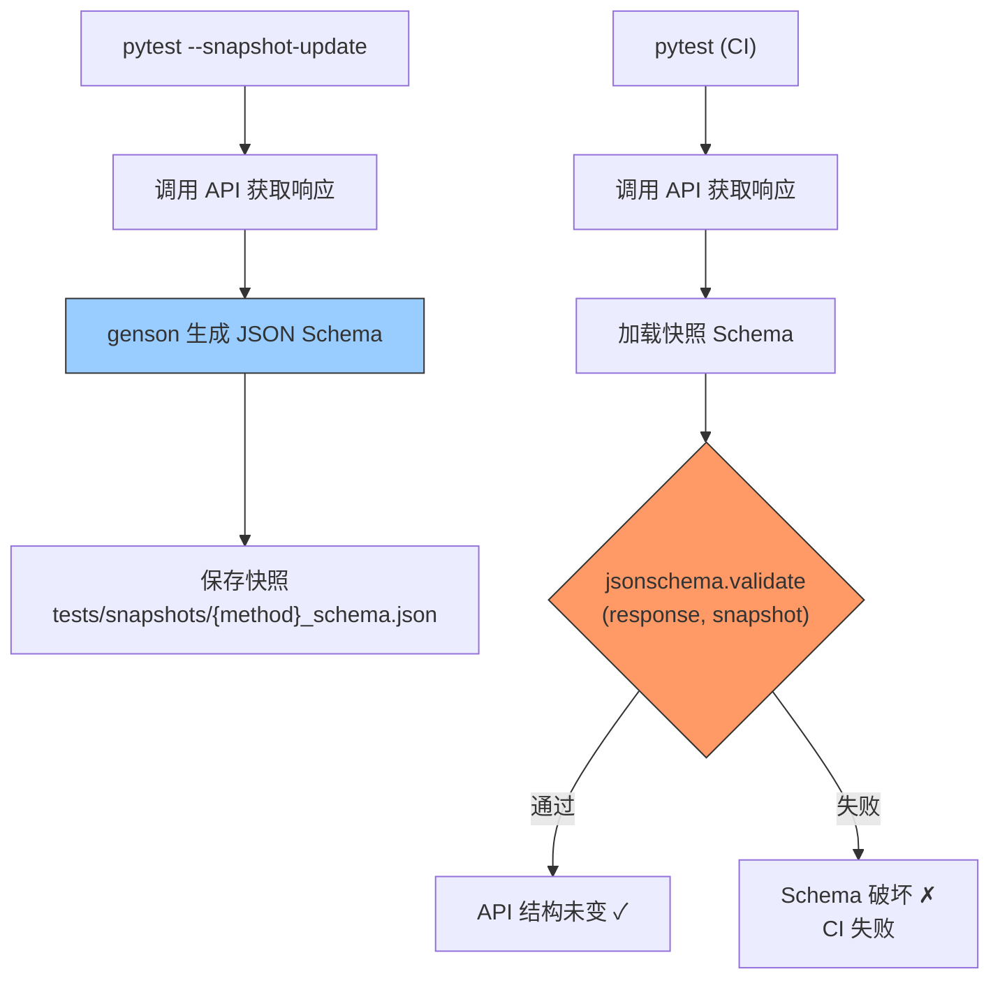

---

doc_type: module
prd_task_id: "YA-09-83"
title: "YA-09-83: Schema 快照测试 — JSON Schema 回归对比 — 开发方案"
status: 需求已编写
priority: P2
owner: 陈铭
roles: [engineer]
created: 2026-09-11
updated: 2026-09-23
project: YiAi
project_id: yiai
prd_month: "202609"
estimate_frontend: 0.5
source_prd: "92-需求-响应Schema快照测试.md"
source_okr: [yiai-001]

type: task
---

# YA-09-83: Schema 快照测试 — JSON Schema 回归对比 — 开发方案

> **文档职责**：本文档定义**怎么做、为什么这么做、实际做成什么样**（HOW），不含产品目标与测试用例。

> 来源 PRD：[92-需求-响应Schema快照测试.md](../../prds/2026-09/92-需求-响应Schema快照测试.md)
> 需求编号：YA-09-83 · 优先级：P2 · 人天：0.5d · 状态：需求已编写

---

<a id="sec-1"></a>
## 一、架构总览

Pydantic model 变更或数据库查询字段修改时，API 响应结构可能被意外破坏——字段名变更、类型变化、必填字段缺失。引入 JSON Schema 快照测试：首次运行生成 Schema 快照文件（git 版本控制），后续 CI 对比当前响应是否符合快照 Schema，不一致则失败。



**核心价值**：CI 自动检测 API 响应结构变更，防止不兼容的字段/类型变化意外合并到 main 分支。

---

<a id="sec-2"></a>
## 二、文件清单

| 文件 | 操作 | 说明 |
|------|------|------|
| `YiAi/tests/snapshots/*.json` | 新增 | Schema 快照文件（git 版本控制） |
| `YiAi/tests/conftest.py` | 修改 | 添加快照 fixture |
| `YiAi/tests/test_api_schema.py` | 新增 | Schema 快照测试用例 |
| `YiAi/requirements-dev.txt` | 修改 | 添加 `genson`, `jsonschema` |

---

<a id="sec-3"></a>
## 三、模块设计

### 3.1 SchemaSnapshotTest

```python
# YiAi/tests/test_api_schema.py
import json, os, pytest
from genson import SchemaBuilder
from jsonschema import validate, ValidationError

SNAPSHOT_DIR = os.path.join(os.path.dirname(__file__), 'snapshots')

def save_snapshot(name: str, schema: dict):
    """保存 Schema 快照到文件。"""
    os.makedirs(SNAPSHOT_DIR, exist_ok=True)
    path = os.path.join(SNAPSHOT_DIR, f'{name}.json')
    with open(path, 'w') as f:
        json.dump(schema, f, indent=2, ensure_ascii=False)

def load_snapshot(name: str) -> dict:
    """加载 Schema 快照。"""
    path = os.path.join(SNAPSHOT_DIR, f'{name}.json')
    with open(path) as f:
        return json.load(f)

def generate_schema(data: dict) -> dict:
    """从响应数据生成 JSON Schema（genson 推断类型）。"""
    builder = SchemaBuilder()
    builder.add_object(data)
    return builder.to_schema()

class SchemaSnapshotTest:
    """API 响应 Schema 快照测试基类。

    使用方式:
        class TestDataServiceSchema(SchemaSnapshotTest):
            SNAPSHOT_NAME = 'query_documents'
            API_PARAMS = {
                'module_name': 'services.data.data_service',
                'method_name': 'query_documents',
                'parameters': {'cname': 'bugs', 'page': 1, 'pageSize': 5}
            }

    首次运行: 生成快照文件 tests/snapshots/query_documents.json
    后续运行: 对比响应是否符合快照 Schema
    """

    SNAPSHOT_NAME: str = None
    API_PARAMS: dict = None
    UPDATE_SNAPSHOTS = False  # pytest --snapshot-update 设置

    async def test_schema(self, async_client):
        resp = await async_client.post('/', json=self.API_PARAMS)
        assert resp.status_code == 200
        data = resp.json()
        assert data.get('code') == 0

        schema = generate_schema(data['data'])

        snapshot_path = os.path.join(SNAPSHOT_DIR, f'{self.SNAPSHOT_NAME}.json')
        if self.UPDATE_SNAPSHOTS or not os.path.exists(snapshot_path):
            save_snapshot(self.SNAPSHOT_NAME, schema)
        else:
            expected = load_snapshot(self.SNAPSHOT_NAME)
            try:
                validate(data['data'], expected)
            except ValidationError as e:
                pytest.fail(f'Schema regression in {self.SNAPSHOT_NAME}: {e.message}')
```

### 3.2 快照端点列表

```python
# 建议覆盖的快照
SNAPSHOT_ENDPOINTS = [
    'query_documents_bugs',     # data_service.query_documents (bugs)
    'query_documents_sessions', # data_service.query_documents (sessions)
    'chat_response',            # chat_service.chat 响应
    'knowledge_list',           # knowledge file 列表
    'search_results',           # 全局搜索响应
    'auth_menu_list',           # 菜单权限列表
]
```

---

<a id="sec-4"></a>
## 四、数据流

```
首次运行 (或 --snapshot-update):
  → pytest test_api_schema.py --snapshot-update
    → 调用 API → 获取真实响应
    → genson.SchemaBuilder.add_object(response_data)
    → 生成 JSON Schema: {type, properties, required, ...}
    → 保存: tests/snapshots/query_documents.json

CI 运行:
  → pytest test_api_schema.py
    → 调用 API → 获取当前响应
    → 加载快照: tests/snapshots/query_documents.json
    → jsonschema.validate(current_response, snapshot_schema)
      → 通过: 响应结构无变化
      → 失败: 字段缺失/类型变更/新增必填字段 → CI 失败
```

---

<a id="sec-5"></a>
## 五、实施路线

| # | 步骤 | 产出 | 验证 | 人天 |
|---|------|------|------|------|
| 1 | 添加 genson + jsonschema 依赖 | `requirements-dev.txt` | pip install 成功 | 0.02 |
| 2 | 创建 SchemaSnapshotTest 基类 | `test_api_schema.py` | 快照生成和对比逻辑 | 0.15 |
| 3 | 为核心 API 编写快照测试 | `test_api_schema.py` | 覆盖 8+ 核心端点 | 0.15 |
| 4 | CI 集成（预提交检查） | CI 配置 | PR 中 Schema 破坏被捕获 | 0.1 |
| 5 | --snapshot-update 支持 | conftest.py | 手动更新快照 | 0.08 |

**合计：0.5d**

---

<a id="sec-6"></a>
## 六、代码审查检查清单

- [ ] 快照文件纳入 git 版本控制（`tests/snapshots/*.json`）
- [ ] 首次运行自动生成快照（非 CI 环境）
- [ ] `--snapshot-update` 标志支持手动更新快照
- [ ] 快照对比仅验证结构（Schema），不验证具体值
- [ ] CI 中快照文件不存在时测试失败（需先运行 generate）
- [ ] 覆盖所有核心 API 端点（至少 8 个）

---

<a id="sec-7"></a>
## 七、风险评估

| 风险 | 概率 | 影响 | 缓解措施 |
|------|------|------|----------|
| 有意 API 变更在 CI 中被拒绝 | 高 | 中 | `--snapshot-update` 更新快照后提交 |
| genson 推断类型不准确 | 低 | 低 | 多种数据组合覆盖 |
| 快照文件合并冲突 | 低 | 低 | 端点一对一文件，减少冲突 |

**回滚**：删除快照测试文件，恢复无 Schema 验证状态。