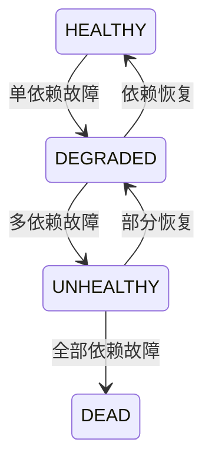

# YA-09-20: 自愈恢复机制 — 故障检测 + 自动恢复编排 — 开发方案

> **文档职责**：本文档定义**怎么做、为什么这么做、实际做成什么样**（HOW），不含产品目标与测试用例。

> 来源 PRD：[93-需求-自愈恢复机制.md](../../prds/2026-09/93-需求-自愈恢复机制.md)
> 需求编号：YA-09-20 · 优先级：P2 · 人天：1.5d · 状态：需求已编写

---

## 一、方案

对已知可恢复的故障模式建立自动检测和恢复策略，减少人工介入。

### 故障-恢复矩阵

| 故障 | 检测方式 | 恢复策略 | 最大重试 |
|------|---------|---------|---------|
| MongoDB 连接断开 | ping 失败 | 等待 5s → 重连 | 3 次 |
| Ollama 不可达 | HTTP 超时 | 等待 10s → 重试 | 2 次 |
| 内存使用 > 80% | `psutil` 监控 | 触发 GC + 拒绝新请求 | — |
| SSE 连接泄漏 | 活跃连接数 > 阈值 | 关闭最旧空闲连接 | — |
| apscheduler 任务卡死 | 任务执行时间 > 阈值 | 重启调度器 | 1 次 |

### 健康状态机

---

## 二、实施步骤

| 步骤 | 验证 | 人天 |
|------|------|------|
| 1 | MongoDB/Ollama 重连机制 | 模拟断连 → 自动恢复 | 0.5 |
| 2 | 内存监控 + GC 触发 | 内存 > 80% 自动 GC | 0.5 |
| 3 | 健康状态机 + 告警 + 测试 | 降级/恢复状态正确转换 | 0.5 |

**合计：1.5d**。

---

## 三、关联模块

- 集成：[YA-09-17 优雅关闭](./28-prd-task-服务优雅关闭.md)
- 关联：[健康检查探针](./20-prd-task-服务健康检查与就绪探针.md)