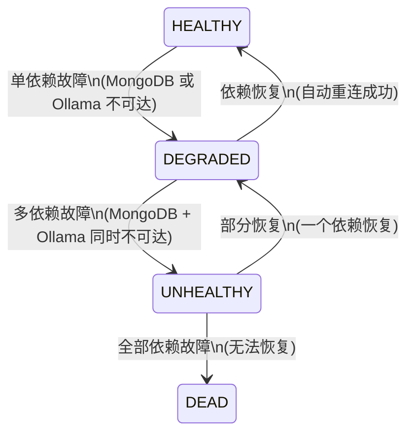

---

doc_type: module
prd_task_id: "YA-09-20"
title: "YA-09-20: 自愈恢复机制 — 故障检测 + 自动恢复编排 — 开发方案"
status: 需求已编写
priority: P2
owner: 陈铭
roles: [engineer]
created: 2026-09-11
updated: 2026-09-23
project: YiAi
project_id: yiai
prd_month: "202609"
estimate_frontend: 1.5
source_prd: "93-需求-自愈恢复机制.md"
source_okr: [yiai-001]

type: task
---

# YA-09-20: 自愈恢复机制 — 故障检测 + 自动恢复编排 — 开发方案

> **文档职责**：本文档定义**怎么做、为什么这么做、实际做成什么样**（HOW），不含产品目标与测试用例。

> 来源 PRD：[93-需求-自愈恢复机制.md](../../prds/2026-09/93-需求-自愈恢复机制.md)
> 需求编号：YA-09-20 · 优先级：P2 · 人天：1.5d · 状态：需求已编写

---

<a id="sec-1"></a>
## 一、架构总览

YiAi 依赖 MongoDB、Ollama、文件系统等多个外部服务，任一依赖故障都可能导致功能部分或完全不可用。建立健康状态机 + 故障自动恢复机制：对已知可恢复的故障模式（连接断开、内存压力、SSE 泄漏）建立自动检测和恢复策略，减少人工介入。


```mermaid
stateDiagram-v2
    HEALTHY --> DEGRADED: 单依赖故障\n(MongoDB 或 Ollama 不可达)
    DEGRADED --> HEALTHY: 依赖恢复\n(自动重连成功)
    DEGRADED --> UNHEALTHY: 多依赖故障\n(MongoDB + Ollama 同时不可达)
    UNHEALTHY --> DEGRADED: 部分恢复\n(一个依赖恢复)
    UNHEALTHY --> DEAD: 全部依赖故障\n(无法恢复)
```

**故障-恢复矩阵**：

| 故障 | 检测 | 恢复 | 最大重试 |
|------|------|------|---------|
| MongoDB 断开 | ping 失败 | 5s 后重连 | 3 次 |
| Ollama 不可达 | HTTP 超时 | 10s 后重试 | 2 次 |
| 内存 > 80% | psutil | 触发 GC + 限流 | -- |
| SSE 连接泄漏 | 活跃 > 阈值 | kill 最旧空闲 | -- |
| 调度器卡死 | 任务耗时 > 阈值 | 重启调度器 | 1 次 |

---

<a id="sec-2"></a>
## 二、文件清单

| 文件 | 操作 | 说明 |
|------|------|------|
| `YiAi/src/server/self_healing.py` | 新增 | HealthStateMachine + RecoveryOrchestrator |
| `YiAi/src/server/main.py` | 修改 | 启动自愈监控 |
| `YiAi/tests/test_self_healing.py` | 新增 | 自愈测试 |

---

<a id="sec-3"></a>
## 三、模块设计

### 3.1 HealthStateMachine

```python
# YiAi/src/server/self_healing.py
from enum import Enum
import asyncio, gc, psutil

class HealthState(Enum):
    HEALTHY = 'healthy'
    DEGRADED = 'degraded'
    UNHEALTHY = 'unhealthy'
    DEAD = 'dead'

class HealthStateMachine:
    """健康状态机——根据依赖状态自动切换服务健康状态。

    转换规则:
        HEALTHY → DEGRADED: 任一核心依赖 (MongoDB/Ollama) 不可用
        DEGRADED → HEALTHY: 所有依赖恢复
        DEGRADED → UNHEALTHY: 多个核心依赖同时不可用
        UNHEALTHY → DEGRADED: 部分依赖恢复
        UNHEALTHY → DEAD: 所有依赖不可恢复
    """

    def __init__(self):
        self._state = HealthState.HEALTHY
        self._dependency_status: dict[str, bool] = {}

    def update_dependency(self, name: str, healthy: bool):
        self._dependency_status[name] = healthy
        unhealthy_count = sum(1 for v in self._dependency_status.values() if not v)

        if unhealthy_count == 0:
            self._transition(HealthState.HEALTHY)
        elif unhealthy_count == 1:
            self._transition(HealthState.DEGRADED)
        elif unhealthy_count >= 2 and len(self._dependency_status) >= 3:
            self._transition(HealthState.UNHEALTHY)

    def _transition(self, new_state: HealthState):
        if self._state != new_state:
            old = self._state
            self._state = new_state
            logger.warning(f'[HealthState] {old.value} → {new_state.value}')
            if new_state in (HealthState.UNHEALTHY, HealthState.DEAD):
                self._send_alert(f'服务状态变更: {old.value} → {new_state.value}')

    @property
    def state(self) -> HealthState:
        return self._state

    def is_ready(self) -> bool:
        return self._state in (HealthState.HEALTHY, HealthState.DEGRADED)
```

### 3.2 RecoveryOrchestrator

```python
class RecoveryOrchestrator:
    """自动恢复编排器——对已知故障模式执行自动恢复。

    恢复策略:
        1. MongoDB 断开: 3 次重连 (5s 间隔)
        2. Ollama 不可达: 2 次重试 (10s 间隔)
        3. 内存压力: GC + 限制新请求
        4. SSE 泄漏: kill 最旧空闲连接
    """

    def __init__(self, mongo_client, ollama_client, state_machine: HealthStateMachine): ...

    async def monitor_mongodb(self):
        """每 10s ping MongoDB，断开时自动重连。"""
        while True:
            await asyncio.sleep(10)
            try:
                await self._mongo.admin.command('ping')
                self._state.update_dependency('mongodb', True)
            except Exception:
                self._state.update_dependency('mongodb', False)
                await self._reconnect_mongodb()

    async def _reconnect_mongodb(self):
        """重连 MongoDB（指数退避 5s/10s/15s, 最多 3 次）。"""
        for attempt in range(3):
            try:
                logger.info(f'[Recovery] MongoDB 重连 {attempt+1}/3')
                await asyncio.sleep(5 * (attempt + 1))
                await self._mongo.admin.command('ping')
                self._state.update_dependency('mongodb', True)
                return
            except Exception:
                pass
        logger.error('[Recovery] MongoDB 重连失败 (3 次)')

    async def monitor_memory(self):
        """每 30s 检查内存，> 80% 触发 GC + 拒绝新请求。"""
        while True:
            await asyncio.sleep(30)
            mem = psutil.virtual_memory()
            if mem.percent > 80:
                logger.warning(f'[Recovery] 内存 {mem.percent}% > 80%，触发 GC')
                gc.collect()
                # 可选: 设置限流标志
```

---

<a id="sec-4"></a>
## 四、数据流

```
监控循环:
  → monitor_mongodb (每 10s)
    → db.admin.command('ping') → 成功
    → 失败 → update_dependency('mongodb', False)
      → 状态: HEALTHY → DEGRADED
      → _reconnect_mongodb (5s/10s/15s 重试)
      → 恢复 → update_dependency('mongodb', True)
        → 状态: DEGRADED → HEALTHY

  → monitor_memory (每 30s)
    → psutil.virtual_memory().percent > 80%
      → gc.collect()
      → 拒绝新请求 (返回 503)
```

---

<a id="sec-5"></a>
## 五、实施路线

| # | 步骤 | 产出 | 验证 | 人天 |
|---|------|------|------|------|
| 1 | HealthStateMachine 实现 | `self_healing.py` | 状态转换正确 | 0.3 |
| 2 | MongoDB/Ollama 自动重连 | `self_healing.py` | 模拟断连 → 自动恢复 | 0.4 |
| 3 | 内存压力 GC + 限流 | `self_healing.py` | 内存 > 80% 触发 GC | 0.3 |
| 4 | SSE 泄漏检测 + 恢复 | `self_healing.py` | 关闭最旧空闲连接 | 0.2 |
| 5 | 企微告警 + 测试 | `self_healing.py` + test | 状态变更通知 | 0.3 |

**合计：1.5d**

---

<a id="sec-6"></a>
## 六、代码审查检查清单

- [ ] 健康状态机四态转换逻辑完整（HEALTHY/DEGRADED/UNHEALTHY/DEAD）
- [ ] DEGRADED 状态下服务仍可处理请求（降级模式）
- [ ] UNHEALTHY 返回 503 + 健康检查失败
- [ ] MongoDB 重连使用指数退避（5s/10s/15s）
- [ ] 内存 GC 触发阈值 80%
- [ ] 状态变更时企微通知

---

<a id="sec-7"></a>
## 七、风险评估

| 风险 | 概率 | 影响 | 缓解措施 |
|------|------|------|----------|
| 频繁 ping 增加数据库负载 | 低 | 低 | 10s 间隔，ping 命令几乎无开销 |
| 状态频繁切换导致日志轰炸 | 低 | 中 | 状态变更限频（60s 内最多一次） |

**回滚**：禁用自愈检测器，手动处理故障。服务恢复正常模式。