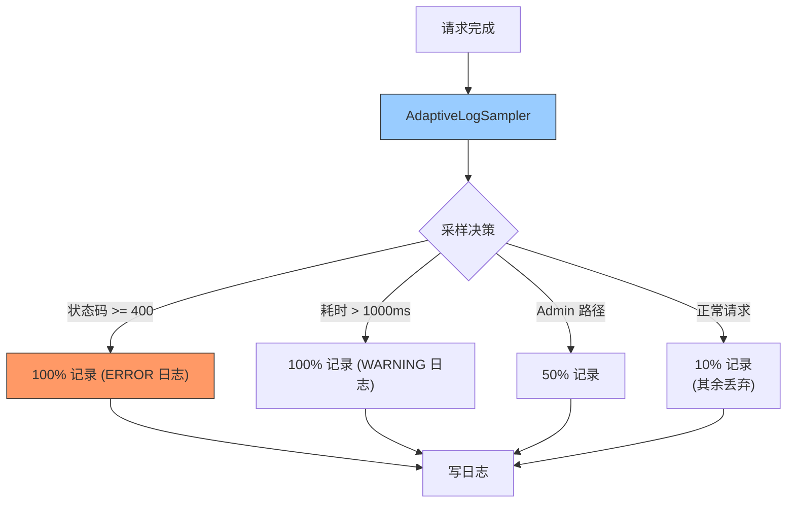

---

doc_type: module
prd_task_id: "YA-09-67"
title: "YA-09-67: 自适应日志采样 — 错误全量 + 正常采样 — 开发方案"
status: 需求已编写
priority: P2
owner: 陈铭
roles: [engineer]
created: 2026-09-11
updated: 2026-09-23
project: YiAi
project_id: yiai
prd_month: "202609"
estimate_frontend: 0.5
source_prd: "94-需求-自适应日志采样.md"
source_okr: [yiai-001]

type: task
---

# YA-09-67: 自适应日志采样 — 错误全量 + 正常采样 — 开发方案

> **文档职责**：本文档定义**怎么做、为什么这么做、实际做成什么样**（HOW），不含产品目标与测试用例。

> 来源 PRD：[94-需求-自适应日志采样.md](../../prds/2026-09/94-需求-自适应日志采样.md)
> 需求编号：YA-09-67 · 优先级：P2 · 人天：0.5d · 状态：需求已编写

---

<a id="sec-1"></a>
## 一、架构总览

高流量下全量日志存储成本高且关键信息被淹没。引入自适应日志采样：错误请求 100% 记录、慢请求 100% 记录、Admin API 50% 记录、正常请求 10% 采样。通过日志 Filter 在写入前决策，不影响业务逻辑。



**效果**：日志量降低 80-90%，但错误和慢请求 100% 保留，不影响排障和性能分析。

---

<a id="sec-2"></a>
## 二、文件清单

| 文件 | 操作 | 说明 |
|------|------|------|
| `YiAi/src/server/log_sampler.py` | 新增 | AdaptiveLogSampler |
| `YiAi/src/server/middleware.py` | 修改 | 集成日志采样到请求中间件 |
| `YiAi/config.yaml` | 修改 | 采样率配置 |
| `YiAi/tests/test_log_sampler.py` | 新增 | 采样逻辑测试 |

---

<a id="sec-3"></a>
## 三、模块设计

### 3.1 AdaptiveLogSampler

```python
# YiAi/src/server/log_sampler.py
import random

class SamplingConfig:
    """日志采样配置。"""
    error_sample_rate: float = 1.0       # 错误 100%
    slow_request_sample_rate: float = 1.0  # 慢请求 100%
    admin_sample_rate: float = 0.5        # Admin 50%
    normal_sample_rate: float = 0.1       # 正常 10%
    slow_request_threshold_ms: int = 1000  # 慢请求阈值

class AdaptiveLogSampler:
    """自适应日志采样器——按请求类型分级采样。

    采样策略:
        1. 错误 (4xx/5xx): 100% 记录——排障必需
        2. 慢请求 (> 1s): 100% 记录——性能分析
        3. Admin API: 50% 记录——安全审计
        4. 正常请求: 10% 记录——流量趋势分析

    使用方式:
        sampler = AdaptiveLogSampler(config)
        if sampler.should_log(status_code=200, duration_ms=50, path='/api/data'):
            logger.info(...)
    """

    def __init__(self, config: SamplingConfig = None):
        self.config = config or SamplingConfig()

    def should_log(self, status_code: int = 200, duration_ms: float = 0,
                   method_name: str = '', path: str = '') -> bool:
        """判定当前请求是否需要记录日志。

        Args:
            status_code: HTTP 状态码
            duration_ms: 请求耗时（毫秒）
            method_name: RPC method_name
            path: 请求路径

        Returns:
            True 表示应该记录日志
        """
        # 1. 错误请求——100% 记录
        if status_code >= 400:
            return True

        # 2. 慢请求——100% 记录
        if duration_ms > self.config.slow_request_threshold_ms:
            return True

        # 3. Admin API——50% 记录
        if path.startswith('/admin') or method_name.startswith('admin.'):
            return random.random() < self.config.admin_sample_rate

        # 4. 正常请求——10% 记录
        return random.random() < self.config.normal_sample_rate

    def get_sampling_stats(self) -> dict:
        """获取采样统计（用于 Dashboard）。"""
        return {
            'error_rate': f'{self.config.error_sample_rate*100:.0f}%',
            'slow_rate': f'{self.config.slow_request_sample_rate*100:.0f}%',
            'admin_rate': f'{self.config.admin_sample_rate*100:.0f}%',
            'normal_rate': f'{self.config.normal_sample_rate*100:.0f}%',
        }

# 集成到 RequestLoggingMiddleware
class RequestLoggingMiddleware:
    def __init__(self, sampler: AdaptiveLogSampler = None):
        self.sampler = sampler or AdaptiveLogSampler()

    async def __call__(self, request: Request, call_next):
        start = time.time()
        response = await call_next(request)
        duration_ms = (time.time() - start) * 1000

        if self.sampler.should_log(
            status_code=response.status_code,
            duration_ms=duration_ms,
            path=request.url.path
        ):
            logger.info(
                f'{request.method} {request.url.path} '
                f'{response.status_code} {duration_ms:.0f}ms'
            )
        return response
```

---

<a id="sec-4"></a>
## 四、数据流

```
请求: POST / {module: "services.data.data_service", method: "query_documents"}
  → 耗时: 45ms, 状态码: 200

  → AdaptiveLogSampler.should_log(200, 45, "data_service.query_documents", "/")
    → status_code < 400: 非错误
    → duration_ms < 1000: 非慢请求
    → path != /admin: 非 Admin
    → random.random() < 0.1: 10% 概率 → True/False

  → True: 记录 INFO 日志 "POST / 200 45ms"
  → False: 不记录（节省磁盘 I/O 和存储）
```

---

<a id="sec-5"></a>
## 五、实施路线

| # | 步骤 | 产出 | 验证 | 人天 |
|---|------|------|------|------|
| 1 | 创建 AdaptiveLogSampler | `log_sampler.py` | 采样率配置正确 | 0.15 |
| 2 | 集成到 RequestLoggingMiddleware | `middleware.py` | 日志量降低 80%+ | 0.1 |
| 3 | config.yaml 化采样率 | `config.yaml` | 不同环境可调采样率 | 0.1 |
| 4 | Dashboard 显示采样统计 | 监控 | Grafana 可查看采样比例 | 0.1 |
| 5 | 测试用例 | `tests/test_log_sampler.py` | 错误/慢请求/Admin/正常 比例验证 | 0.05 |

**合计：0.5d**

---

<a id="sec-6"></a>
## 六、代码审查检查清单

- [ ] 错误请求（>= 400）100% 记录
- [ ] 慢请求（> 1s）100% 记录
- [ ] Admin API 50% 记录
- [ ] 正常请求 10% 记录
- [ ] 采样率从 config.yaml 读取（可热更新）
- [ ] 采样不改变日志格式（仅控制是否写入）
- [ ] 健康检查端点（/health）不受采样影响

---

<a id="sec-7"></a>
## 七、风险评估

| 风险 | 概率 | 影响 | 缓解措施 |
|------|------|------|----------|
| 10% 采样丢失关键信息 | 低 | 中 | 错误/慢请求 100% 保留 |
| 随机采样导致可复现性差 | 中 | 低 | 可设置 seed 用于测试 |

**回滚**：设置所有采样率为 1.0（100% 记录），恢复全量日志。