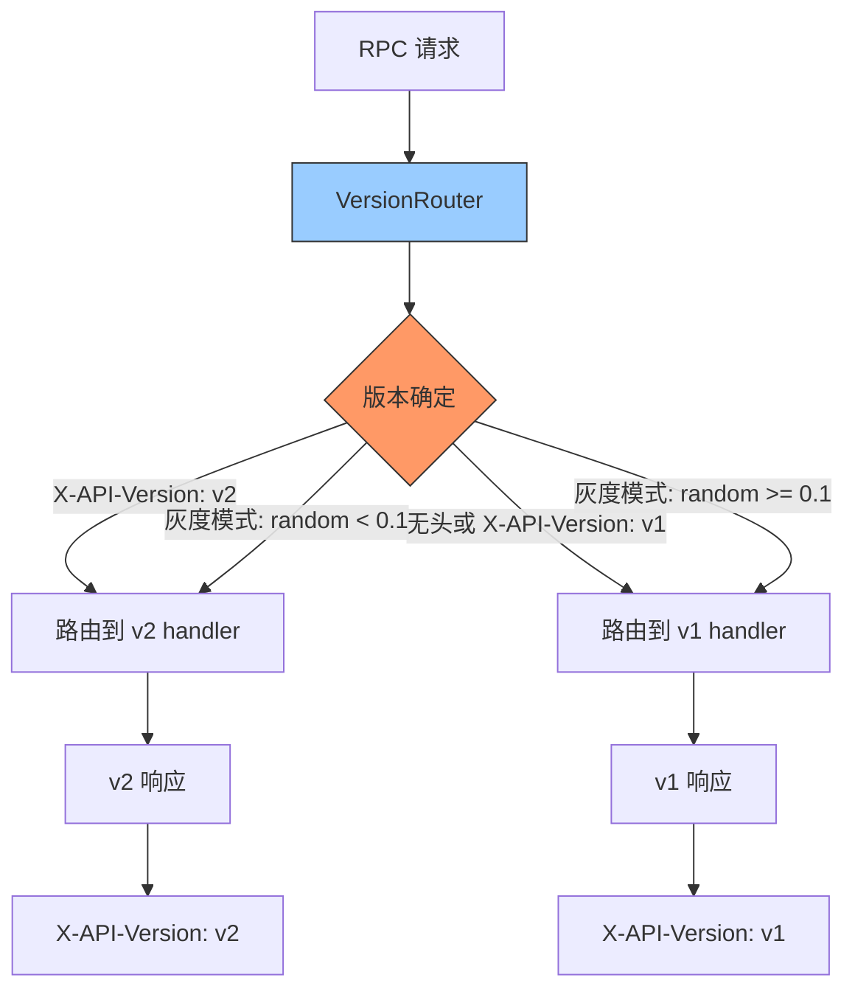

---

doc_type: module
prd_task_id: "YA-09-91"
title: "YA-09-91: API 版本化路由灰度 — URL 路径版本隔离与流量分发 — 开发方案"
status: 需求已编写
priority: P2
owner: 陈铭
roles: [engineer]
created: 2026-09-11
updated: 2026-09-23
project: YiAi
project_id: yiai
prd_month: "202609"
estimate_frontend: 0.5
source_prd: "95-需求-API版本化路由灰度.md"
source_okr: [yiai-002]

type: task
---

# YA-09-91: API 版本化路由灰度 — URL 路径版本隔离与流量分发 — 开发方案

> **文档职责**：本文档定义**怎么做、为什么这么做、实际做成什么样**（HOW），不含产品目标与测试用例。

> 来源 PRD：[95-需求-API版本化路由灰度.md](../../prds/2026-09/95-需求-API版本化路由灰度.md)
> 需求编号：YA-09-91 · 优先级：P2 · 人天：0.5d · 状态：需求已编写

---

<a id="sec-1"></a>
## 一、架构总览

当 RPC API 需要不兼容变更（如重命名方法、修改参数结构）时，需要同时支持新旧版本以便客户端逐步迁移。在 RPC 路由器层面实现版本感知路由：根据 `X-API-Version` 请求头或 `module_name` 中的版本后缀，将请求分发到对应版本的处理函数。支持灰度比例控制（10% 流量走 v2，90% 走 v1）。



---

<a id="sec-2"></a>
## 二、文件清单

| 文件 | 操作 | 说明 |
|------|------|------|
| `YiAi/src/server/version_router.py` | 新增 | VersionRouter + 灰度控制 |
| `YiAi/src/services/*/v2/*.py` | 新增 | v2 版本 service 实现 |
| `YiAi/config.yaml` | 修改 | 灰度比例配置 |
| `YiAi/tests/test_version_router.py` | 新增 | 版本路由测试 |

---

<a id="sec-3"></a>
## 三、模块设计

### 3.1 VersionRouter

```python
# YiAi/src/server/version_router.py
import random

class VersionRouter:
    """API 版本化路由——按 X-API-Version 头或灰度比例分发请求。

    版本解析优先级:
        1. X-API-Version 请求头（显式指定版本）
        2. module_name 后缀（如 data_service_v2）
        3. 灰度比例（随机分配）
        4. 默认版本 (v1)

    配置:
        versioning:
          default_version: "v1"
          available_versions: ["v1", "v2"]
          grayscale:
            enabled: true
            v2_ratio: 0.1          # 10% 流量走 v2
            target_users: []        # 白名单用户（始终走 v2）
    """

    def __init__(self, config: dict):
        self.default_version = config.get('default_version', 'v1')
        self.grayscale = config.get('grayscale', {})
        self._version_map: dict[str, dict[str, callable]] = {
            'v1': {}, 'v2': {},
        }

    def register(self, version: str, method_name: str, handler: callable):
        """注册版本处理方法。

        使用:
            router.register('v1', 'services.data.data_service.query', query_v1)
            router.register('v2', 'services.data.data_service.query', query_v2)
        """
        self._version_map.setdefault(version, {})[method_name] = handler

    def resolve(self, method_name: str, headers: dict, user_id: str = None) -> tuple[str, callable]:
        """解析请求应路由到的版本和 handler。

        Returns:
            (version, handler) 或 (version, None) 如果 handler 不存在
        """
        # 1. X-API-Version 显式指定
        explicit = headers.get('X-API-Version')
        if explicit and explicit in self._version_map:
            handler = self._version_map[explicit].get(method_name)
            if handler:
                return explicit, handler

        # 2. 白名单用户始终走最新版本
        if user_id and user_id in self.grayscale.get('target_users', []):
            latest = self.grayscale.get('latest_version', 'v2')
            handler = self._version_map.get(latest, {}).get(method_name)
            if handler:
                return latest, handler

        # 3. 灰度比例
        if self.grayscale.get('enabled'):
            ratio = self.grayscale.get('v2_ratio', 0)
            if random.random() < ratio:
                latest = 'v2'
                handler = self._version_map.get(latest, {}).get(method_name)
                if handler:
                    return latest, handler

        # 4. 默认版本
        handler = self._version_map.get(self.default_version, {}).get(method_name)
        if handler:
            return self.default_version, handler

        # Fallback: 尝试所有版本
        for ver in self._version_map:
            handler = self._version_map[ver].get(method_name)
            if handler:
                return ver, handler

        return self.default_version, None

    def get_route_info(self) -> dict:
        """获取版本路由信息。"""
        return {
            'default': self.default_version,
            'versions': list(self._version_map.keys()),
            'grayscale': self.grayscale,
        }
```

### 3.2 灰度配置

```yaml
# config.yaml
versioning:
  default_version: "v1"
  grayscale:
    enabled: false
    latest_version: "v2"
    v2_ratio: 0.0      # 0.0 = 0%, 0.1 = 10%
    target_users: []   # 白名单用户 ID 列表
```

---

<a id="sec-4"></a>
## 四、数据流

```
请求: POST / {module: "services.data.data_service", method: "query_documents"}

无版本头:
  → VersionRouter.resolve('services.data.data_service.query_documents', headers={})
    → 灰度关闭 → default_version='v1'
    → handler = v1_handler → 返回 ('v1', v1_handler)
  → v1_handler(params) → 响应

有灰度 (v2_ratio=0.1):
  → random.random() < 0.1 → True
  → handler = v2_handler → 返回 ('v2', v2_handler)
  → v2_handler(params) → 新格式响应

白名单用户:
  → user_id in ['test_user_1']
  → latest_version='v2' → v2_handler
```

---

<a id="sec-5"></a>
## 五、实施路线

| # | 步骤 | 产出 | 验证 | 人天 |
|---|------|------|------|------|
| 1 | 创建 VersionRouter | `version_router.py` | 版本分发逻辑正确 | 0.15 |
| 2 | 实现灰度比例控制 | `version_router.py` | 10% v2 + 90% v1 正确 | 0.1 |
| 3 | 注册 v2 handler 示例 | `v2/data_service.py` | v1/v2 双版本并存 | 0.1 |
| 4 | config.yaml 化版本配置 | `config.yaml` | 灰度比例可配置 | 0.05 |
| 5 | 前端 X-API-Version 头支持 | YiVad | 前端可指定版本 | 0.05 |
| 6 | 测试用例 | `tests/test_version_router.py` | 显式版本/灰度/默认/白名单 | 0.05 |

**合计：0.5d**

---

<a id="sec-6"></a>
## 六、代码审查检查清单

- [ ] 版本解析优先级：X-API-Version > 白名单 > 灰度 > 默认
- [ ] 灰度随机算法保证比例准确性
- [ ] 新版本 handler 不存在时 fallback 到旧版本
- [ ] 响应包含 X-API-Version 头（标识实际版本）
- [ ] 灰度比例从 config.yaml 读取（可热更新）

---

<a id="sec-7"></a>
## 七、风险评估

| 风险 | 概率 | 影响 | 缓解措施 |
|------|------|------|----------|
| 随机灰度可能导致同一用户 v1/v2 切换 | 高 | 中 | 白名单模式 + 用户 ID sticky |
| 灰度比例不准确（样本小） | 低 | 低 | 大流量场景下 random 足够均匀 |

**回滚**：灰度比例设为 0.0，停止 v2 流量。所有请求路由到 v1。