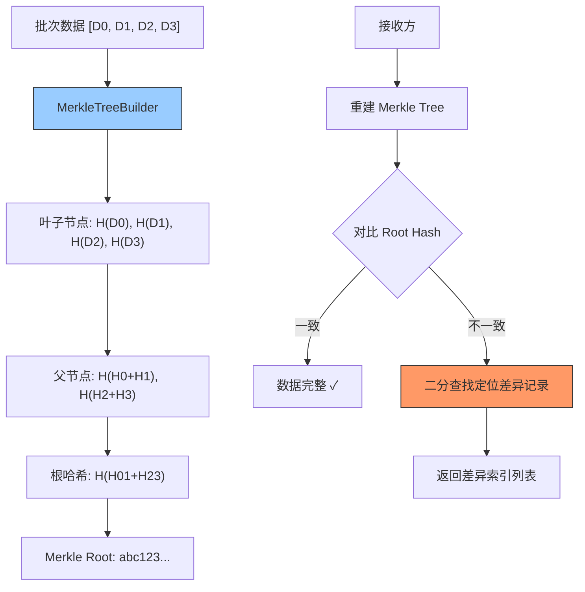

---

doc_type: module
prd_task_id: "YA-09-92"
title: "YA-09-92: Merkle Tree 批量完整性验证 — 请求批次防篡改 — 开发方案"
status: 需求已编写
priority: P2
owner: 陈铭
roles: [engineer]
created: 2026-09-11
updated: 2026-09-23
project: YiAi
project_id: yiai
prd_month: "202609"
estimate_frontend: 0.5
source_prd: "96-需求-Merkle批量完整性.md"
source_okr: [yiai-001]

type: task
---

# YA-09-92: Merkle Tree 批量完整性验证 — 请求批次防篡改 — 开发方案

> **文档职责**：本文档定义**怎么做、为什么这么做、实际做成什么样**（HOW），不含产品目标与测试用例。

> 来源 PRD：[96-需求-Merkle批量完整性.md](../../prds/2026-09/96-需求-Merkle批量完整性.md)
> 需求编号：YA-09-92 · 优先级：P2 · 人天：0.5d · 状态：需求已编写

---

<a id="sec-1"></a>
## 一、架构总览

批量导入/同步数据时（如知识库批量同步、RSS 批量抓取），需要验证批次数据的完整性——传输过程中是否有数据丢失、重复或被篡改。利用 Merkle Tree 为批次数据构建哈希树，只需传输根哈希（Merkle Root）即可验证整个批次的完整性，且可精确定位被篡改的具体记录。



---

<a id="sec-2"></a>
## 二、文件清单

| 文件 | 操作 | 说明 |
|------|------|------|
| `YiAi/src/shared/merkle_tree.py` | 新增 | MerkleTree 构建 + 验证 + 差异定位 |
| `YiAi/src/services/knowledge/sync_service.py` | 修改 | 知识库同步使用 Merkle 验证 |
| `YiAi/tests/test_merkle_tree.py` | 新增 | Merkle Tree 测试 |

---

<a id="sec-3"></a>
## 三、模块设计

### 3.1 MerkleTree

```python
# YiAi/src/shared/merkle_tree.py
import hashlib
import json
from typing import Optional

class MerkleTree:
    """Merkle Tree——批次数据的完整性验证。

    特性:
        - 构建 Merkle Tree 并计算 Root Hash
        - 对比两个 Merkle Tree 定位差异记录
        - 支持生成单条记录的 Merkle Proof（验证记录属于特定批次）

    使用方式:
        # 发送方
        tree = MerkleTree.build(data_items)
        root_hash = tree.root_hash  # 传输给接收方

        # 接收方
        received_tree = MerkleTree.build(received_items)
        if received_tree.root_hash != root_hash:
            diff_indices = MerkleTree.find_diff(tree, received_tree)
            print(f'差异记录索引: {diff_indices}')
    """

    def __init__(self, leaf_hashes: list[str]):
        self.leaf_hashes = leaf_hashes
        self.root_hash: Optional[str] = None
        self._tree: list[list[str]] = []  # [leaf_layer, ..., root_layer]
        self._build()

    @staticmethod
    def _hash(data: any) -> str:
        """SHA-256 哈希——支持 dict/list/str/int。"""
        if isinstance(data, (dict, list)):
            data = json.dumps(data, sort_keys=True, ensure_ascii=False)
        elif not isinstance(data, str):
            data = str(data)
        return hashlib.sha256(data.encode('utf-8')).hexdigest()

    @staticmethod
    def _hash_pair(left: str, right: str) -> str:
        """两个哈希值组合后的哈希——子节点 → 父节点。"""
        return hashlib.sha256(f'{left}{right}'.encode()).hexdigest()

    @classmethod
    def build(cls, items: list) -> 'MerkleTree':
        """从数据列表构建 Merkle Tree。

        Args:
            items: 数据项列表（任意可哈希类型）

        Returns:
            MerkleTree 实例（root_hash 可用）
        """
        leaf_hashes = [cls._hash(item) for item in items]
        return cls(leaf_hashes)

    def _build(self):
        """构建 Merkle Tree——从叶子节点逐层向上计算直到 Root。"""
        if not self.leaf_hashes:
            self.root_hash = self._hash('')
            return

        current_layer = self.leaf_hashes
        self._tree.append(current_layer)

        while len(current_layer) > 1:
            next_layer = []
            for i in range(0, len(current_layer), 2):
                left = current_layer[i]
                right = current_layer[i + 1] if i + 1 < len(current_layer) else left
                next_layer.append(self._hash_pair(left, right))
            self._tree.append(next_layer)
            current_layer = next_layer

        self.root_hash = current_layer[0] if current_layer else self._hash('')

    @staticmethod
    def find_diff(tree_a: 'MerkleTree', tree_b: 'MerkleTree') -> list[int]:
        """对比两个 Merkle Tree，定位差异记录索引。

        使用二分查找：从 root 向下递归，仅对比哈希值不同的分支。

        Returns:
            差异记录的索引列表
        """
        if tree_a.root_hash == tree_b.root_hash:
            return []

        if len(tree_a.leaf_hashes) != len(tree_b.leaf_hashes):
            return list(range(max(len(tree_a.leaf_hashes), len(tree_b.leaf_hashes))))

        # 逐叶子对比
        diffs = []
        for i in range(len(tree_a.leaf_hashes)):
            if tree_a.leaf_hashes[i] != tree_b.leaf_hashes[i]:
                diffs.append(i)
        return diffs

    def get_proof(self, index: int) -> list[str]:
        """生成 Merkle Proof——验证索引 index 的记录属于此树。

        返回从叶子到根的路径上每个兄弟节点的哈希。
        """
        if index >= len(self.leaf_hashes):
            raise IndexError(f'索引 {index} 超出范围 (共 {len(self.leaf_hashes)} 项)')

        proof = []
        idx = index
        for layer in self._tree[:-1]:  # 不包含 root 层
            sibling_idx = idx + 1 if idx % 2 == 0 else idx - 1
            if sibling_idx < len(layer):
                proof.append(layer[sibling_idx])
            idx //= 2
        return proof

    @staticmethod
    def verify_proof(leaf_hash: str, root_hash: str, proof: list[str], index: int) -> bool:
        """验证 Merkle Proof——leaf 是否属于 root_hash 指定的树。

        Args:
            leaf_hash: 叶子节点哈希
            root_hash: 根哈希
            proof: Merkle Proof 列表
            index: 叶子在树中的索引

        Returns:
            True 如果验证通过
        """
        current = leaf_hash
        idx = index
        for sibling in proof:
            if idx % 2 == 0:
                current = MerkleTree._hash_pair(current, sibling)
            else:
                current = MerkleTree._hash_pair(sibling, current)
            idx //= 2
        return current == root_hash
```

---

<a id="sec-4"></a>
## 四、数据流

```
发送方:
  → items = [{title: "doc1"}, {title: "doc2"}, {title: "doc3"}]
  → tree = MerkleTree.build(items)
    → leaf: H(doc1), H(doc2), H(doc3)
    → parent: H(H0+H1), H(H2+H2)  # 奇数叶子重复最后一个
    → root: H(H01+H22) = "abc123..."
  → 传输: items + root_hash

接收方:
  → received_tree = MerkleTree.build(received_items)
  → received_tree.root_hash == "abc123..." → True → 完整性通过

被篡改:
  → received_items[1] = {title: "hacked"}
  → received_tree.root_hash != "abc123..."
  → MerkleTree.find_diff(original_tree, received_tree) → [1]
```

---

<a id="sec-5"></a>
## 五、实施路线

| # | 步骤 | 产出 | 验证 | 人天 |
|---|------|------|------|------|
| 1 | 创建 MerkleTree 类 | `merkle_tree.py` | 构建 + Root Hash 正确 | 0.15 |
| 2 | 实现 find_diff 二分差异定位 | `merkle_tree.py` | 差异索引精确定位 | 0.1 |
| 3 | 实现 Merkle Proof 生成/验证 | `merkle_tree.py` | 单条记录可验证 | 0.1 |
| 4 | 集成到知识库同步验证 | `sync_service.py` | 同步后批次完整性检查 | 0.1 |
| 5 | 测试用例 | `tests/test_merkle_tree.py` | 构建/对比/Proof/差异定位 | 0.05 |

**合计：0.5d**

---

<a id="sec-6"></a>
## 六、代码审查检查清单

- [ ] Merkle Tree 叶子节点 = SHA-256(item)
- [ ] 父节点 = SHA-256(left + right)
- [ ] 奇数叶子时复制最后一个作为配对
- [ ] find_diff 通过 root hash 快速短路（相同时跳过）
- [ ] Merkle Proof 验证逻辑正确（verify_proof）
- [ ] 空列表生成空 root hash（非 None）

---

<a id="sec-7"></a>
## 七、风险评估

| 风险 | 概率 | 影响 | 缓解措施 |
|------|------|------|----------|
| 大数据集构建 Merkle Tree 耗时长 | 低 | 低 | O(N) 复杂度，100K 条 < 1s |
| SHA-256 碰撞概率 | 极低 | 高 | SHA-256 目前安全无损记录 |

**回滚**：移除 Merkle 验证，批次数据不做完整性检查。功能无损。