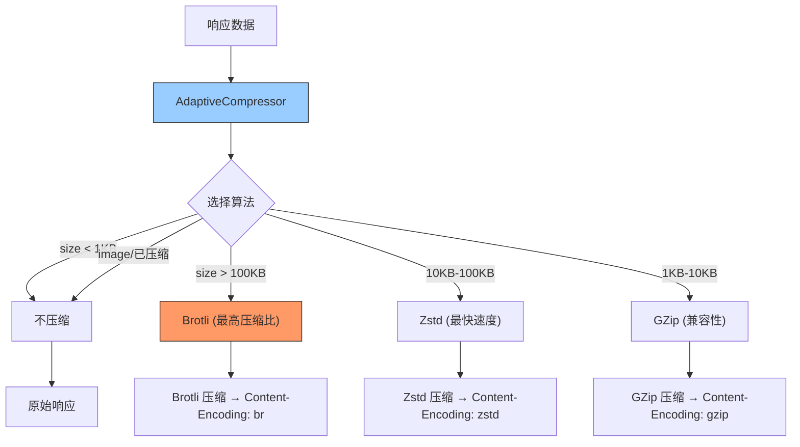

---

doc_type: module
prd_task_id: "YA-09-78"
title: "YA-09-78: 自适应压缩传输 — Zstd/Brotli 智能选择 — 开发方案"
status: 需求已编写
priority: P2
owner: 陈铭
roles: [engineer]
created: 2026-09-11
updated: 2026-09-23
project: YiAi
project_id: yiai
prd_month: "202609"
estimate_frontend: 0.5
source_prd: "97-需求-自适应压缩传输.md"
source_okr: [yiai-001]

type: task
---

# YA-09-78: 自适应压缩传输 — Zstd/Brotli 智能选择 — 开发方案

> **文档职责**：本文档定义**怎么做、为什么这么做、实际做成什么样**（HOW），不含产品目标与测试用例。

> 来源 PRD：[97-需求-自适应压缩传输.md](../../prds/2026-09/97-需求-自适应压缩传输.md)
> 需求编号：YA-09-78 · 优先级：P2 · 人天：0.5d · 状态：需求已编写

---

<a id="sec-1"></a>
## 一、架构总览

当前响应压缩统一使用 GZip（YA-09-73），对不同大小和类型的响应无差异化处理。引入自适应压缩选择：根据 Accept-Encoding、响应体大小和 Content-Type 自动选择最优算法——大 JSON 响应用 Brotli（高压缩比）、中等响应用 Zstd（速度快）、小响应不压缩（开销 > 收益）。



**算法选择策略**：

| 条件 | 算法 | 原因 |
|------|------|------|
| size < 1KB | 不压缩 | 压缩开销 > 网络节省 |
| 1KB-10KB | GZip | 兼容性好，压缩比可接受 |
| 10KB-100KB | Zstd | 速度快（3-5x faster），压缩比 3-5x |
| > 100KB | Brotli | 压缩比最高（5-8x），适合大 JSON |
| image/audio/video | 不压缩 | 已压缩格式，再压缩无收益 |

---

<a id="sec-2"></a>
## 二、文件清单

| 文件 | 操作 | 说明 |
|------|------|------|
| `YiAi/src/server/adaptive_compressor.py` | 新增 | AdaptiveCompressor 中间件 |
| `YiAi/src/server/main.py` | 修改 | 注册压缩中间件 |
| `YiAi/requirements.txt` | 修改 | 添加 `zstandard`, `brotli` |
| `YiAi/tests/test_adaptive_compressor.py` | 新增 | 压缩选择测试 |

---

<a id="sec-3"></a>
## 三、模块设计

### 3.1 AdaptiveCompressor

```python
# YiAi/src/server/adaptive_compressor.py
import zstandard as zstd
import brotli
import gzip
from fastapi import Request

class AdaptiveCompressor:
    """自适应压缩中间件——根据响应大小和类型自动选择最优算法。

    选择逻辑:
        1. 排除已压缩格式 (image/video/audio/zip)
        2. 检查客户端 Accept-Encoding
        3. 按大小选择: < 1KB = 不压缩, 1-10KB = gzip, 10-100KB = zstd, > 100KB = brotli
    """

    # 不压缩的 Content-Type 前缀
    SKIP_COMPRESS_TYPES = {'image/', 'video/', 'audio/', 'application/zip',
                            'application/gzip', 'application/x-compress'}

    # 体积阈值
    SKIP_THRESHOLD = 1024      # < 1KB 不压缩
    GZIP_THRESHOLD = 10_240    # < 10KB 用 gzip
    ZSTD_THRESHOLD = 102_400   # < 100KB 用 zstd
    # >= 100KB 用 brotli

    def choose(self, content_type: str, size: int,
               accept_encoding: str) -> str | None:
        """选择最优压缩算法。返回 None 表示不压缩。"""
        # 1. < 1KB 不压缩
        if size < self.SKIP_THRESHOLD:
            return None

        # 2. 已压缩格式不压缩
        if any(content_type.startswith(t) for t in self.SKIP_COMPRESS_TYPES):
            return None

        # 3. 大响应 (> 100KB) → Brotli (最佳压缩比)
        if 'br' in accept_encoding and size > self.ZSTD_THRESHOLD:
            return 'br'

        # 4. 中等响应 → Zstd (最佳速度)
        if 'zstd' in accept_encoding and size > self.GZIP_THRESHOLD:
            return 'zstd'

        # 5. 小响应 → GZip (最佳兼容性)
        if 'gzip' in accept_encoding:
            return 'gzip'

        return None

    def compress(self, data: bytes, algorithm: str) -> bytes:
        """执行压缩。"""
        if algorithm == 'br':
            return brotli.compress(data, quality=6)
        elif algorithm == 'zstd':
            cctx = zstd.ZstdCompressor(level=3)
            return cctx.compress(data)
        elif algorithm == 'gzip':
            return gzip.compress(data, compresslevel=6)
        return data

    def decompress(self, data: bytes, algorithm: str) -> bytes:
        """解压缩（调试/测试用）。"""
        if algorithm == 'br':
            return brotli.decompress(data)
        elif algorithm == 'zstd':
            return zstd.ZstdDecompressor().decompress(data)
        elif algorithm == 'gzip':
            return gzip.decompress(data)
        return data
```

### 3.2 算法性能对比

| 算法 | 压缩比 | 速度 | 适用场景 | Python 库 |
|------|--------|------|---------|----------|
| Brotli | 高 (5-8x) | 慢 | 大 JSON 列表 (> 100KB) | `brotli` |
| Zstd | 中 (3-5x) | 极快 | 中等响应 (10-100KB) | `zstandard` |
| GZip | 低 (2-4x) | 快 | 小响应 + 兼容性 | `gzip` 内置 |

---

<a id="sec-4"></a>
## 四、数据流

```
响应: Content-Type: application/json, size: 150KB

  → AdaptiveCompressor.choose('application/json', 153600, 'br, gzip, zstd')
    → size > 1024: 不跳过
    → type != image/...: 不跳过  
    → 'br' in accept-encoding: 是
    → size > 102400: 是 → 返回 'br'
  → compress(data, 'br')
    → brotli.compress(data, quality=6)
    → Content-Encoding: br
    → 150KB → ~20KB (压缩比 ~7.5x)
```

---

<a id="sec-5"></a>
## 五、实施路线

| # | 步骤 | 产出 | 验证 | 人天 |
|---|------|------|------|------|
| 1 | 安装 zstandard + brotli 依赖 | `requirements.txt` | pip install 成功 | 0.05 |
| 2 | 创建 AdaptiveCompressor | `adaptive_compressor.py` | 算法选择逻辑正确 | 0.15 |
| 3 | 集成到 FastAPI 压缩中间件 | `main.py` | 三种算法按策略自动选择 | 0.1 |
| 4 | 客户端 Accept-Encoding 测试 | 测试 | 各算法正确触发 | 0.1 |
| 5 | 测试用例 | `tests/test_adaptive_compressor.py` | 大小阈值/类型排除/算法选择/压缩解压 | 0.1 |

**合计：0.5d**

---

<a id="sec-6"></a>
## 六、代码审查检查清单

- [ ] < 1KB 响应不压缩（开销 > 收益）
- [ ] 已压缩格式（image/video/zip）不二次压缩
- [ ] Accept-Encoding 头正确解析（逗号分隔多算法）
- [ ] 客户端不支持任何算法时不压缩
- [ ] Content-Encoding 响应头与算法匹配（br/zstd/gzip）
- [ ] 压缩/解压 roundtrip 验证（compress → decompress = original）

---

<a id="sec-7"></a>
## 七、风险评估

| 风险 | 概率 | 影响 | 缓解措施 |
|------|------|------|----------|
| Brotli 压缩慢（影响响应延迟） | 中 | 中 | 仅 > 100KB 大响应用 Brotli |
| zstandard 库 C 扩展编译失败 | 低 | 中 | fallback 到纯 Python zstd 实现 |
| 客户端不支持 Brotli/Zstd | 中 | 低 | Accept-Encoding 协商，不支持时降级 GZip |

**回滚**：移除 AdaptiveCompressor，回退到固定 GZip 压缩。