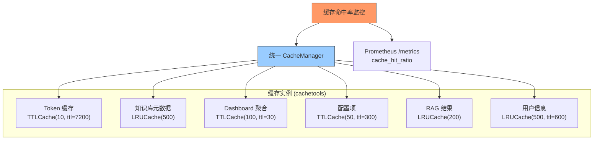

---

doc_type: module
prd_task_id: "YA-09-32"
title: "YA-09-32: 统一内存对象缓存 — LRU/LFU + TTL 过期 — 开发方案"
status: 需求已编写
priority: P2
owner: 陈铭
roles: [engineer]
created: 2026-09-11
updated: 2026-09-23
project: YiAi
project_id: yiai
prd_month: "202609"
estimate_frontend: 1.0
source_prd: "98-需求-内存对象缓存统一.md"
source_okr: [yiai-003]

type: task
---

# YA-09-32: 统一内存对象缓存 — LRU/LFU + TTL 过期 — 开发方案

> **文档职责**：本文档定义**怎么做、为什么这么做、实际做成什么样**（HOW），不含产品目标与测试用例。

> 来源 PRD：[98-需求-内存对象缓存统一.md](../../prds/2026-09/98-需求-内存对象缓存统一.md)
> 需求编号：YA-09-32 · 优先级：P2 · 人天：1.0d · 状态：需求已编写

---

<a id="sec-1"></a>
## 一、架构总览

YiAi 各模块散落着手动 `dict` 缓存（`_cached_token`、`_recorder`、`_guard`、`_model_list` 等），各自实现不同的过期策略和容量控制，代码重复且缺乏统一管理。引入 `cachetools` 库统一所有内存缓存，提供 LRU/LFU/TTL 标准策略 + 缓存命中率监控。



---

<a id="sec-2"></a>
## 二、文件清单

| 文件 | 操作 | 说明 |
|------|------|------|
| `YiAi/src/shared/cache_manager.py` | 新增 | CacheManager + 统一缓存注册 |
| `YiAi/src/services/*/` | 修改 | 散落 dict 替换为 CacheManager |
| `YiAi/requirements.txt` | 修改 | 添加 `cachetools` |
| `YiAi/tests/test_cache_manager.py` | 新增 | 缓存管理测试 |

---

<a id="sec-3"></a>
## 三、模块设计

### 3.1 CacheManager

```python
# YiAi/src/shared/cache_manager.py
from cachetools import TTLCache, LRUCache, cached
from typing import Any, Optional

class CacheManager:
    """统一内存对象缓存管理器——替换各模块散落的 dict 缓存。

    使用 cachetools 提供标准化策略:
        - TTLCache: 基于时间的过期淘汰
        - LRUCache: 基于访问频率的淘汰
        - LFUCache: 基于使用频率的淘汰

    缓存实例:
        token_cache: TTLCache(10, ttl=7200)   → 企微 Access Token
        metadata_cache: LRUCache(500)          → 知识库文件列表
        dashboard_cache: TTLCache(100, ttl=30) → Dashboard 聚合
        config_cache: TTLCache(50, ttl=300)    → 配置项
        rag_cache: LRUCache(200)                → RAG 检索结果
        user_cache: LRUCache(500, ttl=600)      → 用户信息
    """

    def __init__(self):
        self._caches: dict[str, Any] = {}
        self._register_defaults()

    def _register_defaults(self):
        self._caches['token'] = TTLCache(maxsize=10, ttl=7200)
        self._caches['knowledge_metadata'] = LRUCache(maxsize=500)
        self._caches['dashboard'] = TTLCache(maxsize=100, ttl=30)
        self._caches['config'] = TTLCache(maxsize=50, ttl=300)
        self._caches['rag'] = LRUCache(maxsize=200)
        self._caches['user'] = LRUCache(maxsize=500)

    def get(self, name: str) -> Any:
        """获取缓存实例。不存在的缓存名返回 None。"""
        return self._caches.get(name)

    def register(self, name: str, cache: Any):
        """注册自定义缓存。"""
        self._caches[name] = cache

    def invalidate(self, name: str):
        """清除指定缓存。"""
        cache = self._caches.get(name)
        if cache:
            cache.clear()

    def invalidate_all(self):
        """清除所有缓存（配置变更或部署后调用）。"""
        for cache in self._caches.values():
            cache.clear()

    def get_stats(self) -> dict:
        """获取所有缓存的统计信息——用于监控。"""
        return {
            name: {
                'size': len(cache),
                'maxsize': getattr(cache, 'maxsize', 0),
                'hit_rate': getattr(cache, 'currsize', 0) / max(len(cache), 1),
            }
            for name, cache in self._caches.items()
        }

# 全局单例
cache_manager = CacheManager()
```

### 3.2 缓存使用对比

```python
# Before: 手动 dict
_cached_token = {}
async def get_access_token():
    if _cached_token.get('token') and time.time() < _cached_token.get('expires'):
        return _cached_token['token']
    token = await fetch_token()
    _cached_token['token'] = token
    _cached_token['expires'] = time.time() + 7200
    return token

# After: cachetools + CacheManager
from shared.cache_manager import cache_manager

@cached(cache=cache_manager.get('token'))
async def get_access_token() -> str:
    return await fetch_token()
```

### 3.3 缓存策略表

| 场景 | 策略 | maxsize | TTL | 原因 |
|------|------|---------|-----|------|
| 企微 Access Token | TTL | 10 | 7200s | 微信固定 2h 过期 |
| 知识库文件列表 | LRU | 500 | -- | 访问频率差异大 |
| Dashboard 聚合 | TTL | 100 | 30s | 数据定期刷新 |
| 配置项 | TTL | 50 | 300s | 配置变更低频 |
| RAG 检索结果 | LRU | 200 | -- | 热门查询命中率高 |
| 用户信息 | LRU | 500 | 600s | 用户信息变更低频 |

---

<a id="sec-4"></a>
## 四、数据流

```
请求: get_access_token()
  → @cached(cache=cache_manager.get('token'))
    → TTLCache 已存在 ('token', value, expires)
    → expires 有效 → 返回缓存值 (0 延迟)

请求: query_documents('bugs', filter)
  → 未命中 → 调用原函数 → 返回结果
    → TTLCache 自动存储 ('key', result, now + 7200)

缓存淘汰:
  → TTLCache: 超过 TTL 自动删除
  → LRUCache: 超过 maxsize 删除最久未使用项
```

---

<a id="sec-5"></a>
## 五、实施路线

| # | 步骤 | 产出 | 验证 | 人天 |
|---|------|------|------|------|
| 1 | 添加 cachetools 依赖 | `requirements.txt` | pip install 成功 | 0.02 |
| 2 | 创建 CacheManager | `cache_manager.py` | 6 个默认缓存实例创建 | 0.2 |
| 3 | 替换散落 dict 缓存 | 各 service 文件 | 所有手动 dict 改为 CacheManager | 0.35 |
| 4 | 添加缓存命中率 Prometheus 指标 | `cache_manager.py` | /metrics 含 cache_hit_ratio | 0.15 |
| 5 | Dashboard 缓存面板 | 监控 | YiVad 可查看各缓存命中率 | 0.15 |
| 6 | 测试用例 | `tests/test_cache_manager.py` | LRU/TTL/命中率/invalidate | 0.13 |

**合计：1.0d**

---

<a id="sec-6"></a>
## 六、代码审查检查清单

- [ ] 所有散落 dict 缓存替换为 CacheManager 标准实例
- [ ] TTL 策略用于需要时间过期场景（Token、Dashboard）
- [ ] LRU 策略用于访问频率差异大场景（知识库、RAG）
- [ ] 每个缓存实例的 maxsize 合理（避免 OOM）
- [ ] `invalidate_all` 在配置变更后调用
- [ ] Prometheus 指标: cache_size, cache_maxsize 按实例

---

<a id="sec-7"></a>
## 七、风险评估

| 风险 | 概率 | 影响 | 缓解措施 |
|------|------|------|----------|
| TTL 设置不合理导致脏数据 | 中 | 中 | 文档化各场景推荐 TTL |
| LRU maxsize 太小导致频繁回源 | 低 | 中 | 监控命中率，低时调大 maxsize |

**回滚**：恢复各模块的 dict 缓存。CacheManager 本身不存储数据，切换无损。