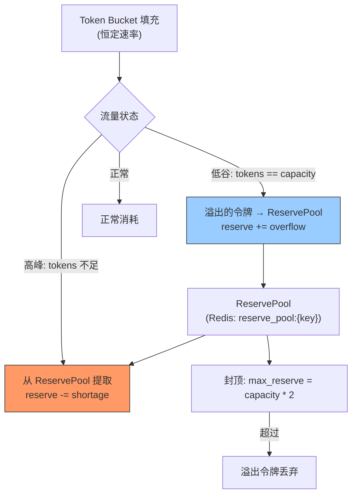

---

doc_type: module
prd_task_id: "YA-09-95"
title: "YA-09-95: 限流令牌回收 — 未使用请求的令牌回池与动态再分配 — 开发方案"
status: 需求已编写
priority: P2
owner: 陈铭
roles: [engineer]
created: 2026-09-11
updated: 2026-09-23
project: YiAi
project_id: yiai
prd_month: "202609"
estimate_frontend: 0.5
source_prd: "99-需求-限流令牌回收.md"
source_okr: [yiai-001]

type: task
---

# YA-09-95: 限流令牌回收 — 未使用请求的令牌回池与动态再分配 — 开发方案

> **文档职责**：本文档定义**怎么做、为什么这么做、实际做成什么样**（HOW），不含产品目标与测试用例。

> 来源 PRD：[99-需求-限流令牌回收.md](../../prds/2026-09/99-需求-限流令牌回收.md)
> 需求编号：YA-09-95 · 优先级：P2 · 人天：0.5d · 状态：需求已编写

---

<a id="sec-1"></a>
## 一、架构总览

Token Bucket 令牌桶在当前实现中，令牌以恒定速率填充，但当流量低谷期，未使用的令牌被浪费，高峰期又面临令牌不足。引入令牌回收机制：低谷期收集未使用的令牌存入 Reserve Pool，高峰期从 Reserve Pool 再分配给急需的项目/用户，提高令牌整体利用率。



**回收规则**：流量低谷期桶满时，溢出的令牌进入 Reserve Pool（封顶 2x capacity）；高峰期桶空时，Reserve Pool 按需补充（优先分配给高优先级项目）。

---

<a id="sec-2"></a>
## 二、文件清单

| 文件 | 操作 | 说明 |
|------|------|------|
| `YiAi/src/server/token_reclaimer.py` | 新增 | TokenReclaimer + ReservePool |
| `YiAi/src/server/rate_limiter.py` | 修改 | 集成 TokenReclaimer |
| `YiAi/tests/test_token_reclaimer.py` | 新增 | 令牌回收测试 |

---

<a id="sec-3"></a>
## 三、模块设计

### 3.1 TokenReclaimer

```python
# YiAi/src/server/token_reclaimer.py
import redis.asyncio as aioredis

class ReservePool:
    """令牌 Reserve Pool——Redis 存储，跨进程共享。

    Key: reserve_pool:{bucket_key}
    Value: reserved_tokens (float)
    Cap: capacity * 2
    """

    def __init__(self, redis_client, max_reserve_factor: float = 2.0): ...

    async def deposit(self, key: str, tokens: float) -> float:
        """存入令牌。返回实际存入数（封顶后可能小于 tokens）。"""
        ...

    async def withdraw(self, key: str, tokens: float) -> float:
        """提取令牌。返回实际提取数（池内不足时部分提取）。"""
        ...

    async def balance(self, key: str) -> float:
        """查询 Reserve Pool 余额。"""
        ...


class TokenReclaimer:
    """令牌回收器——低谷期收集未用令牌，高峰期回补。

    回收时机: 每次 consume() 后检查桶是否满 (tokens >= capacity)
    回补时机: 每次 consume() 前检查桶是否空 (tokens < 1)

    限制:
        - 单次回收最大 = rate * 60 (1 分钟产生的令牌)
        - Reserve Pool 封顶 = capacity * 2
    """

    def __init__(self, redis_client, max_reserve_factor: float = 2.0):
        self._pool = ReservePool(redis_client, max_reserve_factor)

    async def on_bucket_full(self, bucket_key: str, overflow: float):
        """桶满时回收溢出令牌到 Reserve Pool。"""
        if overflow <= 0:
            return
        # 限制单次回收量（防止突发峰值的令牌全被回收）
        recycle = min(overflow, bucket_capacity * 0.1)
        deposited = await self._pool.deposit(bucket_key, recycle)
        if deposited > 0:
            logger.debug(f'[TokenReclaimer] {bucket_key}: 回收 {deposited:.1f} tokens')

    async def on_bucket_empty(self, bucket_key: str, shortage: float) -> float:
        """桶空时从 Reserve Pool 提取令牌。

        Returns: 实际补充的令牌数
        """
        if shortage <= 0:
            return 0
        withdrawn = await self._pool.withdraw(bucket_key, shortage)
        if withdrawn > 0:
            logger.info(f'[TokenReclaimer] {bucket_key}: 补充 {withdrawn:.1f} tokens')
        return withdrawn

    async def get_stats(self, bucket_key: str) -> dict:
        """获取回收统计。"""
        return {
            'reserve_balance': await self._pool.balance(bucket_key),
        }
```

### 3.2 集成到 TokenBucket

```python
class ReclaimableTokenBucket(TokenBucket):
    """带令牌回收的 Token Bucket。"""

    def __init__(self, config, reclaimer: TokenReclaimer, key: str):
        super().__init__(config)
        self._reclaimer = reclaimer
        self._key = key

    def consume(self, tokens: int = 1) -> tuple[bool, float]:
        # 1. 桶空时尝试从 Reserve Pool 补充
        if self.tokens < tokens:
            refill = await self._reclaimer.on_bucket_empty(self._key, tokens - self.tokens)
            self.tokens += refill

        # 2. 正常消耗
        ok, wait = super().consume(tokens)

        # 3. 桶满时回收溢出令牌
        overflow = self.tokens - self.capacity
        if overflow > 0:
            self.tokens = self.capacity  # 截断到 capacity
            await self._reclaimer.on_bucket_full(self._key, overflow)

        return ok, wait
```

---

<a id="sec-4"></a>
## 四、数据流

```
正常流量 (桶有余额):
  → consume(1) → tokens > 0 → 正常消耗

低谷期 (桶满):
  → fill → tokens >= capacity → overflow = tokens - capacity
  → on_bucket_full(key, overflow)
    → deposit(key, min(overflow, capacity*0.1))
    → Redis INCRBY reserve_pool:{key} deposited
    → tokens -= overflow → tokens = capacity

高峰期 (桶空):
  → consume(1) → tokens < 1
  → on_bucket_empty(key, 1 - tokens)
    → withdraw(key, 1 - tokens)
    → Redis DECRBY reserve_pool:{key} withdrawn
    → tokens += withdrawn → consume(1) 成功
```

---

<a id="sec-5"></a>
## 五、实施路线

| # | 步骤 | 产出 | 验证 | 人天 |
|---|------|------|------|------|
| 1 | 创建 ReservePool (Redis) | `token_reclaimer.py` | deposit/withdraw 原子操作 | 0.15 |
| 2 | 创建 TokenReclaimer | `token_reclaimer.py` | 回收和补充逻辑正确 | 0.15 |
| 3 | 集成到 TokenBucket | `rate_limiter.py` | 低谷期回收/高峰期补充 | 0.1 |
| 4 | 测试用例 | `tests/test_token_reclaimer.py` | 回收/补充/封顶/池耗尽 | 0.1 |

**合计：0.5d**

---

<a id="sec-6"></a>
## 六、代码审查检查清单

- [ ] Reserve Pool 使用 Redis INCRBY/DECRBY（原子操作）
- [ ] 单次回收量封顶为 capacity * 0.1（防突发）
- [ ] Reserve Pool 总封顶为 capacity * 2
- [ ] 样本不足时返回 0（不影响正常限流）
- [ ] 回收和补充日志 DEBUG 级别（非 ERROR）

---

<a id="sec-7"></a>
## 七、风险评估

| 风险 | 概率 | 影响 | 缓解措施 |
|------|------|------|----------|
| Reserve Pool 被单一 bucket 耗尽 | 中 | 中 | 每个 bucket 独立 Reserve Pool |
| Redis 不可用时回收失败 | 低 | 低 | 回收失败不影响正常限流 |

**回滚**：禁用 TokenReclaimer，回退到标准 TokenBucket。