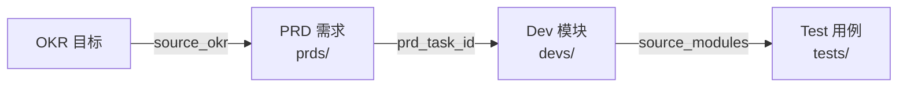

# YiAi 开发模块索引

> **文档职责**：本文档定义**怎么做、为什么这么做、实际做成什么样**（HOW），不含产品目标与测试用例。

> 开发方案文档——描述 HOW（实现方案、架构设计、技术决策），从 PRD 中拆出。
> 完整追溯链：**OKR → PRD → Dev Module → Test**

<a id="sec-1"></a>
## 一、全链路追溯



<a id="sec-2"></a>
## 二、月度分布

| 月份 | PRD 数 | Dev 模块数 | Test 规格数 |
|------|--------|-----------|------------|
| 2026-07 | 8 | [8](../devs/2026-07/) | [8](../tests/2026-07/) |
| 2026-08 | 16 | [16](../devs/2026-08/) | [16](../tests/2026-08/) |
| 2026-09 | 233 | [233](../devs/2026-09/) | [233](../tests/2026-09/) |

<a id="sec-3"></a>
## 三、Dev 文档结构

每个开发方案文件遵循标准结构（参考 [Dev 模板](../模板/00-模板-开发方案.md)）：

```
1. 方案概述 — 架构定位 (Mermaid)、职责边界
2. 文件清单 — 新增/修改文件及职责
3. 模块设计 — 子模块设计、关键代码
4. 接口与数据契约 — API 端点、数据模型
5. 关键流程 — 时序图、判定流程图
6. 实施步骤 — 分步实施、验证检查点
7. 边缘场景 — 异常输入、边界条件
8. 已知缺陷 — 当前实现的真实状态
9. 风险与回滚 — 风险矩阵
10. 完成定义 (DoD) — 可验证的完成标准
```

<a id="sec-4"></a>
## 四、文件命名约定

```
devs/{month}/NN-prd-task-{描述}.md    → 开发模块文档
prds/{month}/NN-{type}-{描述}.md      → 来源 PRD
tests/{month}/NN-prd-test-{描述}.md   → 对应测试规格
```

<a id="sec-5"></a>
## 五、Frontmatter 规范

```yaml
doc_type: module
prd_task_id: "YA-{月}-{序号}"
source_prd: "{PRD文件名}"
source_okr: [{OKR ID}]
```

<a id="sec-6"></a>
## 六、追溯规则

| 从 | 到 | 字段 | 说明 |
|----|----|------|------|
| OKR | PRD | `source_okr` | OKR 驱动 PRD |
| PRD | Dev | `prd_task_id` | PRD 拆分为开发模块 |
| Dev | Test | `source_modules` | 开发模块被测试覆盖 |

**约束：**
- 每个 Dev Module **必须**通过 `prd_task_id` 关联到一个 PRD
- Dev Module 完成后**必须**有对应的 Test 覆盖

<a id="sec-7"></a>
## 七、状态说明

| 状态 | 含义 |
|------|------|
| 需求已编写 | PRD 已评审，方案待编写 |
| 待开始 | 方案已定稿，等待排期 |
| 进行中 | 正在开发 |
| 已完成 | 代码合入、验证通过 |

<a id="sec-8"></a>
## 八、YiAi 特定约束

| 约束 | 说明 |
|------|------|
| 分层架构 | server → services → domain → data → shared |
| 异步优先 | 全局 async/await，Motor 异步驱动 |
| 错误处理 | ErrorCode 枚举 + BusinessException |
| 响应信封 | StandardResponse `{code, message, data}` |
| 参数契约 | `filter`/`target_file`/`cname` |
| 配置管理 | config.yaml + pydantic-settings |