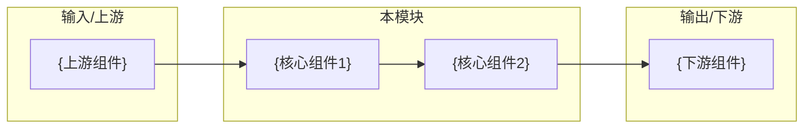
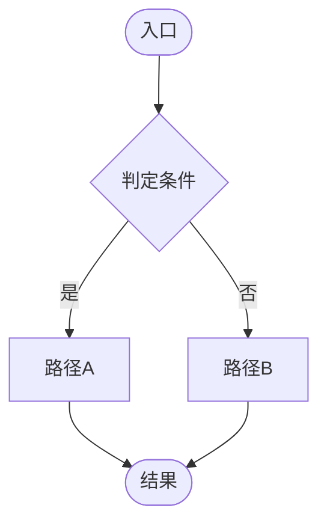
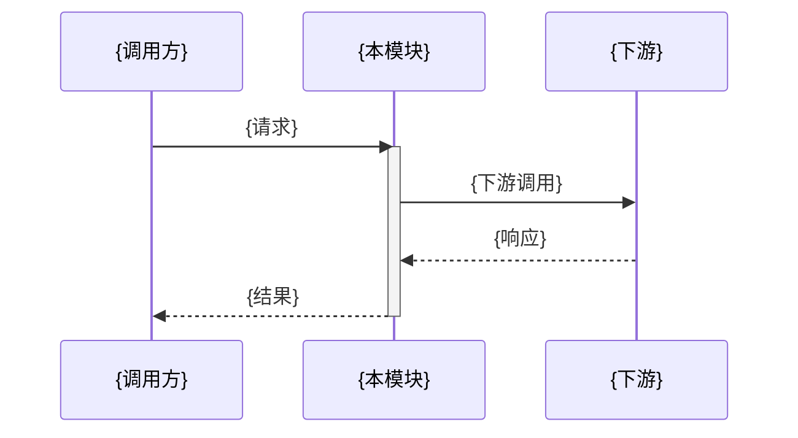
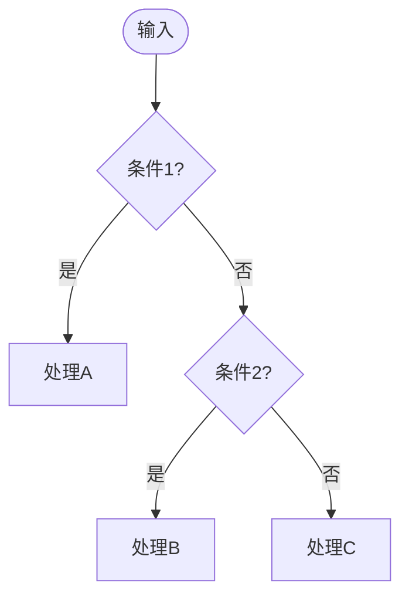

# {YP-XX-NN}: {模块名} — {一句话描述} — 开发方案

> 来源 PRD：[{PRD文件名}](../../prds/{YYYY-MM}/{PRD文件名})
> 需求编号：{YP-XX-NN} · 优先级：{P0|P1|P2|P3} · 人天：{N.N}d 估算
> 本文档定义**实现方案**——怎么做、改动哪些文件、如何验证。需求定义见 PRD，验证方式见[测试用例](../../tests/{YYYY-MM}/{序号}-prd-test-{描述}.md)。

---

## 一、方案概述

### 1.1 架构定位

{一句话说明模块在整体架构中的位置和作用}



### 1.2 职责边界

| 层/组件 | 职责 | 明确不做 |
|---------|------|---------|
| {组件1} | {职责描述} | {边界说明} |
| {组件2} | {职责描述} | {边界说明} |

---

## 二、文件清单

| 文件 | 类型 | 职责 |
|------|------|------|
| `{path/to/file1}` | 新增 | {职责} |
| `{path/to/file2}` | 修改 | {职责} |
| `{path/to/file3}` | 新增 | {职责} |

---

## 三、模块设计

### 3.1 {子模块名}

{核心设计说明}

```{语言}
// 关键代码片段或接口定义
```

**设计要点**：

| 要点 | 说明 |
|------|------|
| {要点1} | {说明} |
| {要点2} | {说明} |

### 3.2 {子模块名}

{核心设计说明 + 关键实现细节}



---

## 四、接口与数据契约

### 4.1 {接口/端点}

| 端点/方法 | 参数 | 返回 | 说明 |
|----------|------|------|------|
| `{method}` | `{params}` | `{return_type}` | {说明} |

### 4.2 数据结构

```typescript
interface {TypeName} {
  field: type;  // 说明
}
```

---

## 五、关键流程

### 5.1 {流程名}



### 5.2 {判定流程}



---

## 六、实施步骤与验证

| 步骤 | 内容 | 涉及文件 | 验证方式 | 人天 |
|------|------|---------|---------|------|
| 1 | {步骤描述} | {文件} | {验证方式} | 0.5 |
| 2 | {步骤描述} | {文件} | {验证方式} | 0.5 |

**合计：{N.N}d**。

### 验证检查点

| 步骤 | 验证项 | 通过标准 |
|------|--------|---------|
| 1 | {验证项} | {通过标准} |
| 2 | {验证项} | {通过标准} |

---

## 七、边缘场景处理

| 场景 | 触发条件 | 处理策略 | 实现位置 |
|------|---------|---------|---------|
| {场景1} | {条件} | {策略} | `{文件}:{行}` |
| {场景2} | {条件} | {策略} | `{文件}:{行}` |

---

## 八、已知缺陷与改进项

> 以下记录**当前实现的真实状态**，需求侧对应风险见 PRD §8。

### 缺陷 1（{P0/P1/P2/P3}）：{缺陷标题}

**现象**：{具体表现}

**根因**：{技术根因}

**影响**：{用户/系统影响}

**改进方向**：{建议方案}

---

## 九、风险与回滚

### 风险

| 风险 | 概率 | 影响 | 缓解措施 |
|------|------|------|---------|
| {风险1} | 高/中/低 | 高/中/低 | {措施} |

### 回滚

| 场景 | 回滚方式 | 影响范围 |
|------|---------|---------|
| {场景1} | {操作} | {范围} |

---

## 十、完成定义（DoD）

- [ ] {文件数量} 个文件按 §2 清单落地，无遗漏、无多余
- [ ] {核心功能1} 行为正确
- [ ] {核心功能2} 行为正确
- [ ] 类型检查 / lint 通过
- [ ] 单元测试覆盖核心判定逻辑（见测试用例）
- [ ] §8 已知缺陷已登记至缺陷追踪