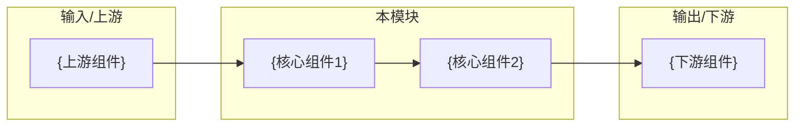
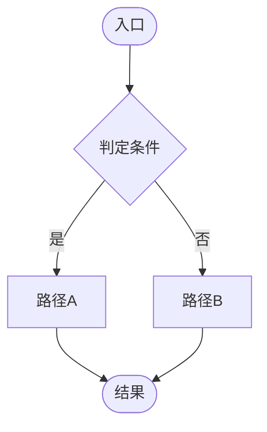
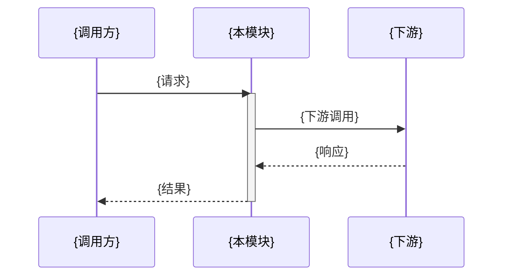
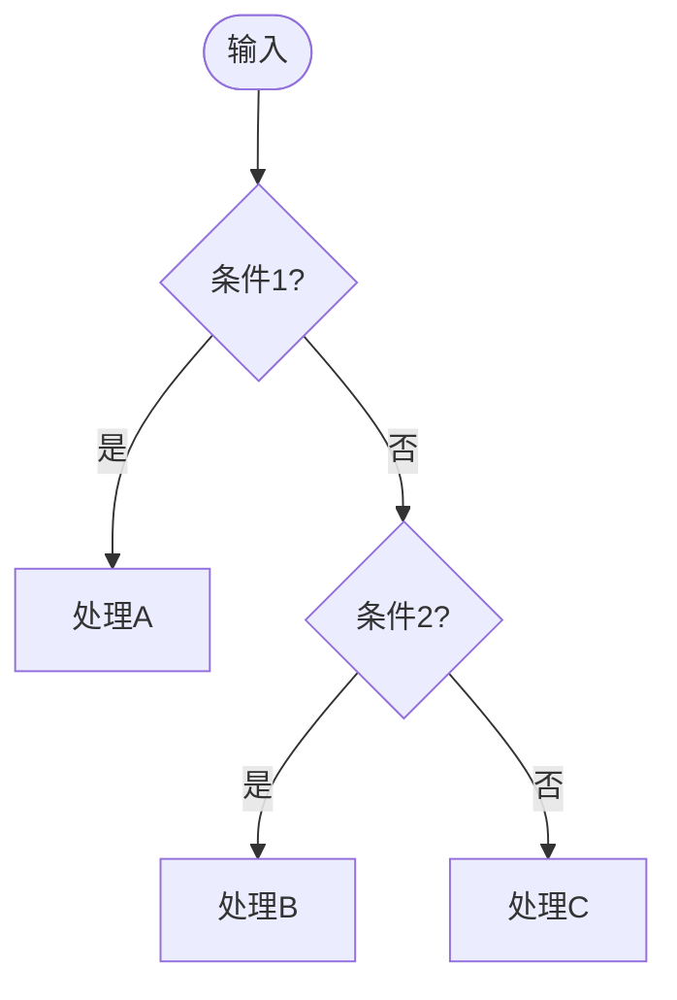

---

doc_type: module
prd_task_id: "{YP-XX-NN}"
title: "{序号}: {模块名} — {一句话描述} — 开发方案"
status: {待开始|进行中|已完成}
priority: {P0|P1|P2|P3}
owner: {负责人}
roles: [engineer]
created: "{YYYY-MM-DD}"
updated: "{YYYY-MM-DD}"
project: {项目名}
project_id: {项目ID}
prd_month: "{YYYYMM}"
estimate_frontend: {N.N}
source_prd: "{PRD文件名}"
source_okr: [{目标ID}]
acceptance_criteria:
  - {可验证的验收标准 1}
  - {可验证的验收标准 2}
  - {可验证的验收标准 3}

type: task
---

# {YP-XX-NN}: {模块名} — {一句话描述} — 开发方案

| 属性 | 值 |
|------|-----|
| 文档编号 | {YP-XX-NN} |
| 版本 | v1.0 |
| 密级 | 内部 |
| 作者 | {负责人} |
| 审核人 | — |
| 状态 | {待开始\|进行中\|已完成} |
| 最后更新 | {YYYY-MM-DD} |

> 来源 PRD：[{PRD文件名}](../../prds/{YYYY-MM}/{PRD文件名})
> 需求编号：{YP-XX-NN} · 优先级：{P0|P1|P2|P3} · 人天：{N.N}d 估算
> 本文档定义**实现方案**——怎么做、改动哪些文件、如何验证。需求定义见 PRD，验证方式见[测试用例](../../tests/{YYYY-MM}/{序号}-prd-test-{描述}.md)。

---

## 目录

1. [方案概述](#一方案概述)
2. [设计约束](#二设计约束)
3. [文件清单](#三文件清单)
4. [模块设计](#四模块设计)
5. [接口与数据契约](#五接口与数据契约)
6. [关键流程](#六关键流程)
7. [实施步骤与验证](#七实施步骤与验证)
8. [边缘场景处理](#八边缘场景处理)
9. [非功能性设计](#九非功能性设计)
10. [测试策略](#十测试策略)
11. [已知缺陷与改进项](#十一已知缺陷与改进项)
12. [风险与回滚](#十二风险与回滚)
13. [环境配置](#十三环境配置)
14. [完成定义](#十四完成定义)
附录 A. [变更记录](#附录-a-变更记录)

---

## 一、方案概述

### 1.1 架构定位

{一句话说明模块在整体架构中的位置和作用}


```mermaid
flowchart LR
  subgraph INPUT["输入/上游"]
    A["{上游组件}"]
  end
  subgraph CORE["本模块"]
    B["{核心组件1}"]
    C["{核心组件2}"]
  end
  subgraph OUTPUT["输出/下游"]
    D["{下游组件}"]
  end
  A --> B
  B --> C
  C --> D
```

### 1.2 职责边界

| 层/组件 | 职责 | 明确不做 |
|---------|------|---------|
| {组件1} | {职责描述} | {边界说明} |
| {组件2} | {职责描述} | {边界说明} |

---

## 二、设计约束

| 约束项 | 说明 |
|--------|------|
| {约束1} | {详细说明} |
| {约束2} | {详细说明} |
| {约束3} | {详细说明} |

---

## 三、文件清单

| 文件 | 类型 | 职责 | 预估行数 |
|------|------|------|----------|
| `{path/to/file1}` | 新增 | {职责} | ~{N} |
| `{path/to/file2}` | 修改 | {职责} | +{N} |

---

## 四、模块设计

### 4.1 {子模块名}

{核心设计说明}

```{语言}
// 关键代码片段或接口定义
```

**设计要点**：

| 要点 | 说明 |
|------|------|
| {要点1} | {说明} |
| {要点2} | {说明} |

### 4.2 {子模块名}

{核心设计说明 + 关键实现细节}


```mermaid
flowchart TD
  A(["入口"]) --> B{"判定条件"}
  B -- 是 --> C["路径A"]
  B -- 否 --> D["路径B"]
  C --> E(["结果"])
  D --> E
```

---

## 五、接口与数据契约

### 5.1 {接口/端点}

| 端点/方法 | 参数 | 返回 | 说明 |
|----------|------|------|------|
| `{method}` | `{params}` | `{return_type}` | {说明} |

### 5.2 数据结构

```typescript
interface {TypeName} {
  field: type;  // 说明
}
```

---

## 六、关键流程

### 6.1 {流程名}


```mermaid
sequenceDiagram
  participant A as {调用方}
  participant B as {本模块}
  participant C as {下游}

  A->>B: {请求}
  activate B
  B->>C: {下游调用}
  C-->>B: {响应}
  B-->>A: {结果}
  deactivate B
```

### 6.2 {判定流程}


```mermaid
flowchart TD
  A(["输入"]) --> B{"条件1?"}
  B -- 是 --> C["处理A"]
  B -- 否 --> D{"条件2?"}
  D -- 是 --> E["处理B"]
  D -- 否 --> F["处理C"]
```

---

## 七、实施步骤与验证

| 步骤 | 内容 | 涉及文件 | 验证方式 | 人天 |
|------|------|---------|---------|------|
| 1 | {步骤描述} | {文件} | {验证方式} | 0.5 |
| 2 | {步骤描述} | {文件} | {验证方式} | 0.5 |

**合计：{N.N}d**。

### 验证检查点

| 步骤 | 验证项 | 通过标准 |
|------|--------|---------|
| 1 | {验证项} | {通过标准} |
| 2 | {验证项} | {通过标准} |

---

## 八、边缘场景处理

| 场景 | 触发条件 | 处理策略 | 实现位置 |
|------|---------|---------|---------|
| {场景1} | {条件} | {策略} | `{文件}:{行}` |
| {场景2} | {条件} | {策略} | `{文件}:{行}` |

---

## 九、非功能性设计

### 9.1 性能指标

| 指标 | 目标值 | 测试条件 |
|------|--------|----------|
| {指标1} | ≤ {目标值} | {条件} |
| {指标2} | ≤ {目标值} | {条件} |

### 9.2 监控与告警

| 监控项 | 数据源 | 采集频率 | 告警规则 |
|--------|--------|----------|----------|
| {监控项1} | {来源} | {频率} | {规则} |
| {监控项2} | {来源} | {频率} | {规则} |

### 9.3 安全

| 层面 | 措施 |
|------|------|
| {层面1} | {措施} |
| {层面2} | {措施} |

---

## 十、测试策略

### 10.1 测试分层

| 层级 | 覆盖范围 | 工具 |
|------|----------|------|
| 单元测试 | {覆盖内容} | pytest |
| 集成测试 | {覆盖内容} | pytest + httpx |
| 接口测试 | {覆盖内容} | httpx / Postman |

### 10.2 关键测试用例

| 场景 | 验证点 |
|------|--------|
| {场景1} | {验证内容} |
| {场景2} | {验证内容} |
| {场景3} | {验证内容} |

---

## 十一、已知缺陷与改进项

> 以下记录**当前实现的真实状态**，需求侧对应风险见 PRD §8。

### 缺陷 1（{P0/P1/P2/P3}）：{缺陷标题}

**现象**：{具体表现}

**根因**：{技术根因}

**影响**：{用户/系统影响}

**改进方向**：{建议方案}

---

## 十二、风险与回滚

### 风险

| 风险 | 概率 | 影响 | 缓解措施 |
|------|------|------|---------|
| {风险1} | 高/中/低 | 高/中/低 | {措施} |

### 回滚

| 场景 | 回滚方式 | 影响范围 |
|------|---------|---------|
| {场景1} | {操作} | {范围} |

---

## 十三、环境配置

| 配置项 | 开发环境 | 生产环境 | 注入方式 |
|--------|----------|----------|----------|
| {配置项1} | {开发值} | {生产值} | 环境变量 / config.yaml |
| {配置项2} | {开发值} | {生产值} | 环境变量 / config.yaml |

---

## 十四、完成定义（DoD）

- [ ] {文件数量} 个文件按 §3 清单落地，无遗漏、无多余
- [ ] {核心功能1} 行为正确
- [ ] {核心功能2} 行为正确
- [ ] 类型检查 / lint 通过
- [ ] 单元测试覆盖核心判定逻辑（见 §10 测试用例）
- [ ] §9 非功能性指标达标
- [ ] §11 已知缺陷已登记至缺陷追踪

---

## 附录 A. 变更记录

| 日期 | 版本 | 变更内容 | 作者 |
|------|------|----------|------|
| {YYYY-MM-DD} | v1.0 | 初始版本 | {作者} |