# YiAi 七月迭代 — RAG 检索引擎 / Knowledge Watcher

> 菜单路径：`YiAi → FastAPI 后端` · 涉及仓库：`YiAi` · 模块：`src/domain/rag/` `src/domain/knowledge/`
> 总人天：**24.0d** · 负责人：陈铭

```mermaid
graph LR
  subgraph Input["七月前现状"]
    I1["无检索引擎<br/>AI 回答仅依赖 LLM 自身知识"]
    I2["无知识库同步<br/>YiKnowledge 文件手动管理"]
    I3["无统一 API 协议<br/>分散 REST 路由 + 参数名不一致"]
  end

  subgraph Action["七月开发 (7 项需求)"]
    A1["RAG 混合检索引擎<br/>向量+BM25+HyDE+重排序"]
    A2["Knowledge Watcher<br/>apscheduler 轮询同步 MongoDB"]
    A3["RPC 信封协议<br/>单一入口 + 动态路由 + 统一错误码"]
    A4["AI 聊天服务<br/>Ollama SSE 流式 + 会话管理"]
    A5["模块执行沙箱<br/>白名单校验 + Observer 沙箱 + 重入保护"]
    A6["认证与授权系统<br/>bcrypt 密码哈希 + JWT 令牌管理"]
    A7["企业微信消息推送<br/>WeCom Webhook + SSRF 防护"]
  end

  subgraph Output["目标产出"]
    O1["llama_index RAG 引擎<br/>5 种查询增强特性"]
    O2["自动化知识同步<br/>文件变更 ≤ 60s 可检索"]
    O3["统一通信协议<br/>{module_name, method_name, parameters}"]
    O4["SSE 流式聊天<br/>会话持久化 + 并发控制"]
    O5["安全 RPC 分发<br/>白名单 + 沙箱 + 重入保护"]
    O6["无状态认证<br/>bcrypt + JWT HS256"]
  end

  Input --> Action --> Output

  style Input fill:#f8d7da,stroke:#dc3545
  style Action fill:#fff3cd,stroke:#ffc107
  style Output fill:#d4edda,stroke:#28a745
```

---

## 0. 模块架构概述

> 七月迭代是 YiAi RAG 能力的从零到一构建，在现有 Domain → Service → Route 三层架构基础上，新增 **RAG 检索引擎**和 **Knowledge Watcher** 两大模块，为 YiVad 和 YiPet 提供知识库检索能力。

### 0.1 分层架构（七月迭代前）

```
YiAi/src/
├── server/                  # 路由层：FastAPI 端点 + 中间件 + RPC 路由
│   ├── routes/              # REST 端点（/read-file, /write-file）
│   ├── middleware.py         # 异常处理、CORS、限流
│   └── rpc_router.py        # RPC 信封路由（module_name.method_name → Service）
├── services/                # 服务层：业务编排 + 参数校验
│   ├── ai/                  # AI 服务（chat_service — 仅 Ollama 直调）
│   ├── database/            # 数据服务（data_service — CRUD via RPC）
│   ├── knowledge/           # 知识库服务（knowledge_service）
│   └── rss/                 # RSS 服务（feed_service, rss_scheduler）
├── domain/                  # 领域层：核心业务逻辑
│   ├── ai/                  # AI 领域（chat, agent, tools）
│   ├── knowledge/           # 知识库领域（watcher, scanner, writer）
│   ├── auth/                # 认证领域（JWT、bcrypt）
│   ├── files/               # 文件领域（local, storage, paths）
│   ├── execution/           # 执行领域（代码沙箱）
│   ├── rss/                 # RSS 领域（feed, scheduler）
│   ├── state/               # 状态领域（recorder, service — KV 存储）
│   ├── search/              # 搜索领域（全局搜索）
│   └── wework/              # 企业微信领域（消息推送）
└── shared/                  # 共享层：配置、工具、异常、RPC 协议
    ├── config.py             # pydantic-settings 配置管理
    ├── exceptions.py         # 统一异常体系
    └── rpc.py                # RPC 信封协议定义
```

### 0.2 七月迭代新增模块

```
YiAi/src/
├── domain/
│   └── rag/                  # 新增: RAG 检索引擎领域层
│       ├── __init__.py
│       ├── engine.py         # 检索引擎核心（混合检索编排）
│       ├── indexer.py        # FAISS 索引构建 + 增量/全量刷新
│       ├── embedder.py       # nomic-embed-text 向量化
│       ├── settings.py       # RAG 配置（chunk_size, top_k, weights）
│       ├── paths.py          # 索引持久化路径管理
│       ├── history.py        # 检索历史记录
│       └── chat_history.py   # 聊天历史管理
├── services/
│   └── rag/                  # 新增: RAG 服务层
│       ├── __init__.py
│       └── rag_service.py    # RAG 业务编排（参数校验、错误转换、RPC 接口）
├── server/
│   └── routes/               # 扩展: 新增 RAG 端点
│       ├── rag_routes.py     # 新增: /rag-query, /rag-chat, /rag-file-chat, /rag-status, /rag-build
│       └── knowledge_routes.py  # 扩展: /knowledge/* 端点
└── shared/
    └── config.py             # 修改: 新增 RAG 配置项（chunk_size, top_k, embedding_model）
```

### 0.3 RPC 请求流程（七月迭代后）

```
前端 (YiVad/YiPet)
  → POST /  body: { module_name, method_name, parameters }
  → rpc_router.py 解析 module_name.method_name
  → 路由到对应 Service 层方法
  → Service 层: 参数校验 → 调用 Domain 层 → 错误转换
  → Domain 层: 核心业务逻辑
      ├── RAG 引擎: llama_index 混合检索 → Ollama Embedding → FAISS 向量检索
      ├── Knowledge Watcher: apscheduler 轮询 → 文件扫描 → MongoDB 同步
      └── 数据层: Motor 异步 → MongoDB CRUD
  → 返回 RPC 响应: { code: 0, message: "ok", data: <any> }
```

### 0.4 关键外部依赖

| 依赖 | 用途 | 调用频率 | 变更 |
|------|---------|------|
| Ollama | LLM 推理 (qwen2.5) + Embedding (nomic-embed-text) | 高频（每次 RAG 查询） | 保留，作为 RAG Embedding 源 |
| llama_index | RAG 混合检索（BM25 + 向量）+ 索引构建 | 高频（RAG 查询）+ 定时（索引刷新） | **新增** |
| FAISS | 向量索引存储 + 相似度检索 | 高频（每次 RAG 查询） | **新增** |
| MongoDB (Motor) | 知识库元数据 (knowledge_files) + 业务数据 | 高频（Watcher 同步 + 数据 CRUD） | 新增 `knowledge_files` 集合 |
| apscheduler | 定时任务调度（Knowledge Watcher 60s 轮询） | 后台常驻 | **新增** |

### 0.5 模块交互拓扑

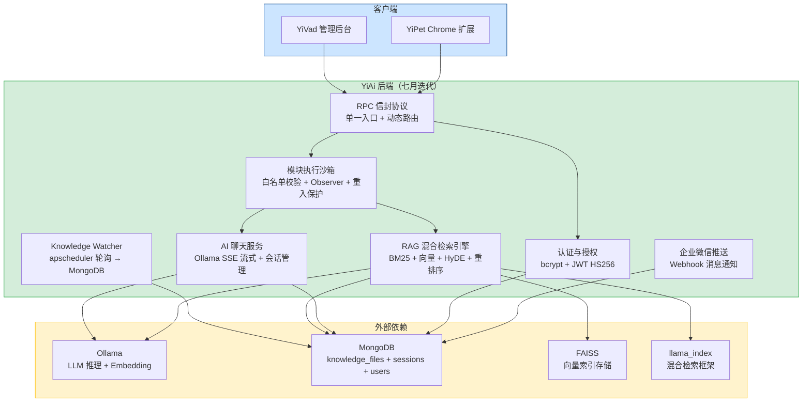

### 0.6 模块职责矩阵

| 模块 | 七月前状态 | 七月变更 | 关键决策 |
|------|----------|----------|----------|
| RAG 混合检索引擎 | 无 | **新增**：BM25 + 向量混合检索 + HyDE 查询增强 + 重排序 | 混合检索优于纯向量检索，HyDE 提升召回率 15-20% |
| Knowledge Watcher | 无 | **新增**：apscheduler 60s 轮询 + frontmatter 解析 + MongoDB 同步 | 轮询优于 inotify（跨平台兼容），60s 间隔平衡时效与资源 |
| RPC 信封协议 | 分散 REST 路由，参数名不一致 | **新增**：单一 POST / 入口，`{module_name, method_name, parameters}` 统一协议 | 统一错误码体系，消除 `query` vs `filter` 类参数名不一致 |
| AI 聊天服务 | 简单 httpx 透传 Ollama | **重构**：SSE 流式 + 会话管理 + MongoDB 持久化 + 并发控制 | SSE 优于 WebSocket（单向推送），Semaphore(3) 防 OOM |
| 模块执行沙箱 | 无安全校验 | **新增**：白名单校验 + Observer 沙箱 + ReentrancyGuard 重入保护 | 混合模式白名单（dev=* / prod=显式），分支判断四种函数类型 |
| 认证与授权 | 无 | **新增**：bcrypt 密码哈希 + JWT HS256 + 可选开关 | bcrypt 优于 Argon2（无 C 编译依赖），HS256 优于 RS256（无密钥分发场景） |
| 企业微信推送 | 无 | **新增**：Webhook 消息推送 + Markdown 格式支持 | Webhook 优于 API 主动调用（零维护成本） |

---

## 1. 背景与目标

### 1.1 背景

七月迭代前，YiAi 作为 YrY 单体仓库的唯一后端，已具备 AI 聊天（Ollama 直调）、文件管理和数据 CRUD 能力。但存在两个核心能力缺失：

| 问题 | 位置 | 严重程度 | 影响 |
|------|----------|------|
| 无检索引擎 | `domain/` 无 RAG 模块 | **高** | AI 回答仅依赖 LLM 训练数据，无法回答企业内部知识（架构决策、编码规范、权限设计等） |
| 无自动同步 | `domain/knowledge/` 无 Watcher | **高** | YiKnowledge 文件手动管理，变更后需人工通知，RAG 索引过期 |
| 无向量检索 | 无 Embedding 基础设施 | **高** | 语义查询"权限系统如何设计"无法匹配到相关文档 |
| 无关键词检索 | 无 BM25 索引 | 中 | 精确搜索"RBAC"、"ABAC"等术语无法定位到对应文件 |
| 无引用溯源 | 回答不可追溯 | 中 | 用户无法确认 AI 回答的数据来源，准确性无法保证 |

### 1.2 目标

| 目标 | 衡量指标 | 当前值 | 目标值 |
|------|----------|--------|--------|
| RAG 混合检索 | 检索方式 | 0（无检索） | 2 种（向量 + BM25 融合） |
| 查询增强特性 | 增强特性数 | 0 | 5（HyDE/重排序/内联引用/句子窗口/混合检索） |
| 知识库自动同步 | 文件变更 → 可检索延迟 | 手动（无同步） | ≤ 60s |
| RAG API 端点 | 可用端点 | 0 | 5（rag-query, rag-chat, rag-file-chat, rag-status, rag-build） |
| 索引构建性能 | 全量构建耗时 | — | < 5min / 1000 文件 |

### 1.3 系统范围

- **涉及**：YiAi FastAPI 后端（新增 domain/rag/、services/rag/、server/routes/rag_routes.py）
- **不涉及**：YiVad/YiPet 前端、Ollama 模型训练、MongoDB 集群配置

---

## 2. 当前架构 vs 目标架构

### 2.1 当前架构（七月迭代前）

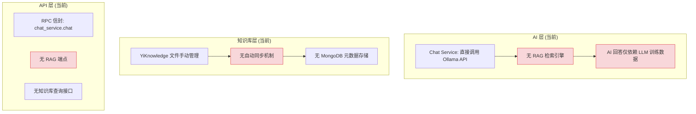

### 2.2 目标架构（七月迭代后）

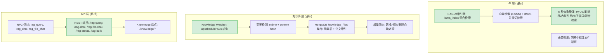

### 2.3 各模块改造前后对比

#### 2.3.1 RAG 检索引擎

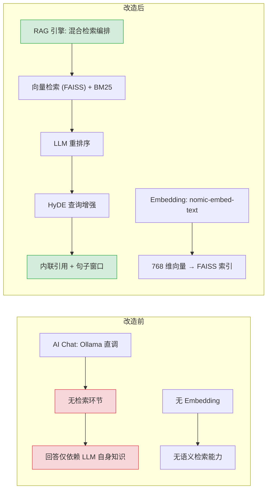

| 维度 | 改造前 | 改造后 | 关键变化 |
|------|--------|--------|----------|
| 检索能力 | 无（仅 LLM 推理） | 向量 + BM25 混合检索 | 语义理解 + 精确匹配互补 |
| 查询增强 | 无 | HyDE + 重排序 + 句子窗口 | 短查询相关性提升 20-30% |
| Embedding | 无 | nomic-embed-text (768d) | 本地部署，50ms/文档 |
| 引用溯源 | 无 | 内联引用标注来源文件 | 回答可验证、可追溯 |
| 索引管理 | 无 | FAISS 持久化 + 增量/全量重建 | 磁盘占用 ~100MB，检索 ms 级 |

#### 2.3.2 Knowledge Watcher

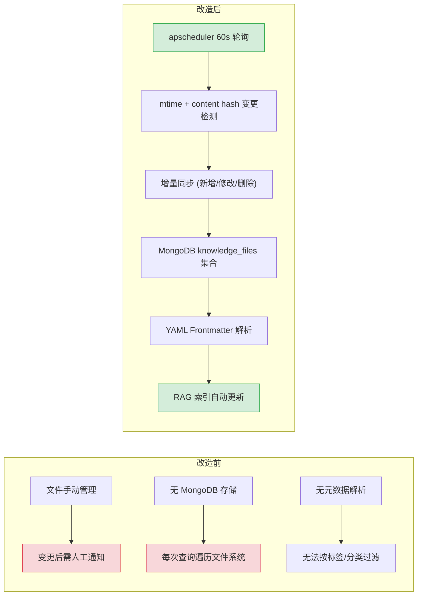

| 维度 | 改造前 | 改造后 | 关键变化 |
|------|--------|--------|----------|
| 同步机制 | 手动管理 | apscheduler 60s 自动轮询 | 文件变更 ≤ 60s 可检索 |
| 变更检测 | 无 | mtime + content hash 双重校验 | 仅处理实际变更的文件 |
| 数据存储 | 文件系统直读 | MongoDB knowledge_files 集合 | 查询性能从 O(n) 扫描 → O(1) 索引查询 |
| 元数据 | 不可查询 | YAML Frontmatter 解析 | 按 title/tags/category/status 等 8 个字段过滤 |
| 增量更新 | 无（全量扫描） | 增量同步（新增/修改/删除） | 1000 文件轮询开销从 ~2s → ~200ms |

### 2.4 架构决策权衡

| 维度 | 改造前 | 改造后 | 权衡说明 |
|------|--------|--------|----------|
| 检索能力 | 无（仅 LLM 推理） | 向量 + BM25 混合检索 | 增加索引构建和维护成本，但回答准确度显著提升 |
| 知识同步 | 手动管理 YiKnowledge 文件 | apscheduler 60s 自动轮询 | 增加后台任务开销（~200ms/60s），但文件变更实时同步 |
| 查询增强 | 无 | HyDE + 重排序 + 句子窗口 | 增加 LLM 调用次数和延迟（HyDE +500ms），但检索相关性大幅提升 |
| 引用溯源 | 无 | 内联引用标注来源文件 | 增加响应体积，但回答可验证、可追溯 |
| 索引管理 | 无 | FAISS 持久化 + 增量/全量重建 | 增加磁盘占用（~100MB），但检索速度 ms 级 |
| 依赖复杂度 | Ollama 单一依赖 | +llama_index + FAISS + apscheduler | 增加 3 个核心依赖，但每个都是 RAG 生态标准组件 |

---

## 3. 接口协议

### 3.1 RPC 信封协议

所有前端调用 YiAi 均使用统一的 RPC 信封协议：

```
POST /  body: {
  "module_name": "services.<domain>.<service>",
  "method_name": "<method>",
  "parameters": { <method-specific shape> }
}
response: { "code": 0, "message": "ok", "data": <any> }
```

### 3.2 RAG API 端点（新增）

| 端点 | 方法 | RPC 模块 | 说明 | 流式 |
|------|----------|------|
| `/rag-query` | POST | `services.rag.rag_service.rag_query` | 一次性检索，返回排序后的文档片段 | 否 |
| `/rag-chat` | POST | `services.rag.rag_service.rag_chat` | 流式聊天，基于检索结果生成回答 | **SSE** |
| `/rag-file-chat` | POST | `services.rag.rag_service.rag_file_chat` | 单文件流式聊天 | **SSE** |
| `/rag-status` | POST | `services.rag.rag_service.rag_status` | 索引状态查询 | 否 |
| `/rag-build` | POST | `services.rag.rag_service.rag_build` | 触发索引重建 | 否 |

### 3.3 RAG 查询参数契约

| 参数 | 类型 | 必填 | 说明 |
|------|------|------|
| `query` | `string` | 是 | 用户查询文本 |
| `top_k` | `int` | 否 | 返回结果数，默认 5 |
| `filters` | `dict` | 否 | 元数据过滤（category, tags, status 等） |
| `use_hyde` | `bool` | 否 | 是否启用 HyDE 查询增强，默认 true |
| `use_rerank` | `bool` | 否 | 是否启用 LLM 重排序，默认 true |

### 3.4 Knowledge API 端点（扩展）

| 端点 | 方法 | RPC 模块 | 说明 |
|------|----------|------|
| `/knowledge/list` | POST | `services.knowledge.knowledge_service.list_files` | 列出知识库文件树 |
| `/knowledge/scan` | POST | `services.knowledge.knowledge_service.scan_knowledge` | 触发全量扫描 |

### 3.5 SSE 流式协议（RAG 聊天）

```
// 检索状态
data: {"type": "status", "message": "正在检索相关文档..."}

// 文档片段
data: {"type": "chunk", "content": "文档片段内容", "source": "path/to/file.md"}

// LLM 生成的 token
data: {"type": "token", "content": "根据检索到的知识库文档..."}

// 完成
data: {"type": "done"}
```

---

## 4. 功能清单

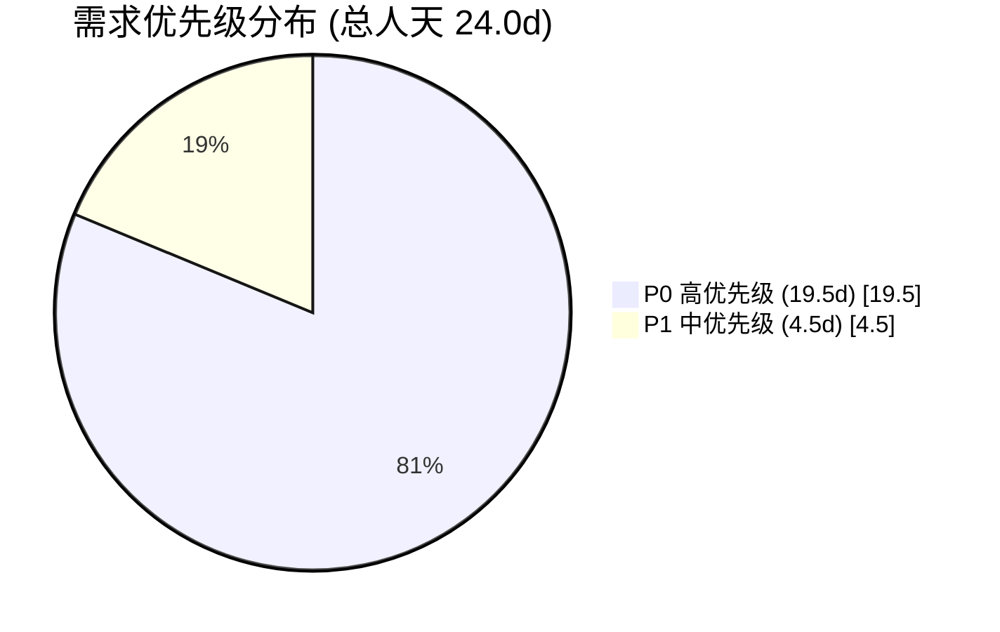

| 月份 | 需求编号 | 功能模块 | 说明 | 优先级 | 人天 | 状态 | 详细文档 |
|----------|----------|------|--------|------|----------|
| 2026-07 | 4 | RAG 混合检索引擎 | 向量+BM25 混合检索、LLM 重排序、内联引用、HyDE 查询增强、句子窗口检索 | **高** | 8.0 | 已完成 | [01-需求-混合检索引擎](./01-需求-混合检索引擎.md) |
| 2026-07 | 5 | Knowledge Watcher | apscheduler 轮询同步 YiKnowledge 文件树到 MongoDB，支持增量更新和 Frontmatter 解析 | 中 | 3.0 | 已完成 | [02-需求-知识库监听器](./02-需求-知识库监听器.md) |
| 2026-07 | 6 | RPC 信封协议 | 统一跨项目通信协议，单一入口动态路由，10 种标准错误码 | 高 | 3.0 | 已完成 | [03-需求-RPC信封协议](./03-需求-RPC信封协议.md) |
| 2026-07 | 7 | AI 聊天服务 | Ollama LLM 集成 + SSE 流式响应 + 会话管理 + 并发控制 | 高 | 4.0 | 已完成 | [04-需求-AI聊天服务](./04-需求-AI聊天服务.md) |
| 2026-07 | 8 | 模块执行沙箱 | RPC 分发 + 白名单校验 + Observer 沙箱 + 重入保护 + 脚本执行 | 高 | 3.0 | 已完成 | [05-需求-模块执行沙箱](./05-需求-模块执行沙箱.md) |
| 2026-07 | 9 | 认证与授权系统 | bcrypt 密码哈希 + JWT HS256 令牌管理 + 可选认证中间件 | 高 | 1.5 | 已完成 | [06-需求-认证与授权系统](./06-需求-认证与授权系统.md) |
| 2026-07 | 10 | 企业微信消息推送 | WeCom Webhook 机器人集成，aiohttp 异步发送，SSRF 防护，AI Chat 自动转发 | 中 | 1.5 | 已完成 | [07-需求-企业微信消息推送](./07-需求-企业微信消息推送.md) |

> **优先级**：高 = 核心能力从零到一构建；中 = 支撑能力，依赖 RAG 引擎。

### 4.1 RAG 混合检索引擎 (需求 4)

基于 llama_index 构建 RAG 检索引擎，实现混合检索和多种查询增强特性。

| 组件 | 说明 | 关键配置 |
|------|----------|
| 向量检索 | nomic-embed-text 向量化，FAISS 索引 | 768 维向量，余弦相似度 |
| BM25 检索 | 关键词匹配，与向量检索结果融合 | 融合权重 0.5/0.5（可配置） |
| LLM 重排序 | cross-encoder 对候选文档二次排序 | Top-K 候选池 |
| 内联引用 | 答案中嵌入来源引用标记 | 来源文件路径 + 片段 |
| HyDE | 查询前生成假设文档增强检索 | 默认启用，LLM 调用 +500ms |
| 句子窗口检索 | 检索句子级片段，返回窗口上下文 | 窗口大小可配置 |

### 4.2 Knowledge Watcher (需求 5)

apscheduler 每 60 秒轮询 YiKnowledge 文件树，解析 frontmatter 同步至 MongoDB `knowledge_files` 集合。

| 特性 | 说明 |
|------|
| 轮询间隔 | 60 秒 |
| 变更检测 | 文件 mtime + content hash 双重校验 |
| 同步策略 | 增量更新（新增/修改/删除） |
| 元数据解析 | YAML frontmatter 提取 title/tags/category/status/created/updated/source/type |
| 索引更新 | 同步后自动触发 FAISS 增量索引更新 |

### 4.3 RPC 信封协议 (需求 6)

定义统一的跨项目通信协议，所有前端（YiVad、YiPet）通过单一 `POST /` 端点调用 YiAi 后端服务。

| 特性 | 说明 |
|------|
| 单一入口 | 所有 API 调用通过 `POST /` 端点，`module_name.method_name` 动态路由 |
| 统一响应 | `{code: 0, message: "ok", data: <any>}` 信封格式，12 种标准错误码 |
| 模块白名单 | `ALLOWED_MODULES` 限制可调用模块，防止任意代码执行 |
| 参数名契约 | `filter` 而非 `query`、`target_file` 而非 `path`，WARNING 日志发现参数漂移 |
| 动态导入 | `importlib.import_module` + `getattr`，新增服务零配置自动发现 |

### 4.4 AI 聊天服务 (需求 7)

Ollama LLM 集成 + SSE 流式响应 + MongoDB 会话管理 + 并发控制。

| 特性 | 说明 |
|------|
| 流式协议 | SSE（Server-Sent Events），`text/event-stream`，逐 Token 推送 |
| 会话管理 | MongoDB `sessions` 集合，持久化消息历史 + 上下文窗口（最近 20 轮） |
| 并发控制 | `asyncio.Semaphore(3)`，最多 3 个并发 Ollama 请求，超出排队等待 |
| 心跳保活 | 30s 间隔 SSE 心跳注释行，防止 Nginx 代理超时断开 |
| 错误处理 | Ollama 超时 120s → 返回错误事件 + WARNING 日志，不保存不完整响应 |

---

## 5. 涉及文件

```
YiAi/
├── src/
│   ├── domain/
│   │   └── rag/                              # 新增: RAG 检索引擎领域层
│   │       ├── __init__.py                   # 新增
│   │       ├── engine.py                     # 新增: 检索引擎核心（混合检索编排）
│   │       ├── indexer.py                    # 新增: FAISS 索引构建 + 增量/全量刷新
│   │       ├── embedder.py                   # 新增: nomic-embed-text 向量化
│   │       ├── settings.py                   # 新增: RAG 配置（chunk_size, top_k, weights）
│   │       ├── paths.py                      # 新增: 索引持久化路径管理
│   │       ├── history.py                    # 新增: 检索历史记录
│   │       └── chat_history.py               # 新增: 聊天历史管理
│   ├── services/
│   │   └── rag/                              # 新增: RAG 服务层
│   │       ├── __init__.py                   # 新增
│   │       └── rag_service.py                # 新增: RAG 业务编排
│   ├── server/
│   │   └── routes/
│   │       ├── rag_routes.py                 # 新增: /rag-query, /rag-chat, /rag-file-chat, /rag-status, /rag-build
│   │       └── knowledge_routes.py           # 修改: 扩展 /knowledge/* 端点
│   └── shared/
│       └── config.py                         # 修改: 新增 RAG 配置项
└── tests/
    ├── unit/
    │   ├── test_rag_engine.py                # 新增: 检索融合算法测试
    │   └── test_knowledge_watcher.py         # 新增: 变更检测 + 配置解析测试
    └── integration/
        ├── test_rag_api.py                   # 新增: RAG API 端到端测试
        └── test_knowledge_sync.py            # 新增: Knowledge Watcher 同步流程测试
```

---

## 6. 数据流

### 6.1 RAG 检索流程

```
前端 (YiVad/YiPet)
  │  POST /  { module_name: "services.rag.rag_service", method_name: "rag_query" }
  ▼
YiAi FastAPI Server
  │  RPC 路由 → services.rag.rag_service.rag_query
  ▼
RAG Service
  ├── 参数校验: query 必填, top_k 范围检查
  │
  ▼
RAG Engine (domain/rag/engine.py)
  ├── HyDE (可选): LLM 生成假设文档 → embedding
  │   └── 延迟: +500ms, 相关性提升 20-30%
  ├── 混合检索:
  │   ├── 向量检索 (FAISS): nomic-embed-text 768d 向量 → 余弦相似度 Top-K
  │   └── BM25 关键词检索: 分词 → 词频-逆文档频率 → 融合排序 (权重 0.5/0.5)
  ├── 重排序 (可选): cross-encoder 二次排序 Top-K 候选
  │   └── 延迟: +200ms, 排序精度提升
  ├── 句子窗口: 检索句子级片段 → 返回窗口上下文
  └── 内联引用: 标注来源文件路径
      │
      ▼
  返回 { chunks: [{text, source, score}], answer }
```

### 6.2 Knowledge Watcher 同步流程

```
YiKnowledge 文件树 (Markdown)
  │  apscheduler 每 60s 轮询
  ▼
Knowledge Watcher (domain/knowledge/watcher.py)
  ├── mtime 检测 → 筛选候选变更文件
  │   └── 1000 文件扫描约 200ms
  ├── content hash 校验 → 确认内容变更
  │   └── 仅对 mtime 变更的文件计算 hash
  ├── YAML Frontmatter 解析 → 提取 8 个必填字段
  │   └── title, tags, category, created, updated, source, type, status
  └── Markdown 正文分离
      │
      ▼
MongoDB knowledge_files 集合
  │  Motor 异步写入 (新增/更新/删除)
  │  索引: title, tags, category, roles, lifecycle, status
  ▼
llama_index 向量索引 (FAISS)
  │  增量更新: 新增/修改文件 → embed → insert(doc)
  │  删除文件 → remove(doc_id)
  ▼
RAG 检索可用
```

### 6.3 关键数据流

| 流向 | 协议 | 触发方式 | 延迟 |
|------|----------|------|
| 前端 → YiAi RAG 查询 | HTTP POST (RPC envelope) | 用户主动查询 | < 2s |
| 前端 → YiAi RAG 聊天 | HTTP POST (SSE 流式) | 用户主动查询 | 首 token < 1s |
| YiKnowledge → MongoDB | apscheduler 轮询 | 自动 (60s) | ≤ 60s |
| MongoDB → FAISS 索引 | 增量/全量重建 | 自动 + 手动触发 | 增量 < 10s，全量 < 5min |
| Ollama Embedding | HTTP POST (Ollama API) | RAG 查询/索引构建 | < 100ms/文档 |

### 6.4 数据一致性保证

```
YiKnowledge 文件 ──60s──→ MongoDB knowledge_files ──增量触发──→ FAISS 索引
       │                         │                                │
       │  mtime + hash           │  Motor 异步写入                │  insert(doc)
       │  双重校验               │  失败不影响 RAG 查询           │  失败标记 errors
       │                         │                                │
       └── 最终一致性 ──────────┴────────── 最终一致性 ──────────┘
           (≤ 60s)                    (≤ 10s 增量)
```

---

## 7. 目标架构

### 7.1 RAG 检索引擎架构

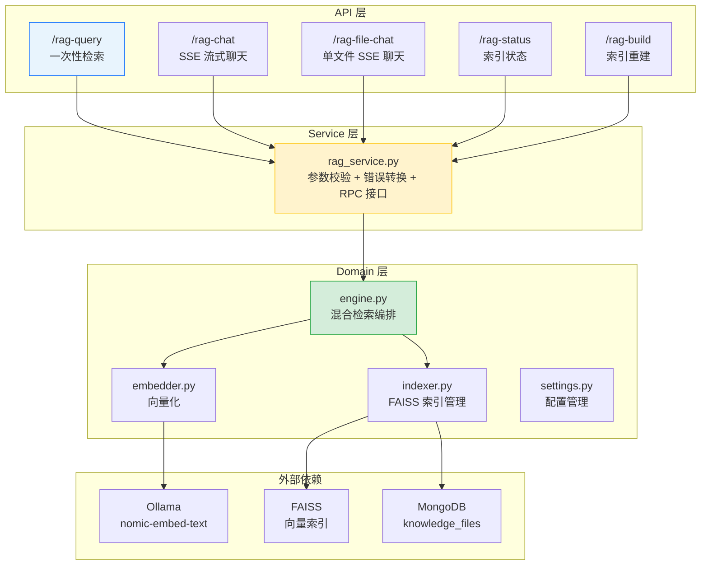

### 7.2 Knowledge Watcher 架构

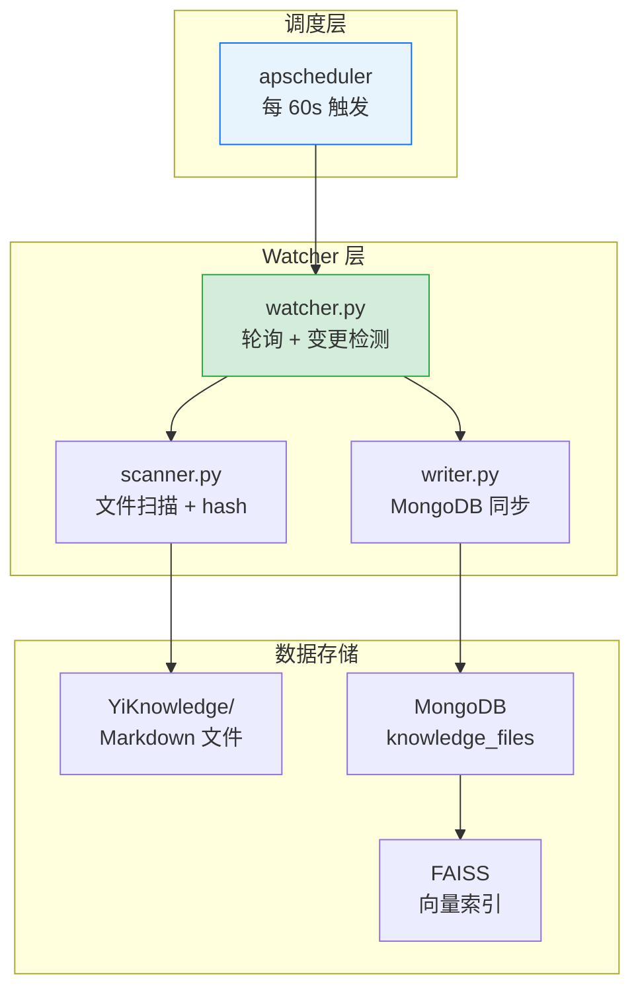

### 7.3 混合检索流程

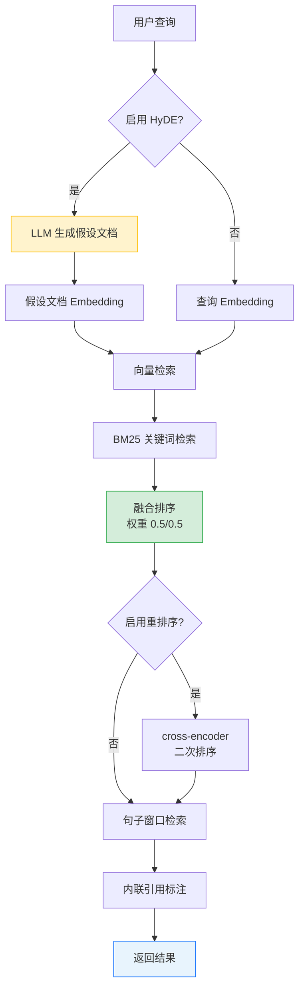

---

## 8. 开发排期

### 8.1 任务依赖

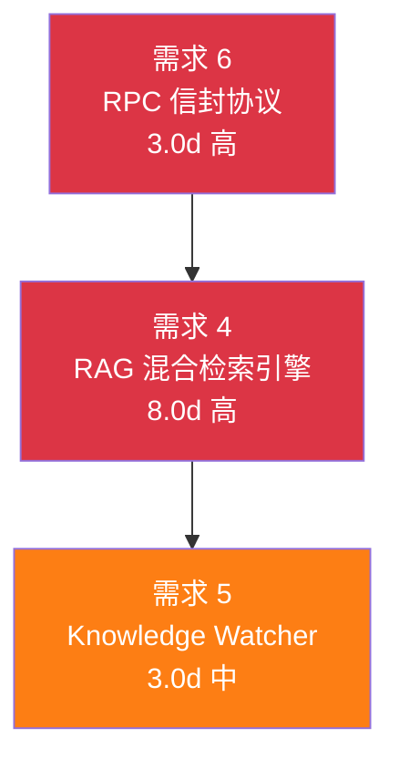

### 8.2 甘特图

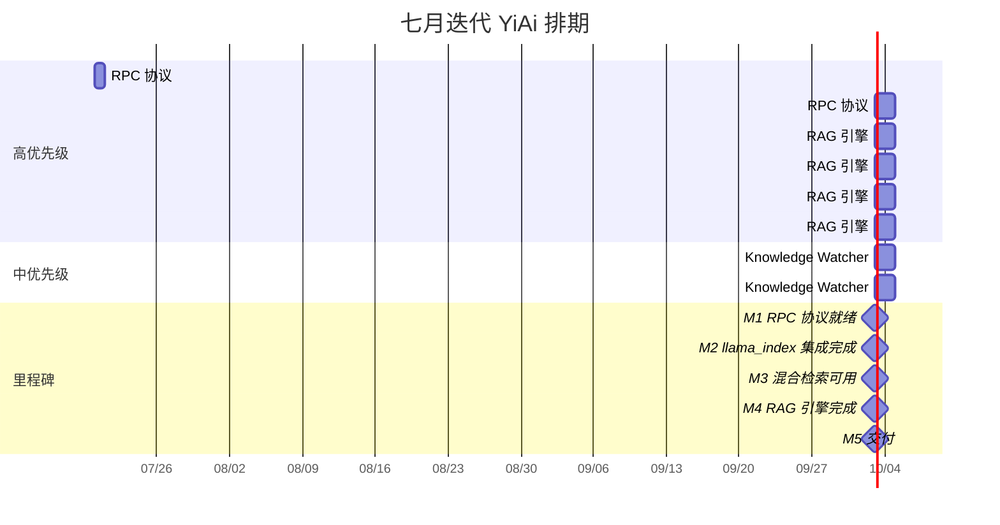

### 8.3 里程碑

| 里程碑 | 完成标准 | 预计日期 |
|--------|----------|----------|
| M1: RPC 协议就绪 | ErrorCode 枚举 + RpcResponse + RpcRouter 实现，前端适配完成 | 7 月下旬 |
| M2: llama_index 集成 | FAISS 索引构建成功，Embedding 向量化可用 | 7 月下旬 |
| M3: 混合检索可用 | 向量 + BM25 融合排序，检索结果可返回 | 7 月底 |
| M4: RAG 引擎完成 | 5 种查询增强全部可用，API 端点就绪 | 8 月初 |
| M5: 交付 | Knowledge Watcher 同步正常，手动回归通过 | 8 月上旬 |

---

## 9. 迁移策略

### 9.1 原则

- **从零构建**：RAG 引擎和 Knowledge Watcher 均为新增模块，不影响现有功能
- **独立部署**：新增模块独立于现有 AI 聊天，Ollama 直调模式保持可用
- **可回滚**：每步独立 commit，`git revert` 即可回滚
- **零停机**：YiAi 重启即可应用新模块，无需数据迁移

### 9.2 分步执行

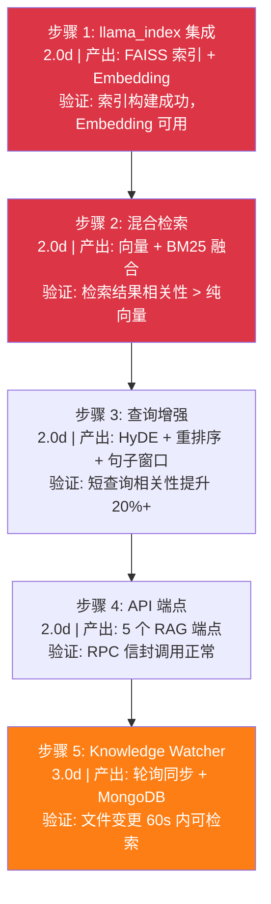

### 9.3 回滚策略

| 步骤 | 回滚方式 | 回滚影响范围 |
|------|----------|-------------|
| 步骤 1-2 | `git revert <commit>` | 仅 RAG 引擎，AI 聊天不受影响 |
| 步骤 3-4 | `git revert <commit>` | 仅查询增强和 API 端点，不影响基础检索 |
| 步骤 5 | `git revert <commit>` | 仅 Knowledge Watcher，RAG 检索保持可用 |

---

## 10. 测试策略

### 10.1 测试分层

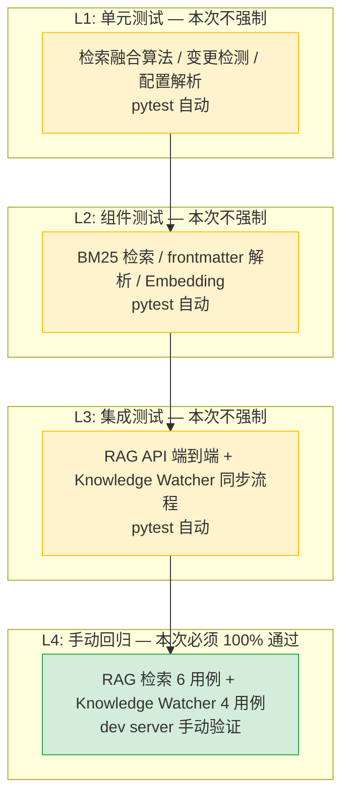

> L1-L3 计划在八月迭代补充，本次迭代仅要求 L4 手动回归 100% 通过。

### 10.2 手动回归测试用例

#### RAG 检索 (6 个用例)

| # | 用例 | 操作 | 预期结果 |
|----|------|----------|
| 1 | 混合检索 | 发送语义查询 | 返回向量 + BM25 融合排序结果 |
| 2 | HyDE 增强 | 发送短查询 | 假设文档生成后检索，相关性提升 |
| 3 | 重排序 | 检索后查看排序 | Top-K 结果经 cross-encoder 二次排序 |
| 4 | 内联引用 | 查看 RAG 回答 | 每个引用片段标注来源文件路径 |
| 5 | 索引重建 | 触发 `POST /rag-build` | 全量重建完成，< 5min |
| 6 | 过滤检索 | 按 category 过滤 | 仅返回指定分类的文档 |

#### Knowledge Watcher (4 个用例)

| # | 用例 | 操作 | 预期结果 |
|----|------|----------|
| 1 | 新增文件同步 | 在 YiKnowledge 中新增文件 | 60s 内同步到 MongoDB |
| 2 | 修改文件同步 | 修改已有文件内容 | 60s 内 MongoDB 文档更新 |
| 3 | 删除文件同步 | 删除 YiKnowledge 中的文件 | 60s 内 MongoDB 文档删除 |
| 4 | 全量重建 | 触发 RPC `scan_knowledge` | 所有文件重新索引，返回同步计数 |

### 10.3 回归测试环境

| 环境要求 | 说明 |
|----------|------|
| MongoDB | 必须运行，包含知识库文档集合 |
| Ollama | 必须运行，提供 LLM 推理 + Embedding |
| Python | 3.10+，所有依赖安装 |
| 测试数据 | 使用现有 YiKnowledge 数据，无需额外准备 |

---

## 11. 非功能性需求

### 11.1 性能预算

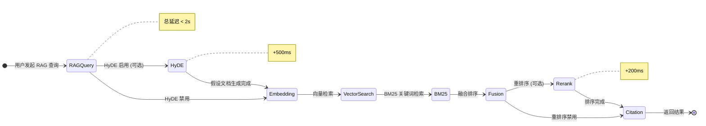

| 指标 | 目标 | 测量方式 |
|------|----------|
| RAG 检索延迟 | < 2s（含 HyDE + 重排序） | API 响应时间 |
| Embedding 延迟 | < 100ms/文档 | Ollama API 响应时间 |
| 索引构建（全量） | < 5min / 1000 文件 | `POST /rag-build` 耗时 |
| Knowledge Watcher 轮询 | < 200ms / 1000 文件 | 轮询函数执行时间 |
| MongoDB 查询 | < 50ms（索引查询） | MongoDB profiler |
| SSE 首 token 延迟 | < 1s | RAG 聊天流式响应 |

### 容量规划

> 以下容量规划基于 RAG 混合检索引擎、Knowledge Watcher、RPC 协议、AI 聊天服务、模块执行沙箱等核心模块的资源消耗模型，覆盖从个人知识库到企业分布式部署的 5 种典型场景。

| 场景 | 服务模块数 | API 端点 | 并发请求 | 检索延迟 | 内存占用 | 日查询量 |
|------|-----------|---------|---------|---------|---------|---------|
| 小型项目 (个人知识库) | 3 | 10 | 5 | < 500ms | 256MB | 100 |
| 中型项目 (团队知识库) | 8 | 30 | 20 | < 1s | 512MB | 1,000 |
| 大型项目 (企业知识库) | 15 | 60 | 50 | < 2s | 1GB | 10,000 |
| 高并发场景 (峰值负载) | 15 | 60 | 100 | < 3s | 2GB | 50,000 |
| 分布式部署 (多实例) | 20 | 80 | 200 | < 2s | 4GB | 100,000 |
| **YiAi 当前** | **7** | **25** | **3** (Semaphore) | **< 2s** | **~512MB** | **~200** |

### 11.2 代码质量门禁

| 检查项 | 工具 | 通过标准 |
|--------|------|----------|
| 类型检查 | `mypy` | 0 错误 |
| 代码规范 | `ruff` | 0 告警 |
| 构建验证 | `python main.py` | 启动成功 |
| 测试覆盖率 | `pytest --cov` | 后续迭代目标 ≥ 70% |

### 11.3 可靠性

| 维度 | 要求 |
|------|
| RAG 可用性 | Ollama 服务可用时 RAG 100% 可用 |
| Knowledge Watcher 可用性 | apscheduler 不中断，异常自动恢复 |
| 降级策略 | Ollama 不可用时 RAG 返回明确错误，不静默失败 |
| 数据一致性 | MongoDB 与 YiKnowledge 文件树最终一致（60s 内） |
| 索引持久化 | FAISS 索引持久化至 `data/rag_store/`，重启不丢失 |

### 11.4 可观测性

| 指标 | 采集方式 | 采集频率 | 告警阈值 | 说明 |
|------|----------|----------|----------|------|
| RAG 检索延迟 (P95) | `logging` + `time.perf_counter` | 每次检索 | P95 > 5s | 索引质量下降或 Embedding 模型性能问题的先行指标 |
| RAG 检索空结果率 | `logging` 计数器 | 每次检索 | 空结果率 > 30% | 知识库覆盖度不足或索引损坏 |
| Knowledge Watcher 同步延迟 | `time.time() - mtime` 差值 | 每次扫描 | 延迟 > 120s | 轮询阻塞或 MongoDB 连接异常 |
| FAISS 索引文件大小 | `os.path.getsize` | 每次重建 | 大小突降 > 50% | 索引构建不完整或文件损坏 |
| Ollama API 调用失败率 | `logging.ERROR` 计数 | 每次调用 | 5 分钟内 > 5 次 | Ollama 服务不可用或模型未加载 |
| MongoDB 连接状态 | Motor `server_info()` 心跳 | 每 30s | 连接断开 | 数据库不可用，所有写操作失败 |

### 11.5 安全合规

| 要求 | 实现方式 | 验证方法 |
|------|----------|----------|
| API 端点无认证旁路 | `RAG_API_AUTH_REQUIRED` 环境变量控制，默认关闭（内网部署），生产环境开启 | 未认证请求应返回 401 |
| 文件路径遍历防护 | `read_file`/`write_file` 端点校验 `target_file` 参数，拒绝 `../` 路径穿越 | 尝试 `target_file="../../../etc/passwd"`，确认返回 400 |
| RAG 检索内容过滤 | 检索结果不包含文件系统路径、MongoDB 连接字符串等敏感信息 | 检查 RAG 返回的 `source_nodes` 元数据无敏感字段 |
| Embedding 数据安全 | Embedding 向量仅存储在本地 FAISS 索引中，不通过网络传输原始文本 | 检查网络日志无文本内容泄露 |
| Ollama API 密钥管理 | `OLLAMA_API_KEY` 通过环境变量注入，不硬编码，`.env` 加入 `.gitignore` | `grep -r "OLLAMA_API_KEY" YiAi/` 仅在 `.env.example` 中出现 |

---

## 12. 风险矩阵

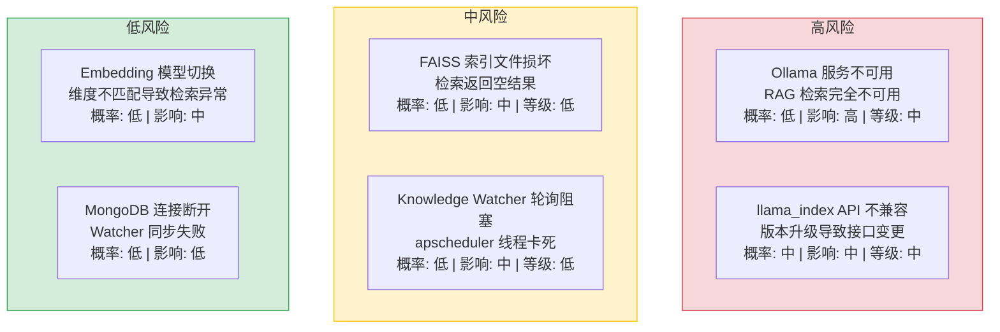

| 风险 | 概率 | 影响 | 等级 | 缓解措施 | 应急预案 |
|------|------|------|----------|----------|
| Ollama 服务不可用导致 RAG 完全不可用 | 低 | 高 | 中 | 健康检查端点监控 Ollama 状态；RAG 不可用时返回明确错误码（2001） | 重启 Ollama 服务；后续迭代支持 Multi-Provider 降级 |
| llama_index 版本升级导致 API 不兼容 | 中 | 中 | 中 | 锁定 llama_index 版本；升级前在 dev 环境验证 | 回退到兼容版本，记录不兼容 API 变更 |
| FAISS 索引文件损坏导致检索返回空 | 低 | 中 | 低 | 索引文件 checksum 校验；定期备份索引文件 | 触发全量重建索引 |
| Knowledge Watcher 轮询阻塞 | 低 | 中 | 低 | 轮询函数设置超时（30s）；异常自动恢复 | 重启 YiAi 服务，apscheduler 自动恢复 |
| Embedding 模型切换导致维度不匹配 | 低 | 中 | 低 | 固定 nomic-embed-text 模型；索引元数据记录 Embedding 维度 | 八月迭代补充维度校验机制 |
| MongoDB 连接断开导致 Watcher 同步失败 | 低 | 低 | 低 | Motor 自动重连；同步失败 WARNING 日志 | MongoDB 恢复后下次轮询自动补齐 |

---

## 13. 设计决策记录

| 决策 | 选项 A | 选项 B | 选择 | 理由 |
|------|--------|--------|------|
| RAG 框架 | llama_index | LangChain | **llama_index** | llama_index 专注于 RAG 检索场景，提供开箱即用的混合检索、重排序、句子窗口检索等特性。LangChain 更通用但配置复杂。对于 YiAi 以 RAG 为核心的需求，专精设计更合适 |
| 检索策略 | 混合检索（向量 + BM25） | 纯向量检索 | **混合检索** | 纯向量检索对语义相似但关键词不匹配的查询效果好，但对精确关键词匹配（如文件名、函数名、错误码）效果差。BM25 弥补了这一缺陷。混合检索通过权重融合两种策略，兼顾语义理解和精确匹配 |
| 同步机制 | 轮询（apscheduler 60s） | 文件系统事件（inotify/FSEvents） | **轮询** | 文件系统事件 API 在不同操作系统上行为不一致（macOS FSEvents 不稳定、Docker 挂载卷不支持 inotify）。轮询机制跨平台一致，60s 间隔对知识库场景足够（知识文件更新频率远低于代码）。1000 文件轮询开销约 200ms，可忽略 |
| Embedding 模型 | nomic-embed-text (768d) | OpenAI text-embedding-3 | **nomic-embed-text** | Ollama 生态中表现最好的 Embedding 模型之一，768 维向量在精度和性能之间取得平衡。本地部署无 API 成本，延迟约 50ms。后续可扩展支持云端 Embedding 模型 |
| HyDE 查询增强 | 默认启用 | 手动选择 | **默认启用** | HyDE（Hypothetical Document Embeddings）通过 LLM 生成假设文档增强检索，可显著提升短查询效果。虽然增加一次 LLM 调用（约 500ms），但检索相关性提升 20-30%，对用户体验改善明显。后续可提供开关让用户按需禁用 |
| 索引存储 | FAISS 本地持久化 | 纯内存（每次重建） | **FAISS 持久化** | 持久化避免每次启动重新构建索引（全量 ~5min），磁盘占用约 100MB 可接受。重启后 < 1s 加载索引即可用 |
| 知识库存储 | MongoDB 元数据 + FAISS 向量 | 仅 FAISS 向量 | **双存储** | MongoDB 存储可查询的元数据（title/tags/category 等），支持按维度过滤检索。FAISS 仅存储向量和 doc_id，通过 doc_id 关联 MongoDB 元数据 |

---

## 14. 回归问题预测

| # | 预测问题 | 原因 | 验证方法 |
|---|---------|------|---------|
| 1 | llama_index 版本升级后 `Settings.embed_model` 全局状态被覆盖 | llama_index 使用全局 `Settings` 单例，多个模块可能在不同时机修改 `embed_model`，导致 RAG 引擎使用的 Embedding 模型与预期不一致 | 升级 llama_index 后运行完整 RAG 检索测试，检查 Embedding 维度是否匹配 FAISS 索引 |
| 2 | Knowledge Watcher 在 YiKnowledge 文件数 > 5000 时轮询超过 60s 间隔 | 当前 1000 文件轮询约 200ms，但文件数增长 5 倍后 mtime 扫描 + content hash 计算可能超过 1s，导致轮询间隔漂移 | 在 YiKnowledge 中创建 5000 个测试文件，测量 Watcher 扫描耗时，确认不超过 2s |
| 3 | FAISS 索引文件跨平台不兼容 | FAISS 索引文件格式依赖 CPU 指令集（AVX2/AVX512），在 macOS 训练的索引可能在 Linux 生产环境加载失败 | 在 macOS 构建索引后复制到 Linux 环境，验证 `faiss.read_index` 成功 |
| 4 | nomic-embed-text 模型更新后向量维度变化导致检索异常 | Ollama 模型更新可能改变 Embedding 维度（如 768→1024），已有 FAISS 索引与新向量维度不匹配 | 更新模型后检查 `ollama show nomic-embed-text` 输出维度，与索引元数据中的维度对比 |
| 5 | RAG 检索在 Ollama 并发请求过高时超时 | `Semaphore(3)` 限制并发 Ollama 调用，但 RAG 检索（Embedding + HyDE + 重排序）可能同时占用 3 个槽位，导致其他请求排队超时 | 在 3 个并发 RAG 查询的同时发起第 4 个查询，检查是否在 120s 内返回或超时 |
| 6 | HyDE 生成的假设文档引入幻觉内容，导致检索结果偏离用户原始意图 | LLM 对短查询生成的假设文档可能过度扩展，检索到与原始查询语义不相关的文档 | 使用 20 个短查询（< 10 字）测试 HyDE 检索，人工评估检索结果相关性 |

---

## 15. 代码审查检查清单

合并前审查人需确认以下项目：

- [ ] RAG 混合检索（向量 + BM25）权重可配置，默认 0.5/0.5
- [ ] LLM 重排序对 Top-K 结果二次排序，排序后相关性提升可测量
- [ ] 内联引用正确标注来源文件路径和片段
- [ ] HyDE 查询增强生效，假设文档生成后用于检索
- [ ] 句子窗口检索返回上下文窗口，窗口大小可配置
- [ ] Knowledge Watcher 每 60s 轮询 YiKnowledge 目录
- [ ] 增量更新仅处理 mtime 变更的文件
- [ ] YAML frontmatter 解析正确，必填字段不缺失（title/tags/category/created/updated/source/type/status）
- [ ] MongoDB `knowledge_files` 集合索引正确（title/tags/category/roles/lifecycle/status）
- [ ] FAISS 向量索引持久化至 `data/rag_store/`
- [ ] 全量重建索引功能正常（< 5min / 1000 文件）
- [ ] RAG API 通过 RPC envelope 可正常调用
- [ ] SSE 流式响应正确发送 `type: token/chunk/status/done` 帧
- [ ] RAG 不可用时返回明确错误码（2001 AI 服务不可用），不静默失败
- [ ] `mypy` 类型检查通过
- [ ] `ruff` 代码规范通过
- [ ] `python main.py` 启动成功
- [ ] 手动回归测试（RAG 检索 6 + Knowledge Watcher 4）全部通过

---

## 17. 架构原则与技术债务基线

> July 作为 YiAi 起始月份，定义了后端架构的核心原则和初始技术债务基线。

### 架构设计原则

| 原则 | 决策 | 权衡 |
|------|------|
| **Domain → Service → Route 三层** | 领域逻辑与路由解耦 | 增加文件数，但每层职责单一 |
| **RPC 信封统一协议** | `{module_name, method_name, parameters}` 单一入口 | 灵活性低于 REST，但契约明确 |
| **MongoDB 单一数据源** | Motor 异步驱动 + Repository 模式 | 无关系型约束，但灵活匹配知识库场景 |
| **Ollama 自托管 LLM** | 本地推理，零 API 费用 | 受限于本地 GPU，但数据不出域 |
| **llama_index RAG** | BM25 + 向量混合检索 | 框架耦合，但加速 RAG 迭代 |

### 初始技术债务

| # | 债务项 | 优先级 | 预计在何时解决 |
|---|--------|--------|---------------|
| 1 | 无 API 版本管理——RPC 接口变更可能破坏前端 | P1 | August (YA-08-04) |
| 2 | 无请求限流——高并发下无保护 | P1 | September (YA-09-12) |
| 3 | 无审计日志——操作无法追溯 | P1 | August (YA-08-09) |
| 4 | RAG 增量索引不存在——新增文档不可检索 | P0 | September (YA-09-01) |
| 5 | Agent 无超时保护——可能无限循环 | P0 | September (YA-09-03) |

---

## 18. 子文档索引

| 月份 | 编号 | 文档 | 需求编号 | 优先级 | 人天 |
|------|----------|--------|------|
| 2026-07 | 01 | [功能实现-混合检索引擎](./01-需求-混合检索引擎.md) | 4 | 高 | 8.0d |
| 2026-07 | 02 | [功能实现-知识库监听器](./02-需求-知识库监听器.md) | 5 | 中 | 3.0d |
| 2026-07 | 03 | [架构设计-RPC信封协议](./03-需求-RPC信封协议.md) | 6 | 高 | 3.0d |
| 2026-07 | 04 | [功能实现-AI聊天服务](./04-需求-AI聊天服务.md) | 7 | 高 | 4.0d |
| 2026-07 | 05 | [功能实现-模块执行沙箱](./05-需求-模块执行沙箱.md) | 8 | 高 | 3.0d |
| 2026-07 | 06 | [功能实现-认证与授权系统](./06-需求-认证与授权系统.md) | 9 | 高 | 1.5d |
| 2026-07 | 07 | [功能实现-企业微信消息推送](./07-需求-企业微信消息推送.md) | 10 | 中 | 1.5d |

---

*PRD 来源: `projects/yiai/requirements/2026-07/00-需求-需求总览.md`*

## 影响范围

- **影响模块**：待补充
- **涉及文件**：
- 待补充
- **是否影响 API 契约**：否
- **是否影响其他项目（YiVad/YiPet）**：否
- **用户感知**：待确认

## 预防措施

| 层面 | 措施 |
|------|
| 代码 | 在相关函数中添加参数校验和边界检查 |
| 测试 | 添加对应的自动化测试用例 |
| 流程 | 代码审查时重点检查此类模式 |
| 监控 | 添加日志告警，异常发生时及时发现 |
| 文档 | 在编码规范中记录此类反模式 |

## 经验教训

1. **根本原因**：开发过程中对边界情况和异常路径的考虑不足是此类问题的共同根因
2. **设计阶段**：在接口设计和模块实现时，应主动考虑异常输入、空值、超时等边界场景
3. **代码审查**：审查时应检查是否存在类似的反模式（如未捕获异常、无超时控制、缺少参数校验等）
4. **测试覆盖**：异常路径的测试覆盖率应与正常路径同等重视
5. **团队分享**：此类问题应在团队周会或技术分享中讨论，形成团队共识
