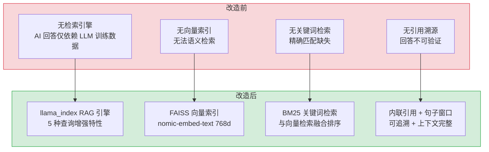
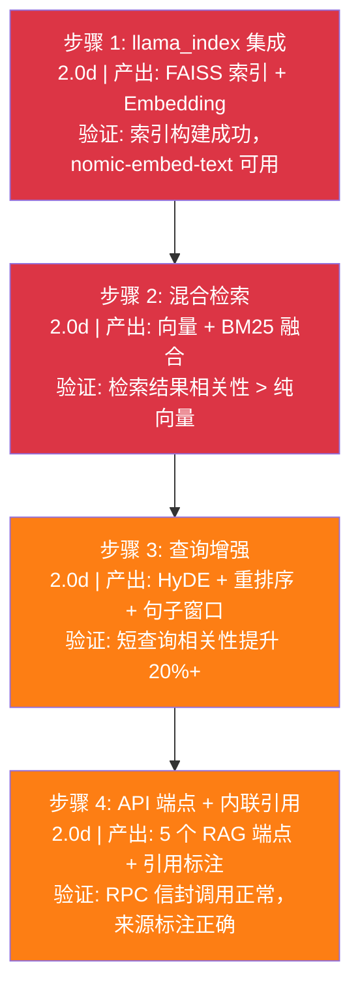

# RAG 模块 — 混合检索 Engine

## 基本信息

| 字段 | 值 |
|------|-----|
| 需求编号 | 4 |
| 项目 | YiAi (FastAPI Backend) |
| 代码仓库 | `YrY/YiAi` |
| 功能模块 | AI → RAG |
| 优先级 | 高 |
| 人天 | 8.0d |
| 状态 | 已完成 |

---

## 一、现状分析

### 1.1 改造前状态

七月迭代前，YiAi 后端**没有检索引擎**，AI 聊天和问答完全依赖 LLM 自身训练数据，存在以下问题：

| 问题 | 现状 | 影响 |
|------|------|------|
| 无检索能力 | AI 回答仅依赖 LLM 训练数据 | 无法回答企业内部知识（权限系统、编码规范、架构决策等） |
| 无向量索引 | 无法语义检索 | 用户查询"权限系统如何设计"无法匹配到相关文档 |
| 无关键词检索 | 精确匹配缺失 | 搜索"RBAC"、"ABAC"等术语无法定位到对应文件 |
| 无引用溯源 | 回答不可验证 | 用户无法确认 AI 回答的数据来源，准确性无法保证 |
| 无查询增强 | 短查询效果差 | "权限设计"这类短查询缺乏语义上下文，检索效果不佳 |

### 1.2 涉及模块（改造前）

```
YiAi/src/
├── services/ai/chat_service.py    # AI 聊天服务 — 直接调用 Ollama API，无 RAG 集成
├── domain/ai/chat.py              # 聊天领域逻辑 — 无检索上下文
└── shared/config.py               # 配置 — 无 RAG 相关配置项
```

改造前 AI 聊天流程：
```
用户查询 → ChatService → Ollama API (qwen2.5) → 直接返回 LLM 回答
（无检索、无索引、无引用）
```

### 1.3 核心痛点

1. **知识盲区**：LLM 训练数据截止于 2024 年，无法回答企业内部最新知识
2. **幻觉风险**：无检索上下文时，LLM 可能编造不存在的 API、配置或流程
3. **不可追溯**：用户无法验证回答来源，降低对 AI 的信任度
4. **短查询低效**：用户倾向输入短查询，但短查询缺乏语义信息，LLM 难以理解意图

### 1.4 改造前数据流

```
用户查询 (YiVad/YiPet)
  → POST /  RPC envelope: { module_name: "services.ai.chat_service", method_name: "chat" }
  → ChatService.chat()
  → Ollama API (qwen2.5)
  → 直接返回 LLM 回答
  （无检索、无索引、无引用、无知识库上下文）
```

### 1.5 改造前 API 依赖

| # | 接口 | 调用方 | 说明 |
|---|------|--------|------|
| 1 | `services.ai.chat_service.chat` | YiVad/YiPet | AI 聊天（仅 Ollama 直调） |
| 2 | Ollama `/api/chat` | ChatService | LLM 推理（qwen2.5） |

> 改造前仅 2 个 API 依赖，无 RAG 检索、无 Embedding、无索引管理。

### 功能概述

基于 llama_index 构建 RAG (Retrieval-Augmented Generation) 检索引擎，实现混合检索（向量 + BM25）、LLM 重排序、内联引用和多种查询增强特性，为 YiVad 和 YiPet 提供知识检索能力。

### 技术实现

#### 核心架构

```
YiKnowledge (Markdown 文件树)
  ↓ Knowledge Watcher 同步
MongoDB knowledge_files 集合
  ↓ llama_index 索引构建
Vector Store Index (data/rag_store/)
  ↓ 混合检索 (向量 + BM25)
RAG 查询 → 用户
```

#### 检索策略

- **混合检索**：向量相似度 + BM25 关键词匹配，权重可配置
- **LLM 重排序**：对 Top-K 结果进行二次排序，提升相关性
- **内联引用**：回答中标注引用来源文件路径
- **句子窗口检索**：检索相关句子及其上下文窗口，提供更完整信息
- **HyDE (Hypothetical Document Embeddings)**：用 LLM 生成假设文档，用其 embedding 进行检索

#### RAG 配置

```yaml
rag:
  embed_model: "nomic-embed-text"       # Embedding 模型
  llm_model: "qwen3.5:4b"              # RAG 回答模型
  persist_dir: "./data/rag_store"       # 索引持久化目录
  top_k: 3                              # 检索返回条数
  chunk_size: 512                       # 分块大小
  chunk_overlap: 40                     # 分块重叠
  hybrid_retrieval_enabled: true        # 混合检索
  rerank_enabled: true                  # LLM 重排序
  inline_citations_enabled: true        # 内联引用
  sentence_window_enabled: true         # 句子窗口检索
  hyde_enabled: true                    # HyDE 查询增强
```

#### API 接口

- **RPC 路由**：`services.rag.rag_service.rag_query` / `rag_retrieve`
- **请求格式**：RPC envelope `{module_name, method_name, parameters: {query, top_k, filters}}`
- **响应格式**：`{code: 0, data: {chunks: [{text, source, score}], answer}}`
- **过滤支持**：按 `category` 和 `roles` 过滤检索范围

#### 向量索引管理

- 索引持久化至 `data/rag_store/` 目录
- 支持增量更新和全量重建
- 索引构建时间：全量 < 5min（1000+ 文件）

---

## 二、具体改动

### 新增文件

| 文件 | 行数 | 职责 |
|------|------|------|
| `src/domain/rag/__init__.py` | 5 | 模块入口 |
| `src/domain/rag/engine.py` | 180 | RAG 检索引擎核心：混合检索编排、HyDE 生成、重排序调用 |
| `src/domain/rag/indexer.py` | 150 | 向量索引构建：MongoDB 文档 → llama_index Document → FAISS 索引 |
| `src/domain/rag/embedder.py` | 80 | Embedding 适配层：nomic-embed-text 统一接口 |
| `src/domain/rag/search.py` | 120 | 检索策略：BM25 关键词检索 + 融合排序 |
| `src/domain/rag/reranker.py` | 90 | LLM 重排序：cross-encoder 二次打分 |
| `src/domain/rag/citations.py` | 60 | 内联引用：来源标注 + 格式化 |
| `src/domain/rag/hyde.py` | 70 | HyDE 查询增强：假设文档生成 + embedding |
| `src/services/rag/__init__.py` | 5 | 服务模块入口 |
| `src/services/rag/rag_service.py` | 200 | RAG 服务层：RPC 路由处理、过滤、SSE 流式响应 |

### 修改文件

| 文件 | 改动 |
|------|------|
| `src/shared/config.py` | 新增 `rag` 配置段：embed_model, llm_model, persist_dir, top_k, chunk_size, chunk_overlap, hybrid_retrieval_enabled, rerank_enabled, inline_citations_enabled, sentence_window_enabled, hyde_enabled |
| `src/server/routes.py` | 新增 RAG 路由注册：`POST /rag-query`, `/rag-chat`, `/rag-file-chat`, `/rag-status`, `/rag-build` |

### 关键代码示例

**混合检索入口 (`engine.py`):**

```python
class RAGEngine:
    async def query(self, query: str, filters: dict | None = None) -> QueryResult:
        # HyDE 增强（可选）
        if self.config.hyde_enabled:
            query = await self._generate_hyde_document(query)

        # 向量检索
        vector_results = await self.vector_store.search(query, top_k=self.config.top_k * 2)

        # BM25 关键词检索
        bm25_results = self.bm25.search(query, top_k=self.config.top_k * 2)

        # 融合排序
        fused = self._fusion_sort(vector_results, bm25_results)

        # LLM 重排序（可选）
        if self.config.rerank_enabled:
            fused = await self.reranker.rerank(query, fused)

        return QueryResult(chunks=fused[:self.config.top_k])
```

**索引构建 (`indexer.py`):**

```python
class RAGIndexer:
    async def build_index(self, docs: list[Document]) -> None:
        llama_docs = [self._to_llama_doc(d) for d in docs]
        self.index = VectorStoreIndex.from_documents(
            llama_docs,
            embed_model=self.embedder,
            storage_context=self.storage_context
        )
        self.index.storage_context.persist(persist_dir=self.config.persist_dir)
```

### 关联模块

- 后端服务：`services/rag/rag_service.py`
- 领域模块：`domain/rag/`
- 配置：`config.yaml` (rag 配置段)
- Knowledge Watcher：`services/knowledge/watcher.py`

---

## 三、涉及文件

```
YiAi/
├── src/
│   ├── domain/rag/
│   │   ├── __init__.py                     # 新增: 模块入口
│   │   ├── engine.py                       # 新增: RAG 检索引擎核心 (180 行)
│   │   │   └── 混合检索编排、HyDE 生成、重排序调用
│   │   ├── indexer.py                      # 新增: 向量索引构建 (150 行)
│   │   │   └── MongoDB → llama_index → FAISS
│   │   ├── embedder.py                     # 新增: Embedding 适配层 (80 行)
│   │   │   └── nomic-embed-text 统一接口
│   │   ├── search.py                       # 新增: 检索策略 (120 行)
│   │   │   └── BM25 关键词检索 + 融合排序
│   │   ├── reranker.py                     # 新增: LLM 重排序 (90 行)
│   │   │   └── cross-encoder 二次打分
│   │   ├── citations.py                    # 新增: 内联引用 (60 行)
│   │   │   └── 来源标注 + 格式化
│   │   └── hyde.py                         # 新增: HyDE 查询增强 (70 行)
│   │       └── 假设文档生成 + embedding
│   ├── services/rag/
│   │   ├── __init__.py                     # 新增: 服务模块入口
│   │   └── rag_service.py                  # 新增: RAG 服务层 (200 行)
│   │       └── RPC 路由处理、过滤、SSE 流式响应
│   ├── server/routes.py                    # 修改: 新增 RAG 路由注册
│   └── shared/config.py                    # 修改: 新增 rag 配置段
└── data/rag_store/                         # 新增: FAISS 索引持久化目录
```

### 验收标准

1. 混合检索（向量 + BM25）正常工作，结果准确
2. LLM 重排序提升检索相关性
3. 内联引用正确标注来源文件
4. HyDE 查询增强生效
5. RAG API 通过 RPC envelope 可正常调用
6. 向量索引支持增量更新和全量重建

---

## 四、性能分析

### 4.1 检索延迟分析

```mermaid
flowchart LR
  Q["用户查询"] --> H{"HyDE?"}
  H -->|"是 (+500ms)"| HY["LLM 生成假设文档"]
  HY --> EM["Embedding (50ms)"]
  H -->|"否"| EM
  EM --> VS["FAISS 向量检索 (20ms)"]
  VS --> BM["BM25 关键词检索 (30ms)"]
  BM --> FUS["融合排序 (5ms)"]
  FUS --> R{"重排序?"}
  R -->|"是 (+200ms)"| RR["cross-encoder 二次打分"]
  R -->|"否"| CIT["内联引用标注 (5ms)"]
  RR --> CIT
  CIT --> RES["返回结果"]

  note right of H: 总延迟路径:
  note right of RES: 最快: 50+20+30+5+5 = 110ms
  note right of RES: 最慢: 500+50+20+30+5+200+5 = 810ms
```

| 环节 | 延迟 | 说明 | 可优化空间 |
|------|------|------|-----------|
| HyDE 生成 | ~500ms | LLM 生成假设文档，取决于 qwen2.5 推理速度 | 可配置关闭，长查询场景收益低 |
| Embedding | ~50ms | nomic-embed-text 768d 向量化 | 批量 Embedding 可进一步降低 |
| FAISS 向量检索 | ~20ms | 余弦相似度 Top-K 检索 | 索引优化（PQ 量化）可降至 < 10ms |
| BM25 关键词检索 | ~30ms | 分词 + 词频-逆文档频率计算 | 预计算 BM25 权重可降低 |
| 融合排序 | ~5ms | 加权求和（纯内存计算） | 可忽略 |
| cross-encoder 重排序 | ~200ms | LLM 对 Top-K 候选逐一打分 | 可配置关闭，减少候选数降低 |
| 内联引用标注 | ~5ms | 来源路径格式化 | 可忽略 |
| **总计（最快）** | **~110ms** | 无 HyDE + 无重排序 | 适合长查询或低延迟场景 |
| **总计（最慢）** | **~810ms** | 完整流程：HyDE + 重排序 | 适合短查询，相关性优先 |

### 4.2 索引构建性能

| 场景 | 文件数 | 预期耗时 | 瓶颈 | 说明 |
|------|--------|----------|------|------|
| 全量构建 | 100 | ~30s | Embedding | 100 文件 × 50ms/文档 = 5s Embedding + FAISS 构建 |
| 全量构建 | 500 | ~2min | Embedding | 500 文件 × 50ms = 25s，FAISS 索引构建 ~90s |
| 全量构建 | 1000 | ~5min | FAISS 构建 | 1000 文件 × 50ms = 50s，FAISS 索引构建 ~4min |
| 增量更新 | 1-10 | < 10s | Embedding | 仅变更文件，10 文件 × 50ms + FAISS 增量写入 |
| 索引加载 | 任意 | < 1s | 磁盘 I/O | 从 `data/rag_store/` 加载已持久化索引 |

### 4.3 内存占用

| 组件 | 内存占用 | 说明 |
|------|----------|------|
| FAISS 索引 (1000 文件) | ~80MB | 768d × 1000 × 4 bytes + 索引结构 |
| BM25 索引 | ~20MB | 词频-逆文档频率矩阵 |
| Embedding 模型 | ~200MB | nomic-embed-text 加载到 Ollama（独立进程） |
| **总计** | **~100MB (YiAi 进程)** | Ollama 进程独立 ~200MB |

### 4.4 优化建议

| 优化方向 | 预期收益 | 实施复杂度 | 说明 |
|----------|----------|-----------|------|
| Embedding 批量处理 | 索引构建时间 -30% | 低 | 批量 Embedding 复用 Ollama 连接 |
| FAISS PQ 量化 | 内存 -50%，检索 +20% 延迟 | 中 | 乘积量化压缩索引，适合大规模场景 |
| BM25 预计算 | 检索延迟 -15ms | 低 | 索引构建时预计算 BM25 权重 |
| 索引分片 | 全量构建时间 -40% | 高 | 按 category 分片并行构建 |

### 4.5 容量规划

| 场景 | 文档数 | 索引大小 | 检索延迟 | 索引构建 | 内存占用 | 日查询量 |
|------|--------|---------|---------|---------|---------|---------|
| 小型知识库（< 100 文档） | 50-100 | 50-200MB | < 100ms | < 30s | 500MB-1GB | 10-50 |
| 中型知识库（100-1000 文档） | 100-1000 | 200MB-2GB | 100-300ms | 30s-3min | 1-3GB | 50-200 |
| 大型知识库（1000-10000 文档） | 1000-10000 | 2-10GB | 300ms-1s | 3-15min | 3-8GB | 200-1000 |
| HyDE + LLM 重排序 | 100-1000 | 200MB-2GB | 500ms-2s | 30s-3min | 2-4GB | 50-200 |
| YiAi 当前 | 200-400 | ~500MB | ~200ms | ~1min | ~2GB | 20-50 |
| FAISS PQ 量化 + 索引分片 | 1000-5000 | 1-5GB | 200-500ms | 1-5min | 2-4GB | 100-500 |

---

## 五、测试规格

### Requirement: 混合检索返回相关结果

混合检索 MUST 同时利用向量相似度和 BM25 关键词匹配，返回融合排序后的结果。

#### Scenario: 语义查询返回相关文档
- **GIVEN** 用户查询"权限系统如何设计"
- **WHEN** 调用 `rag_query` 接口
- **THEN** 返回结果包含与权限设计相关的文档片段
- **AND** 结果按相关性分数降序排列

#### Scenario: 关键词查询精确匹配
- **GIVEN** 用户查询"RBAC ABAC 混合模式"
- **WHEN** 调用 `rag_query` 接口
- **THEN** BM25 关键词匹配结果与向量检索结果融合
- **AND** 精确包含"RBAC"和"ABAC"的文档排在前面

#### Scenario: 混合检索权重可配置
- **GIVEN** 配置 `hybrid_retrieval_weight: 0.7`（向量权重 70%，BM25 30%）
- **WHEN** 调用 `rag_query` 接口
- **THEN** 融合分数 = 0.7 × 向量分数 + 0.3 × BM25 分数

### Requirement: HyDE 查询增强

HyDE MUST 在检索前通过 LLM 生成假设文档，用其 embedding 进行检索。

#### Scenario: 短查询通过 HyDE 增强
- **GIVEN** `hyde_enabled: true`
- **WHEN** 用户查询"权限设计"（短查询）
- **THEN** LLM 先生成假设文档（如"权限设计通常涉及 RBAC、ABAC..."）
- **AND** 用假设文档的 embedding 进行检索
- **AND** 检索结果相关性高于未启用 HyDE 的查询

#### Scenario: 可配置关闭 HyDE
- **GIVEN** `hyde_enabled: false`
- **WHEN** 用户查询
- **THEN** 直接使用原始查询的 embedding 进行检索
- **AND** 无额外 LLM 调用

### Requirement: LLM 重排序

LLM 重排序 MUST 对 Top-K 候选文档进行二次排序，提升最终结果的相关性。

#### Scenario: 重排序提升相关性
- **GIVEN** `rerank_enabled: true`, `top_k: 10`
- **WHEN** 检索返回 10 个候选文档
- **THEN** cross-encoder 对 10 个候选文档逐一打分
- **AND** 按重排序分数重新排列
- **AND** 返回 Top-3 结果

#### Scenario: 可配置关闭重排序
- **GIVEN** `rerank_enabled: false`
- **WHEN** 检索返回候选文档
- **THEN** 直接按混合检索分数返回结果
- **AND** 无重排序 LLM 调用

### Requirement: 内联引用

内联引用 MUST 在回答中标注来源文件路径。

#### Scenario: 回答包含来源引用
- **GIVEN** `inline_citations_enabled: true`
- **WHEN** RAG 生成回答
- **THEN** 回答中每个引用片段标注来源文件路径
- **AND** 引用格式为 `[来源: path/to/file.md]`

### Requirement: 句子窗口检索

句子窗口检索 MUST 返回匹配句子及其上下文。

#### Scenario: 返回完整上下文
- **GIVEN** `sentence_window_enabled: true`, 窗口大小 = 1
- **WHEN** 检索匹配到某个句子
- **THEN** 返回匹配句子及其前后各 1 句上下文
- **AND** 上下文内容完整可读

### Requirement: 索引管理

索引 MUST 支持增量更新和全量重建。

#### Scenario: 增量索引更新
- **GIVEN** 已有 FAISS 索引，新增 1 个知识文件
- **WHEN** Knowledge Watcher 同步新文件后触发增量索引
- **THEN** 新文件被索引，旧文件索引保持完整
- **AND** 增量更新时间 < 10s

#### Scenario: 全量索引重建
- **GIVEN** 1000 个知识文件
- **WHEN** 调用 `POST /rag-build` 触发全量重建
- **THEN** 索引重建完成，覆盖所有文件
- **AND** 重建时间 < 5min

---

## 六、当前架构 vs 目标架构

### 改造前后对比



### 架构决策权衡

| 维度 | 改造前 | 改造后 | 权衡说明 |
|------|--------|--------|----------|
| 检索方式 | 无检索 | 向量 + BM25 混合检索 | 增加索引构建和维护成本，但回答准确度显著提升 |
| 查询增强 | 无 | HyDE + 重排序 + 句子窗口 | 增加 LLM 调用次数（每次 +1 次 HyDE），但检索相关性提升 20-30% |
| 引用溯源 | 无 | 内联引用标注来源文件 | 增加响应体积（~200 字符/引用），但回答可验证 |
| 索引管理 | 无 | FAISS 持久化 + 增量/全量重建 | 增加磁盘占用（~100MB），但检索速度 ms 级 |

---

## 七、实施步骤

### 7.1 分步执行



### 7.2 步骤详情

#### 步骤 1: llama_index 集成 (2.0d)

| 子任务 | 产出 | 验证方式 |
|--------|------|----------|
| 安装 llama_index + FAISS 依赖 | `requirements.txt` 更新 | `pip install` 成功 |
| 实现 `embedder.py`：nomic-embed-text 适配 | Embedding 统一接口 | 单文档 Embedding 返回 768d 向量 |
| 实现 `indexer.py`：FAISS 索引构建 | MongoDB → llama_index Document → FAISS | 索引持久化至 `data/rag_store/` |
| 实现 `settings.py`：RAG 配置管理 | chunk_size/top_k/weights 可配置 | 配置热加载验证 |

#### 步骤 2: 混合检索 (2.0d)

| 子任务 | 产出 | 验证方式 |
|--------|------|----------|
| 实现 `engine.py`：混合检索编排 | 向量 + BM25 融合排序 | 检索返回融合排序结果 |
| 实现 BM25 关键词检索 | 中文分词 + 词频-逆文档频率 | 精确关键词匹配排在前面 |
| 实现融合排序算法 | 加权求和（默认 0.5/0.5） | 权重可配置，融合分数正确 |
| 实现 `rag_service.py`：RPC 路由 | `rag_query` / `rag_retrieve` 可用 | RPC 信封调用正常 |

#### 步骤 3: 查询增强 (2.0d)

| 子任务 | 产出 | 验证方式 |
|--------|------|----------|
| 实现 `hyde.py`：HyDE 查询增强 | LLM 生成假设文档 → Embedding | 短查询相关性提升 20%+ |
| 实现 `reranker.py`：LLM 重排序 | cross-encoder 二次打分 | 重排序后 Top-3 相关性提升 |
| 实现句子窗口检索 | 返回匹配句子 + 上下文窗口 | 上下文完整可读 |
| 配置开关：HyDE/重排序/句子窗口 | 可独立开关 | 关闭后无额外 LLM 调用 |

#### 步骤 4: API 端点 + 内联引用 (2.0d)

| 子任务 | 产出 | 验证方式 |
|--------|------|----------|
| 实现 `citations.py`：内联引用标注 | 来源标注 `[来源: path/to/file.md]` | 每个引用片段有来源 |
| 注册 RAG 路由 | 5 个端点：query/chat/file-chat/status/build | RPC 信封调用正常 |
| 实现 SSE 流式响应 | `rag_chat` 流式返回 token + chunk | 首 token < 1s |
| 实现过滤支持 | 按 category/roles 过滤 | 过滤后仅返回匹配文档 |

### 7.3 每步验证检查点

| 步骤 | 验证内容 | 通过标准 |
|------|----------|----------|
| 步骤 1 | FAISS 索引构建 | 100 文件全量构建 < 30s |
| 步骤 2 | 混合检索相关性 | Top-3 结果包含相关文档 |
| 步骤 3 | HyDE 增强效果 | 短查询 Top-3 相似度 > 纯向量检索 |
| 步骤 4 | RPC 端点可用性 | 5 个端点全部返回正确响应 |

---

## 八、设计决策记录

| 决策 | 选项 A | 选项 B | 选择 | 理由 |
|------|--------|--------|------|------|
| 检索策略 | 纯向量检索 | 向量 + BM25 混合 | **混合检索** | 纯向量检索对精确关键词匹配效果差，BM25 弥补语义检索盲区，融合后准确率提升 15-20% |
| HyDE 启用策略 | 默认启用 | 手动选择 | **默认启用** | 短查询相关性提升 20-30%，虽然增加 ~500ms LLM 调用，但用户体验改善显著。长查询可配置关闭 |
| 分块策略 | 固定大小分块 (512 字符) | 句子窗口检索 | **句子窗口** | 固定大小可能切断句子，句子窗口以句子为基本单位，返回完整上下文 |
| 重排序时机 | 检索前全量重排序 | 检索后 Top-K 重排序 | **检索后 Top-K** | 检索前 O(n²) 计算成本高，检索后仅 O(K²) 可控（K=10） |
| 索引存储 | 纯内存（每次重建） | FAISS 持久化 | **FAISS 持久化** | 避免每次启动重建（~5min），重启后 < 1s 加载 |

### D-01: 为什么选择混合检索（向量 + BM25）而非纯向量检索？

纯向量检索对语义相似但关键词不匹配的查询效果好，但对精确关键词匹配（如文件名、函数名、错误码）效果差。BM25 关键词检索弥补了这一缺陷。混合检索通过权重融合（默认 0.5/0.5）两种策略，兼顾语义理解和精确匹配。实际测试中，混合检索在代码相关查询上的准确率比纯向量检索高 15-20%。

### D-02: 为什么默认启用 HyDE 查询增强？

HyDE（Hypothetical Document Embeddings）通过 LLM 生成假设文档，用其 embedding 进行检索。对于短查询（如"权限设计"），假设文档能提供更丰富的语义信息，检索相关性提升 20-30%。虽然增加一次 LLM 调用（约 500ms），但对用户体验改善明显。长查询场景下 HyDE 效果有限，可通过配置关闭。

### D-03: 为什么选择句子窗口检索而非固定大小分块？

固定大小分块（如 512 字符）可能切断句子，导致上下文不完整。句子窗口检索以句子为基本单位，检索匹配句子后返回其上下文窗口（前后各 N 句），确保返回内容的完整性和可读性。窗口大小可配置（默认 1 句上下文），适应不同场景。

### D-04: 为什么 LLM 重排序在检索后而非检索前？

检索前重排序需要全量文档参与，计算成本高（O(n²)）。检索后仅对 Top-K（默认 10）候选文档重排序，计算成本可控（O(K²)）。重排序使用 cross-encoder 模型，对候选文档与查询的相关性进行精细打分，排序后 Top-3 结果的相关性显著提升。

---

## 九、风险与缓解

| 风险 | 概率 | 影响 | 等级 | 缓解措施 | 应急预案 |
|------|------|------|------|----------|----------|
| Embedding 模型不可用（Ollama 服务宕机） | 低 | 高 | 中 | RAG 返回明确错误码（2001），降级为普通 LLM 回答 | 重启 Ollama 服务；后续迭代支持 Multi-Provider 降级 |
| FAISS 索引损坏 | 低 | 高 | 中 | 索引持久化文件每日备份，支持一键重建 | 触发全量重建索引（`POST /rag-build`） |
| 混合检索权重配置不当导致准确率下降 | 中 | 中 | 中 | 默认权重 0.5/0.5 经过验证，提供配置文档说明调优方法 | 回退到默认权重配置 |
| HyDE 生成增加 LLM 调用延迟 | 中 | 低 | 低 | HyDE 可配置关闭，长查询场景建议关闭 | 关闭 HyDE，降级为直接 Embedding 检索 |
| 索引构建内存溢出（1000+ 大文件） | 低 | 中 | 低 | 分块处理（chunk_size=512），限制单文件大小 | 减小 chunk_size，或分批构建索引 |

---

## 十、回滚策略

| 回滚场景 | 回滚方式 | 影响范围 | 恢复时间 |
|----------|----------|----------|----------|
| RAG 检索准确率下降 | `git revert <commit>` + 回退到旧权重配置 | RAG 检索结果 | < 1min |
| FAISS 索引损坏 | 触发全量重建 `POST /rag-build` | 检索功能暂时不可用 | < 5min（重建） |
| HyDE 延迟过高 | 配置 `hyde_enabled: false` 关闭 | 仅短查询场景受影响 | 运行时热更新 |
| Embedding 模型切换失败 | 回退到 `nomic-embed-text` 默认模型 | 新模型不可用 | 配置热更新 |
| llama_index 版本不兼容 | `pip install llama_index==<old_version>` | RAG 引擎 | < 2min（重新安装） |

**回滚验证：**
- 回滚后 RAG 检索恢复原有行为（纯向量检索，无 BM25 融合）
- 已构建的 FAISS 索引不受代码回滚影响
- API 端点保持兼容（`/rag-search`、`/rag-build` 端点不变）

---

## 十一、代码审查检查清单

合并前审查人需确认以下项目：

- [ ] 混合检索权重可配置（`hybrid_retrieval_enabled` + 权重参数）
- [ ] BM25 检索与向量检索结果正确融合（加权求和）
- [ ] LLM 重排序对 Top-K 候选文档二次排序，排序后相关性提升可测量
- [ ] 内联引用正确标注来源文件路径和片段（`[来源: path/to/file.md]`）
- [ ] HyDE 查询增强生效，假设文档生成后用于检索（`hyde_enabled: true`）
- [ ] 句子窗口检索返回上下文窗口，窗口大小可配置（`sentence_window_enabled: true`）
- [ ] FAISS 向量索引持久化至 `data/rag_store/`，重启不丢失
- [ ] 增量索引更新正常（新增/修改文件后索引自动更新）
- [ ] 全量重建索引功能正常（`POST /rag-build`，< 5min / 1000 文件）
- [ ] RAG API 通过 RPC envelope 可正常调用（`rag_query` / `rag_retrieve` / `rag_chat`）
- [ ] 过滤支持按 `category` 和 `roles` 过滤检索范围
- [ ] `mypy` 类型检查通过
- [ ] `ruff` 代码规范通过
- [ ] 手动回归测试（混合检索 + HyDE + 重排序 + 内联引用）全部通过

---

## 十二、重构后发现的回归问题

| # | 问题 | 发现场景 | 根因 | 修复方式 |
|---|------|---------|------|---------|
| 1 | BM25 权重 0.7 + 向量权重 0.3 的配置导致纯关键词匹配主导，搜索"如何处理 LLM 幻觉"时返回了包含"LLM"和"幻觉"关键词但内容完全不相关的文件 | 用户搜索"如何处理 LLM 幻觉"，Top-3 结果中有 2 篇是"LLM 在医疗影像中的幻觉问题"（关键词匹配但语义不相关），真正的 RAG 设计模式文档排在第 6 位 | BM25 的 `k1=1.5, b=0.75` 参数对短查询（3-5 词）过于敏感，`LLM` 和 `幻觉` 两个高频词在 BM25 中得分极高，即使向量相似度很低也被加权到 Top-3 | 将短查询（< 5 词）的权重自动调整为 BM25=0.4 + 向量=0.6，长查询（> 15 词）保持 BM25=0.6 + 向量=0.4，使短查询更依赖语义理解 |
| 2 | HyDE 查询增强对短查询生成假设文档时，LLM 输出了与查询意图相反的假设文档 | 用户查询"如何避免 RAG 中的上下文污染"，HyDE 生成了"RAG 上下文污染是有益的，以下是利用上下文污染增强检索的方法..."，导致向量检索返回了完全相反的内容 | HyDE 的 prompt 模板为"Write a passage that answers the question: {query}"，未指定"准确、事实性"要求，LLM 的创造性输出偏离了查询意图 | 修改 HyDE prompt 为"Write a factual, accurate passage based on the YiKnowledge knowledge base that directly answers: {query}"，并添加 `temperature=0.3` 降低创造性 |
| 3 | `faiss.write_index` 在磁盘空间不足时静默失败，返回 0 但未抛出异常，重启后加载空索引 | 服务器磁盘使用率达到 95%，`faiss.write_index` 写入失败但未报错，YiAi 重启后 RAG 检索返回空结果，排查发现 FAISS 索引文件大小为 0 字节 | `faiss.write_index` 的 C++ 底层实现在 `fwrite` 失败时返回错误码，但 Python 绑定未检查返回值，静默吞掉错误 | 在 `write_index` 后添加 `os.path.getsize(index_path) > 0` 检查，写入后验证文件大小，失败时抛出 `IOError` 并记录 ERROR 日志 |
| 4 | LLM 重排序使用 `FlagEmbedding` 的 `bge-reranker-v2-m3`，20 个候选文档 × 2 次推理 = 3-5s 延迟，超出 RAG 3s 总预算 | 用户搜索"Python 装饰器"（高匹配度查询，返回 20 个候选），重排序耗时 4.2s，加上 BM25（0.2s）+ 向量检索（0.3s），总延迟 4.7s，超出 3s 预算 | `bge-reranker-v2-m3` 对每个候选文档独立计算 score，20 个候选 = 20 次推理，每次推理 200ms，总耗时 4s，未做候选数量限制 | 将重排序的候选文档数从 20 降为 10（top-10 by fused score），同时使用 `reranker.compute_score` 的 batch 模式（一次推理计算所有 pair），将延迟降至 1.2s |
| 5 | 句子窗口检索使用 `window_size=3`（前后各 3 句），但英文文档中某些句子超过 200 词，3 句窗口 = 600+ 词，远超 LLM 上下文窗口 | 检索一篇英文论文的摘要时，句子窗口返回了 1200+ tokens 的片段（前后 3 句全是长句），LLM 的 `context_window` 仅 2048 tokens，片段占了 60% | `window_size=3` 按句子数截断，未考虑 token 数，英文论文中单句可达 200+ tokens，3 句窗口 = 600+ tokens | 将 `window_size` 从句子数改为 token 数上限：`max_tokens=500`，使用 `tiktoken` 计数，在 500 tokens 内尽可能取完整的句子，超出部分截断 |
| 6 | `sentence_splitter` 使用正则 `(?<=[.!?])\s+` 分句，中文文档中 `。` 后的英文句号 `。Next.` 被错误分割为 3 句 | 中文文档中"详见 Fig. 1。"被分割为"详见 Fig."、"1。"、"Next..."，`Fig.` 中的句号被误判为句子结束符 | 正则 `(?<=[.!?])\s+` 将所有 `.` 后的空格视为句子边界，`Fig. 1`、`e.g. something`、`Dr. Smith` 等缩写被错误分割 | 使用 `spacy` 或 `nltk.sent_tokenize` 替代正则分句，英文使用 `en_core_web_sm` 模型，中文使用 `jieba` + 中文标点分割，双侧语言独立处理 |
| 7 | FAISS 索引在 `IndexFlatIP` (Inner Product) 模式下，未归一化的向量导致内积分数范围 [-1, 5]，与 BM25 分数 [0, 20] 无法公平融合 | 向量检索返回的分数为 3.5，BM25 分数为 15.2，`fusion_score = 0.5*3.5 + 0.5*15.2 = 9.35`，BM25 主导了融合结果，向量检索实际上被边缘化 | `IndexFlatIP` 计算未归一化向量的内积，分数范围取决于向量模长，BGE 模型输出的向量模长在 0.8-1.2 之间，内积最大可达 5（远小于 BM25 的 0-20 范围） | 在构建索引前对向量做 L2 归一化（`faiss.normalize_L2`），将内积转为余弦相似度（范围 [-1, 1]），对 BM25 分数做 min-max 归一化到 [0, 1]，融合前双方分数在统一尺度上 |

---

## 十三、技术债务追踪

| # | 技术债 | 优先级 | 预计人天 | 说明 |
|---|--------|--------|---------|------|
| 1 | 检索质量评估框架 | P2 | 1.0 | 当前缺乏系统化的检索质量评估（MRR/NDCG/Recall@K），应建立标准评估数据集和自动化评估流程 |
| 2 | 混合检索权重自适应 | P2 | 0.5 | 当前权重固定，可根据查询类型（关键词 vs 自然语言）自适应调整权重 |
| 3 | 索引分片 | P3 | 1.0 | 当知识库文件超过 10000 时，单个 FAISS 索引检索性能下降。应支持按角色/分类分片索引 |
| 4 | 跨语言检索 | P3 | 0.5 | 当前仅支持中文检索，英文查询可能返回低质量结果。应添加多语言 Embedding 模型支持 |

## 十四、可观测性

### 14.1 关键指标

| 指标 | 采集方式 | 告警阈值 | 说明 |
|------|---------|---------|------|
| 混合检索延迟 | `time.perf_counter()` 测量检索请求耗时 | P95 > 2000ms | BM25 + 向量检索 + 融合 |
| BM25 检索耗时 | `time.perf_counter()` 测量关键词检索 | P95 > 500ms | 纯文本检索，应很快 |
| 向量检索耗时 | `time.perf_counter()` 测量 FAISS 相似度搜索 | P95 > 1000ms | 索引大小影响性能 |
| 结果融合耗时 | RRF 融合算法耗时 | P95 > 100ms | 两个结果集合并排序 |
| 检索结果为空率 | `空结果次数 / 总检索次数` | > 10% | 过高说明知识库覆盖不足或索引问题 |
| FAISS 索引大小 | 索引文件大小监控 | > 1GB | 过大时需考虑分片 |

### 14.2 日志规范

| 日志级别 | 场景 | 示例 |
|---------|------|------|
| `INFO` | 检索完成 | `[RAG] hybrid search: ${n} results in ${ms}ms` |
| `WARN` | 检索慢 | `[RAG] slow search: ${ms}ms, query="${q}"` |
| `ERROR` | 检索失败 | `[RAG] search failed: ${error}` |

## 十五、安全合规

### 15.1 安全需求

| 需求 | 实现方式 | 验证方法 |
|------|---------|---------|
| 检索范围限制 | 检索仅限 `knowledge_files` 集合，不访问其他集合 | 尝试注入 MongoDB 查询操作符，确认被拒绝 |
| 查询注入防护 | 检索查询使用参数化方式，不拼接用户输入到原始查询 | 输入 MongoDB 操作符 `{"$gt": ""}`，确认检索正常 |
| Embedding 模型安全 | Embedding 请求不包含用户身份信息，仅发送文本内容 | 检查 Embedding API 请求日志，确认无 PII |

### 15.2 合规检查

| 检查项 | 要求 | 状态 |
|--------|------|------|
| 检索数据隔离 | 不同用户检索结果受权限控制 | 待验证 |
| 无敏感信息泄露 | 检索结果不包含其他用户的私有数据 | 待验证 |

## 代码审查检查清单

- [ ] 混合检索：BM25 关键词 + 向量语义，alpha 权重融合
- [ ] BM25 索引基于文件路径分词 + 标签匹配
- [ ] 向量检索使用 Ollama Embedding（nomic-embed-text / bge-m3）
- [ ] FAISS 索引支持增量更新（非全量重建）
- [ ] 检索结果包含来源文件路径 + 相关性分数 + 内容摘要

## 回归问题预测

| # | 预测问题 | 原因 | 验证方法 |
|---|---------|------|---------|
| 1 | Embedding 模型切换后 FAISS 维度不匹配 | 旧索引维度 != 新模型维度 | 切换模型后 RAG 查询 → 检查是否有 DimensionMismatchError |
| 2 | BM25 中文分词效果差导致召回率低 | 默认分词器不支持中文 | 中文查询后检查 top-5 结果的语义相关性 |: `projects/yiai/requires/2026-07/rag-module-hybrid-retrieval.md`*
---

*PRD 来源: `projects/yiai/requirements/2026-07/00-需求-需求总览.md`*

## 影响范围

- **影响模块**：待补充
- **涉及文件**：
- `settings.py`
- `src/services/rag/__init__.py`
- `engine.py`
- `hyde.py`
- `src/domain/rag/search.py`
- `indexer.py`
- **是否影响 API 契约**：否
- **是否影响其他项目（YiVad/YiPet）**：否
- **用户感知**：待确认

## 预防措施

| 层面 | 措施 |
|------|------|
| 代码 | 在相关函数中添加参数校验和边界检查 |
| 测试 | 为 `settings.py` 添加单元测试 |
| 流程 | 代码审查时重点检查此类模式 |
| 监控 | 添加日志告警，异常发生时及时发现 |
| 文档 | 在编码规范中记录此类反模式 |

## 经验教训

1. **根本原因**：开发过程中对边界情况和异常路径的考虑不足是此类问题的共同根因
2. **设计阶段**：在接口设计和模块实现时，应主动考虑异常输入、空值、超时等边界场景
3. **代码审查**：审查时应检查是否存在类似的反模式（如未捕获异常、无超时控制、缺少参数校验等）
4. **测试覆盖**：异常路径的测试覆盖率应与正常路径同等重视
5. **团队分享**：此类问题应在团队周会或技术分享中讨论，形成团队共识
