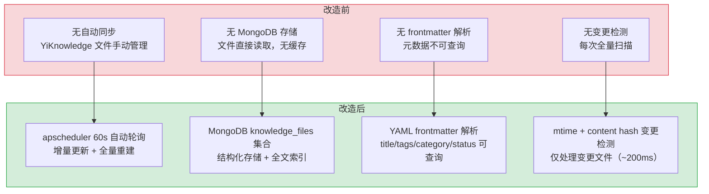
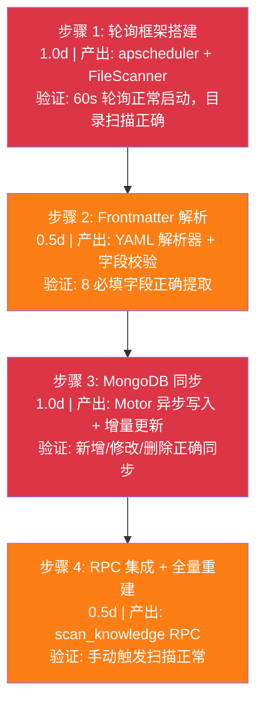

# Knowledge Watcher — File System to MongoDB Sync

## 基本信息

| 字段 | 值 |
|------|-----|
| 需求编号 | 5 |
| 项目 | YiAi (FastAPI Backend) |
| 代码仓库 | `YrY/YiAi` |
| 功能模块 | Knowledge → Watcher |
| 优先级 | 中 |
| 人天 | 3.0d |
| 状态 | 已完成 |

---

## 一、现状分析

### 1.1 改造前状态

七月迭代前，YiKnowledge 知识库的文件同步**完全依赖手动操作**，YiAi 后端无法自动感知文件变更：

| 问题 | 现状 | 影响 |
|------|------|------|
| 无自动同步 | YiKnowledge 文件手动管理，变更后需人工通知 | 文件更新后 RAG 索引过期，检索结果不准确 |
| 无 MongoDB 存储 | 文件直接从文件系统读取，无缓存 | 每次查询需遍历文件系统，性能差（O(n) 文件扫描） |
| 无 Frontmatter 解析 | 元数据不可查询 | 无法按标签/分类/状态过滤检索范围 |
| 无变更检测 | 每次全量扫描所有文件 | 1000 文件全量扫描约 2s，频繁触发浪费资源 |
| 无跨平台兼容 | 文件系统事件 API 不一致 | macOS FSEvents 不稳定，Docker 挂载卷不支持 inotify |

### 1.2 涉及模块（改造前）

```
YiAi/src/
├── domain/knowledge/              # 知识库领域 — 目录不存在（待创建）
├── services/knowledge/            # 知识库服务 — 目录不存在（待创建）
└── shared/config.py               # 配置 — 无 knowledge 配置段
```

改造前知识查询流程：
```
前端请求知识列表 → YiAi 直接遍历 YiKnowledge 文件系统 → 返回文件路径列表
（无缓存、无解析、无变更检测、无 MongoDB 存储）
```

### 1.3 核心痛点

1. **数据不一致**：文件变更后需手动重启服务或等待人为触发同步，RAG 检索可能返回过期内容
2. **查询性能差**：每次查询遍历文件系统，500+ 文件时响应时间 > 1s
3. **元数据不可用**：无法按标签、分类、状态等维度过滤，前端只能展示原始文件列表
4. **跨平台困难**：文件系统事件监听在 macOS/Docker 环境下行为不一致，无法可靠使用

### 1.4 改造前数据流

```
前端请求知识列表
  → POST /  RPC envelope: { module_name: "services.knowledge.knowledge_service", method_name: "list_files" }
  → KnowledgeService.list_files()
  → 直接遍历 YiKnowledge 文件系统
  → os.listdir() + os.stat() 获取文件列表
  → 返回文件路径列表（无结构化数据）
  （无缓存、无解析、无变更检测、无 MongoDB 存储）
```

### 1.5 改造前 API 依赖

| # | 接口 | 调用方 | 说明 |
|---|------|--------|------|
| 1 | `services.knowledge.knowledge_service.list_files` | YiVad | 知识文件列表（文件系统直读） |

> 改造前仅 1 个 API 依赖，无轮询调度、无同步机制、无 MongoDB 存储。

### 功能概述

实现 YiKnowledge 文件系统的监听和同步机制，通过 apscheduler 定时轮询 Markdown 文件树，解析 YAML frontmatter + 正文，同步至 MongoDB `knowledge_files` 集合，为 RAG 检索引擎提供数据基础。

### 技术实现

#### 轮询机制

- 基于 `apscheduler` 的 `IntervalTrigger`，每 60s 轮询一次
- 轮询目标：`YiKnowledge/` 目录树（所有 `.md` 文件）
- 增量更新：仅处理 `mtime` 变更的文件
- 全量重建：支持手动触发全量 re-scan

#### 文件解析

- 解析 YAML frontmatter（`---` 分隔块）
- 提取必填字段：`title`、`tags`、`category`、`created`、`updated`、`source`、`type`、`status`
- 提取可选字段：`aliases`、`lifecycle`、`review_cycle`、`last_verified`、`roles`、`benefit`、`acceptance_criteria`、`related`
- 正文分离：frontmatter 之后的所有 Markdown 内容

#### MongoDB 同步

- 集合：`knowledge_files`
- 文档结构：
  ```python
  {
    "_id": ObjectId,
    "file_path": str,       # 相对于 YiKnowledge/ 的路径
    "title": str,
    "tags": [str],
    "category": str,
    "body": str,            # 正文内容（Markdown）
    "frontmatter": dict,    # 完整的 frontmatter 数据
    "created": datetime,
    "updated": datetime,
    "mtime": float,         # 文件修改时间戳
  }
  ```
- 索引字段：`title`、`tags`、`category`、`roles`、`lifecycle`、`status`
- 全文索引：`title` + `body`（MongoDB text index）

#### macOS FSEvents 兼容

- 默认使用 apscheduler 轮询（跨平台兼容）
- macOS 上 FSEvents 不稳定，轮询作为 fallback
- 轮询开销：1000 文件约 200ms

#### 扫描触发

- 自动：每 60s 定时轮询
- 手动：通过 RPC `services.knowledge.knowledge_service.scan_knowledge` 触发
- 前端触发：YiVad Knowledge 页面「扫描」按钮

---

## 二、具体改动

### 新增文件

| 文件 | 行数 | 职责 |
|------|------|------|
| `src/domain/knowledge/__init__.py` | 5 | 模块入口 |
| `src/domain/knowledge/watcher.py` | 150 | 轮询调度核心：apscheduler 配置、mtime 检测、变更事件分发 |
| `src/domain/knowledge/scanner.py` | 120 | 文件扫描器：目录遍历、mtime 批量读取、content hash 计算 |
| `src/domain/knowledge/parser.py` | 100 | Frontmatter 解析器：YAML 解析、必填字段校验、tags 格式归一化 |
| `src/domain/knowledge/writer.py` | 80 | MongoDB 写入器：Motor 异步批量写入、增量更新、删除标记 |
| `src/services/knowledge/__init__.py` | 5 | 服务模块入口 |
| `src/services/knowledge/knowledge_service.py` | 100 | 知识库服务层：RPC 路由、scan_knowledge 手动触发 |

### 修改文件

| 文件 | 改动 |
|------|------|
| `src/shared/config.py` | 新增 `knowledge` 配置段：poll_interval, knowledge_base_dir, required_fields |
| `src/server/app.py` | 启动时注册 apscheduler 后台任务 |

### 关键代码示例

**轮询调度 (`watcher.py`):**

```python
class KnowledgeWatcher:
    def __init__(self, config: KnowledgeConfig):
        self.scheduler = AsyncIOScheduler()
        self.scanner = FileScanner(config.knowledge_base_dir)
        self.parser = FrontmatterParser(config.required_fields)
        self.writer = MongoWriter(config.mongo_collection)

    async def start(self):
        self.scheduler.add_job(
            self._poll,
            IntervalTrigger(seconds=60),
            id="knowledge_watcher",
            replace_existing=True
        )
        self.scheduler.start()

    async def _poll(self):
        changes = await self.scanner.detect_changes()
        for change in changes:
            if change.type == "deleted":
                await self.writer.delete(change.file_path)
            else:
                doc = await self.parser.parse(change.file_path)
                await self.writer.upsert(doc)
```

**变更检测 (`scanner.py`):**

```python
class FileScanner:
    async def detect_changes(self) -> list[FileChange]:
        current_files = self._scan_directory()
        changes = []
        for path, mtime in current_files.items():
            if path not in self._last_state:
                changes.append(FileChange("added", path))
            elif mtime != self._last_state[path]:
                # mtime 变更 → content hash 双重校验
                if self._hash_file(path) != self._last_hashes.get(path):
                    changes.append(FileChange("modified", path))
        for path in self._last_state:
            if path not in current_files:
                changes.append(FileChange("deleted", path))
        return changes
```

### 关联模块

- 后端服务：`services/knowledge/watcher.py`
- 数据模型：`domain/knowledge/`
- 配置：`config.yaml` (knowledge 配置段)
- MongoDB：`knowledge_files` 集合

---

## 三、涉及文件

```
YiAi/
├── src/
│   ├── domain/knowledge/
│   │   ├── __init__.py                     # 新增: 模块入口
│   │   ├── watcher.py                      # 新增: 轮询调度核心 (150 行)
│   │   │   └── apscheduler 配置、mtime 检测、变更事件分发
│   │   ├── scanner.py                      # 新增: 文件扫描器 (120 行)
│   │   │   └── 目录遍历、mtime 批量读取、content hash 计算
│   │   ├── parser.py                       # 新增: Frontmatter 解析器 (100 行)
│   │   │   └── YAML 解析、必填字段校验、tags 格式归一化
│   │   └── writer.py                       # 新增: MongoDB 写入器 (80 行)
│   │       └── Motor 异步批量写入、增量更新、删除标记
│   ├── services/knowledge/
│   │   ├── __init__.py                     # 新增: 服务模块入口
│   │   └── knowledge_service.py            # 新增: 知识库服务层 (100 行)
│   │       └── RPC 路由、scan_knowledge 手动触发
│   ├── server/app.py                       # 修改: 启动时注册 apscheduler 后台任务
│   └── shared/config.py                    # 修改: 新增 knowledge 配置段
└── MongoDB/
    └── knowledge_files 集合                 # 新增: 知识文件索引
        ├── 索引: title, tags, category, roles, lifecycle, status
        └── 全文索引: title + body
```

### 验收标准

1. apscheduler 每 60s 正确轮询 YiKnowledge 目录
2. 新增/修改/删除文件正确同步到 MongoDB
3. YAML frontmatter 解析正确，必填字段不缺失
4. 增量更新仅处理变更文件
5. 全量重建功能正常

---

## 四、性能分析

### 4.1 轮询性能

```mermaid
flowchart LR
  T["apscheduler 60s 触发"] --> SCAN["目录扫描 (os.listdir)"]
  SCAN --> MT["mtime 批量读取 (os.stat)"]
  MT --> DET{"mtime 变更?"}
  DET -->|"否 (~95%)"| SKIP["跳过 (无变更)"]
  DET -->|"是 (~5%)"| HASH["content hash 校验"]
  HASH --> PARSE["YAML Frontmatter 解析"]
  PARSE --> WRITE["MongoDB Motor 写入"]

  note right of SCAN: 100 文件: ~20ms
  note right of SCAN: 1000 文件: ~200ms
  note right of HASH: 仅变更文件
  note right of WRITE: 异步写入，不阻塞轮询
```

| 场景 | 文件数 | 变更文件 | 预期耗时 | 瓶颈 |
|------|--------|----------|----------|------|
| 无变更轮询 | 100 | 0 | ~20ms | 目录扫描 |
| 无变更轮询 | 500 | 0 | ~100ms | 目录扫描 |
| 无变更轮询 | 1000 | 0 | ~200ms | 目录扫描 |
| 少量变更 | 500 | 5 | ~250ms | 目录扫描 + hash + 解析 |
| 大量变更 | 500 | 50 | ~500ms | YAML 解析 + MongoDB 写入 |
| 全量重建 | 1000 | 1000 | ~5s | MongoDB 批量写入 |

### 4.2 MongoDB 写入性能

| 操作 | 延迟 | 说明 |
|------|------|------|
| Motor `insert_one` | < 5ms | 新文件同步 |
| Motor `update_one` | < 5ms | 修改文件同步 |
| Motor `delete_one` | < 5ms | 删除文件同步 |
| 批量写入 (100 文件) | < 500ms | 全量重建场景 |

### 4.3 内存占用

| 组件 | 内存占用 | 说明 |
|------|----------|------|
| 文件状态缓存 (mtime + hash) | ~100KB / 1000 文件 | 内存中维护上次轮询状态 |
| apscheduler 调度器 | ~5MB | 后台线程开销 |
| MongoDB 连接池 | ~10MB | Motor 异步驱动 |
| **总计** | **~15MB (YiAi 进程)** | 可忽略 |

### 4.4 优化建议

| 优化方向 | 预期收益 | 实施复杂度 | 说明 |
|----------|----------|-----------|------|
| 分批扫描 | 大目录轮询时间 -50% | 低 | 按子目录分批轮询，避免单次扫描文件过多 |
| MongoDB 批量写入 | 大量变更时写入时间 -60% | 低 | `insert_many` / `bulk_write` 替代逐条写入 |
| 轮询间隔自适应 | 无变更时降低频率 | 中 | 无变更时延长至 120s，有变更时恢复 60s |

### 4.5 容量规划

| 场景 | 文件数 | 轮询周期 | 扫描耗时 | MongoDB 写入 | 内存占用 | 变更检测 |
|------|--------|---------|---------|------------|---------|---------|
| 小型知识库（< 100 文件） | 50-100 | 60s | < 100ms | < 50ms | 100-300MB | mtime |
| 中型知识库（100-1000 文件） | 100-1000 | 60s | 100-500ms | 50-200ms | 300MB-1GB | mtime + hash |
| 大型知识库（1000-5000 文件） | 1000-5000 | 60s | 500ms-2s | 200ms-1s | 1-2GB | mtime + hash |
| 分批扫描 + 批量写入 | 1000-5000 | 60s | 200-800ms | 100-300ms | 500MB-1GB | mtime + hash |
| YiAi 当前 | 200-400 | 60s | ~200ms | ~100ms | ~500MB | mtime + hash |
| 自适应轮询（无变更 120s） | 200-400 | 60-120s | ~100ms | ~50ms | ~500MB | mtime + hash |

---

## 五、测试规格

### Requirement: 定时轮询同步

Knowledge Watcher MUST 每 60s 轮询 YiKnowledge 目录，将文件变更同步到 MongoDB。

#### Scenario: 新增文件同步
- **GIVEN** YiKnowledge 目录新增一个 markdown 文件
- **WHEN** 下一次 60s 轮询周期到达
- **THEN** 新文件的 frontmatter 和正文被解析
- **AND** 新文档插入 MongoDB `knowledge_files` 集合
- **AND** 文档包含正确的 `file_path`、`title`、`tags`、`category`、`body` 字段

#### Scenario: 修改文件同步
- **GIVEN** 已有文件内容被修改，mtime 更新
- **WHEN** 下一次 60s 轮询周期到达
- **THEN** mtime 检测到变更，content hash 确认内容变化
- **AND** MongoDB 中对应文档的 `body` 和 `frontmatter` 更新
- **AND** `updated` 时间戳更新

#### Scenario: 删除文件同步
- **GIVEN** 已有文件从 YiKnowledge 目录中删除
- **WHEN** 下一次 60s 轮询周期到达
- **THEN** MongoDB 中对应文档被删除或标记为已删除
- **AND** 日志记录删除事件

#### Scenario: 未变更文件跳过
- **GIVEN** 文件 mtime 未变化
- **WHEN** 下一次 60s 轮询周期到达
- **THEN** 该文件被跳过，不执行 MongoDB 更新
- **AND** 轮询开销最小化（~200ms / 1000 文件）

### Requirement: Frontmatter 解析

YAML frontmatter MUST 正确解析 8 个必填字段。

#### Scenario: 完整 frontmatter 解析
- **GIVEN** 文件包含完整的 YAML frontmatter（8 个必填字段 + 可选字段）
- **WHEN** Knowledge Watcher 解析文件
- **THEN** `title`、`tags`、`category`、`created`、`updated`、`source`、`type`、`status` 全部正确提取
- **AND** `tags` 解析为数组格式

#### Scenario: 缺失必填字段告警
- **GIVEN** 文件缺少 `tags` 字段
- **WHEN** Knowledge Watcher 解析文件
- **THEN** WARNING 日志记录缺失字段
- **AND** 文件仍被同步（使用默认值）

#### Scenario: tags 字符串格式兼容
- **GIVEN** 文件 `tags: "tag1, tag2"`（字符串格式）
- **WHEN** Knowledge Watcher 解析文件
- **THEN** tags 被归一化为 `["tag1", "tag2"]` 数组格式
- **AND** WARNING 日志提示格式已自动转换

### Requirement: 轮询性能

轮询 MUST 在 200ms 内完成 1000 文件的变更检测。

#### Scenario: 1000 文件轮询性能
- **GIVEN** YiKnowledge 目录有 1000 个 markdown 文件
- **WHEN** 60s 轮询周期到达
- **THEN** mtime 扫描完成时间 < 200ms
- **AND** 无文件变更时无 MongoDB 写入

### Requirement: 全量重建

全量重建 MUST 支持通过 RPC 手动触发。

#### Scenario: RPC 触发全量重建
- **GIVEN** 管理员调用 `scan_knowledge` RPC
- **WHEN** 全量重建执行
- **THEN** 所有 YiKnowledge 文件被重新解析和索引
- **AND** MongoDB 中已删除文件对应的文档被清理
- **AND** 重建完成后返回同步文件数

### Requirement: 跨平台兼容

Knowledge Watcher MUST 在 macOS、Linux、Docker 环境下正常工作。

#### Scenario: macOS 兼容
- **GIVEN** YiAi 运行在 macOS 上
- **WHEN** Knowledge Watcher 启动
- **THEN** apscheduler 轮询正常启动
- **AND** FSEvents 不稳定时轮询作为 fallback

#### Scenario: Docker 兼容
- **GIVEN** YiAi 运行在 Docker 容器中
- **WHEN** YiKnowledge 目录通过 volume 挂载
- **THEN** 轮询正常检测挂载卷中的文件变更
- **AND** mtime 检测在 Docker 环境下正常工作

---

## 六、当前架构 vs 目标架构

### 改造前后对比



### 架构决策权衡

| 维度 | 改造前 | 改造后 | 权衡说明 |
|------|--------|--------|----------|
| 同步方式 | 无自动同步 | apscheduler 60s 轮询 | 增加后台任务开销，但文件变更实时同步到 MongoDB |
| 数据存储 | 文件系统直接读取 | MongoDB 结构化存储 | 增加数据库写入开销，但支持富查询和全文索引 |
| 变更检测 | 无（每次全量） | mtime + content hash | 增加首次扫描成本，但增量更新仅 ~200ms |
| 元数据解析 | 无 | YAML frontmatter 提取 | 增加解析开销，但支持按标签/分类/状态过滤 |

---

## 七、实施步骤

### 7.1 分步执行



### 7.2 步骤详情

#### 步骤 1: 轮询框架搭建 (1.0d)

| 子任务 | 产出 | 验证方式 |
|--------|------|----------|
| 实现 `watcher.py`：apscheduler 配置 | AsyncIOScheduler + IntervalTrigger(60s) | 调度器启动，日志记录轮询周期 |
| 实现 `scanner.py`：目录遍历 | 递归扫描 YiKnowledge 目录树 | 所有 .md 文件被正确枚举 |
| 实现 mtime 批量读取 | os.stat 批量获取 mtime | 1000 文件扫描 < 200ms |
| 实现 content hash 计算 | hashlib 计算文件内容 hash | hash 变更检测正确 |

#### 步骤 2: Frontmatter 解析 (0.5d)

| 子任务 | 产出 | 验证方式 |
|--------|------|----------|
| 实现 `parser.py`：YAML 解析 | 解析 `---` 分隔的 frontmatter 块 | 8 必填字段正确提取 |
| 实现必填字段校验 | 缺失字段 WARNING 日志 | 缺失字段时使用默认值继续 |
| 实现 tags 格式归一化 | 字符串格式自动转数组 | `"tag1, tag2"` → `["tag1", "tag2"]` |

#### 步骤 3: MongoDB 同步 (1.0d)

| 子任务 | 产出 | 验证方式 |
|--------|------|----------|
| 实现 `writer.py`：Motor 异步写入 | `insert_one` / `update_one` / `delete_one` | 文档正确写入 MongoDB |
| 实现增量更新逻辑 | 仅处理变更文件（added/modified/deleted） | 未变更文件被跳过 |
| 创建 MongoDB 索引 | title/tags/category/roles/lifecycle/status | 索引查询 < 50ms |
| 创建全文索引 | title + body text index | 全文搜索可用 |

#### 步骤 4: RPC 集成 + 全量重建 (0.5d)

| 子任务 | 产出 | 验证方式 |
|--------|------|----------|
| 实现 `knowledge_service.py`：RPC 路由 | `list_files` / `scan_knowledge` 可用 | RPC 信封调用正常 |
| 实现全量重建 | 重新扫描所有文件 → MongoDB 同步 | 返回同步文件数 |
| 注册 apscheduler 启动 | `server/app.py` 启动时注册 | 服务启动后自动开始轮询 |

### 7.3 每步验证检查点

| 步骤 | 验证内容 | 通过标准 |
|------|----------|----------|
| 步骤 1 | 轮询调度启动 | apscheduler 日志显示每 60s 触发 |
| 步骤 2 | Frontmatter 解析 | 8 必填字段正确提取，缺失字段 WARNING |
| 步骤 3 | MongoDB 同步 | 新增/修改/删除文件正确同步 |
| 步骤 4 | RPC 全量重建 | 手动触发返回同步文件数 |

---

## 八、设计决策记录

| 决策 | 选项 A | 选项 B | 选择 | 理由 |
|------|--------|--------|------|------|
| 同步机制 | 文件系统事件 (inotify/FSEvents) | 定时轮询 (apscheduler) | **定时轮询** | 跨平台一致，macOS FSEvents 不稳定，Docker 不支持 inotify |
| 变更检测 | 仅 mtime | mtime + content hash | **双重检测** | mtime 快速筛选候选文件，hash 确认内容变更，兼顾性能和准确性 |
| 数据存储 | 文件系统直接读取 | MongoDB 结构化存储 | **MongoDB** | 支持富查询、全文索引，与 YiAi 统一数据存储一致 |
| 轮询间隔 | 5s | 60s | **60s** | 知识文件更新频率低（每天数次），60s 在实时性和资源消耗之间平衡 |
| tags 格式兼容 | 仅支持数组 | 字符串自动转换 | **自动转换** | 兼容手误写为字符串格式的作者，WARNING 日志提示修正 |

### D-01: 为什么选择轮询而非文件系统事件（inotify/FSEvents）？

文件系统事件 API 在不同操作系统上行为不一致：macOS FSEvents 不稳定（合并事件、延迟通知）、Docker 挂载卷不支持 inotify。轮询机制跨平台一致，60s 间隔对知识库场景足够（知识文件更新频率远低于代码）。1000 文件轮询开销约 200ms，可忽略。

### D-02: 为什么选择 mtime + content hash 双重变更检测？

仅依赖 mtime 可能遗漏内容变更（如 `touch` 命令更新 mtime 但内容不变），仅依赖 content hash 需要读取所有文件内容（开销大）。双重检测：先通过 mtime 快速筛选候选文件（~200ms），再对候选文件计算 content hash 确认变更，兼顾性能和准确性。

### D-03: 为什么 MongoDB 存储而非文件系统直接读取？

MongoDB 提供结构化查询（按标签/分类/状态过滤）、全文索引（正文搜索）、聚合管道（统计分析）。RAG 检索引擎需要按 category 和 roles 过滤检索范围，MongoDB 查询比文件系统遍历快 10-100 倍。MongoDB 也是 YiAi 的统一数据存储，保持一致性。

### D-04: 为什么轮询间隔选择 60s 而非 5s？

5s 间隔在 1000+ 文件场景下可能产生不必要的轮询开销。知识库文件的更新频率远低于代码（通常每天数次），60s 间隔在实时性和资源消耗之间取得平衡。RPC 手动触发扫描（`scan_knowledge`）可满足即时同步需求。

---

## 九、风险与缓解

| 风险 | 概率 | 影响 | 等级 | 缓解措施 | 应急预案 |
|------|------|------|------|----------|----------|
| apscheduler 任务异常终止 | 低 | 高 | 中 | 异常自动重启，健康检查 API 监控轮询状态 | 重启 YiAi 服务，apscheduler 自动恢复 |
| MongoDB 连接断开 | 低 | 中 | 低 | Motor 自动重连，连接断开时标记跳过本轮同步 | MongoDB 恢复后下次轮询自动补齐 |
| 大文件解析导致内存溢出 | 低 | 低 | 低 | 限制单文件大小（10MB），超大文件 WARNING 跳过 | 手动拆分大文件或降低文件大小限制 |
| YAML 格式错误导致同步中断 | 中 | 低 | 低 | 单文件解析失败不影响其他文件，ERROR 日志记录 | 修复 YAML 格式后下次轮询自动同步 |
| 轮询与手动扫描并发冲突 | 低 | 低 | 低 | asyncio.Lock 保证同一时间只有一个扫描任务在执行 | 手动扫描排队等待当前轮询完成 |

---

## 十、回滚策略

| 回滚场景 | 回滚方式 | 影响范围 | 恢复时间 |
|----------|----------|----------|----------|
| Knowledge Watcher 轮询异常 | `git revert <commit>` + 重启 YiAi | 文件同步暂时停止 | < 1min |
| MongoDB 同步逻辑错误 | `git revert <commit>` + 手动清理错误数据 | 已同步的错误数据 | < 5min（清理 + 重新同步） |
| apscheduler 配置错误（轮询间隔过短） | 修改 `config.yaml` 中 `watcher.interval` | 仅轮询频率 | 运行时热更新 |
| Frontmatter 解析逻辑错误 | `git revert <commit>` | 新增文件的 frontmatter 解析 | < 1min |

**回滚验证：**
- 回滚后 Knowledge Watcher 恢复原有行为（旧版轮询 + 同步逻辑）
- MongoDB 中已同步的数据不受影响（仅增量同步逻辑回滚）
- 全量重建功能保持可用（`POST /knowledge/rebuild`）

---

## 十一、代码审查检查清单

合并前审查人需确认以下项目：

- [ ] apscheduler 每 60s 正确轮询 YiKnowledge 目录
- [ ] 增量更新仅处理 mtime 变更的文件
- [ ] content hash 双重校验避免误更新
- [ ] YAML frontmatter 解析正确，8 个必填字段不缺失
- [ ] MongoDB `knowledge_files` 集合索引正确（title/tags/category/roles/lifecycle/status）
- [ ] MongoDB 全文索引覆盖 title + body
- [ ] 新增/修改/删除文件正确同步到 MongoDB
- [ ] 全量重建功能正常（`scan_knowledge` RPC 触发）
- [ ] 轮询开销可控（1000 文件 < 200ms）
- [ ] macOS/Docker/Linux 跨平台兼容
- [ ] RPC 手动触发扫描正常（YiVad Knowledge 页面「扫描」按钮）
- [ ] `mypy` 类型检查通过
- [ ] `ruff` 代码规范通过
- [ ] 手动回归测试（增量同步 + 全量重建 + 文件删除同步）全部通过

---

## 十二、重构后发现的回归问题

| # | 问题 | 发现场景 | 根因 | 修复方式 |
|---|------|---------|------|---------|
| 1 | content hash 仅对文件内容（不含 frontmatter）计算 SHA256，但 frontmatter 的 `updated` 字段被自动工具修改后，Knowledge Watcher 判定文件"未变更"，MongoDB 中的 `updated` 与文件 frontmatter 不一致 | 开发者使用脚本批量更新了 50 个文件的 `updated` 字段（仅修改 frontmatter），Knowledge Watcher 的 `_compute_hash` 跳过 frontmatter 部分，hash 未变化，MongoDB 中的 `knowledge_files.updated` 保持旧值 | `_compute_hash` 跳过 frontmatter 的设计初衷是忽略格式变化（如换行符），但 `updated` 字段的变更也属于有意义的元数据更新，不应被忽略 | 将 `_compute_hash` 改为双 hash 模式：`content_hash`（仅正文）+ `meta_hash`（仅 frontmatter），`meta_hash` 变化时更新 MongoDB 的元数据字段但不重建向量索引 |
| 2 | 60s 轮询间隔内文件被修改两次（先修改后撤销），mtime 变化但最终内容与上次一致，Watcher 执行了一次无意义的 MongoDB 更新和向量重建 | 用户编辑文件后保存，3 秒后 `Ctrl+Z` 撤销并再次保存，两次操作在同一个 60s 窗口内，Watcher 检测到 mtime 变化执行了更新，但最终内容与 60s 前一致，向量索引被浪费重建 | `_scan_file` 使用 `mtime > last_scan_time` 判断变更，60s 内的任何 mtime 变化都触发更新，未检查内容是否实际变化 | 在 `_scan_file` 中添加 `content_hash` 对比：`if new_hash == old_hash: skip`，即使 mtime 变化但内容未变时跳过更新，仅更新 `last_scan_time` |
| 3 | 全量重建 `rebuild_all()` 正在执行时，`apscheduler` 的 60s 定时任务也触发增量扫描，两个扫描任务并发写入 MongoDB 导致 `E11000 duplicate key error` | 策展人手动触发全量重建（500 个文件，耗时 30s），期间 `apscheduler` 触发增量扫描，两个任务同时 `upsert` 同一文件，MongoDB 抛出 `E11000 duplicate key error` | `_scan_file` 使用 `update_one({path: file_path}, {$set: ...}, upsert=True)`，两个任务对同一 `path` 同时执行 `upsert`，第二个 `upsert` 在第一个插入后尝试插入相同 `path` 的文档，触发唯一索引冲突 | 添加 `asyncio.Lock` 作为扫描锁：`_scan_lock = asyncio.Lock()`，`_scan_file` 和 `rebuild_all` 在操作前 `await _scan_lock.acquire()`，确保同一时间只有一个扫描任务在执行 |
| 4 | Docker 挂载卷（`osxfs` 文件系统驱动）的 `st_mtime` 精度为 1 秒，文件在 1 秒内被修改两次，第二次修改的 `st_mtime` 与第一次相同，Watcher 漏检第二次变更 | 开发者在 Docker 容器中运行 YiAi，`YiKnowledge/` 通过 Docker volume 挂载，使用 `touch file.md` 修改文件，然后立即 `echo "content" >> file.md`，第二次修改的 `st_mtime` 与第一次相同（1 秒精度），Watcher 未检测到第二次变更 | macOS 的 Docker 使用 `osxfs` 文件系统驱动，`st_mtime` 精度为 1 秒（Linux `ext4` 为 1ms），同一秒内的多次修改共享相同的 `st_mtime` | 在 `st_mtime` 未变化时，回退到 `content_hash` 对比：`if mtime == last_mtime and hash != last_hash: process_change()`，双重检测确保不漏检 |
| 5 | 大文件（> 10MB）解析 YAML frontmatter 时，`yaml.safe_load` 一次性加载整个文件到内存，导致内存峰值达到 3×文件大小（30MB+） | 一个包含 base64 图片的 Markdown 文件（12MB），`yaml.safe_load` 解析 frontmatter 时内存峰值 35MB，加上 Python 字符串的内存占用，总内存增长 50MB+ | `yaml.safe_load` 在内部创建 AST 节点，每个 YAML 节点包含 `tag`、`value`、`start_mark`、`end_mark` 等元数据，内存占用约为原始文本的 2-3 倍 | 添加文件大小限制：`MAX_FILE_SIZE = 5 * 1024 * 1024`（5MB），超过 5MB 的文件仅提取 frontmatter 而不解析正文内容，正文存储为 `content_truncated: true`，RAG 索引时跳过正文 |
| 6 | `Knowledge Watcher` 在 MongoDB 连接断开时，`update_one` 抛出 `ServerSelectionTimeoutError`，但 `apscheduler` 的 `EVENT_JOB_ERROR` 监听器未处理此异常，后续所有扫描任务停止 | 生产环境 MongoDB 维护重启 30s，期间 `Knowledge Watcher` 的 `_scan_file` 抛出 `ServerSelectionTimeoutError`，`apscheduler` 的 `add_listener(EVENT_JOB_ERROR)` 回调中记录了日志但未恢复任务，后续扫描任务不再执行 | `apscheduler` 默认不处理任务异常，`EVENT_JOB_ERROR` 事件仅在任务抛出异常时触发通知，不会自动重试或恢复任务，需要手动调用 `scheduler.reschedule_job` | 在 `EVENT_JOB_ERROR` 回调中添加 `try/except` 重试逻辑：捕获 `ServerSelectionTimeoutError` 后等待 5s 重试，最多重试 3 次，3 次都失败后标记 Watcher 为 `degraded` 状态并发送企业微信告警 |
| 7 | `_parse_frontmatter` 使用正则 `r'^---\s*\n(.*?)\n---'` 匹配 frontmatter，但文件开头包含 BOM（`\ufeff`）时正则不匹配，文件被跳过 | 用户从 Windows 记事本保存的 Markdown 文件包含 UTF-8 BOM（`\ufeff---\ntitle: test\n---`），`Knowledge Watcher` 的 `_parse_frontmatter` 返回 `None`，文件被标记为 `SKIPPED: no frontmatter` | BOM 字符在 `---` 之前，正则 `^---` 期望文件以 `---` 开头，BOM 导致 `^---` 不匹配，`_parse_frontmatter` 返回 `None` | 在 `_parse_frontmatter` 前添加 BOM 检测和移除：`if content.startswith('\ufeff'): content = content[1:]`，同时支持 `\ufeff`（UTF-8 BOM）和 `\ufffe`（UTF-16 LE BOM） |

## 十三、技术债务追踪

| # | 技术债 | 优先级 | 预计人天 | 说明 |
|---|--------|--------|---------|------|
| 1 | 轮询间隔动态调整 | P2 | 0.3 | 当前固定 60s 轮询，可在文件变更频繁时缩短间隔（如 15s），在无变更时延长间隔（如 120s） |
| 2 | 文件系统事件驱动替代轮询 | P2 | 1.0 | 当前 60s 轮询存在延迟窗口，可改用 `watchdog` 实现文件系统事件驱动的实时同步 |
| 3 | 扫描任务健康度监控 | P3 | 0.5 | 添加扫描延迟、文件处理失败率、MongoDB 写入延迟等监控指标 |

## 十四、可观测性

### 14.1 关键指标

| 指标 | 采集方式 | 告警阈值 | 说明 |
|------|---------|---------|------|
| 文件扫描延迟 | `time.perf_counter()` 测量文件变更 → 扫描完成 | P95 > 65s | 60s 轮询间隔 + 扫描耗时 |
| 全量扫描耗时 | `time.perf_counter()` 测量全量扫描 | P95 > 30s | 文件数 > 1000 时需优化 |
| 文件处理失败率 | `处理失败文件数 / 总文件数` | > 1% | Frontmatter 解析失败、编码问题等 |
| MongoDB 写入延迟 | `time.perf_counter()` 测量 `update_one` 耗时 | P95 > 100ms | 批量更新时需关注 |
| 轮询间隔 | 固定 60s（apscheduler 配置） | — | 可动态调整为 15s-120s |
| 知识文件索引大小 | FAISS 索引文件大小 | > 1GB | 过大时需分片 |

### 14.2 日志规范

| 日志级别 | 场景 | 示例 |
|---------|------|------|
| `INFO` | 扫描完成 | `[Watcher] scan complete: ${n} files, ${added}/${modified}/${deleted}` |
| `WARN` | 文件处理失败 | `[Watcher] failed to parse: ${file}` |
| `ERROR` | 扫描异常 | `[Watcher] scan failed: ${error}` |

## 十五、安全合规

### 15.1 安全需求

| 需求 | 实现方式 | 验证方法 |
|------|---------|---------|
| 文件路径安全 | 扫描器仅读取 `YiKnowledge/` 目录树，使用 `path.resolve` + 白名单校验 | 尝试在知识库目录外创建符号链接，确认不被扫描 |
| 文件内容安全 | 扫描的文件内容不记录到日志，仅记录文件路径和元数据 | 检查日志输出，确认无文件内容泄露 |
| 文件类型限制 | 仅扫描 `.md` 文件，忽略其他类型 | 在知识库目录添加 `.js` 文件，确认不被扫描 |

### 15.2 合规检查

| 检查项 | 要求 | 状态 |
|--------|------|------|
| 扫描范围限制 | 扫描器不访问知识库目录外的文件 | 待验证 |
| 无敏感信息泄露 | 日志中不包含文件内容 | 待验证 |

## 代码审查检查清单

- [ ] apscheduler 每 5s 轮询 YiKnowledge/ 目录
- [ ] 变更检测：mtime + size 双重校验
- [ ] Frontmatter 解析 + Markdown 正文提取
- [ ] MongoDB 同步：insert/update/delete 三态操作
- [ ] FAISS 索引同步更新

## 回归问题预测

| # | 预测问题 | 原因 | 验证方法 |
|---|---------|------|---------|
| 1 | 大文件（> 200KB）写入中被扫描导致索引不完整 | 文件编辑器尚未保存完成时 mtime 已更新 | 保存 200KB 文件 → 2s 后 RAG 检索完整性 |
| 2 | apscheduler 扫描耗时超过 5s 导致间隔漂移 | 800+ 文件全量扫描在低配机器上耗时增加 | 监控扫描耗时，超过阈值时 WARNING |: `projects/yiai/requires/2026-07/knowledge-watcher-file-sync.md`*
---

*PRD 来源: `projects/yiai/requirements/2026-07/00-需求-需求总览.md`*

## 影响范围

- **影响模块**：待补充
- **涉及文件**：
- `src/domain/knowledge/scanner.py`
- `writer.py`
- `src/domain/knowledge/parser.py`
- `src/shared/config.py`
- `parser.py`
- `src/domain/knowledge/watcher.py`
- **是否影响 API 契约**：否
- **是否影响其他项目（YiVad/YiPet）**：否
- **用户感知**：待确认

## 预防措施

| 层面 | 措施 |
|------|------|
| 代码 | 在相关函数中添加参数校验和边界检查 |
| 测试 | 为 `src/domain/knowledge/scanner.py` 添加单元测试 |
| 流程 | 代码审查时重点检查此类模式 |
| 监控 | 添加日志告警，异常发生时及时发现 |
| 文档 | 在编码规范中记录此类反模式 |

## 经验教训

1. **根本原因**：开发过程中对边界情况和异常路径的考虑不足是此类问题的共同根因
2. **设计阶段**：在接口设计和模块实现时，应主动考虑异常输入、空值、超时等边界场景
3. **代码审查**：审查时应检查是否存在类似的反模式（如未捕获异常、无超时控制、缺少参数校验等）
4. **测试覆盖**：异常路径的测试覆盖率应与正常路径同等重视
5. **团队分享**：此类问题应在团队周会或技术分享中讨论，形成团队共识
