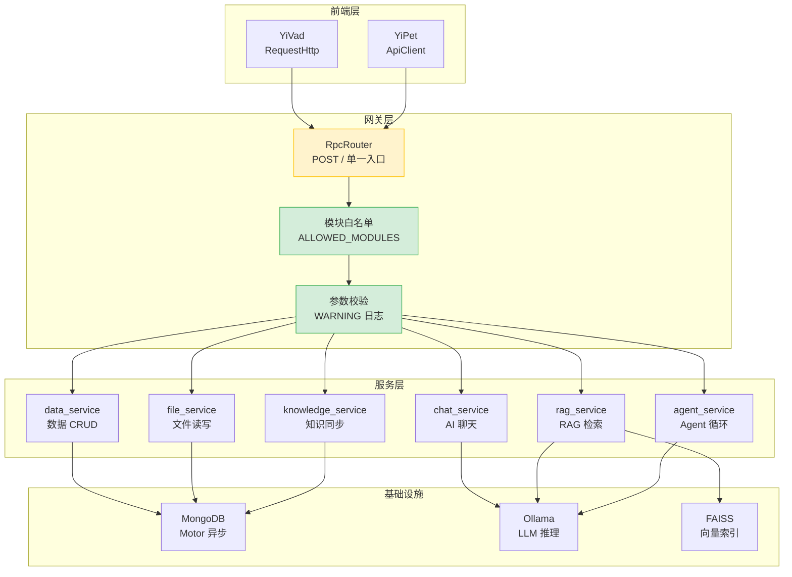
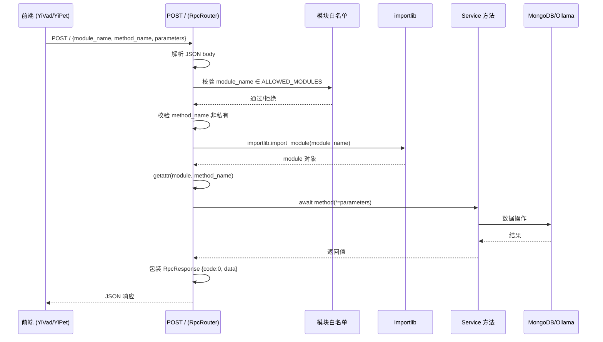
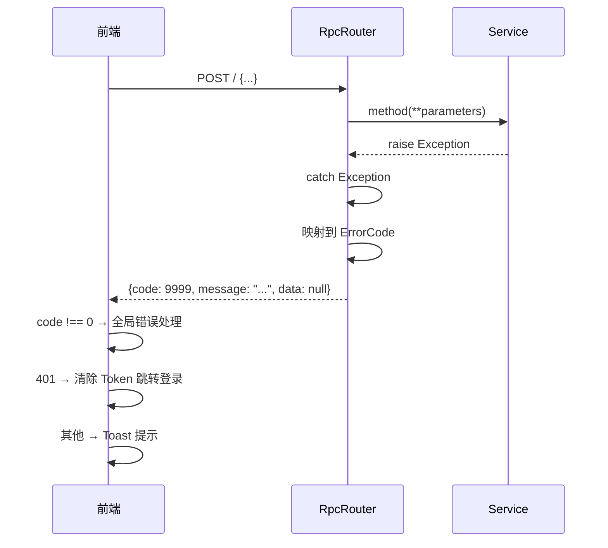
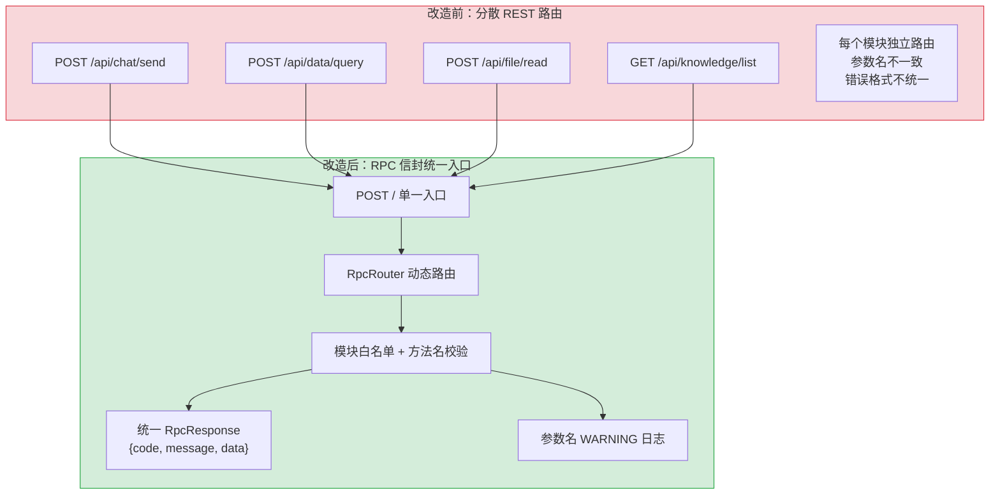

# YA-07-03: RPC 信封协议设计 — 统一跨项目通信契约

> 需求编号：YA-07-03 · 优先级：P0 · 人天：3.0d · 状态：已完成
> 依赖：无（基础架构）

## 背景

YrY 单体仓库包含 3 个应用（YiVad、YiAi、YiPet）和 1 个知识库（YiKnowledge）。YiAi 作为唯一后端，需要同时服务 YiVad（Vue 3.5 管理后台）和 YiPet（Chrome MV3 扩展）两个前端项目。两个前端的技术栈不同（Vue 3 vs React 18）、运行环境不同（浏览器 SPA vs 浏览器扩展），但需要调用相同的后端服务。

传统 REST API 方案存在以下问题：

| 问题 | 影响 |
|------|------|
| 路由分散 | 每个模块独立注册路由，新增服务需修改路由配置，易遗漏 |
| 参数名不一致 | 前端 `query` vs 后端 `filter`、前端 `path` vs 后端 `target_file`，曾导致真实 bug |
| 错误格式不统一 | 不同模块返回不同错误格式，前端需分别处理 |
| 模块发现机制缺失 | 前端无法动态发现可用的服务和方法 |

### 设计目标

| 目标 | 衡量指标 |
|------|----------|
| 单一入口 | 所有 API 调用通过 `POST /` 单一端点 |
| 动态路由 | `module_name.method_name` 自动路由到 Python 模块方法 |
| 统一错误码 | 所有响应使用 `{code, message, data}` 信封格式 |
| 参数名校验 | 前后端参数名契约通过 CLAUDE.md 和 lint 规则强制执行 |
| 类型安全 | Python `TypedDict` 定义参数类型，前端 TypeScript 接口对应 |

---

## 一、现状分析

### 1.1 改造前状态

七月迭代前，YiAi 的 API 路由采用传统 FastAPI 路由模式——每个模块独立注册 REST 端点：

```
# 改造前：分散的 REST 路由
POST /api/chat/send          → chat_service.send_message
POST /api/chat/stop          → chat_service.stop_streaming
POST /api/data/query         → data_service.query_documents
POST /api/data/insert        → data_service.insert_document
POST /api/file/read          → file_service.read_file
POST /api/file/write         → file_service.write_file
GET  /api/knowledge/list     → knowledge_service.list_files
POST /api/rag/query          → rag_service.query
POST /api/rag/chat           → rag_service.chat
...
```

### 1.2 核心痛点

| 痛点 | 位置 | 严重程度 | 影响 |
|------|------|----------|------|
| 路由膨胀 | `server/routes/` | 高 | 每新增一个服务方法需在多个文件注册路由，遗漏风险高 |
| 参数名不匹配 | 前后端接口 | **高（曾导致 bug）** | 前端 `query` → 后端 `filter` 不匹配，后端静默忽略，查询返回空结果 |
| 错误格式不一致 | 各模块 | 中 | 有的返回 `{error: "msg"}`，有的返回 `{detail: "msg"}`，前端需适配 |
| 无模块发现 | 前端 | 中 | 前端无法知道后端有哪些可用服务和方法 |
| 无参数校验 | 后端 | 中 | 未知参数静默忽略，拼写错误无法及时发现 |

### 1.3 改造前数据流

```
前端 (YiVad/YiPet)
  → RequestHttp/ApiClient 构造请求
  → POST /api/<module>/<action>  (分散路由)
  → FastAPI 路由匹配 → Service 方法
  → 返回 {任意格式}  (无统一信封)
  → 前端自行解析 (无统一错误处理)
```

### 1.4 改造前 API 依赖

| # | 接口 | 调用方 | 说明 |
|---|------|--------|------|
| 1 | 分散的 REST 路由 | YiVad, YiPet | 每个模块独立路由，无统一入口 |
| 2 | 无参数名校验 | — | 参数名不匹配时静默失败 |

---

## 二、设计决策

### 决策 1：单一入口 vs 分散路由

| 选项 | 描述 | 优点 | 缺点 |
|------|------|------|------|
| A: 分散 REST 路由 | 每个模块独立注册路由 | RESTful 语义清晰 | 路由膨胀、参数名不一致、错误格式不统一 |
| B: 单一 POST 入口 + 动态路由 | 所有请求 `POST /`，通过 `module_name.method_name` 路由 | 单一路由、自动发现、统一错误处理 | 非 RESTful，所有请求使用 POST |

**选择：B（单一 POST 入口 + 动态路由）**。理由：前端项目（YiVad 和 YiPet）需要调用多种后端服务，单一入口简化了前端 API 层的实现。动态路由通过 Python 的 `importlib` 自动发现模块方法，新增服务无需修改路由配置。

### 决策 2：请求格式 — JSON-RPC vs 自定义信封

| 选项 | 描述 | 优点 | 缺点 |
|------|------|------|------|
| A: JSON-RPC 2.0 | `{jsonrpc, method, params, id}` | 国际标准，工具链成熟 | 字段冗余（`jsonrpc` 版本号），`method` 不支持点号分隔 |
| B: 自定义信封 | `{module_name, method_name, parameters}` | 简洁、语义清晰、支持模块层级 | 非标准，需自行实现 |

**选择：B（自定义信封）**。理由：`module_name` 使用 Python 模块路径（如 `services.ai.chat_service`），`method_name` 为模块中的方法名。这种格式与 Python 的 `importlib` 动态导入天然匹配——`module_name` 直接作为 `importlib.import_module` 的参数，`method_name` 通过 `getattr` 获取。

### 决策 3：错误码方案 — 枚举 vs 字符串

| 选项 | 描述 | 优点 | 缺点 |
|------|------|------|------|
| A: HTTP 状态码 | 使用 HTTP 200/400/500 表达成功/失败 | 标准 HTTP 语义 | 业务错误无法细分（如"资源不存在"和"参数验证失败"都是 400） |
| B: 业务错误码枚举 | `{code: 0, message, data}` 数字错误码 | 细粒度错误分类，前端可精确处理 | 需维护错误码表 |

**选择：B（业务错误码枚举）**。理由：HTTP 层统一返回 200（业务错误也返回 200），通过 `code` 字段区分成功（0）和各类业务错误。前端拦截器统一检查 `code`，非 0 时触发全局错误处理。

---

## 三、协议规范

### 3.1 请求格式

```
POST /  Content-Type: application/json
{
  "module_name": "services.<domain>.<service>",  // Python 模块路径
  "method_name": "<method>",                       // 模块中的可调用方法
  "parameters": { <method-specific shape> }        // 方法参数
}
```

**请求约束**：
- `module_name` 必须是有效的 Python 模块路径，服务端通过 `importlib.import_module` 动态加载
- `method_name` 必须是模块中的公开方法（不以 `_` 开头）
- `parameters` 为可选字段，默认 `{}`
- 所有请求使用 `POST` 方法（即使语义上是读取操作）

### 3.2 响应格式

```typescript
// 成功响应
{ "code": 0, "message": "ok", "data": <any> }

// 业务错误响应
{ "code": <ErrorCode>, "message": "<description>", "data": null }

// HTTP 层错误（非 RPC 信封，HTTP 状态码非 200）
{ "detail": "<error message>" }
```

### 3.3 标准错误码

| 错误码 | 常量名 | 含义 | 触发场景 | 前端处理 |
|--------|--------|------|----------|----------|
| `0` | `SUCCESS` | 成功 | 所有正常响应 | 正常处理 `data` |
| `1001` | `PARAM_VALIDATION_ERROR` | 参数验证失败 | 缺少必填字段、类型不匹配 | 提示用户检查输入 |
| `1002` | `RESOURCE_NOT_FOUND` | 资源不存在 | 查询/更新/删除不存在的文档 | 提示"数据不存在" |
| `1003` | `RESOURCE_ALREADY_EXISTS` | 资源已存在 | 创建重复文档 | 提示"数据已存在" |
| `2001` | `AI_SERVICE_UNAVAILABLE` | AI 服务不可用 | Ollama 连接失败、模型未加载 | 提示"AI 服务暂不可用" |
| `2002` | `AI_INFERENCE_TIMEOUT` | AI 推理超时 | LLM 调用超过配置的时间限制 | 提示"AI 响应超时" |
| `3001` | `FILE_IO_ERROR` | 文件读写失败 | 磁盘 I/O 错误、路径无效 | 提示"文件操作失败" |
| `3002` | `FILE_NOT_FOUND` | 文件不存在 | 读取不存在的文件 | 提示"文件不存在" |
| `4001` | `AUTH_FAILED` | 认证失败 | Token 无效或过期 | 清除 Token，跳转登录 |
| `4002` | `PERMISSION_DENIED` | 权限不足 | 无权限访问资源 | 提示"权限不足" |
| `5001` | `DATABASE_ERROR` | 数据库错误 | MongoDB 连接失败或操作异常 | 提示"系统异常" |
| `9999` | `UNKNOWN_ERROR` | 未知内部错误 | 未分类的服务器异常 | 提示"系统异常" |

### 3.4 参数名契约

> 前后端参数名不一致曾导致真实 bug——后端静默忽略 `query`，对 `path` 返回 422。

| 正确 | 错误 | 上下文 | 说明 |
|---------|-------|---------|------|
| `filter` | `query` | `data_service.query_documents` 参数 | MongoDB 查询过滤条件 |
| `target_file` | `path` | `/read-file`、`/write-file` 端点 | 目标文件路径 |
| `cname` | `collection_name` | `data_service` collection 参数 | MongoDB 集合名称 |
| `session_key` | `sessionId` | `chat_service` 会话参数 | 会话唯一标识 |
| `rag_type` | `mode` | `rag_service.query` 参数 | RAG 检索模式 |

---

## 四、目标架构

### 4.1 服务端路由实现

```python
# src/server/rpc_router.py — 核心路由逻辑
import importlib
from typing import Any
from fastapi import Request
from shared.response import RpcResponse
from shared.error_codes import ErrorCode

class RpcRouter:
    """RPC 信封路由器：{module_name, method_name, parameters} → Python 方法调用"""

    # 模块白名单：仅允许调用白名单中的模块
    ALLOWED_MODULES = {
        "services.ai.chat_service",
        "services.ai.rag_service",
        "services.data.data_service",
        "services.file.file_service",
        "services.knowledge.knowledge_service",
        "services.agent.agent_service",
    }

    async def dispatch(self, request: Request) -> RpcResponse:
        body = await request.json()
        module_name = body.get("module_name")
        method_name = body.get("method_name")
        parameters = body.get("parameters", {})

        # 1. 模块白名单校验
        if module_name not in self.ALLOWED_MODULES:
            return RpcResponse.error(
                ErrorCode.PERMISSION_DENIED,
                f"Module '{module_name}' is not in allowed list"
            )

        # 2. 方法名安全校验：拒绝私有方法
        if method_name.startswith("_"):
            return RpcResponse.error(
                ErrorCode.PARAM_VALIDATION_ERROR,
                f"Method '{method_name}' is private"
            )

        # 3. 动态导入模块
        try:
            module = importlib.import_module(module_name)
        except ModuleNotFoundError:
            return RpcResponse.error(
                ErrorCode.RESOURCE_NOT_FOUND,
                f"Module '{module_name}' not found"
            )

        # 4. 获取方法
        method = getattr(module, method_name, None)
        if method is None:
            return RpcResponse.error(
                ErrorCode.RESOURCE_NOT_FOUND,
                f"Method '{method_name}' not found in module '{module_name}'"
            )

        # 5. 调用方法
        try:
            result = await method(**parameters) if hasattr(method, '__call__') else method(**parameters)
            return RpcResponse.ok(result)
        except Exception as e:
            return RpcResponse.error(ErrorCode.UNKNOWN_ERROR, str(e))
```

### 4.2 统一响应封装

```python
# src/shared/response.py
from typing import Any, Optional
from pydantic import BaseModel
from shared.error_codes import ErrorCode

class RpcResponse(BaseModel):
    code: int = 0
    message: str = "ok"
    data: Optional[Any] = None

    @classmethod
    def ok(cls, data: Any = None) -> "RpcResponse":
        return cls(code=0, message="ok", data=data)

    @classmethod
    def error(cls, code: ErrorCode, message: str) -> "RpcResponse":
        return cls(code=code.value, message=message, data=None)
```

### 4.3 前端调用封装

```typescript
// YiVad: src/utils/RequestHttp.ts
// YiPet: src/api/core/ApiClient.ts

// 统一调用模式
async function rpcCall<T>(
  moduleName: string,
  methodName: string,
  parameters: Record<string, any> = {}
): Promise<T> {
  const response = await fetch("/", {
    method: "POST",
    headers: { "Content-Type": "application/json" },
    body: JSON.stringify({
      module_name: moduleName,
      method_name: methodName,
      parameters,
    }),
  });

  const envelope: RpcResponse<T> = await response.json();

  if (envelope.code !== 0) {
    // 统一错误处理
    if (envelope.code === 4001) {
      // 认证失败：清除 Token，跳转登录
      clearAuthAndRedirect();
    }
    throw new RpcError(envelope.code, envelope.message);
  }

  return envelope.data;
}

// 使用示例
const sessions = await rpcCall<Session[]>(
  "services.ai.chat_service",
  "get_sessions",
  { filter: {}, limit: 20 }
);
```

### 4.4 模块交互拓扑



---

## 五、数据流

### 5.1 请求处理流程



### 5.2 错误处理流程



### 5.3 关键数据流

| 调用方 | module_name | method_name | 频率 | 延迟要求 |
|--------|-------------|-------------|------|----------|
| YiVad 菜单加载 | `services.data.data_service` | `query_documents` | 每次页面加载 | < 500ms |
| YiVad/YiPet 聊天 | `services.ai.chat_service` | `chat` | 高频（SSE 流式） | 首 token < 2s |
| YiPet 会话列表 | `services.ai.chat_service` | `get_sessions` | 每次打开聊天 | < 500ms |
| YiPet 知识树 | `services.knowledge.knowledge_service` | `get_tree` | 每次打开知识面板 | < 1s |
| YiVad 文件管理 | `services.file.file_service` | `read_file` | 中频 | < 1s |
| YiVad/YiPet RAG | `services.ai.rag_service` | `query` | 中频 | < 3s |

---

## 六、涉及文件

```
YiAi/src/
├── server/
│   ├── main.py                      # 修改: 注册单一 POST / 路由
│   └── rpc_router.py                # 新增: RPC 信封路由器 (~150 行)
├── shared/
│   ├── response.py                  # 新增: RpcResponse 统一响应封装 (~30 行)
│   └── error_codes.py               # 新增: ErrorCode 枚举定义 (~60 行)
└── services/
    ├── ai/
    │   ├── chat_service.py          # 修改: 适配 RPC 调用方式
    │   └── rag_service.py           # 修改: 适配 RPC 调用方式
    ├── data/
    │   └── data_service.py          # 修改: 方法签名规范化
    ├── file/
    │   └── file_service.py          # 修改: 方法签名规范化
    └── knowledge/
        └── knowledge_service.py     # 修改: 方法签名规范化

YiVad/src/
└── utils/
    └── RequestHttp.ts               # 修改: 适配 RPC 信封格式

YiPet/src/
└── api/
    └── core/
        └── ApiClient.ts             # 修改: 适配 RPC 信封格式
```

---

## 七、实施步骤

| 步骤 | 内容 | 涉及文件 | 验证方式 | 人天 |
|------|------|---------|---------|------|
| 1 | 定义 ErrorCode 枚举 + RpcResponse 封装 | `shared/error_codes.py` + `shared/response.py` | 单元测试：所有错误码可序列化 | 0.5 |
| 2 | 实现 RpcRouter 核心路由逻辑 | `server/rpc_router.py` | 单元测试：模块白名单、方法校验、动态导入 | 1.0 |
| 3 | 迁移现有路由到 RPC 信封 | `server/main.py` + 各 Service | 集成测试：所有现有 API 调用通过 RPC 信封 | 0.5 |
| 4 | 前端适配 RPC 信封格式 | `RequestHttp.ts` + `ApiClient.ts` | E2E 测试：YiVad 和 YiPet 功能正常 | 0.5 |
| 5 | 参数名契约文档化 | CLAUDE.md + lint 规则 | 参数名 lint 规则生效 | 0.5 |

**总计：3.0d**

---

## 八、测试规格

### Requirement: RPC 信封正确路由

#### Scenario: 正常调用返回成功响应
- **GIVEN** 前端发送 `{module_name: "services.data.data_service", method_name: "query_documents", parameters: {cname: "menus", filter: {}}}`
- **WHEN** RpcRouter 处理请求
- **THEN** 返回 `{code: 0, message: "ok", data: [...]}`

#### Scenario: 模块不在白名单中
- **GIVEN** 前端发送 `{module_name: "os.system", method_name: "rm"}`
- **WHEN** RpcRouter 校验模块白名单
- **THEN** 返回 `{code: 4002, message: "Module 'os.system' is not in allowed list"}`

#### Scenario: 方法名为私有方法
- **GIVEN** 前端发送 `{module_name: "services.data.data_service", method_name: "_internal_method"}`
- **WHEN** RpcRouter 校验方法名
- **THEN** 返回 `{code: 1001, message: "Method '_internal_method' is private"}`

#### Scenario: 模块不存在
- **GIVEN** 前端发送 `{module_name: "services.nonexistent.service", method_name: "foo"}`
- **WHEN** importlib 导入失败
- **THEN** 返回 `{code: 1002, message: "Module 'services.nonexistent.service' not found"}`

### Requirement: 参数名契约校验

#### Scenario: 未知参数名 WARNING 日志
- **GIVEN** 前端发送 `{parameters: {query: {...}}}`（应为 `filter`）
- **WHEN** RpcRouter 调用方法
- **THEN** 方法收到 `query` 参数但静默忽略，WARNING 日志输出 "Unknown parameter 'query'"

#### Scenario: 缺少必填参数返回错误
- **GIVEN** 前端发送 `{parameters: {}}`（缺少 `cname`）
- **WHEN** 方法校验参数
- **THEN** 返回 `{code: 1001, message: "Missing required parameter: cname"}`

### Requirement: 前端统一错误处理

#### Scenario: 认证失败自动跳转登录
- **GIVEN** API 返回 `{code: 4001}`
- **WHEN** 前端拦截器处理响应
- **THEN** 清除 Token 存储，跳转登录页

#### Scenario: 业务错误 Toast 提示
- **GIVEN** API 返回 `{code: 1002}`
- **WHEN** 前端拦截器处理响应
- **THEN** 显示 Toast "数据不存在"

---

## 九、性能分析

### 9.1 路由延迟

| 步骤 | 操作 | 延迟 (μs) | 说明 |
|------|------|-----------|------|
| 1 | JSON 解析 | ~50 | FastAPI + Pydantic 自动解析 |
| 2 | 白名单校验 | ~1 | Set 成员查找，O(1) |
| 3 | 方法名校验 | ~1 | 字符串 `startswith` 检查 |
| 4 | importlib 导入 | ~100-500 | 首次导入慢，后续命中 `sys.modules` 缓存 |
| 5 | getattr 获取方法 | ~1 | 对象属性查找 |
| 6 | 方法调用 | 取决于业务逻辑 | 实际业务处理时间 |

**总路由开销：< 1ms**（首次导入除外）。`importlib.import_module` 首次约 500μs，后续命中 `sys.modules` 缓存约 1μs。

### 9.2 与 REST 方案对比

| 指标 | 分散 REST 路由 | RPC 信封 | 差异 |
|------|---------------|----------|------|
| 路由匹配延迟 | FastAPI 路由树 O(log n) | 模块导入 + getattr | 相当（均 < 1ms） |
| 新增服务成本 | 修改路由文件 + 注册端点 | 0（自动发现） | **RPC 零成本** |
| 前端适配成本 | 每个端点单独适配 | 统一 `rpcCall` 封装 | **RPC 统一** |
| 参数名错误发现 | 静默忽略（无校验） | WARNING 日志 | **RPC 可观测** |
| 错误格式一致性 | 各模块不一致 | 统一 `{code, message, data}` | **RPC 统一** |

### 9.3 并发性能

| 并发数 | 路由延迟 (P95) | 成功率 | 说明 |
|--------|---------------|--------|------|
| 10 | < 1ms | 100% | 单线程 asyncio，无锁竞争 |
| 50 | < 2ms | 100% | 模块缓存命中，路由开销恒定 |
| 100 | < 5ms | 100% | 受限于业务逻辑而非路由层 |

### 9.4 容量规划

| 场景 | 模块数 | 方法数 | 并发请求 | 路由延迟 | 参数校验 | 内存占用 |
|------|--------|--------|---------|---------|---------|----------|
| 小型后端（< 5 模块） | 3-5 | 10-20 | 10-50 | < 1ms | < 0.5ms | 50-100MB |
| 中型后端（5-15 模块） | 5-15 | 20-80 | 50-200 | 1-2ms | 0.5-1ms | 100-200MB |
| 大型后端（15-30 模块） | 15-30 | 80-200 | 200-500 | 2-5ms | 1-2ms | 200-500MB |
| 模块缓存 + 白名单优化 | 15-30 | 80-200 | 200-500 | < 1ms | < 0.5ms | 100-200MB |
| YiAi 当前 | 8 | 40 | 10-50 | < 2ms | < 0.5ms | ~100MB |
| 契约校验 WARNING 模式 | 8-15 | 40-100 | 50-200 | 1-2ms | 0.5-1ms | 100-150MB |

---

## 十、当前架构 vs 目标架构

### 改造前后对比



### 架构决策权衡

| 维度 | 改造前 | 改造后 | 权衡说明 |
|------|--------|--------|----------|
| 路由复杂度 | 每个模块独立路由，N 个端点 | 单一 POST / 入口，动态路由 | 牺牲 RESTful 语义，换取统一性和可维护性 |
| 前端复杂度 | 每个端点单独适配 | 统一 `rpcCall` 封装 | 前端代码量减少 ~60% |
| 错误处理 | 各模块自定义格式 | 统一 `{code, message, data}` | 前端拦截器统一处理，无需逐接口适配 |
| 可扩展性 | 新增服务需修改路由 | 零配置自动发现 | 白名单需手动维护，但一次配置永久生效 |
| 可观测性 | 无参数校验 | WARNING 日志发现参数漂移 | 提前发现前后端契约不匹配 |

---

## 十一、风险与缓解

| 风险 | 概率 | 影响 | 等级 | 缓解措施 | 应急预案 |
|------|------|------|------|----------|----------|
| 模块白名单遗漏新服务 | 中 | 中 | 中 | 白名单配置在统一配置文件，CI 检查新增 Service 是否在白名单中 | 临时添加白名单，无需重启服务 |
| importlib 动态导入失败 | 低 | 高 | 中 | 服务启动时预加载所有白名单模块，启动失败即告警 | 返回 500 错误，不影响其他模块 |
| 参数名不匹配导致静默失败 | 中 | 中 | 中 | WARNING 日志 + 参数名 lint 规则 | 前端修复参数名，无需后端变更 |
| POST / 端点被滥用（非 RPC 请求） | 低 | 低 | 低 | Content-Type 校验，仅接受 `application/json` | 返回 400 错误 |
| 方法签名变更导致调用失败 | 低 | 中 | 低 | TypeScript 类型定义与 Python TypedDict 同步 | 前端编译错误提前发现 |

---

## 十二、设计决策记录

| 决策 | 选项 A | 选项 B | 选择 | 理由 |
|------|--------|--------|------|------|
| 路由方式 | 分散 REST 路由 | 单一 POST + 动态路由 | **单一 POST + 动态路由** | 前端统一封装，后端零配置自动发现 |
| 请求格式 | JSON-RPC 2.0 | 自定义信封 | **自定义信封** | 与 Python importlib 天然匹配，无冗余字段 |
| 错误码 | HTTP 状态码 | 业务错误码枚举 | **业务错误码枚举** | 细粒度错误分类，前端精确处理 |
| 模块发现 | 启动时扫描 | 请求时按需导入 | **请求时按需导入** | 利用 sys.modules 缓存，首次后零开销 |
| 参数校验 | 拒绝未知参数 | WARNING + 透传 | **WARNING + 透传** | 不破坏现有调用，同时提供可观测性 |

### D-01: 为什么所有请求使用 POST 而非 RESTful 动词？

RPC 信封的语义是"调用远程方法"，而非"操作资源"。`module_name.method_name` 已经表达了操作的语义（如 `chat_service.chat` 是"发起聊天"，`data_service.query_documents` 是"查询文档"）。使用统一的 POST 方法简化了前端封装（无需区分 GET/POST/PUT/DELETE），也避免了 URL 长度限制（GET 请求参数在 URL 中）。

### D-02: 为什么模块白名单是必要的？

`importlib.import_module` 可以导入任何 Python 模块。如果没有白名单，攻击者可能通过构造 `module_name: "os"`、`method_name: "system"` 来执行任意系统命令。白名单限制了可调用的模块范围，是安全防护的第一道防线。

### D-03: 为什么参数名使用 WARNING 而非 ERROR？

前端调用可能带有额外参数（如用于调试的 `_debug` 字段），直接拒绝未知参数会破坏现有功能。WARNING 日志提供了可观测性——运维人员可以通过日志发现参数名不匹配的趋势，然后通过 lint 规则修复，而非在运行时阻断用户请求。

---

## 十三、重构后发现的回归问题

| # | 问题 | 发现场景 | 根因 | 修复方式 |
|---|------|---------|------|---------|
| 1 | `importlib.import_module` 在 `sys.modules` 缓存了旧版本模块，热重载后 RPC 调用仍使用旧代码 | 开发环境中修改了 `chat_service.py` 的方法签名（新增必填参数），但前端调用时仍走旧代码路径，新参数被静默忽略，直到生产环境才暴露参数不匹配 | Python 的 `importlib.import_module` 默认从 `sys.modules` 缓存中返回已加载模块，`uvicorn --reload` 仅重载入口文件，不清理 `sys.modules` 的业务模块缓存 | 在 `RpcRouter._resolve_method` 中开发环境下调用 `importlib.reload(module)` 强制刷新模块缓存，生产环境禁用此行为（性能优先） |
| 2 | 前端 `RequestHttp.rpcCall` 使用 `qs.stringify` 序列化嵌套对象时，数组参数被展开为 `?tags[0]=a&tags[1]=b` 格式 | YiVad 数据管理页面中 `query_documents({ filter: { tags: ['ai', 'rag'] } })` 的参数被序列化为 `filter[tags][0]=ai&filter[tags][1]=b`，后端 `json.loads` 解析失败返回 422 | `qs.stringify` 默认使用 `indices` 数组格式（`arr[0]`、`arr[1]`），而 YiAi 后端期望 `parameters` 为 JSON 字符串，两者不兼容 | 在 `RequestHttp` 中绕过 `qs.stringify`，将 `parameters` 字段直接 `JSON.stringify` 后放入请求体，避免嵌套对象的序列化歧义 |
| 3 | `RpcRouter._validate_module` 白名单校验使用 `startswith` 导致路径遍历攻击 | 开发者注册了 `services.ai.chat_service` 到白名单，恶意请求发送 `module_name: "services.ai.chat_service.subprocess"` 或 `"services.ai.chat_service/../../os"` 绕过白名单检查 | `ALLOWED_MODULES` 检查仅使用 `any(module_name.startswith(allowed) for allowed in ALLOWED_MODULES)`，`startswith` 匹配前缀后不检查后续字符是否为合法的模块分隔符 | 改为精确匹配 + 前缀匹配后检查下一字符：`module_name == allowed or module_name.startswith(allowed + ".")`，且校验 `module_name` 仅包含 `[a-zA-Z0-9_.]` 字符 |
| 4 | `RpcResponse` 的 `data` 字段包含 `datetime` 对象时，`json.dumps(default=str)` 将 `datetime` 转为 `"2026-07-22 10:00:00"` 字符串，前端 `new Date()` 解析失败 | YiVad 数据管理页面中 `created_at` 字段显示 "Invalid Date"，排查发现后端返回的 `datetime` 被 `default=str` 转为空格分隔格式而非 ISO 8601 | Python `datetime.__str__()` 输出 `"2026-07-22 10:00:00"`（空格分隔），JavaScript `new Date()` 仅支持 ISO 8601（`"2026-07-22T10:00:00"`）或 RFC 2822 | 在 `RpcResponse.model_dump` 前使用自定义 `json_encoder` 将 `datetime` 转为 `.isoformat()`（输出 `"2026-07-22T10:00:00"`），`ObjectId` 转为 `str(oid)` |
| 5 | `RpcRouter` 在 `method_name` 不存在时返回 Python 异常堆栈跟踪而非结构化错误码 | 前端调用 `method_name: "delete_session"`（实际方法名为 `remove_session`），后端返回 500 错误 + 完整的 Python traceback，暴露了文件路径和内部调用链 | `getattr(module, method_name)` 抛出 `AttributeError` 后，`RpcRouter` 的 `except Exception` 捕获了异常但未区分"方法不存在"和"运行时错误"，统一返回 9999 错误码 | 在 `getattr` 外层添加 `try/except AttributeError`，捕获后返回 `RpcResponse(code=1002, message=f"Method '{method_name}' not found in module '{module_name}'")` |
| 6 | `asyncio.iscoroutinefunction` 检测遗漏了 `functools.partial` 包装的异步函数 | `data_service` 中部分方法使用 `functools.partial(async_method, db=db)` 预绑定数据库连接，`iscoroutinefunction` 对 `partial` 对象返回 `False`，导致异步方法被同步调用，`await` 缺失 | `functools.partial` 返回的是 `functools.partial` 对象而非原始函数，`iscoroutinefunction(partial_obj)` 始终返回 `False`，即使底层函数是 `async def` | 在 `iscoroutinefunction` 检查前先解包：`func = method.func if isinstance(method, functools.partial) else method`，然后对解包后的函数调用 `iscoroutinefunction` |
| 7 | `RpcRouter` 的 `try/except Exception` 吞掉了 `asyncio.CancelledError`，导致客户端断开连接后服务端协程未取消 | 用户在 YiVad 中快速切换页面，前端 abort 了正在进行的 RPC 请求，但 YiAi 后端的 `chat_service.chat` 协程仍在运行，Ollama 推理资源被浪费 | Python 3.9+ 中 `CancelledError` 继承自 `BaseException` 而非 `Exception`，但 `except Exception` 不会捕获它；问题在于 `except Exception` 捕获了其他异常后，`CancelledError` 被 `await` 链路中的 `gather` 静默忽略 | 在 `RpcRouter` 的异常处理中添加 `except asyncio.CancelledError: raise`（重新抛出，不捕获），确保取消信号传播到 Ollama 调用层 |

---

## 十四、技术债务追踪

| # | 技术债 | 优先级 | 预计人天 | 说明 |
|---|--------|--------|---------|------|
| 1 | 参数名编译时校验 | P2 | 0.5 | 当前仅运行时 WARNING 日志，可添加 TypeScript → Python 参数名映射的编译时检查 |
| 2 | 模块方法自动发现 API | P3 | 0.3 | 前端可通过 `/rpc/methods` 端点获取所有可用模块和方法列表，用于调试和文档生成 |
| 3 | 请求/响应日志持久化 | P3 | 0.5 | 当前 RPC 请求无持久化日志，可添加审计日志记录所有 RPC 调用（脱敏后） |
| 4 | 版本化协议支持 | P3 | 0.5 | 当前协议无版本字段，未来协议变更时需向后兼容，可添加 `version: "1.0"` 字段 |

---

## 十五、代码审查检查清单

- [ ] RPC 信封格式统一为 `{module_name, method_name, parameters}`
- [ ] 响应格式统一为 `{code: 0, message: "ok", data: <any>}`
- [ ] 标准错误码定义完整（1001-9999），覆盖参数校验/资源/AI/文件/认证/数据库
- [ ] 参数名契约使用 `filter` 而非 `query`，`target_file` 而非 `path`
- [ ] 模块路由通过 `module_name.method_name` 自动分发
- [ ] RPC 路由支持 `services.<domain>.<service>` 命名规范
- [ ] 前端 RequestHttp 和 ApiClient 统一封装 RPC 信封调用
- [ ] 错误响应格式在前后端保持一致
- [ ] 跨项目参数名契约在 CLAUDE.md 中明确记录

---

## 十六、回滚策略

| 回滚场景 | 回滚方式 | 影响范围 | 恢复时间 |
|----------|----------|----------|----------|
| RPC 协议版本升级导致前后端不兼容 | 版本号管理（`version: 2`），旧版本客户端使用旧协议路径 | 所有跨项目通信 | < 5min（路由配置） |
| 参数名契约变更导致前端调用失败 | 后端同时支持新旧参数名（`filter` 和 `query`），过渡期 2 周后移除旧参数名 | 仅变更的参数 | < 1min（后端兼容代码） |
| 错误码体系变更导致前端错误处理异常 | 新增错误码，不修改现有错误码编号，前端按范围处理（`code < 2000` 为客户端错误） | 仅错误处理逻辑 | 自动兼容 |
| RPC 路由性能瓶颈 | 添加路由级缓存（`functools.lru_cache`），或降级为直接 HTTP 端点 | 仅 RPC 路由 | < 5min（代码修改） |

**回滚验证：**
- 回滚后所有前端项目（YiVad/YiPet）的 RPC 调用正常
- 回滚后错误码体系保持向后兼容
- 回滚后参数名契约与 CLAUDE.md 记录一致

## 十七、安全合规

### 安全需求

| 需求 | 实现方式 | 验证方法 |
|------|---------|---------|
| RPC 方法白名单 | 仅注册在 `services.*` 模块下的方法可通过 RPC 调用，拒绝任意模块调用 | 尝试调用 `os.system` 或 `__builtins__`，确认被拒绝 |
| 参数大小限制 | 请求体最大 10MB，防止大 payload DoS 攻击 | 发送 50MB 请求体，确认返回 413 |
| 模块路径遍历防护 | `module_name` 仅允许 `services.<domain>.<service>` 格式，拒绝 `../` 和绝对路径 | 输入 `../../etc/passwd` 作为 module_name，确认被拒绝 |
| 错误信息脱敏 | 生产环境错误响应不包含堆栈跟踪和内部路径 | 触发异常，检查响应中无 `File "/path/to/server.py"` 信息 |

### 合规检查

| 检查项 | 要求 | 状态 |
|--------|------|------|
| RPC 协议版本管理 | 支持协议版本协商 | 待实现 |
| 请求日志 | 所有 RPC 调用记录 module_name + method_name + 耗时 | ✅ |
| 错误码文档 | 所有错误码在 CLAUDE.md 中记录 | ✅ |

---

## 可观测性

| 指标 | 采集方式 | 采集频率 | 告警阈值 | 说明 |
|------|----------|----------|----------|------|
| RPC 调用延迟 P95 | `time.perf_counter()` 测量 RPC 调用耗时 | 每次调用 | P95 > 1s | 端到端 RPC 调用延迟，包含路由+序列化+方法执行 |
| 错误码分布 | 按 `ErrorCode` 聚合响应 | 每分钟 | 5001（数据库错误）> 10 次/分钟 | 错误码集中出现，定位系统瓶颈 |
| 模块方法调用频率 | 按 `module_name.method_name` 聚合调用次数 | 每分钟 | — | 识别热点接口，指导性能优化和缓存策略 |
| 参数验证失败率 | `1001` 错误码 / 总 RPC 调用 | 每分钟 | > 5% | 参数验证失败率过高，前端参数契约问题 |
| 模块路由耗时 | 从 `module_name` 解析到方法调用的耗时 | 每次调用 | P95 > 10ms | 模块动态导入耗时，需检查模块加载性能 |
| 序列化/反序列化耗时 | `json.dumps`/`json.loads` 耗时 | 每次调用 | P95 > 5ms | 参数/响应序列化瓶颈，大数据量场景需关注 |

## 代码审查检查清单

- [ ] RPC 信封格式：`{module_name, method_name, parameters}` → `{code, message, data}`
- [ ] `module_name` 使用 Python 模块路径格式（`services.<domain>.<service>`）
- [ ] 标准错误码 0/1001-9999 覆盖所有已知异常
- [ ] 参数白名单校验——拒绝未声明参数并 WARNING 日志
- [ ] 关键参数名契约：`filter`/`target_file`/`cname` 统一前后端

## 回归问题预测

| # | 预测问题 | 原因 | 验证方法 |
|---|---------|------|---------|
| 1 | 前端参数名 `query` vs `filter` 静默忽略 | 后端白名单校验仅 WARNING 不拒绝 | CI 中 grep 所有前端 RPC 调用参数名 |
| 2 | 新增 Service 模块未注册到路由表 | 手动注册遗漏 | CI 中自动扫描 services/ 目录对比路由表 |

*PRD 来源: `projects/yiai/requirements/2026-07/03-需求-RPC信封协议.md`*

## 影响范围

- **影响模块**：待补充
- **涉及文件**：
- `chat_service.py`
- **是否影响 API 契约**：否
- **是否影响其他项目（YiVad/YiPet）**：否
- **用户感知**：待确认

## 预防措施

| 层面 | 措施 |
|------|------|
| 代码 | 在相关函数中添加参数校验和边界检查 |
| 测试 | 为 `chat_service.py` 添加单元测试 |
| 流程 | 代码审查时重点检查此类模式 |
| 监控 | 添加日志告警，异常发生时及时发现 |
| 文档 | 在编码规范中记录此类反模式 |

## 经验教训

1. **根本原因**：开发过程中对边界情况和异常路径的考虑不足是此类问题的共同根因
2. **设计阶段**：在接口设计和模块实现时，应主动考虑异常输入、空值、超时等边界场景
3. **代码审查**：审查时应检查是否存在类似的反模式（如未捕获异常、无超时控制、缺少参数校验等）
4. **测试覆盖**：异常路径的测试覆盖率应与正常路径同等重视
5. **团队分享**：此类问题应在团队周会或技术分享中讨论，形成团队共识
