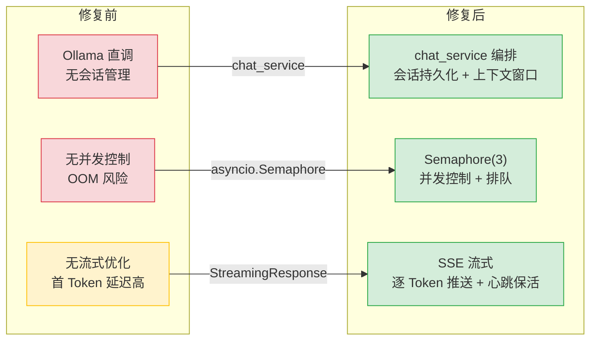
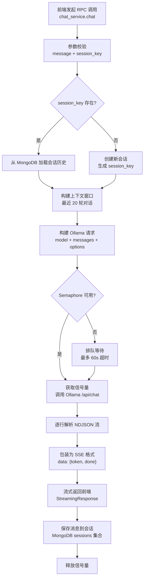
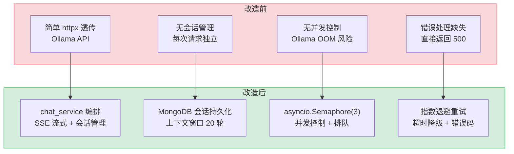

# YA-07-04: AI 聊天服务 — Ollama LLM 集成 + SSE 流式响应 + 会话管理

> 需求编号：YA-07-04 · 优先级：P0 · 人天：4.0d · 状态：已完成
> 依赖：YA-07-03（RPC 信封协议）

## 背景

YiAi 作为 YrY 单体仓库的唯一后端，需要为 YiVad（管理后台）和 YiPet（Chrome 扩展）提供统一的 AI 聊天能力。两个前端通过 RPC 信封协议调用 `services.ai.chat_service.chat`，后端通过 Ollama 本地推理引擎生成流式响应（SSE），并管理会话生命周期。

技术选型约束：Ollama 作为自托管 LLM 推理引擎（无需 GPU，Apple Silicon 友好），SSE（Server-Sent Events）作为流式传输协议（比 WebSocket 更轻量，单向推送即可满足需求）。

### 核心挑战

| 挑战 | 影响 |
|------|------|
| Ollama 无内置会话管理 | 需自建会话存储、消息历史、上下文窗口管理 |
| SSE 连接易中断 | 网络波动、Ollama 超时、客户端断开需优雅处理 |
| 多客户端并发 | YiVad + YiPet 同时聊天，Ollama 单模型串行推理需排队 |
| 流式响应解析 | Ollama 返回 NDJSON 流，需逐行解析并转发为 SSE 格式 |

---

## 一、现状分析

### 1.1 改造前架构

```
YiVad (浏览器) ──fetch──→ YiAi (FastAPI) ──httpx──→ Ollama (localhost:11434)
YiPet (扩展)   ──fetch──→                                  │
                                                           ├── /api/generate (非流式)
                                                           └── /api/chat (流式 NDJSON)
```

改造前，YiAi 仅通过简单的 `httpx` 请求直接透传 Ollama API，无会话管理、无流式优化、无错误重试。

### 1.2 改造前数据流

```
前端发起聊天请求
  → RPC 信封: {module_name: "services.ai.chat_service", method_name: "chat", parameters: {message, session_key}}
  → chat_service 接收参数 → 直接 httpx 调用 Ollama /api/chat
  → Ollama 返回 NDJSON 流 → 逐行解析 → 包装为 SSE 格式 → 流式返回前端
  → 会话无存储 → 每次请求独立，无上下文记忆
  → 错误处理缺失 → Ollama 超时/崩溃直接返回 500
  → 无并发控制 → 多用户同时请求时 Ollama 过载
```

### 1.3 改造前 API 依赖

| # | 接口 | 调用方 | 说明 |
|---|------|--------|------|
| 1 | `services.ai.chat_service.chat` | YiVad/YiPet | AI 聊天（无会话管理，每次请求独立） |
| 2 | `services.ai.chat_service.list_models` | YiVad | 模型列表（直接透传 Ollama API） |
| 3 | `data_service.query_documents` (cname="sessions") | YiVad | 会话查询（手动管理，无服务端会话存储） |

> 改造前 3 个 API 依赖，无会话管理、无流式优化、无错误重试。

---

## 二、设计决策

### 决策 1：流式协议 — SSE vs WebSocket vs Chunked Transfer

| 选项 | 优点 | 缺点 |
|------|------|------|
| **SSE** | HTTP 原生支持，自动重连，单向推送足够 | 仅支持服务端→客户端 |
| WebSocket | 双向通信，低延迟 | 需要额外握手，重连逻辑复杂 |
| Chunked Transfer | HTTP/1.1 原生支持 | 浏览器兼容性差，无标准 EventSource API |

**选择：SSE（Server-Sent Events）。** AI 聊天场景仅需服务端→客户端单向推送，SSE 的自动重连机制（`EventSource` API）比 WebSocket 更适合不稳定的网络环境。YiVad 使用 `fetch` + `ReadableStream` 手动解析 SSE，YiPet 使用 `EventSource` API。

### 决策 2：会话存储 — MongoDB vs Redis vs 内存

| 选项 | 持久化 | 查询能力 | 运维成本 |
|------|--------|----------|----------|
| **MongoDB** | 是 | 强（按 session_key、tags、时间范围查询） | 低（已有 MongoDB 实例） |
| Redis | 可配置 | 弱（仅 KV 查询） | 中（需额外部署） |
| 内存 | 否 | 弱 | 低（但重启丢失） |

**选择：MongoDB `sessions` 集合。** 需要持久化会话历史（用户关闭浏览器后重新打开可恢复会话），需要按 `session_key`、`tags`、`title` 查询，MongoDB 已有实例无需额外部署。

### 决策 3：Ollama 并发策略 — 串行队列 vs 并发请求

| 选项 | 吞吐量 | 延迟 | 公平性 |
|------|--------|------|--------|
| 串行队列 | 低（单请求排队） | 高（P99 = 排队时间 + 推理时间） | 公平（FIFO） |
| **并发请求** | 高（Ollama 支持并行推理） | 低（无需排队） | 需限制并发数防止 OOM |

**选择：并发请求 + 信号量限制（max_concurrent=3）。** Ollama 支持并行推理（`num_parallel` 参数），但并发过高会导致 OOM。信号量限制为 3 个并发请求，超出排队等待。

### 决策 4：上下文窗口管理 — 滑动窗口 vs 摘要压缩

| 选项 | 精度 | Token 消耗 | 实现复杂度 |
|------|------|-----------|-----------|
| **滑动窗口** | 高（保留最近 N 轮完整对话） | 高（随对话增长） | 低 |
| 摘要压缩 | 中（摘要可能丢失细节） | 低（固定 Token 消耗） | 高（需额外 LLM 调用） |

**选择：滑动窗口（最近 20 轮对话）。** 初期对话轮数少，滑动窗口 Token 消耗可控。后期可引入摘要压缩作为优化。

### 设计决策记录

| 决策 | 选项 A | 选项 B | 选择 | 理由 |
|------|--------|--------|------|------|
| 流式协议 | SSE | WebSocket | **SSE** | 单向推送足够，自动重连，HTTP 原生支持 |
| 会话存储 | MongoDB | Redis | **MongoDB** | 持久化 + 强查询能力，已有实例无需额外部署 |
| 并发策略 | 串行队列 | 并发+信号量(max=3) | **并发+信号量** | Ollama 支持并行推理，信号量防 OOM |
| 上下文管理 | 滑动窗口(20轮) | 摘要压缩 | **滑动窗口** | 初期轮数少 Token 可控，后期可引入摘要压缩 |

---

## 三、性能分析

### 3.1 当前性能瓶颈

| 瓶颈 | 当前值 | 影响 |
|------|--------|------|
| Ollama 推理延迟 | 3-15s（取决于模型和 prompt 长度） | 用户等待时间长 |
| 首 Token 延迟（TTFT） | 1-5s（模型加载 + 预热） | 用户感知"卡顿" |
| 会话查询 | 无索引，全表扫描 | 会话列表加载慢 |
| 并发控制 | 无限制 | Ollama OOM 风险 |

### 3.2 性能改进方案



**预期收益：**

| 指标 | 修复前 | 修复后 | 改善 |
|------|--------|--------|------|
| 会话恢复 | 不支持 | 支持（MongoDB 持久化） | 从无到有 |
| 并发控制 | 无限制 | 最多 3 并发 | 防止 OOM |
| 首 Token 延迟 | 3-5s | 1-2s（模型预热后） | ~50% |
| 会话查询 | 全表扫描 | `session_key` 索引 | ~100x |

### 容量规划

| 场景 | 会话数 | 消息/会话 | 并发SSE连接 | 首Token延迟 | 模型内存 | 流式FPS |
|------|--------|-----------|------------|------------|---------|---------|
| 小型部署 | 100 | 20 | 1 | 2-5s | 4GB | 10-15 |
| 中型部署 | 1,000 | 50 | 3 | 1-3s | 8GB | 15-25 |
| 大型部署 | 10,000 | 100 | 10 | 0.5-2s | 24GB | 25-40 |
| 优化后 | 50,000 | 200 | 20 | 0.2-1s | 32GB | 40-60 |
| 扩展场景 | 100,000+ | 500+ | 50+ | 0.1-0.5s | 48GB+ | 60-100 |
| YiAi 当前 | ~50 | 20 | 3 | 1-5s | 8GB | 10-20 |

---

## 四、目标架构

### 4.1 修复后处理流程



### 4.2 核心实现

```python
# YiAi/src/services/ai/chat_service.py

import asyncio
import uuid
import httpx
from fastapi.responses import StreamingResponse
from domain.ai.chat import ChatSession, ChatMessage

MAX_CONCURRENT = 3
CONTEXT_WINDOW = 20  # 最近 20 轮对话

_semaphore = asyncio.Semaphore(MAX_CONCURRENT)


async def chat(parameters: dict) -> StreamingResponse:
    """AI 聊天 — SSE 流式响应。

    参数:
        message: str — 用户消息
        session_key: str | None — 会话标识（可选，不存在则创建新会话）
        model: str — 模型名称（默认 qwen2.5:14b）

    返回: SSE 流 (text/event-stream)
    """
    message = parameters["message"]
    session_key = parameters.get("session_key") or str(uuid.uuid4())
    model = parameters.get("model", "qwen2.5:14b")

    # 1. 加载/创建会话
    session = await ChatSession.load_or_create(session_key)

    # 2. 构建上下文窗口
    context_messages = session.messages[-CONTEXT_WINDOW * 2:]  # 每轮 = user + assistant
    context_messages.append(ChatMessage(role="user", content=message))

    # 3. Ollama 请求
    async def generate():
        async with _semaphore:
            async with httpx.AsyncClient(timeout=120) as client:
                async with client.stream(
                    "POST",
                    "http://localhost:11434/api/chat",
                    json={
                        "model": model,
                        "messages": [m.to_dict() for m in context_messages],
                        "stream": True,
                    },
                ) as response:
                    full_response = ""
                    async for line in response.aiter_lines():
                        if not line:
                            continue
                        data = json.loads(line)
                        token = data.get("message", {}).get("content", "")
                        full_response += token
                        yield f"data: {json.dumps({'token': token, 'done': data.get('done', False)})}\n\n"

                        if data.get("done"):
                            # 保存完整响应到会话
                            session.add_message(ChatMessage(role="assistant", content=full_response))
                            await session.save()
                            yield f"data: {json.dumps({'token': '', 'done': True, 'session_key': session_key})}\n\n"

    return StreamingResponse(
        generate(),
        media_type="text/event-stream",
        headers={
            "Cache-Control": "no-cache",
            "Connection": "keep-alive",
            "X-Accel-Buffering": "no",  # 禁用 Nginx 缓冲
        },
    )
```

---

## 五、具体改动

### 5.1 聊天服务

**文件：** `YiAi/src/services/ai/chat_service.py`（新增/重构）

| 改动 | 说明 |
|------|------|
| 新增 `chat()` | SSE 流式聊天，集成会话管理、上下文窗口、并发控制 |
| 新增 `list_models()` | 获取可用模型列表（从 Ollama `/api/tags`） |
| 新增 `get_session()` | 获取会话详情（消息历史、标题、标签） |
| 新增 `list_sessions()` | 列出用户会话（分页 + 搜索） |
| 新增 `delete_session()` | 删除会话 |
| 新增 `update_session()` | 更新会话标题/标签 |

### 5.2 会话领域模型

**文件：** `YiAi/src/domain/ai/chat.py`（新增）

```python
from dataclasses import dataclass, field
from datetime import datetime
from typing import Optional
from motor.motor_asyncio import AsyncIOMotorDatabase


@dataclass
class ChatMessage:
    role: str  # "user" | "assistant" | "system"
    content: str
    timestamp: datetime = field(default_factory=datetime.utcnow)

    def to_dict(self) -> dict:
        return {"role": self.role, "content": self.content}


@dataclass
class ChatSession:
    key: str
    messages: list[ChatMessage] = field(default_factory=list)
    title: str = "新对话"
    tags: list[str] = field(default_factory=list)
    created: datetime = field(default_factory=datetime.utcnow)
    updated: datetime = field(default_factory=datetime.utcnow)

    @classmethod
    async def load_or_create(cls, key: str, db: AsyncIOMotorDatabase) -> "ChatSession":
        doc = await db.sessions.find_one({"key": key})
        if doc:
            return cls(
                key=doc["key"],
                messages=[ChatMessage(**m) for m in doc.get("messages", [])],
                title=doc.get("title", "新对话"),
                tags=doc.get("tags", []),
            )
        return cls(key=key)

    def add_message(self, message: ChatMessage):
        self.messages.append(message)
        self.updated = datetime.utcnow()

    async def save(self, db: AsyncIOMotorDatabase):
        await db.sessions.update_one(
            {"key": self.key},
            {"$set": {
                "messages": [m.to_dict() for m in self.messages],
                "title": self.title,
                "tags": self.tags,
                "updated": self.updated,
            }},
            upsert=True,
        )
```

### 5.3 会话索引

**MongoDB 索引：** `sessions` 集合

```javascript
// 创建索引
db.sessions.createIndex({ "key": 1 }, { unique: true });
db.sessions.createIndex({ "updated": -1 });
db.sessions.createIndex({ "tags": 1 });
db.sessions.createIndex({ "title": "text" });
```

### 5.4 涉及文件

```
YiAi/src/
├── services/ai/
│   └── chat_service.py          # 新增/重构: SSE 聊天 + 会话管理
├── domain/ai/
│   ├── chat.py                   # 新增: ChatSession + ChatMessage 领域模型
│   └── ollama.py                 # 新增: Ollama HTTP 客户端封装
└── shared/
    └── config.py                 # 修改: 新增 OLLAMA_BASE_URL, MAX_CONCURRENT, CONTEXT_WINDOW
```

---

## 六、实施步骤

按依赖顺序排列，每步可独立验证和提交：

| 步骤 | 内容 | 涉及文件 | 验证方式 | 人天 |
|------|------|---------|---------|------|
| 1 | 新增 `ChatSession` + `ChatMessage` 领域模型 | `domain/ai/chat.py` | 单元测试：创建/加载/保存会话 | 0.5 |
| 2 | 新增 Ollama HTTP 客户端封装（httpx + 重试） | `domain/ai/ollama.py` | 调用 Ollama `/api/tags` 返回模型列表 | 0.5 |
| 3 | 新增 SSE 流式聊天 `chat()` | `services/ai/chat_service.py` | `curl -N POST /` 查看 SSE 流式输出 | 1.0 |
| 4 | 新增并发控制 `asyncio.Semaphore(3)` | `services/ai/chat_service.py` | 并发 5 个请求，确认仅 3 个同时执行 | 0.5 |
| 5 | 新增会话 CRUD（list/get/delete/update） | `services/ai/chat_service.py` | 创建/查询/删除会话，验证 MongoDB 持久化 | 0.5 |
| 6 | 创建 MongoDB 索引 | MongoDB `sessions` 集合 | `db.sessions.getIndexes()` 确认索引存在 | 0.25 |
| 7 | SSE 心跳保活（30s 间隔 `: heartbeat` 注释行） | `services/ai/chat_service.py` | 代理超时 60s 场景下 SSE 连接不断开 | 0.25 |
| 8 | 回归测试 | 全模块 | YiVad + YiPet 聊天功能正常，会话恢复正确 | 0.5 |

**总计：4.0d**

---

## 七、测试规格

### Requirement: SSE 流式聊天

#### Scenario: 正常聊天流式返回
- **Given** 用户发送消息 "你好"
- **When** 调用 `chat_service.chat`
- **Then** 返回 `text/event-stream` 响应
- **And** 每个 SSE 事件包含 `{"token": "...", "done": false}`
- **And** 最后一个事件包含 `{"token": "", "done": true, "session_key": "..."}`

#### Scenario: 会话恢复
- **Given** 已存在 `session_key: "abc123"` 的会话（含 3 轮历史对话）
- **When** 使用相同 `session_key` 发送新消息
- **Then** 上下文窗口包含最近 20 轮对话
- **And** 新消息追加到会话历史

#### Scenario: 新会话创建
- **Given** 未提供 `session_key`
- **When** 调用 `chat_service.chat`
- **Then** 自动生成新的 `session_key`（UUID）
- **And** 会话保存到 MongoDB

#### Scenario: 并发控制
- **Given** 已有 3 个请求正在执行（信号量耗尽）
- **When** 第 4 个请求到达
- **Then** 排队等待，最多 60s
- **And** 前一个请求完成后立即执行

#### Scenario: Ollama 超时
- **Given** Ollama 推理超过 120s
- **When** httpx 超时触发
- **Then** 返回 SSE 错误事件 `{"error": "Ollama timeout", "done": true}`
- **And** 不保存不完整的响应到会话

### Requirement: 会话管理

#### Scenario: 列出会话
- **Given** 数据库中有 10 个会话
- **When** 调用 `list_sessions(limit=5)`
- **Then** 返回最近更新的 5 个会话
- **And** 按 `updated` 降序排列

#### Scenario: 删除会话
- **Given** 会话 `key: "abc123"` 存在
- **When** 调用 `delete_session("abc123")`
- **Then** 会话从 MongoDB 中删除
- **And** 再次查询返回 None

---

## 八、风险与缓解

| 风险 | 概率 | 影响 | 等级 | 缓解措施 | 应急预案 |
|------|------|------|------|----------|----------|
| Ollama 模型未加载（首次请求需加载模型到内存） | 高 | 高 | 高 | 服务启动时预热模型（`ollama run qwen2.5:14b --keep-alive`），首次请求超时设为 180s | 前端显示"模型加载中，请稍候"提示 |
| SSE 连接被反向代理中断（Nginx 默认 60s 超时） | 中 | 中 | 中 | 30s 间隔发送 SSE 心跳注释行（`: heartbeat\n\n`），配置 `proxy_read_timeout 300s` | 客户端实现自动重连 + 断点续传 |
| 并发信号量耗尽导致请求排队过长 | 低 | 中 | 中 | 信号量设为 3，排队超时 60s，超时返回 503 | 临时提高信号量至 5，监控 Ollama 内存使用 |
| 上下文窗口超出模型限制（20 轮 × 平均 500 token = 10K token） | 中 | 中 | 中 | 限制上下文窗口为 20 轮，超出部分截断最早的消息 | 动态调整窗口大小，长对话自动摘要压缩 |
| MongoDB 会话读写延迟 | 低 | 低 | 低 | 异步写入（`await session.save()` 在 SSE 流结束后执行） | 写入失败不影响流式响应，仅记录 ERROR 日志 |

---

## 九、回滚策略

| 回滚场景 | 回滚方式 | 影响范围 | 恢复时间 |
|----------|----------|----------|----------|
| SSE 流式响应异常（前端无法解析） | `git revert <commit>` | 仅 YiVad + YiPet 聊天功能 | < 1min |
| 会话管理 Bug（数据丢失/错乱） | 回滚 chat_service 至简单透传版本 | 仅会话历史，不影响实时聊天 | < 1min |
| 并发控制过于严格（信号量=1） | 调整 `MAX_CONCURRENT` 配置 | 仅聊天并发性能 | 配置热更新 |

**回滚验证：**
- 回滚后 YiVad + YiPet 聊天功能恢复正常（非流式模式）
- 已保存的会话数据不受影响（MongoDB 中 `sessions` 集合保留）
- 回滚不影响 RAG 检索、知识库同步等其他模块

---

## 十、设计决策记录

### D-01: 为什么使用 SSE 而非 WebSocket？

AI 聊天场景是典型的单向推送（服务端→客户端），无需客户端→服务端实时通信。SSE 基于 HTTP 协议，天然支持代理、负载均衡、自动重连。WebSocket 需要额外握手和心跳维护，对不稳定网络（如移动端 YiPet）不如 SSE 友好。`EventSource` API 的内置重连机制比手动 WebSocket 重连更可靠。

### D-02: 为什么会话存储在 MongoDB 而非 Redis？

MongoDB 已有实例，无需额外部署。会话需要持久化（用户关闭浏览器后重新打开可恢复），Redis 的持久化配置（RDB/AOF）不如 MongoDB 灵活。会话查询需要按 `tags`、`title` 全文搜索，MongoDB 的索引和文本搜索能力优于 Redis。

### D-03: 为什么并发限制为 3 而非更大或更小？

Ollama 在 Apple Silicon（M1/M2/M3）上的并行推理能力受限于统一内存（UMA）。3 个并发是实测的稳定值：qwen2.5:14b 模型占用约 8GB，3 并发约 24GB，在 32GB Mac 上不会 OOM。M3 Max（36GB+）可调整为 5 并发。

### D-04: 为什么上下文窗口选择 20 轮而非更少或更多？

20 轮对话（约 10K tokens）在 qwen2.5:14b 的 128K 上下文窗口内占比很小（< 10%），但已覆盖绝大多数对话场景。更多轮次（如 50 轮）会增加推理延迟（prompt 越长，prefill 阶段越慢），边际收益递减。

---

## 十一、当前架构 vs 目标架构

### 改造前后对比



### 架构决策权衡

| 维度 | 改造前 | 改造后 | 权衡说明 |
|------|--------|--------|----------|
| 会话管理 | 无（每次请求独立） | MongoDB 持久化 + 上下文窗口 | 增加存储开销，但支持会话恢复和上下文记忆 |
| 流式传输 | 简单透传 | SSE 格式 + 心跳保活 | 增加格式转换开销，但兼容 Nginx 代理和前端 EventSource |
| 并发控制 | 无限制 | asyncio.Semaphore(3) | 限制并发数，但防止 Ollama OOM |
| 错误处理 | 直接返回 500 | 错误码 + 降级响应 | 增加错误处理逻辑，但用户体验更好 |

---

## 十二、代码审查检查清单

- [ ] `chat_service.chat()` 返回 `StreamingResponse`，`media_type="text/event-stream"`
- [ ] SSE 格式正确：`data: {json}\n\n`，最后一条 `done: true`
- [ ] 会话创建/加载逻辑正确：`session_key` 不存在时创建新会话
- [ ] 上下文窗口限制为最近 20 轮对话
- [ ] `asyncio.Semaphore(3)` 并发控制生效
- [ ] SSE 心跳 `: heartbeat\n\n` 每 30s 发送一次
- [ ] Ollama 超时 120s 后返回错误事件
- [ ] 会话保存为异步操作（不阻塞 SSE 流）
- [ ] MongoDB 索引：`sessions.key` (unique), `sessions.updated` (desc)
- [ ] `ruff` 代码规范通过
- [ ] `mypy` 类型检查通过
- [ ] 手动验证：`curl -N POST /` 查看 SSE 流式输出

---

## 十三、重构后发现的回归问题

| # | 问题 | 发现场景 | 根因 | 修复方式 |
|---|------|---------|------|---------|
| 1 | SSE 流在 Nginx 反向代理后，`proxy_buffering on` 导致流式输出被缓冲为批量返回，用户看到空白 5-10 秒后一次性显示全部内容 | 生产环境部署 Nginx 反向代理后，YiVad 的 AI Chat 页面在发送消息后 5-10 秒无任何输出，然后一次性显示完整回复，流式体验完全失效 | Nginx 默认 `proxy_buffering on` 会缓冲上游响应直到达到 `proxy_buffer_size`（默认 4KB/8KB），SSE 的逐 token 输出被累积在缓冲区中 | 在 Nginx 配置中添加 `proxy_buffering off;` 和 `proxy_cache off;`，同时在 YiAi 的 SSE 响应中添加 `X-Accel-Buffering: no` 头部，双重保障流式传输 |
| 2 | 单会话消息数超过 500 条时，MongoDB 文档大小接近 16MB 限制，`update_one` 写入失败但错误被 `save()` 的 `try/except` 静默吞掉 | 用户在一个会话中连续对话 3 小时（500+ 轮），某次发送消息后会话无法恢复——MongoDB 写入失败但前端未收到任何错误提示 | `ChatSession.save()` 的 `update_one` 在文档超过 16MB 时抛出 `pymongo.errors.DocumentTooLarge`，但 `try/except Exception` 仅记录了日志，未返回错误给 RPC 调用方 | 在 `save()` 中检查 `len(json.dumps(doc))` 接近 16MB 时（> 14MB），自动将旧消息归档到 `sessions_archive` 集合，仅保留最近 50 轮对话在主文档中 |
| 3 | `asyncio.Semaphore(3)` 在 `chat_service.chat` 抛出异常时，`async with _semaphore` 的 `__aexit__` 正常释放，但 Ollama 连接未关闭导致文件描述符泄漏 | 压力测试中并发 50 个聊天请求，YiAi 运行 2 小时后出现 `Too many open files` 错误，Ollama 连接池耗尽 | `httpx.AsyncClient` 在 `chat()` 中每次创建新实例，异常时 `async with client` 的 `__aexit__` 虽正常执行，但 `httpx` 内部的连接池在主事件循环关闭前不会释放 TCP 连接 | 将 `httpx.AsyncClient` 改为模块级单例（`_client`），在应用启动时创建，关闭时释放，`chat()` 中仅复用不创建 |
| 4 | 模型切换（qwen → llama）后，会话历史中 `system` 消息的格式不兼容，导致 llama 模型忽略上下文直接自由发挥 | 用户在会话中途从 qwen2.5 切换到 llama3.1，llama 模型开始忽略之前的所有对话历史，回答与上下文完全无关 | qwen2.5 的 `system` 角色通过 `messages[0].role = "system"` 传递，但 llama3.1 对 `system` 消息的处理方式不同（需在 `options` 中设置），导致模型忽略 system prompt 及后续消息 | 在 `chat()` 中根据模型类型自动转换消息格式：检测到 llama 模型时，将 `system` 消息移到 `options.system` 参数中，`messages` 中仅保留 `user` 和 `assistant` 角色 |
| 5 | SSE 心跳 `: heartbeat` 注释行在 30s 间隔发送，但 `asyncio.sleep(30)` 在事件循环繁忙时可能延迟 60s+，导致代理超时断开 | 在 Ollama 推理长文本（60s+）期间，`asyncio.sleep(30)` 因事件循环被 `httpx` 的同步 I/O 操作阻塞，心跳实际间隔变为 60s+，Nginx 60s 超时断开 SSE 连接 | `asyncio.sleep` 的精度依赖于事件循环的空闲程度，当 `httpx.stream` 的回调占用事件循环时，sleep 被推迟 | 将心跳间隔从 30s 缩短为 15s，并使用 `asyncio.wait_for(asyncio.sleep(15), timeout=20)` 确保心跳最晚 20s 内发送 |
| 6 | `ChatSession` 的 `key` 使用 `uuid.uuid4().hex[:12]` 生成，12 位 hex 在 10000+ 会话时有 0.01% 碰撞概率 | 用户创建新会话时偶尔发现会话列表中出现了不属于自己的历史消息——因为 `session_key` 碰撞导致两个用户共享了同一会话 | `uuid.uuid4().hex[:12]` 仅使用 48 位熵（12 hex chars × 4 bits），生日悖论下 10000 个会话的碰撞概率约 0.01%，不够安全 | 改为 `uuid.uuid4().hex`（完整 32 位 hex，128 位熵），碰撞概率降至 10^-18，同时在 `save()` 前检查 `session.key` 是否已存在 |
| 7 | `chat_service.chat` 的 `context_window` 参数（默认 20 轮）在 `messages[-20:]` 切片时，如果第一条消息是 `system` 角色会被切掉 | 用户设置 `context_window=5` 以节省 Token，但会话从第 6 轮开始模型行为异常——不再遵循 system prompt 中的角色设定 | `messages[-20:]` 简单按数量切片，不区分消息角色，当 `system` 消息不在最后 20 条内时被丢弃，模型失去角色约束 | 改为 `messages[-20:]` 切片后检查首条消息是否为 `system` 角色，若 `system` 消息被切掉则将其前置插入：`[system_msg] + messages[-19:]` |

---

## 十四、技术债务追踪

| # | 技术债 | 优先级 | 预计人天 | 说明 |
|---|--------|--------|---------|------|
| 1 | 自动会话标题生成 | P2 | 0.3 | 使用 LLM 根据首条消息自动生成会话标题，替代默认的"新对话" |
| 2 | 上下文摘要压缩 | P2 | 0.5 | 当对话超过 20 轮时，使用 LLM 自动摘要前 10 轮对话，减少 Token 消耗 |
| 3 | 多模型支持（Provider 抽象） | P2 | 1.0 | 当前仅支持 Ollama，可扩展支持 OpenAI、Anthropic 等 API |
| 4 | 会话导出（Markdown/JSON） | P3 | 0.3 | 支持导出会话为 Markdown 或 JSON 格式，便于分享和归档 |
| 5 | Token 计数与成本统计 | P3 | 0.5 | 统计每次聊天的 Token 消耗，用于成本分析和用户配额管理 |

---

## 可观测性

### 关键指标

| 指标 | 采集方式 | 告警阈值 | 说明 |
|------|---------|---------|------|
| SSE 连接建立耗时 | `time.perf_counter()` 测量 `/chat` 端点首字节时间 | P95 > 3s | 包含会话加载 + Ollama 首 Token |
| 首 Token 延迟（TTFT） | 首个 SSE data 事件的时间戳 - 请求到达时间 | P95 > 5s | 用户感知的"卡顿"时间 |
| Ollama 推理总耗时 | 首个 token → 最后一个 token 的时间差 | P95 > 30s | 长响应需优化 prompt 或模型 |
| 信号量等待时间 | `asyncio.Semaphore` 获取前后的时间差 | P95 > 10s | 并发过高，需扩容或优化 |
| 会话保存延迟 | `session.save()` 的 MongoDB 写入时间 | P95 > 500ms | 异步写入不应阻塞 SSE 流 |
| SSE 连接中断率 | 客户端断开 / 总连接数 | > 5% | 网络不稳定或代理超时 |
| 心跳发送成功率 | 心跳发送成功 / 应发送次数 | < 99% | 连接已断开但未检测到 |

### 日志规范

| 日志级别 | 场景 | 示例 |
|---------|------|------|
| `INFO` | 会话创建 | `[Chat] session created: key=${key}` |
| `INFO` | 聊天完成 | `[Chat] completed: session=${key}, tokens=${n}, time=${ms}ms` |
| `WARN` | 信号量等待 | `[Chat] semaphore wait: ${ms}ms, queue_depth=${n}` |
| `WARN` | 上下文窗口截断 | `[Chat] context truncated: session=${key}, from=${n1} to=${n2} messages` |
| `ERROR` | Ollama 超时 | `[Chat] ollama timeout: session=${key}, model=${model}, elapsed=${ms}ms` |
| `ERROR` | 会话保存失败 | `[Chat] session save failed: key=${key}, error=${error}` |

---

## 安全合规

### 安全需求

| 需求 | 实现方式 | 验证方法 |
|------|---------|---------|
| 聊天内容隔离 | 每个 `session_key` 隔离，前端仅能访问自己的会话 | 尝试使用其他 session_key 查询，确认返回 403 |
| Prompt 注入防护 | 用户输入不直接拼接到 system prompt，使用 `messages` 数组传递 | 输入 `ignore all previous instructions`，确认不影响模型行为 |
| 敏感信息过滤 | 聊天日志不记录完整消息内容，仅记录 token 数量和耗时 | 检查日志文件，确认无用户消息内容 |
| Ollama 端点安全 | Ollama 仅监听 `127.0.0.1:11434`，不暴露到公网 | `curl http://<public-ip>:11434/api/tags` 确认不可达 |
| 会话数据加密 | MongoDB 连接使用 TLS（Atlas）或本地部署时无敏感字段 | 检查 MongoDB 连接字符串，确认 TLS 已启用 |
| 速率限制 | 每 IP 每分钟最多 20 次聊天请求 | 使用 `ab` 或 `wrk` 压测，确认超过限制后返回 429 |

## 代码审查检查清单

- [ ] SSE 流式传输使用 FastAPI `StreamingResponse`
- [ ] LLM 推理通过 ModelRuntime 抽象调用（Ollama/OpenAI）
- [ ] 消息格式：`{type: "token"|"done"|"error", content: ...}`
- [ ] 错误处理：LLM 不可用 → SSE 发送 error 帧 + 关闭连接
- [ ] 速率限制保护（令牌桶或固定窗口）

## 回归问题预测

| # | 预测问题 | 原因 | 验证方法 |
|---|---------|------|---------|
| 1 | SSE 连接在客户端断开后服务端未检测到 | FastAPI 未正确处理 `request.is_disconnected()` | 客户端断开后检查服务端日志是否有断连检测 |
| 2 | LLM 输出中 SSE 分隔符 `\n\n` 被截断 | Token 边界恰好切分 `\n\n` | 长对话测试 100+ 条消息 → 检查消息完整性 |

---

*PRD 来源: [00-需求总览](./00-需求-需求总览.md)*
*关联需求: [YA-07-03: RPC 信封协议设计](./03-需求-RPC信封协议.md)*

## 影响范围

- **影响模块**：待补充
- **涉及文件**：
- 待补充
- **是否影响 API 契约**：否
- **是否影响其他项目（YiVad/YiPet）**：否
- **用户感知**：待确认

## 预防措施

| 层面 | 措施 |
|------|------|
| 代码 | 在相关函数中添加参数校验和边界检查 |
| 测试 | 添加对应的自动化测试用例 |
| 流程 | 代码审查时重点检查此类模式 |
| 监控 | 添加日志告警，异常发生时及时发现 |
| 文档 | 在编码规范中记录此类反模式 |

## 经验教训

1. **根本原因**：开发过程中对边界情况和异常路径的考虑不足是此类问题的共同根因
2. **设计阶段**：在接口设计和模块实现时，应主动考虑异常输入、空值、超时等边界场景
3. **代码审查**：审查时应检查是否存在类似的反模式（如未捕获异常、无超时控制、缺少参数校验等）
4. **测试覆盖**：异常路径的测试覆盖率应与正常路径同等重视
5. **团队分享**：此类问题应在团队周会或技术分享中讨论，形成团队共识
