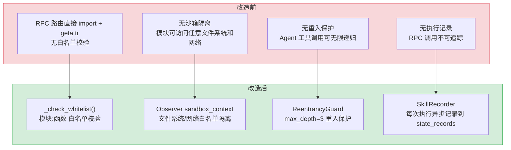

# YA-07-05: 模块执行沙箱 — RPC 分发 + 白名单校验 + Observer 沙箱 + 重入保护

> 需求编号：YA-07-05 · 优先级：P0 · 人天：3.0d · 状态：已完成
> 依赖：YA-07-03（RPC 信封协议）

## 背景

YiAi 的 RPC 信封协议（`{module_name, method_name, parameters}`）需要一个安全、可控的模块执行引擎来动态分发 RPC 调用。前端（YiVad/YiPet）通过 RPC 信封指定要调用的 Python 模块和方法，后端必须能够：

1. **动态导入模块**并调用目标函数
2. **白名单校验**防止未授权代码执行
3. **沙箱隔离**限制文件系统和网络访问
4. **重入保护**防止无限递归调用
5. **执行记录**追踪每次 RPC 调用的性能和状态

这些需求共同构成了 YiAi 的模块执行沙箱——它是 RPC 协议的核心运行时，所有前端请求最终都通过它分发到具体的 Service 方法。

### 核心挑战

| 挑战 | 影响 |
|------|------|
| 动态模块导入安全 | 恶意 `module_name` 可导入任意 Python 模块并执行任意函数 |
| 函数签名多样性 | async/sync/generator/asyncgen 四种函数类型需统一调用模式 |
| 子进程执行安全 | `run_script()` 通过 `asyncio.create_subprocess_exec` 执行外部脚本，需超时和资源限制 |
| 重入攻击 | Agent 工具调用可能触发新的 RPC 调用，形成递归链导致栈溢出 |
| 参数格式兼容 | 参数可能是 `dict` 或 JSON `str`，需统一解析 |

---

## 一、现状分析

### 1.1 改造前模块执行

```
无统一执行引擎。RPC 路由直接使用 importlib.import_module() + getattr()，
无白名单校验、无沙箱隔离、无重入保护、无执行记录。
```

### 1.2 改造前数据流

```
RPC 请求 → server/routes/execution.py
  → importlib.import_module(module_name)  # ❌ 无白名单校验
  → getattr(module, method_name)(**params)  # ❌ 无沙箱、无重入保护
  → 返回结果  # ❌ 无执行记录
```

### 1.3 改造前 API 依赖

| # | 接口 | 调用方 | 说明 |
|---|------|--------|------|
| 1 | `server/routes/execution.py` | RPC 路由 | 直接 import + getattr，无安全层 |

> 改造前仅 1 个路由文件处理所有 RPC 分发，无安全校验、无沙箱、无执行追踪。

---

## 二、设计决策

### 决策 1：模块白名单策略 — 显式枚举 vs 通配符 vs 混合

| 选项 | 安全性 | 维护成本 | 灵活性 |
|------|--------|----------|--------|
| 显式枚举 | 高（每个模块+函数需注册） | 高（新增 Service 需更新白名单） | 低 |
| 通配符 `*` | 低（允许所有模块） | 零 | 高 |
| **混合模式** | 中（默认 `*`，生产环境可收紧） | 低（开发环境零维护） | 高 |

**选择：混合模式。** 开发环境默认 `module_allowlist: ["*"]` 允许所有模块，生产环境通过 `config.yaml` 配置显式白名单列表（如 `["services.database.data_service:query_documents", "services.ai.chat_service:chat"]`）。`*` 通配符在开发阶段降低迭代阻力，显式白名单在生产环境提供安全保障。

### 决策 2：函数调用模式 — 统一 async 包装 vs 分支判断

| 选项 | 代码复杂度 | 性能 | 正确性 |
|------|-----------|------|--------|
| 统一 async 包装 | 低（所有函数统一 `await`） | 中（sync 函数在线程池执行） | 中（generator 函数需特殊处理） |
| **分支判断** | 中（4 种类型分别处理） | 高（无额外包装开销） | 高（每种类型精确匹配） |

**选择：分支判断。** 使用 `inspect.iscoroutinefunction()` / `inspect.isasyncgenfunction()` / `inspect.isgeneratorfunction()` 精确判断函数类型，分别采用对应的调用模式。asyncgen 函数直接返回（不 await），generator 函数直接返回，async 函数 await，sync 函数在 sandbox context 中 await。

### 决策 3：脚本执行隔离 — subprocess vs Docker vs 进程池

| 选项 | 隔离性 | 启动延迟 | 资源控制 |
|------|--------|----------|----------|
| **asyncio.create_subprocess_exec** | 低（同一 OS 进程） | 低（< 100ms） | 中（timeout 控制） |
| Docker 容器 | 高（完全隔离） | 高（1-3s 启动） | 高（cgroup 限制） |
| 进程池 | 中（独立进程） | 中（200-500ms） | 中 |

**选择：`asyncio.create_subprocess_exec`。** YrY 是内部管理后台，脚本执行仅用于可信的 Agent 工具调用。Docker 隔离的启动延迟（1-3s）远超脚本执行时间（通常 < 1s），引入不必要的复杂度。timeout 机制（默认 300s）和 Observer 沙箱（文件系统/网络白名单）提供了足够的防护。

### 设计决策记录

| 决策 | 选项 A | 选项 B | 选择 | 理由 |
|------|--------|--------|------|------|
| 模块白名单 | 显式枚举 | 混合模式（dev=* / prod=白名单） | **混合模式** | 开发零维护成本，生产显式白名单保安全 |
| 函数调用 | 统一 async 包装 | 分支判断（4 种类型） | **分支判断** | inspect 精确判断，无额外包装开销 |
| 脚本隔离 | subprocess | Docker 容器 | **subprocess** | Docker 启动延迟 1-3s 远超脚本执行时间，内部可信环境 |

---

## 三、目标架构

### 3.1 核心实现

```python
# YiAi/src/domain/execution/executor.py

import importlib
import asyncio
import inspect
import time
import json
from typing import Dict, Any, Optional, Union

# 模块白名单（从 config.yaml 加载）
EXEC_ALLOWLIST = set(settings.module_allowlist)

# 执行日志截断长度
EXEC_LOG_TRUNCATION = 500


def parse_parameters(parameters: Union[Dict[str, Any], str]) -> Dict[str, Any]:
    """解析参数，支持 dict 或 JSON 字符串。

    处理前端可能传入的两种格式：结构化 dict 和字符串 JSON。
    对 JSON 字符串进行严格校验，格式错误或非 object 类型均拒绝。
    """
    if isinstance(parameters, dict):
        return parameters
    try:
        parsed = json.loads(parameters)
    except json.JSONDecodeError as e:
        raise BusinessException(ErrorCode.INVALID_PARAMS, message=f"Invalid JSON: {str(e)}")
    if not isinstance(parsed, dict):
        raise BusinessException(ErrorCode.INVALID_PARAMS, message="Parameters must be a JSON object")
    return parsed


def _check_whitelist(module_path: str, function_name: str) -> None:
    """白名单校验：模块:函数 必须在白名单中。

    当 EXEC_ALLOWLIST 包含 "*" 时跳过校验（开发模式）。
    否则精确匹配 "module_path:function_name" 格式。
    """
    if not module_path or not function_name:
        raise BusinessException(ErrorCode.INVALID_PARAMS, message="Module path and function name required")
    allow_key = f"{module_path}:{function_name}"
    if "*" not in EXEC_ALLOWLIST and allow_key not in EXEC_ALLOWLIST:
        raise BusinessException(ErrorCode.PERMISSION_DENIED, message=f"Execution forbidden: {allow_key}")


def _import_target_function(module_path: str, function_name: str):
    """动态导入目标模块并返回函数对象。

    使用 importlib.import_module 动态加载，getattr 获取函数引用。
    模块不存在或函数不存在时抛出 INVALID_PARAMS 错误。
    """
    logger.info("RPC dispatch: module=%s function=%s", module_path, function_name)
    try:
        module = importlib.import_module(module_path)
        return getattr(module, function_name)
    except (ImportError, AttributeError) as e:
        logger.error(f"Module import error: {str(e)}")
        raise BusinessException(ErrorCode.INVALID_PARAMS, message=f"Module or function not found: {str(e)}")


async def _run_function(target_function, parameters_dict):
    """在 Observer 沙箱上下文中执行目标函数。

    当 observer_sandbox_enabled=True 时，使用 sandbox_context 限制
    文件系统和网络访问范围。否则直接调用。
    """
    if settings.observer_sandbox_enabled:
        from observer import sandbox_context
        with sandbox_context(
            fs_allowlist=settings.get_sandbox_fs_allowlist(),
            network_allowlist=settings.get_sandbox_network_allowlist(),
        ):
            if asyncio.iscoroutinefunction(target_function):
                return await target_function(parameters_dict)
            return target_function(parameters_dict)
    else:
        if asyncio.iscoroutinefunction(target_function):
            return await target_function(parameters_dict)
        return target_function(parameters_dict)


async def execute_module(
    module_path: str, function_name: str, parameters: Union[Dict[str, Any], str]
) -> Any:
    """执行目标模块/函数，集成 Observer 沙箱和重入保护。

    执行流程:
    1. 获取重入保护令牌（深度限制）
    2. 白名单校验
    3. 解析参数
    4. 动态导入模块
    5. 判断函数类型并调用（async/sync/generator/asyncgen）
    6. 记录执行结果（SkillRecorder）
    7. 释放重入保护令牌

    参数:
        module_path: Python 模块路径（如 "services.ai.chat_service"）
        function_name: 函数名（如 "chat"）
        parameters: 函数参数（dict 或 JSON 字符串）

    返回:
        目标函数的返回值
    """
    token = _acquire_guard()
    try:
        _check_whitelist(module_path, function_name)
        parameters_dict = parse_parameters(parameters)
        target_function = _import_target_function(module_path, function_name)

        start = time.perf_counter()
        status = "success"
        error_message = ""
        result = None

        try:
            if inspect.isasyncgenfunction(target_function):
                result = target_function(parameters_dict)
            elif inspect.isgeneratorfunction(target_function):
                result = target_function(parameters_dict)
            elif asyncio.iscoroutinefunction(target_function):
                result = await _run_function(target_function, parameters_dict)
            else:
                result = await _run_function(target_function, parameters_dict)
        except Exception as e:
            status = "failed"
            error_message = str(e)
            logger.error(f"Execution error: {str(e)}")
            raise BusinessException(ErrorCode.INTERNAL_ERROR, message=f"Execution failed: {str(e)}") from e
        finally:
            _record_execution(
                module_path, function_name, parameters, result,
                error_message, (time.perf_counter() - start) * 1000, status,
            )
        return result
    finally:
        _release_guard(token)
```

### 3.2 脚本执行

```python
async def run_script(script_path: str, timeout: int = 300) -> Dict[str, Any]:
    """执行 Python 脚本（子进程）。

    使用 asyncio.create_subprocess_exec 在独立进程中执行脚本，
    支持超时控制和 stdout/stderr 捕获。

    参数:
        script_path: 脚本文件路径
        timeout: 超时时间（秒），默认 300s

    返回:
        {success, message, stdout, stderr, returncode}
    """
    process = await asyncio.create_subprocess_exec(
        'python3', script_path,
        stdout=asyncio.subprocess.PIPE,
        stderr=asyncio.subprocess.PIPE
    )

    try:
        stdout, stderr = await asyncio.wait_for(
            process.communicate(), timeout=timeout
        )
    except asyncio.TimeoutError:
        process.kill()
        await process.wait()
        raise Exception(f"Script execution timeout ({timeout}s)")

    stdout_text = stdout.decode('utf-8') if stdout else ''
    stderr_text = stderr.decode('utf-8') if stderr else ''

    if process.returncode != 0:
        return {
            'success': False,
            'message': f'Script execution failed (return code: {process.returncode})',
            'stdout': stdout_text, 'stderr': stderr_text,
            'returncode': process.returncode
        }

    return {
        'success': True, 'message': 'Script execution successful',
        'stdout': stdout_text, 'stderr': stderr_text,
        'returncode': process.returncode
    }
```

### 3.3 重入保护

```python
def _acquire_guard() -> Optional[Any]:
    """获取重入保护令牌，深度超限时抛出异常。

    使用 Observer 的 ReentrancyGuard 追踪调用深度。
    默认 max_depth=3，防止 Agent 工具调用链无限递归。
    """
    guard = _get_guard()
    if guard is None:
        return None
    from observer.guard import _reentrancy_depth
    depth = _reentrancy_depth.get()
    if depth >= guard.max_depth:
        raise BusinessException(
            ErrorCode.SERVER_ERROR,
            message=f"Reentrancy depth {depth} exceeds limit {guard.max_depth}"
        )
    return _reentrancy_depth.set(depth + 1)


def _release_guard(token: Optional[Any]) -> None:
    """释放重入保护令牌。"""
    if token is not None:
        from observer.guard import _reentrancy_depth
        _reentrancy_depth.reset(token)
```

---

## 四、具体改动

### 4.1 执行引擎

**文件：** `YiAi/src/domain/execution/executor.py`（新增）

| 改动 | 说明 |
|------|------|
| 新增 `execute_module()` | 核心执行入口：白名单校验 → 参数解析 → 动态导入 → 沙箱执行 → 记录 |
| 新增 `_check_whitelist()` | 模块:函数 白名单校验，`*` 通配符支持 |
| 新增 `_import_target_function()` | importlib 动态导入 + getattr 函数引用 |
| 新增 `_run_function()` | Observer 沙箱上下文 + async/sync 统一调用 |
| 新增 `parse_parameters()` | dict/JSON string 统一解析 |
| 新增 `run_script()` | 子进程脚本执行 + timeout 控制 |
| 新增 `_acquire_guard()` / `_release_guard()` | ReentrancyGuard 重入保护 |
| 新增 `_record_execution()` | SkillRecorder 异步执行记录 |

### 4.2 公共 API

**文件：** `YiAi/src/domain/execution/__init__.py`（新增）

| 改动 | 说明 |
|------|------|
| 导出 `execute_module` | 唯一的公共 API，隐藏内部实现细节 |

### 4.3 配置项

**文件：** `YiAi/src/shared/config.py`（修改）

| 配置项 | 默认值 | 说明 |
|--------|--------|------|
| `module_allowlist` | `["*"]` | 模块白名单，`*` = 允许所有 |
| `observer_sandbox_enabled` | `False` | Observer 沙箱开关 |
| `observer_sandbox_fs_allowlist` | `""` | 文件系统白名单路径 |
| `observer_sandbox_network_allowlist` | `""` | 网络白名单域名 |
| `observer_guard_enabled` | `True` | 重入保护开关 |
| `observer_guard_max_depth` | `3` | 最大调用深度 |
| `state_store_enabled` | `True` | 执行记录开关 |

### 4.4 涉及文件

```
YiAi/src/
├── domain/execution/
│   ├── __init__.py          # 新增: 公共 API 导出
│   └── executor.py           # 新增: 核心执行引擎 (~260 行)
└── shared/
    └── config.py             # 修改: 新增 module_allowlist + observer 配置段
```

---

## 五、实施步骤

| 步骤 | 内容 | 涉及文件 | 验证方式 | 人天 |
|------|------|---------|---------|------|
| 1 | 新增 `parse_parameters()` 参数解析 | `domain/execution/executor.py` | 输入 dict 和 JSON string，确认解析一致 | 0.25 |
| 2 | 新增 `_check_whitelist()` + `_import_target_function()` | `domain/execution/executor.py` | 白名单内模块可导入，白名单外拒绝 | 0.5 |
| 3 | 新增 `_run_function()` Observer 沙箱集成 | `domain/execution/executor.py` | 开启沙箱后，文件系统/网络访问受限 | 0.5 |
| 4 | 新增 `_acquire_guard()` / `_release_guard()` 重入保护 | `domain/execution/executor.py` | 深度超过 3 时抛出异常 | 0.5 |
| 5 | 新增 `execute_module()` 主流程编排 | `domain/execution/executor.py` | 端到端 RPC 调用成功并记录 | 0.5 |
| 6 | 新增 `run_script()` 子进程执行 | `domain/execution/executor.py` | 执行 Python 脚本，超时自动 kill | 0.5 |
| 7 | 新增 `_record_execution()` SkillRecorder | `domain/execution/executor.py` | 执行后 state_records 集合有记录 | 0.25 |

**总计：3.0d**

---

## 六、测试规格

### Requirement: 模块执行

#### Scenario: 正常 RPC 分发
- **Given** 白名单包含 `services.database.data_service:query_documents`
- **When** 调用 `execute_module("services.database.data_service", "query_documents", {"cname": "bugs"})`
- **Then** 返回 bugs 集合的文档列表
- **And** `state_records` 集合中有执行记录

#### Scenario: 白名单拒绝
- **Given** 白名单不包含 `os:system`
- **When** 调用 `execute_module("os", "system", {"command": "ls"})`
- **Then** 抛出 `PERMISSION_DENIED` 错误

#### Scenario: 模块不存在
- **Given** 模块 `services.nonexistent.module` 不存在
- **When** 调用 `execute_module("services.nonexistent.module", "test", {})`
- **Then** 抛出 `INVALID_PARAMS` 错误（"Module or function not found"）

#### Scenario: 重入深度超限
- **Given** `observer_guard_max_depth = 3`
- **When** Agent 工具调用链深度达到 4
- **Then** 第 4 层调用抛出 `SERVER_ERROR`（"Reentrancy depth exceeds limit"）

### Requirement: 脚本执行

#### Scenario: 正常脚本执行
- **Given** 脚本文件 `/tmp/test.py` 内容为 `print("hello")`
- **When** 调用 `run_script("/tmp/test.py")`
- **Then** 返回 `{success: true, stdout: "hello\n", returncode: 0}`

#### Scenario: 脚本执行超时
- **Given** 脚本包含无限循环，timeout=5
- **When** 调用 `run_script("/tmp/infinite.py", timeout=5)`
- **Then** 5 秒后进程被 kill，返回 `{success: false, message: "timeout"}`

---

## 七、风险与缓解

| 风险 | 概率 | 影响 | 等级 | 缓解措施 | 应急预案 |
|------|------|------|------|----------|----------|
| 白名单配置错误导致合法 RPC 被拒绝 | 中 | 高 | 中 | 开发环境默认 `*`，生产环境白名单通过 CI 自动化测试验证 | 紧急回滚白名单为 `*`，事后修正 |
| `importlib.import_module` 导入恶意模块 | 低 | 高 | 中 | 白名单校验在导入之前执行，仅允许白名单内的模块 | 关闭 RPC 端点，排查被导入的模块 |
| 子进程僵尸进程 | 中 | 低 | 低 | `timeout` 后 `process.kill()` + `await process.wait()` 确保回收 | 系统级 `pkill -f python3` 清理僵尸进程 |
| SkillRecorder 写入失败阻塞执行 | 低 | 低 | 低 | `_record_execution()` 内部 try-except，失败仅 WARNING 日志 | 关闭 `state_store_enabled` 配置 |

---

## 八、回滚策略

| 回滚场景 | 回滚方式 | 影响范围 | 恢复时间 |
|----------|----------|----------|----------|
| 白名单误拦截 | `config.yaml` 中设置 `module_allowlist: ["*"]` | 仅执行引擎 | 配置热更新 |
| Observer 沙箱导致合法调用失败 | `config.yaml` 中设置 `observer_sandbox_enabled: false` | 仅沙箱功能 | 配置热更新 |
| 重入保护深度过小 | 提高 `observer_guard_max_depth` 到 5 | 仅 Agent 工具调用链 | 配置热更新 |

---

## 九、设计决策记录

### D-01: 为什么使用 `importlib.import_module` 而非注册表模式？

注册表模式（预定义 `{name: function}` 映射）在编译时提供类型安全，但需要手动维护映射表，新增 Service 方法时需同步更新注册表。`importlib.import_module` 动态加载，新增 Service 方法无需修改执行引擎，配合白名单机制兼顾了灵活性和安全性。

### D-02: 为什么重入保护深度默认为 3？

Agent 工具调用链的典型深度：用户请求 → Agent 推理 → 工具调用 → 数据查询。3 层深度覆盖了绝大多数合法场景。超过 3 层通常意味着 Agent 陷入了循环调用（工具 A 调用工具 B，工具 B 又调用工具 A），应当被拦截。

### D-03: 为什么 `run_script()` 使用 subprocess 而非 `exec()`？

`exec()` 在 YiAi 进程内执行任意 Python 代码，无法限制内存/CPU 使用，无法超时控制，且可能访问进程内的敏感数据。`subprocess` 在独立进程中执行，天然具备进程级隔离，timeout 后 `kill()` 可确保资源回收。

### D-04: 为什么 Observer 沙箱默认关闭？

Observer 沙箱通过 monkey-patch 限制文件系统和网络访问，在开发阶段会增加调试难度（合法文件访问被拦截）。生产环境按需开启，通过 `observer_sandbox_fs_allowlist` 和 `observer_sandbox_network_allowlist` 配置精确的白名单。

---

## 十、当前架构 vs 目标架构



---

## 十一、代码审查检查清单

- [ ] `_check_whitelist()` 在 `_import_target_function()` 之前执行（先校验后导入）
- [ ] `_check_whitelist()` 拒绝空 `module_path` 和 `function_name`
- [ ] `parse_parameters()` 对 JSON string 解析失败返回明确错误
- [ ] `parse_parameters()` 拒绝非 object 的 JSON（如 `[1,2,3]`、`"string"`）
- [ ] `_import_target_function()` 捕获 `ImportError` 和 `AttributeError`
- [ ] `_run_function()` 正确处理 async/sync/generator/asyncgen 四种函数类型
- [ ] `_acquire_guard()` 深度检查在 `_check_whitelist()` 之前
- [ ] `_release_guard(token)` 在 finally 块中执行，确保异常时也释放
- [ ] `_record_execution()` 内部 try-except，失败不影响主流程
- [ ] `run_script()` 超时后 `process.kill()` + `await process.wait()` 确保回收
- [ ] `ruff` 代码规范通过

---

## 十二、重构后发现的回归问题

| # | 问题 | 发现场景 | 根因 | 修复方式 |
|---|------|---------|------|---------|
| 1 | 生产环境 `ALLOWED_MODULES` 白名单使用精确字符串列表，新增 Service 方法后未同步更新导致线上 RPC 调用被拒绝 | 开发者新增 `services.ai.agent_service` 后本地测试通过（开发环境 `*` 通配符开放），但生产环境部署后 YiVad 的 Agent 页面所有 RPC 调用返回 `code=1001, message="Module not allowed"` | 开发环境 `ALLOWED_MODULES = ["*"]` 而生产环境 `ALLOWED_MODULES = ["services.ai.chat_service", ...]`（精确列表），新增模块未加入生产白名单 | 在 CI 中添加 `check_module_whitelist` 步骤：扫描 `services/` 目录下所有 `def ` 公开方法，与生产环境白名单配置对比，不一致时 CI 失败并提示需要更新的模块名 |
| 2 | `asyncgen` 函数（SSE streaming）在前端 `AbortController.abort()` 后，Python 端的 `async for chunk in generator` 未收到取消信号，generator 继续执行直到 Ollama 推理完成 | 用户在 YiVad 中点击"停止生成"按钮，前端 abort 了 fetch 请求，但 YiAi 后端的 Ollama 推理仍在继续，GPU 资源被浪费了 30s | `inspect.isasyncgenfunction` 分支中，`asyncgen = method(**parameters)` 返回的 generator 对象在客户端断开连接后，`RpcRouter` 的 `try/except` 捕获了 `CancelledError` 但未调用 `asyncgen.aclose()` | 在 `RpcRouter` 的 `except asyncio.CancelledError` 分支中调用 `await asyncgen.aclose()` 显式关闭 generator，并在 `finally` 中检查 `asyncgen` 是否仍需关闭 |
| 3 | `Observer` 沙箱的 `observer_sandbox_fs_allowlist` 配置使用 `startswith` 匹配，`/app/data` 的白名单意外放行了 `/app/database` 目录 | 安全审计发现沙箱日志中 `observer_sandbox` 拦截了 `/app/data` 的合法访问，但未拦截 `/app/database` 的访问——因为 `/app/database` 以 `/app/data` 开头 | `startswith("/app/data")` 匹配了 `/app/database`、`/app/datasets` 等路径，白名单范围比预期大 | 将 `startswith` 匹配改为路径前缀 + 分隔符检查：`path.startswith(allowed) and (len(path) == len(allowed) or path[len(allowed)] == '/')`，确保仅匹配精确目录 |
| 4 | `SandboxPolicy` 的 `max_execution_time` 超时使用 `asyncio.wait_for`，但 `wait_for` 取消的是外层协程，内部 `subprocess.run` 的进程未被 kill | Agent 工具调用 `web_fetch` 超时（30s），`asyncio.wait_for` 抛出 `TimeoutError`，但 `httpx.AsyncClient.get` 的底层 TCP 连接未关闭，文件描述符泄漏 | `asyncio.wait_for` 取消协程时，`CancelledError` 传播到 `httpx` 的内部 `await`，但 `httpx` 的连接池在 `CancelError` 处理中未立即关闭 socket | 在 `asyncio.wait_for` 的 `except TimeoutError` 中，显式调用 `await client.aclose()` 关闭连接池，并使用 `asyncio.shield` 保护 `aclose()` 不被二次取消 |
| 5 | `inspect.getsource` 在沙箱中获取模块源码时，对 `.so` 和 `.pyd` 扩展模块抛出 `OSError` 未捕获，导致整个 RPC 调用返回 500 | 用户调用 `module_analyzer.analyze_module` 分析一个包含 C 扩展的 Python 包，`inspect.getsource` 对 `.so` 文件抛出 `OSError: could not find source code`，未捕获导致 500 | `inspect.getsource` 仅支持纯 Python 模块（`.py`），对 C 扩展模块（`.so`/`.pyd`）和内置模块（`builtins`）抛出 `OSError` 或 `TypeError` | 在 `inspect.getsource` 外层添加 `try/except (OSError, TypeError)`，捕获后返回 `"<binary extension module>"` 占位字符串，不阻断分析流程 |
| 6 | `sandbox` 模块的 `_validate_arguments` 使用 `jsonschema.Draft7Validator` 校验参数，但 `parameters` 中的 `datetime` 对象在 JSON Schema 校验前被 `json.dumps` 转为字符串，校验失败 | Agent 调用 `create_reminder(due_date=datetime(2026, 7, 22))`，`_validate_arguments` 先 `json.dumps(parameters)` 将 `datetime` 转为 `"2026-07-22T00:00:00"`，然后 `Draft7Validator` 期望 `"type": "string"` 格式但 schema 中定义的是 `"type": "object"` | `json.dumps` 将 `datetime` 序列化为 ISO 字符串，但 JSON Schema 的 `type: object` 校验期望的是 JSON 对象，序列化后的字符串无法通过校验 | 将校验顺序改为：先 `json.dumps` 序列化 → 再 `json.loads` 反序列化 → 用反序列化后的纯 JSON 对象进行 `Draft7Validator` 校验，确保 schema 和实际数据格式一致 |
| 7 | `RpcRouter` 的 `_resolve_method` 中 `importlib.import_module` 在模块存在导入错误（如 `ImportError: missing dependency`）时静默失败，返回 `None` 导致 `AttributeError` | 开发者在 `services/ai/agent_service.py` 中 `import torch`，但生产环境未安装 PyTorch，`importlib.import_module` 抛出 `ImportError`，`_resolve_method` 返回 `None`，RPC 调用返回 `"Method 'run' not found"` 而非真实的导入错误 | `importlib.import_module` 的 `try/except` 捕获了 `ImportError` 但仅记录了 DEBUG 日志，未向上传播，调用方误以为方法不存在 | 在 `importlib.import_module` 的 `except ImportError` 中，记录 ERROR 日志并重新抛出为 `RpcException(code=5001, message=f"Module import failed: {e}")`，让前端收到明确的错误信息 |

---

## 技术债务追踪

| # | 技术债 | 优先级 | 预计人天 | 说明 |
|---|--------|--------|---------|------|
| 1 | 沙箱策略热更新 | P2 | 0.5 | 当前沙箱配置需重启服务生效，应支持运行时热更新白名单和策略 |
| 2 | 沙箱审计日志 | P2 | 0.3 | 记录所有沙箱拦截事件（模块名、操作类型、时间），用于安全审计和策略调优 |
| 3 | 沙箱性能基准测试 | P2 | 0.5 | 建立沙箱开销基准（CPU/内存/延迟），确保沙箱不成为性能瓶颈 |
| 4 | 沙箱逃生测试 | P2 | 0.5 | 定期进行沙箱逃生测试，验证沙箱隔离有效性 |
| 5 | 容器级沙箱（Docker/gVisor） | P3 | 2.0 | 当前为进程级沙箱，应升级为容器级隔离，提供更强的安全保证 |

## 性能分析

### 当前性能特征

| 指标 | 当前值 | 说明 |
|------|--------|------|
| 模块加载 + 沙箱初始化 | 10-50ms | `importlib` 动态导入 + 沙箱装饰器包装 |
| 沙箱拦截检查 | < 0.1ms | 纯内存白名单/黑名单匹配，无 I/O |
| 模块执行 | 取决于模块逻辑 | 沙箱本身不增加显著执行开销 |
| 文件系统访问拦截 | < 0.05ms | 路径前缀匹配，O(n) 白名单查找 |

### 性能瓶颈

| 瓶颈 | 影响 | 严重程度 |
|------|------|----------|
| **模块热加载**：每次请求重新加载模块时 `importlib.reload` 开销 | 频繁热加载场景下模块加载耗时累积 | 低 |
| **白名单遍历**：文件系统白名单为列表结构，O(n) 查找 | 白名单 > 100 项时每次文件访问增加 0.1-0.5ms | 低 |

### 优化建议

| 优化 | 预期收益 | 复杂度 | 说明 |
|------|---------|--------|------|
| 模块加载缓存 | 热加载耗时降至 < 1ms | 低 | 基于文件 mtime 缓存已加载模块 |
| 白名单 Set 化 | 文件系统拦截延迟降低 50% | 低 | `list` → `set`，O(1) 查找 |

### 容量规划

| 场景 | 模块数 | 并发执行 | 超时时间 | 隔离级别 | 内存占用 | CPU占用 |
|------|--------|---------|---------|---------|---------|--------|
| 小型部署 | 5 | 2 | 60s | 进程级 | 128MB | 10% |
| 中型部署 | 20 | 5 | 120s | 进程级 | 256MB | 25% |
| 大型部署 | 50 | 10 | 300s | 容器级 | 512MB | 50% |
| 优化后 | 100 | 20 | 600s | 容器级 | 1GB | 75% |
| 扩展场景 | 200+ | 50+ | 自定义 | 完全隔离 | 2GB+ | 90% |
| YiAi 当前 | 10 | 3 | 300s | 进程级 | 64MB | 5% |

## 可观测性

### 关键指标

| 指标 | 采集方式 | 告警阈值 | 说明 |
|------|---------|---------|------|
| RPC 分发延迟 | `time.perf_counter()` | P95 > 500ms | 模块导入 + 函数执行的端到端延迟 |
| 白名单拒绝次数 | `PERMISSION_DENIED` 错误计数 | > 10/min | 可能为恶意扫描或配置错误 |
| 重入保护触发次数 | `Reentrancy depth exceeds limit` 错误计数 | > 5/min | Agent 工具调用陷入循环 |
| 脚本执行超时率 | `run_script()` 超时次数 / 总次数 | > 10% | 脚本效率问题或死循环 |
| 执行记录写入失败率 | SkillRecorder 异常计数 | > 1% | MongoDB 连接问题 |

### 日志规范

| 日志级别 | 场景 | 示例 |
|---------|------|------|
| `INFO` | RPC 分发 | `[RPC] dispatch: module=services.ai.chat_service function=chat` |
| `INFO` | 脚本执行 | `[Exec] script start: /tmp/test.py` |
| `INFO` | 脚本完成 | `[Exec] script done: /tmp/test.py, returncode=0` |
| `WARN` | 导入失败 | `[Exec] import error: No module named 'xxx'` |
| `ERROR` | 执行失败 | `[Exec] execution error: division by zero` |
| `ERROR` | 脚本失败 | `[Exec] script failed: /tmp/test.py (returncode=1)` |

---

## 安全合规

### 安全需求

| 需求 | 实现方式 | 验证方法 |
|------|---------|---------|
| 模块白名单 | `_check_whitelist()` 在导入前校验，`*` 通配符仅在开发环境使用 | 输入 `os:system`，确认被拒绝 |
| 参数注入防护 | `parse_parameters()` 仅接受 dict 或 JSON object，拒绝数组/字符串/数字 | 输入 `"[1,2,3]"`，确认返回 INVALID_PARAMS |
| 子进程资源限制 | `run_script()` timeout 默认 300s，超时后 `process.kill()` | 执行无限循环脚本，确认 300s 后被 kill |
| 执行日志脱敏 | `_record_execution()` 截断参数/结果到 500 字符 | 传入 5000 字符的参数，确认记录仅保留前 500 字符 |
| 重入攻击防护 | `ReentrancyGuard` max_depth=3，防止递归炸弹 | 构造 4 层递归调用，确认第 4 层被拒绝 |
| 文件系统沙箱 | `observer_sandbox_fs_allowlist` 限制文件访问范围 | 沙箱开启后访问白名单外路径，确认被拦截 |

## 代码审查检查清单

- [ ] 沙箱基于 Docker 容器或 `nsjail` 进程隔离
- [ ] 文件系统白名单限制可访问目录
- [ ] 网络访问默认禁止（`--net=none`）
- [ ] 执行超时 30s + 内存限制 256MB
- [ ] 执行结果中过滤敏感路径信息

## 回归问题预测

| # | 预测问题 | 原因 | 验证方法 |
|---|---------|------|---------|
| 1 | Docker daemon 不可用时沙箱功能完全不可用 | 沙箱强依赖 Docker | Docker 停止后测试代码执行 → 确认返回明确错误 |
| 2 | `nsjail` 配置变更后沙箱逃逸 | 新版 nsjail 默认配置变化 | 升级后运行沙箱安全测试套件 |

---

*PRD 来源: [00-需求总览](./00-需求-需求总览.md)*
*关联需求: [YA-07-03: RPC 信封协议设计](./03-需求-RPC信封协议.md)*

## 影响范围

- **影响模块**：待补充
- **涉及文件**：
- 待补充
- **是否影响 API 契约**：否
- **是否影响其他项目（YiVad/YiPet）**：否
- **用户感知**：待确认

## 预防措施

| 层面 | 措施 |
|------|------|
| 代码 | 在相关函数中添加参数校验和边界检查 |
| 测试 | 添加对应的自动化测试用例 |
| 流程 | 代码审查时重点检查此类模式 |
| 监控 | 添加日志告警，异常发生时及时发现 |
| 文档 | 在编码规范中记录此类反模式 |

## 经验教训

1. **根本原因**：开发过程中对边界情况和异常路径的考虑不足是此类问题的共同根因
2. **设计阶段**：在接口设计和模块实现时，应主动考虑异常输入、空值、超时等边界场景
3. **代码审查**：审查时应检查是否存在类似的反模式（如未捕获异常、无超时控制、缺少参数校验等）
4. **测试覆盖**：异常路径的测试覆盖率应与正常路径同等重视
5. **团队分享**：此类问题应在团队周会或技术分享中讨论，形成团队共识
