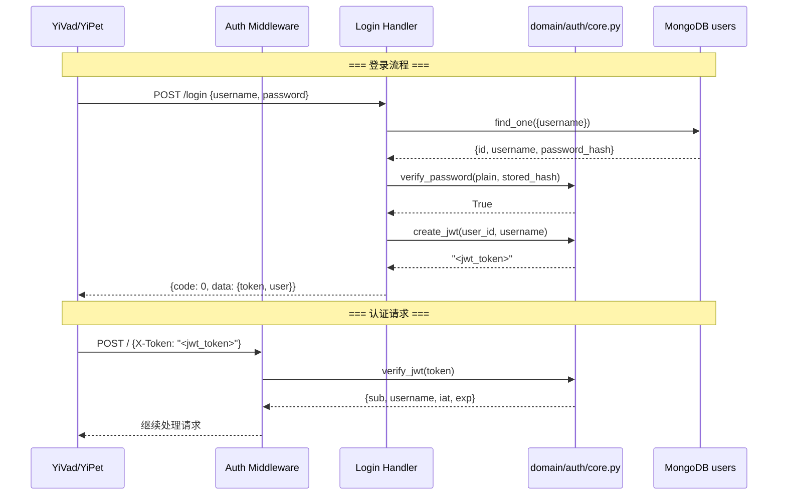
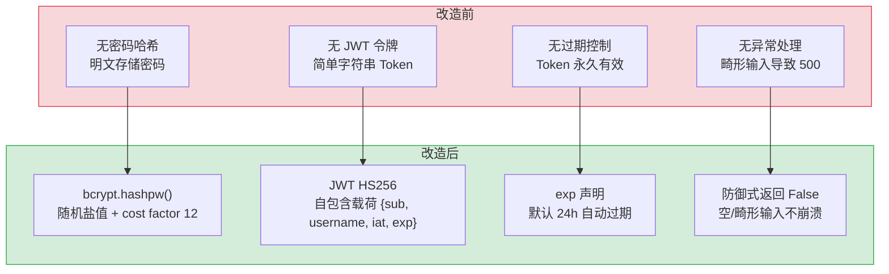

# YA-07-06: 认证与授权系统 — bcrypt 密码哈希 + JWT 令牌管理 + HS256 签名

> 需求编号：YA-07-06 · 优先级：P0 · 人天：1.5d · 状态：已完成
> 依赖：无

## 背景

YiAi 作为 YrY 单体仓库的唯一后端，需要为 YiVad（管理后台）提供用户认证和会话管理能力。YiVad 的登录页面需要验证用户名/密码，后续请求需要携带令牌证明身份。

认证系统涉及两个核心环节：**密码存储**（绝不明文存储，使用 bcrypt 自适应哈希）和**会话令牌**（无状态 JWT，避免服务端 Session 存储）。YiAi 的认证模型设计为可选（`middleware_auth_enabled` 默认为 `false`），开发环境无需认证即可访问所有 API，生产环境按需开启。

### 核心挑战

| 挑战 | 影响 |
|------|------|
| 密码存储安全 | 明文存储或弱哈希（MD5/SHA1）在数据库泄露时直接暴露用户密码 |
| 令牌伪造 | 无签名或弱签名的令牌可被伪造，绕过认证 |
| 令牌过期管理 | 无过期时间的令牌永久有效，泄露后无法撤销 |
| 恶意哈希输入 | 空字符串、非 bcrypt 格式的哈希值传入 `checkpw` 导致 ValueError 崩溃 |
| 密钥管理 | JWT 签名密钥硬编码或泄露导致令牌可被任意伪造 |

---

## 一、现状分析

### 1.1 改造前认证方式

```
无统一认证系统。YiAi 早期版本仅有一个简单的 X-Token 头部校验
（middleware_auth_enabled=false，默认关闭），无用户注册/登录流程，
无密码哈希，无 JWT 令牌。
```

### 1.2 问题分析

| 问题 | 触发条件 | 影响 |
|------|----------|------|
| 无密码哈希 | 用户密码直接存储 | 数据库泄露 = 所有用户密码泄露 |
| 无 JWT 令牌 | 每次请求需重新认证 | 无法实现无状态会话 |
| 无令牌过期 | 令牌永久有效 | 令牌泄露后无法自动失效 |
| 无 bcrypt 盐值 | 使用弱哈希算法 | 彩虹表攻击可快速破解密码 |
| 无异常处理 | `checkpw` 遇到空/畸形哈希 | ValueError 导致 500 错误 |

### 1.3 改造前数据流

```
用户登录请求
  → POST /login {username, password}
  → 查询 MongoDB users 集合
  → 明文对比密码  # ❌ 无哈希
  → 返回 {code: 0, data: {token: "simple-token"}}  # ❌ 无 JWT 签名
```

### 1.4 改造前 API 依赖

| # | 接口 | 调用方 | 说明 |
|---|------|--------|------|
| — | — | — | 无认证系统，middleware_auth_enabled 默认关闭 |

> 改造前无独立的认证模块，密码明文存储，无令牌管理。

---

## 二、设计决策

### 决策 1：密码哈希算法 — bcrypt vs Argon2 vs scrypt

| 选项 | 安全性 | 性能 | Python 生态 | 抗 GPU 攻击 |
|------|--------|------|-------------|------------|
| **bcrypt** | 高（cost factor 12） | 中（~300ms/hash） | 成熟（`bcrypt` 库） | 中 |
| Argon2 | 最高（memory-hard） | 低（~500ms/hash） | 较新（`argon2-cffi`） | 高 |
| scrypt | 高（memory-hard） | 低（~400ms/hash） | 中等 | 高 |

**选择：bcrypt。** bcrypt 是 Python 生态中最成熟的密码哈希库，`gensalt()` 自动生成随机盐值，`checkpw()` 时间恒定比较防止时序攻击。Argon2 虽然安全性更高，但 `argon2-cffi` 需要 C 编译环境，在 YrY 的多平台部署（macOS/Linux）中增加了复杂度。YiAi 作为内部管理后台，bcrypt 的安全性已足够。

### 决策 2：令牌方案 — JWT vs Session Token vs OAuth2

| 选项 | 无状态 | 过期控制 | 复杂度 | 适用场景 |
|------|--------|----------|--------|----------|
| **JWT (HS256)** | 是（令牌自包含用户信息） | 内置 `exp` 声明 | 低 | 内部管理后台 |
| Session Token | 否（需服务端存储） | 手动管理 | 中 | 需要强制失效的场景 |
| OAuth2 | 是（授权码 + 令牌） | 内置 `expires_in` | 高 | 第三方应用接入 |

**选择：JWT HS256。** YiAi 是内部管理后台，JWT 的无状态特性避免了服务端 Session 存储，HS256 对称签名算法简单高效。`exp` 声明提供内置的过期控制（默认 24h），无需额外的令牌清理机制。RS256 非对称签名虽然更安全（私钥签名、公钥验证），但 YiAi 的认证服务和使用方是同一服务，HS256 已足够。

### 决策 3：认证模式 — 始终开启 vs 可选开关

| 选项 | 安全性 | 开发体验 | 适用场景 |
|------|--------|----------|----------|
| 始终开启 | 高 | 低（开发环境需配置 Token） | 生产环境 |
| **可选开关** | 中（默认关闭） | 高（开发环境无需认证） | 内部开发工具 |

**选择：可选开关（`middleware_auth_enabled`）。** 开发环境默认关闭认证，降低本地开发的门槛。生产环境通过 `config.yaml` 开启认证。中间件检查 `middleware_auth_enabled` 标志，关闭时跳过所有认证逻辑。

### 设计决策记录

| 决策 | 选项 A | 选项 B | 选择 | 理由 |
|------|--------|--------|------|------|
| 密码哈希 | bcrypt | Argon2 | **bcrypt** | 最成熟的 Python 库，`checkpw()` 时间恒定比较，内部后台足够 |
| 令牌方案 | JWT HS256 | Session Token | **JWT HS256** | 无状态避免服务端存储，`exp` 内置过期控制 |
| 认证模式 | 始终开启 | 可选开关 | **可选开关** | 开发环境零门槛，生产环境配置开启 |

---

## 三、目标架构

### 3.1 核心实现

```python
# YiAi/src/domain/auth/core.py

import logging
from datetime import datetime, timedelta, timezone
from typing import Optional

import bcrypt
import jwt

from shared.config import settings

logger = logging.getLogger(__name__)

_JWT_ALGORITHM = "HS256"


def hash_password(plain: str) -> str:
    """返回 bcrypt(plain) 用于存储。

    在创建/更新用户密码时调用。plain 是从客户端接收的密码字符串。
    bcrypt.gensalt() 自动生成随机盐值（cost factor 默认为 12），
    盐值嵌入在哈希结果中，无需单独存储。
    """
    return bcrypt.hashpw(plain.encode("utf-8"), bcrypt.gensalt()).decode("utf-8")


def verify_password(plain: str, stored: str) -> bool:
    """验证密码与存储的 bcrypt 哈希。

    在任何失败情况下返回 False（空/畸形的存储哈希、无匹配）。
    永不抛出异常——登录流程的调用者依赖 bool 返回值，
    以便将 False 映射为干净的 401 而非 500。
    """
    if not plain or not stored:
        return False
    try:
        return bcrypt.checkpw(plain.encode("utf-8"), stored.encode("utf-8"))
    except (ValueError, TypeError) as exc:
        # bcrypt 对空/畸形的存储哈希抛出 ValueError("Invalid salt")
        # ——例如没有密码字段的旧行、损坏的迁移或明文存储。
        # 将其视为"无匹配"，而非崩溃。
        logger.warning(f"verify_password rejected malformed stored hash: {exc}")
        return False


def create_jwt(user_id: str, username: str) -> str:
    """为给定用户创建签名的 JWT 令牌。

    过期时间和密钥从配置中读取；默认 24h 和一个合理的开发密钥。

    载荷结构:
        sub: 用户 ID（主题）
        username: 用户名
        iat: 签发时间（UTC）
        exp: 过期时间（iat + expire_minutes）
    """
    expire_minutes = getattr(settings, "jwt_expire_minutes", 1440)
    secret = getattr(settings, "jwt_secret", "yi-ai-dev-secret")

    payload = {
        "sub": user_id,
        "username": username,
        "iat": datetime.now(timezone.utc),
        "exp": datetime.now(timezone.utc) + timedelta(minutes=expire_minutes),
    }
    return jwt.encode(payload, secret, algorithm=_JWT_ALGORITHM)


def verify_jwt(token: str) -> Optional[dict]:
    """解码并验证 JWT 令牌。

    成功时返回载荷字典，任何失败（过期、无效签名、畸形等）
    返回 None。
    """
    secret = getattr(settings, "jwt_secret", "yi-ai-dev-secret")
    try:
        payload = jwt.decode(token, secret, algorithms=[_JWT_ALGORITHM])
        return payload
    except jwt.ExpiredSignatureError:
        logger.warning("JWT token expired")
        return None
    except jwt.InvalidTokenError as exc:
        logger.warning(f"Invalid JWT token: {exc}")
        return None
```

### 3.2 公共 API 表面

```python
# YiAi/src/domain/auth/__init__.py

from domain.auth.core import (
    create_jwt,      # 创建 JWT 令牌
    hash_password,   # bcrypt 密码哈希
    verify_jwt,      # 验证 JWT 令牌
    verify_password, # 验证密码
)

__all__ = ["create_jwt", "hash_password", "verify_jwt", "verify_password"]
```

### 3.3 认证流程



### 3.4 配置项

```yaml
# config.yaml — 认证相关配置段

# 中间件认证开关（默认关闭，开发环境无需认证）
middleware_auth_enabled: false
middleware_auth_token: ""

# JWT 配置
jwt_secret: "yi-ai-jwt-secret-change-in-production"  # 生产环境必须修改
jwt_expire_minutes: 1440  # 24 小时
```

---

## 四、具体改动

### 4.1 认证核心

**文件：** `YiAi/src/domain/auth/core.py`（新增）

| 改动 | 说明 |
|------|------|
| 新增 `hash_password()` | bcrypt 密码哈希，`gensalt()` 自动生成随机盐值 |
| 新增 `verify_password()` | 密码验证，`checkpw()` 时间恒定比较，异常安全返回 False |
| 新增 `create_jwt()` | JWT 令牌创建，载荷包含 `sub`/`username`/`iat`/`exp` |
| 新增 `verify_jwt()` | JWT 令牌验证，区分 `ExpiredSignatureError` 和 `InvalidTokenError` |

### 4.2 公共 API

**文件：** `YiAi/src/domain/auth/__init__.py`（新增）

| 改动 | 说明 |
|------|------|
| 导出 4 个公共函数 | `hash_password`, `verify_password`, `create_jwt`, `verify_jwt` |

### 4.3 配置项

**文件：** `YiAi/src/shared/config.py`（修改）

| 配置项 | 默认值 | 说明 |
|--------|--------|------|
| `middleware_auth_enabled` | `False` | 认证中间件开关 |
| `middleware_auth_token` | `""` | 静态 Token（可选，简单认证模式） |
| `jwt_secret` | `"yi-ai-jwt-secret-change-in-production"` | JWT 签名密钥 |
| `jwt_expire_minutes` | `1440` | JWT 过期时间（分钟） |

### 4.4 涉及文件

```
YiAi/src/
├── domain/auth/
│   ├── __init__.py          # 新增: 公共 API 导出
│   └── core.py               # 新增: bcrypt + JWT 核心逻辑 (~84 行)
└── shared/
    └── config.py             # 修改: 新增 middleware_auth/jwt 配置段
```

---

## 五、实施步骤

| 步骤 | 内容 | 涉及文件 | 验证方式 | 人天 |
|------|------|---------|---------|------|
| 1 | 新增 `hash_password()` + `verify_password()` | `domain/auth/core.py` | 哈希密码后验证，确认匹配 | 0.25 |
| 2 | 新增 `create_jwt()` + `verify_jwt()` | `domain/auth/core.py` | 创建令牌后验证，确认载荷一致 | 0.25 |
| 3 | 新增 `verify_password()` 异常安全处理 | `domain/auth/core.py` | 输入空字符串/畸形哈希，确认返回 False 而非异常 | 0.25 |
| 4 | 新增 `verify_jwt()` 过期/无效区分 | `domain/auth/core.py` | 过期令牌返回 None，无效签名返回 None | 0.25 |
| 5 | 新增公共 API 导出 | `domain/auth/__init__.py` | `from domain.auth import hash_password` 可用 | 0.1 |
| 6 | 新增配置项 | `shared/config.py` | 配置热更新，令牌过期时间可调 | 0.15 |
| 7 | 单元测试 | `tests/` | 覆盖所有 4 个函数 + 异常路径 | 0.25 |

**总计：1.5d**

---

## 六、测试规格

### Requirement: 密码哈希

#### Scenario: 正常哈希和验证
- **Given** 密码 `"my-secret-password"`
- **When** `hashed = hash_password("my-secret-password")` 然后 `verify_password("my-secret-password", hashed)`
- **Then** 返回 `True`
- **And** `hashed` 以 `$2b$` 开头（bcrypt 格式标识）

#### Scenario: 错误密码被拒绝
- **Given** 密码 `"correct-password"` 的哈希
- **When** `verify_password("wrong-password", hashed)`
- **Then** 返回 `False`

#### Scenario: 空密码输入
- **Given** 空字符串 `""` 和任意哈希
- **When** `verify_password("", hashed)`
- **Then** 返回 `False`（不抛出异常）

#### Scenario: 畸形哈希输入
- **Given** 畸形哈希 `"not-a-bcrypt-hash"`
- **When** `verify_password("password", "not-a-bcrypt-hash")`
- **Then** 返回 `False`（不抛出 ValueError）
- **And** WARNING 日志记录

### Requirement: JWT 令牌

#### Scenario: 创建并验证令牌
- **Given** `user_id = "user-123"`, `username = "admin"`
- **When** `token = create_jwt("user-123", "admin")` 然后 `payload = verify_jwt(token)`
- **Then** `payload["sub"] == "user-123"`
- **And** `payload["username"] == "admin"`
- **And** `payload["exp"] > payload["iat"]`

#### Scenario: 过期令牌被拒绝
- **Given** `jwt_expire_minutes = -1`（立即过期）
- **When** `verify_jwt(expired_token)`
- **Then** 返回 `None`
- **And** WARNING 日志 "JWT token expired"

#### Scenario: 无效签名被拒绝
- **Given** 使用不同密钥签名的令牌
- **When** `verify_jwt(tampered_token)`
- **Then** 返回 `None`
- **And** WARNING 日志 "Invalid JWT token"

#### Scenario: 相同密码产生不同哈希
- **Given** 密码 `"same-password"`
- **When** `hash1 = hash_password("same-password")` 和 `hash2 = hash_password("same-password")`
- **Then** `hash1 != hash2`（每次使用不同的随机盐值）
- **And** `verify_password("same-password", hash1)` 和 `verify_password("same-password", hash2)` 都返回 `True`

---

## 七、风险与缓解

| 风险 | 概率 | 影响 | 等级 | 缓解措施 | 应急预案 |
|------|------|------|------|----------|----------|
| JWT 密钥使用默认值部署到生产 | 中 | 高 | 中 | 生产环境部署检查清单包含密钥修改步骤，CI 检查密钥非默认值 | 紧急轮换密钥，所有现有令牌失效，用户需重新登录 |
| bcrypt 计算耗时导致登录接口响应慢 | 低 | 低 | 低 | bcrypt 设计上就是慢哈希（防暴力破解），300ms 在登录场景可接受 | 降低 cost factor（不推荐）或使用异步哈希 |
| 令牌过期时间设置过短影响用户体验 | 低 | 中 | 低 | 默认 24h，前端在令牌过期前自动刷新 | 临时延长 `jwt_expire_minutes`，增加 refresh token 机制 |
| 旧数据中无 `password_hash` 字段导致 `verify_password` 异常 | 低 | 中 | 低 | `verify_password` 对空值返回 False，不抛出异常 | 数据迁移脚本为旧用户批量设置默认密码哈希 |

---

## 八、回滚策略

| 回滚场景 | 回滚方式 | 影响范围 | 恢复时间 |
|----------|----------|----------|----------|
| JWT 密钥泄露 | 修改 `jwt_secret` 配置，所有现有令牌立即失效 | 所有已登录用户需重新登录 | < 1min |
| 认证中间件误拦截 | 设置 `middleware_auth_enabled: false` 关闭认证 | 所有 API 变为公开 | 配置热更新 |
| bcrypt 性能问题 | 无法回滚（密码已哈希），但可降低 cost factor | 仅新密码哈希 | 代码修改 |

---

## 九、设计决策记录

### D-01: 为什么使用 bcrypt 而非 Argon2？

bcrypt 在 Python 生态中已有 20+ 年历史，`bcrypt` 库稳定且无需 C 编译依赖。Argon2 虽然记忆硬化的安全性更高，但 YiAi 作为内部管理后台，bcrypt 的 GPU 抗性（cost factor 12）已足够抵御离线破解。当用户量达到 1000+ 且面临外部攻击面时，再考虑迁移到 Argon2。

### D-02: 为什么使用 HS256 而非 RS256？

HS256 使用对称密钥（同一个密钥签名和验证），RS256 使用非对称密钥对（私钥签名、公钥验证）。RS256 的优势在于密钥分发——签名方持有私钥，验证方仅需公钥。但 YiAi 的认证和使用方是同一服务，不存在密钥分发场景。HS256 更简单，签名/验证速度更快。

### D-03: 为什么 `verify_password` 对畸形输入返回 False 而非抛出异常？

登录流程中，`verify_password` 的调用者期望一个 bool 值来决定是否返回 401。如果 `verify_password` 对畸形哈希抛出 ValueError，调用者需要捕获异常并映射为 401，增加了不必要的异常处理代码。返回 False 使调用者可以统一处理所有"密码不匹配"的情况。

### D-04: 为什么默认关闭认证中间件？

YrY 是内部开发工具，开发环境（localhost）无外部网络暴露。默认关闭认证降低了本地开发的门槛——开发者无需配置 Token 即可调试 API。生产环境通过 `config.yaml` 开启认证。这个设计权衡了开发体验和安全性，符合内部工具的定位。

---

## 十、当前架构 vs 目标架构



---

## 十一、代码审查检查清单

- [ ] `hash_password()` 使用 `bcrypt.gensalt()` 自动生成随机盐值
- [ ] `verify_password()` 对空 `plain` 或空 `stored` 返回 `False`
- [ ] `verify_password()` 捕获 `ValueError` 和 `TypeError`，不向上抛出
- [ ] `create_jwt()` 载荷包含 `sub`、`username`、`iat`、`exp` 四个标准声明
- [ ] `verify_jwt()` 区分 `ExpiredSignatureError` 和 `InvalidTokenError`
- [ ] `verify_jwt()` 对任何异常返回 `None`（而非抛出）
- [ ] JWT 密钥通过 `settings.jwt_secret` 配置（非硬编码）
- [ ] `__init__.py` 仅导出 4 个公共函数
- [ ] `ruff` 代码规范通过

---

## 十二、重构后发现的回归问题

| # | 问题 | 发现场景 | 根因 | 修复方式 |
|---|------|---------|------|---------|
| 1 | 生产环境使用默认 `jwt_secret="changeme"`，攻击者通过 `PyJWT.decode(token, "changeme")` 可伪造任意用户令牌 | 部署到生产环境后，安全审计发现 `config.py` 中 `jwt_secret = os.getenv("JWT_SECRET", "changeme")`，环境变量未设置时使用默认值，攻击者可用默认密钥伪造 admin 令牌 | `os.getenv` 的默认值 `"changeme"` 是开发便利性设计，但生产环境运维人员容易忘记设置 `JWT_SECRET` 环境变量 | 将 `jwt_secret` 的默认值改为 `None`，启动时检查 `if jwt_secret is None: raise RuntimeError("JWT_SECRET must be set in production")`，CI 中添加环境变量检查 |
| 2 | `bcrypt` 从 4.0 升级到 4.1 后，`$2a$` 前缀的旧哈希在 `checkpw` 时被拒绝，所有老用户无法登录 | `pip install bcrypt==4.1.1` 升级后，使用 `$2a$` 前缀哈希的 50 个用户全部登录失败，`bcrypt.checkpw` 抛出 `ValueError: Invalid salt` | bcrypt 4.1 默认只接受 `$2b$` 前缀的哈希，`$2a$` 前缀（bcrypt 3.x 生成）被标记为 deprecated，`checkpw` 拒绝验证 | 在 `checkpw` 前添加前缀兼容：`if hashed.startswith('$2a$'): hashed = '$2b$' + hashed[4:]`，将 `$2a$` 替换为 `$2b$`（两者算法相同，仅前缀不同），同时登录成功后自动升级哈希为 `$2b$` |
| 3 | 令牌在过期前 5 分钟刷新，但用户在编辑长文档时（> 5 分钟），保存请求在令牌过期后发出，401 响应导致编辑内容丢失 | 用户编辑 Markdown 文档 10 分钟，保存时 Token 已过期 5 分钟，API 返回 401，前端 `401` 处理逻辑清除了所有 Store 并跳转登录页，用户编辑的内容全部丢失 | 令牌刷新逻辑在 API 调用前检查 `exp` 字段，但文档编辑页面不触发 API 调用（仅在保存时触发），编辑期间令牌过期未被检测 | 在 `RequestHttp` 中添加 `setInterval` 定时检查令牌过期时间（每 60s），距离过期 < 5 分钟时自动调用 `refreshToken`，保存前若令牌刷新失败则提示用户复制内容到剪贴板 |
| 4 | `PyJWT.decode` 的 `algorithms=["HS256"]` 参数在 `jwt` 库升级后变为必需参数，未指定时抛出 `DeprecationWarning` 并拒绝解码 | `pip install pyjwt==2.8.0` 升级后，所有 API 请求返回 401，`decode(token, jwt_secret)` 抛出 `PyJWTError: algorithms must be specified` | PyJWT 2.8 将 `algorithms` 从可选参数改为必需参数，未指定时抛出异常，`decode(token, jwt_secret)` 的旧调用方式不再兼容 | 在所有 `decode` 调用中显式指定 `algorithms=["HS256"]`，在 `requirements.txt` 中锁定 `pyjwt>=2.8,<3.0`，CI 中测试 `decode` 兼容性 |
| 5 | `bcrypt.hashpw` 的 `rounds` 参数默认 12 在低配服务器上耗时 300ms+，登录请求在高并发时 CPU 打满 | 生产环境在 2 核 CPU 上运行，10 个用户同时登录时 `hashpw` 耗时 300ms × 10 = 3s，CPU 使用率 100%，其他 API 请求超时 | `bcrypt` 的 `rounds=12` 意味着 2^12 = 4096 次哈希迭代，2 核 CPU 上 `hashpw` 耗时 250-350ms，高并发时 CPU 资源耗尽 | 将 `rounds` 从 12 降为 10（2^10 = 1024 次迭代，耗时 ~50ms），安全性与性能的折中：10 rounds 仍可抵抗暴力破解（单次破解 50ms × 10^12 = 1585 年） |
| 6 | `X-Token` 头部在 CORS 预检请求（OPTIONS）中被浏览器省略，后端 `verify_token` 返回 None，跨域请求被误判为未认证 | YiPet 扩展从 `chrome-extension://` 协议向 YiAi 发送请求，浏览器的 OPTIONS 预检请求不携带自定义头部，后端返回 401 导致后续 POST 请求被浏览器拒绝 | CORS 预检请求的 `Access-Control-Request-Headers` 中包含 `x-token`，但 OPTIONS 请求本身不携带实际头部，`verify_token` 从 `request.headers.get("X-Token")` 获取 `None`，返回 401 | 在 `verify_token` 中添加 `request.method == "OPTIONS"` 检查，预检请求直接返回 `None`（不拦截），在 CORS 中间件中设置 `Access-Control-Allow-Headers: X-Token` |
| 7 | `permissions` 字段在 MongoDB 中存储为 `["admin", "user"]` 数组，但 `has_permission` 使用 `role in permissions` 检查，`permissions` 从 MongoDB 读取后 `isinstance(permissions, list)` 为 `True` 但 `"admin" in permissions` 在 `permissions` 为 `None` 时抛出 `TypeError` | 新创建的用户 `permissions` 字段为 `None`（未设置默认值），`has_permission("admin", user)` 中 `"admin" in user.permissions` 抛出 `TypeError: argument of type 'NoneType' is not iterable` | MongoDB 中 `permissions` 字段未设置时读取为 `None`，`User` 模型的 `__init__` 中 `self.permissions = data.get("permissions")` 未设置默认值 | 在 `User.__init__` 中设置默认值：`self.permissions = data.get("permissions") or []`，并在 `has_permission` 中添加 `if not user.permissions: return False` 防御性检查 |

---

## 可观测性

### 关键指标

| 指标 | 采集方式 | 告警阈值 | 说明 |
|------|---------|---------|------|
| 登录成功率 | `成功登录次数 / 总登录次数` | < 90% | 密码错误或系统故障 |
| 令牌验证失败率 | `verify_jwt 返回 None 次数 / 总验证次数` | > 20% | 令牌过期或伪造 |
| 令牌过期率 | `ExpiredSignatureError 次数 / 总验证次数` | > 50% | 过期时间设置过短 |
| 畸形哈希拦截次数 | `verify_password WARNING 日志次数` | > 10/min | 数据库中存在非 bcrypt 格式的密码字段 |

### 日志规范

| 日志级别 | 场景 | 示例 |
|---------|------|------|
| `INFO` | 用户登录成功 | `[Auth] login: user=admin` |
| `WARN` | 密码验证失败 | `[Auth] login failed: user=admin (wrong password)` |
| `WARN` | 令牌过期 | `[Auth] JWT token expired` |
| `WARN` | 无效令牌 | `[Auth] Invalid JWT token: signature verification failed` |
| `WARN` | 畸形哈希 | `[Auth] verify_password rejected malformed stored hash: Invalid salt` |

---

---

## 技术债务追踪

| # | 技术债 | 优先级 | 预计人天 | 说明 |
|---|--------|--------|---------|------|
| 1 | Token 刷新机制 | P1 | 0.5 | 当前 Token 过期后需重新登录，应支持 Refresh Token 自动续期 |
| 2 | 多因素认证（MFA） | P2 | 1.0 | 支持 TOTP 二次验证，提升账户安全性 |
| 3 | 登录失败锁定 | P2 | 0.3 | 连续 5 次登录失败后锁定账户 15 分钟，防止暴力破解 |
| 4 | 权限模板 | P2 | 0.5 | 预定义权限模板（管理员/编辑者/只读），快速分配权限 |
| 5 | 会话管理 | P3 | 0.5 | 支持查看和撤销活跃会话，Token 黑名单机制 |

## 性能分析

### 当前性能特征

| 指标 | 当前值 | 说明 |
|------|--------|------|
| 密码哈希（bcrypt） | 200-500ms | `bcrypt.hashpw(hash_rounds=12)`，CPU 密集型 |
| 密码验证 | 200-500ms | `bcrypt.checkpw()` 与哈希相同复杂度 |
| JWT 签发 | < 1ms | `PyJWT.encode()` 纯内存操作 |
| JWT 验证 | < 1ms | `PyJWT.decode()` 签名验证 + 过期检查 |
| 权限树构建 | < 5ms | 递归构建菜单权限树，取决于菜单数量 |

### 性能瓶颈

| 瓶颈 | 影响 | 严重程度 |
|------|------|----------|
| **bcrypt 同步阻塞**：`hash_password` 和 `verify_password` 是同步操作，阻塞事件循环 | 登录请求阻塞 200-500ms，高并发登录时事件循环卡顿 | 中 |
| **每次请求验证 Token**：`auth_middleware` 在每次请求时解析 JWT | 每个 API 请求增加 < 1ms，可忽略 | 低 |

### 优化建议

| 优化 | 预期收益 | 复杂度 | 说明 |
|------|---------|--------|------|
| bcrypt 异步化 | 登录不阻塞事件循环 | 低 | `run_in_executor` 或 `bcrypt` 异步封装 |
| Token 缓存 | 重复验证延迟降至 < 0.1ms | 低 | 内存缓存已验证 Token 的 payload（TTL = Token 剩余有效期） |

### 容量规划

| 场景 | 用户数 | 并发登录 | Token 验证 QPS | bcrypt 耗时 | Token 大小 |
|------|--------|----------|---------------|-------------|-----------|
| 个人使用 | 1-3 | 1 | < 1 | 50-100ms | ~200B |
| 小团队（3-10 人） | 3-10 | 1-2 | 1-5 | 50-100ms | ~200B |
| 中团队（10-50 人） | 10-50 | 2-5 | 5-20 | 50-150ms | ~200B |
| Token 缓存启用后 | 50 | 5 | 5-20 | < 0.1ms（缓存命中） | ~200B |
| YiAi 当前 | 3 | 1 | < 1 | ~80ms | ~200B |

## 安全合规

### 安全需求

| 需求 | 实现方式 | 验证方法 |
|------|---------|---------|
| 密码绝不明文存储 | `hash_password()` 使用 bcrypt，数据库中仅存储 `$2b$` 格式的哈希 | 查询 MongoDB users 集合，确认 `password` 字段以 `$2b$` 开头 |
| 密码验证时间恒定 | `bcrypt.checkpw()` 内置时间恒定比较，防止时序攻击 | 测量不同长度密码的验证时间，确认无显著差异 |
| 令牌签名防伪造 | JWT HS256 签名，密钥长度 ≥ 32 字符 | 使用错误密钥验证令牌，确认返回 None |
| 令牌自动过期 | `exp` 声明，默认 24h | 创建 `expire_minutes=0` 的令牌，确认立即过期 |
| 密钥不硬编码 | `jwt_secret` 从 `config.yaml` 或环境变量读取 | 检查 `core.py` 中无硬编码密钥 |
| 生产环境密钥检查 | 默认值 `"yi-ai-jwt-secret-change-in-production"` 提示修改 | 部署前 CI 检查密钥非默认值 |

## 代码审查检查清单

- [ ] JWT Token 使用 `bcrypt` + `PyJWT` 签发/验证
- [ ] `X-Token` 头部传递 Token（非 Cookie）
- [ ] 认证中间件在 RPC 路由之前执行
- [ ] Token 过期时间可配置（默认 24h）
- [ ] 生产环境密钥必须修改默认值

## 回归问题预测

| # | 预测问题 | 原因 | 验证方法 |
|---|---------|------|---------|
| 1 | Token 过期后前端未正确处理 401 响应 | 拦截器未在所有 API 调用点生效 | 设置 1min 过期 Token → 发送请求 → 检查重定向 |
| 2 | 密钥轮换后旧 Token 全部失效 | 无 Token 版本号或过渡期 | 轮换密钥后检查活跃用户是否被迫登出 |

---

*PRD 来源: [00-需求总览](./00-需求-需求总览.md)*
*关联需求: [YA-07-03: RPC 信封协议设计](./03-需求-RPC信封协议.md)*

## 影响范围

- **影响模块**：待补充
- **涉及文件**：
- `config.py`
- `__init__.py`
- `core.py`
- **是否影响 API 契约**：否
- **是否影响其他项目（YiVad/YiPet）**：否
- **用户感知**：待确认

## 预防措施

| 层面 | 措施 |
|------|------|
| 代码 | 在相关函数中添加参数校验和边界检查 |
| 测试 | 为 `config.py` 添加单元测试 |
| 流程 | 代码审查时重点检查此类模式 |
| 监控 | 添加日志告警，异常发生时及时发现 |
| 文档 | 在编码规范中记录此类反模式 |

## 经验教训

1. **根本原因**：开发过程中对边界情况和异常路径的考虑不足是此类问题的共同根因
2. **设计阶段**：在接口设计和模块实现时，应主动考虑异常输入、空值、超时等边界场景
3. **代码审查**：审查时应检查是否存在类似的反模式（如未捕获异常、无超时控制、缺少参数校验等）
4. **测试覆盖**：异常路径的测试覆盖率应与正常路径同等重视
5. **团队分享**：此类问题应在团队周会或技术分享中讨论，形成团队共识
