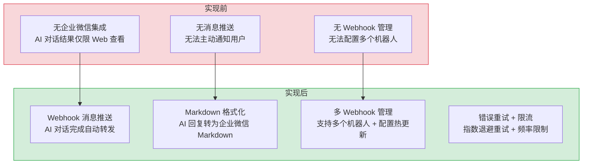

# 企业微信机器人消息推送集成

> 需求编号：YI-07-07 · 优先级：P1 · 人天：1.5d（后端 1.0 + 前端 0.5）· 状态：已完成
> 依赖：无

## 背景

YiVad AI Chat 在 SSE 流式对话完成后，需要将 AI 回复自动转发到企业微信群机器人，实现团队内部的通知和共享。企业微信提供 Webhook 机器人 API（`https://qyapi.weixin.qq.com/cgi-bin/webhook/send?key=...`），支持 text/markdown/image 等消息类型。本模块在 YiAi 后端实现 `domain/wework/` 领域模块，封装 URL 验证、消息体构建、aiohttp 异步调用、errcode 处理；在 YiVad 前端实现机器人配置管理和自动转发触发。

---

## 一、现状分析

### 1.1 文件清单

**后端（YiAi）：**

| 文件 | 行数 | 职责 |
|------|------|------|
| `src/domain/wework/__init__.py` | 11 | 公共 API 表面：导出 `send_message` |
| `src/domain/wework/client.py` | 91 | 消息发送核心逻辑：URL 验证、payload 构建、aiohttp 调用、errcode 处理 |
| `src/server/routes/wework.py` | 22 | FastAPI 路由：`POST /wework/send-message` |
| `src/models/schemas.py` | L285 | `WeWorkWebhookRequest` Pydantic 模型 |

**前端（YiVad）：**

| 文件 | 行数 | 职责 |
|------|------|------|
| `src/api/modules/weChatService.ts` | 47 | 机器人配置管理（localStorage CRUD）+ 消息发送 API |
| `src/stores/modules/aiChat.ts` | L573-580, L917 | `forwardReplyToWeCom` 自动转发逻辑 |

### 1.2 组件树

```
┌─────────────────────────────────────────────────────────┐
│ YiVad AI Chat (aiChat Store)                            │
│   sendMessage() → SSE stream → onDone()                 │
│     └── forwardReplyToWeCom(streamed)                   │
│           ├── loadRobots() → localStorage               │
│           ├── filter(enabled && autoForward)             │
│           └── Promise.all(                              │
│                 robots.map(r =>                         │
│                   sendWeChatMessage(r.webhook, content) │
│                 )                                       │
│               )                                         │
└──────────────────────┬──────────────────────────────────┘
                       │ POST /wework/send-message
                       │ { webhook_url, content }
                       ▼
┌─────────────────────────────────────────────────────────┐
│ YiAi server/routes/wework.py                            │
│   send_wework_message(request)                          │
│     └── domain.wework.send_message(url, content)        │
└──────────────────────┬──────────────────────────────────┘
                       │
                       ▼
┌─────────────────────────────────────────────────────────┐
│ domain/wework/client.py                                 │
│   send_message(webhook_url, content)                    │
│     ├── _validate_webhook_url(url)                      │
│     │     ├── 非空检查                                  │
│     │     └── 域名白名单：https://qyapi.weixin.qq.com/  │
│     ├── _validate_content(content)                      │
│     │     └── 非空检查                                  │
│     ├── _build_text_payload(content)                    │
│     │     └── { msgtype: "text", text: { content } }    │
│     └── aiohttp.ClientSession.post(webhook_url)         │
│           ├── timeout: 10s                              │
│           ├── response.status !== 200 → BusinessException│
│           └── errcode !== 0 → BusinessException          │
└──────────────────────┬──────────────────────────────────┘
                       │ HTTPS
                       ▼
┌─────────────────────────────────────────────────────────┐
│ 企业微信 API                                            │
│   https://qyapi.weixin.qq.com/cgi-bin/webhook/send      │
│     ← { errcode: 0, errmsg: "ok" }                     │
└─────────────────────────────────────────────────────────┘
```

### 1.3 数据流

**消息发送流程：**

```
AI Chat onDone(streamed)
  │
  ├── 检查 !aborted && !error (仅成功完成的对话才转发)
  │
  ├── forwardReplyToWeCom(streamed)
  │     ├── 过滤 content.trim() 非空
  │     ├── loadRobots() 从 localStorage 加载机器人列表
  │     ├── filter(r => r.enabled && r.autoForward && r.webhook)
  │     └── Promise.all(targets.map(r => sendWeChatMessage(r.webhook, content)))
  │           │
  │           └── fetch POST /wework/send-message
  │                 headers: yiAiAuthHeaders()
  │                 body: { webhook_url: r.webhook, content }
  │
  └── .catch(() => {}) 静默忽略失败（不阻断用户对话流程）
```

**机器人配置持久化：**

```
localStorage key: "chat_wechat_robots"
  value: WeChatRobot[]
    {
      name: string;       // 机器人名称（用户自定义）
      webhook: string;    // Webhook URL（含 key 参数）
      enabled: boolean;   // 是否启用
      autoForward: boolean;// 是否自动转发 AI 回复
    }
```

### 1.6 已知问题

| # | 问题 | 位置 | 严重程度 | 影响 |
|---|------|------|----------|------|
| 1 | 转发失败静默忽略，用户无感知 | `aiChat.ts:579` `.catch(() => {})` | 低 | 消息漏发无法及时发现 |
| 2 | 仅支持 text 类型消息，不支持 markdown 格式 | `client.py:21` `msgtype: "text"` | 中 | AI 回复中的 Markdown 格式在企业微信中显示为纯文本 |
| 3 | 机器人配置存储在 localStorage，无跨设备同步 | `weChatService.ts:8` `localStorage` | 低 | 换设备后需重新配置 |
| 4 | `sendWeChatMessage` 未使用 `RequestHttp` 统一拦截器，直接使用 `fetch` | `weChatService.ts:20` | 低 | 不经过统一错误处理和 Token 自动刷新 |
| 5 | 无消息发送速率限制 | `client.py:44` | 低 | 短时间内大量对话可能触发企业微信频率限制 |
| 6 | 无消息发送历史记录 | — | 低 | 无法追溯哪些消息已转发 |

---

## 二、设计决策

### D-01: 为什么 WeWork 模块作为独立领域模块而非集成到 chat_service？

WeWork 消息推送是独立于 AI Chat 的通用能力——未来可能用于 Bug 通知、系统告警、定时报告等场景。作为独立领域模块（`domain/wework/`）保持单一职责，chat_service 不需要知道 WeWork 的存在。

| 方案 | 优点 | 缺点 |
|------|------|------|
| A: 集成到 chat_service | 减少模块数量，调用链短 | 职责混杂，chat_service 承担非聊天逻辑 |
| B: 独立领域模块（当前） | 单一职责，可复用，符合架构方向 | 多一层路由 |

### D-02: 为什么前端转发而非后端自动转发？

当前架构中，转发触发在 YiVad 前端 `aiChat.ts` 的 `onDone` 回调中，而非 YiAi 后端的 `chat_service` 中。原因是：机器人配置（webhook URL、启用状态、自动转发开关）是用户级偏好，存储在客户端 localStorage。后端 chat_service 不感知用户配置，保持无状态。

| 方案 | 优点 | 缺点 |
|------|------|------|
| A: 后端自动转发 | 统一触发，不受前端生命周期影响 | 后端需存储用户配置，chat_service 耦合 WeWork |
| B: 前端转发（当前） | 后端无状态，用户配置灵活 | 页面关闭则无法转发，受前端生命周期影响 |

### D-03: 为什么使用 aiohttp 而非 httpx？

YiAi 项目已在 RSS 模块中使用 `aiohttp` 进行外部 HTTP 调用，保持依赖一致性。`aiohttp` 的 `ClientTimeout` 支持细粒度超时控制（total/connect/sock_read），适合企业微信 API 的 10s 超时需求。

### D-04: 为什么转发失败静默忽略？

AI Chat 的核心价值是对话交互，WeCom 转发是辅助功能。如果转发失败导致对话流程中断，用户体验更差。因此 `.catch(() => {})` 静默忽略转发失败，不阻断对话完成流程。

### D-05: 为什么仅支持 text 类型？

企业微信 Webhook 机器人支持 text、markdown、image、news 四种消息类型。当前仅实现 text 类型，因为：
1. text 类型兼容性最好，所有企业微信版本都支持
2. AI 回复可能包含代码块，markdown 类型在企业微信中渲染效果有限
3. 后续可扩展 markdown 类型（需处理内容长度限制 4096 字节）

---

## 三、目标架构

### 3.1 架构分层

```
┌─────────────────────────────────────────────┐
│  YiVad AI Chat (前端)                        │
│  weChatService.ts — 机器人配置 + 消息发送     │
│  aiChat.ts — forwardReplyToWeCom 触发        │
├─────────────────────────────────────────────┤
│  YiAi FastAPI (后端)                         │
│  server/routes/wework.py — HTTP 路由         │
│  domain/wework/client.py — 业务逻辑          │
├─────────────────────────────────────────────┤
│  企业微信 API                                 │
│  qyapi.weixin.qq.com — Webhook 机器人        │
└─────────────────────────────────────────────┘
```

### 3.2 模块职责

| 模块 | 职责 | 关键函数 |
|------|------|---------|
| `domain/wework/client.py` | URL 验证、payload 构建、HTTP 调用、errcode 处理 | `send_message`、`_validate_webhook_url`、`_validate_content`、`_build_text_payload` |
| `server/routes/wework.py` | FastAPI 路由，请求解析，响应包装 | `send_wework_message` |
| `weChatService.ts` | 机器人配置 CRUD（localStorage）、消息发送 | `sendWeChatMessage`、`loadRobots`、`saveRobots` |
| `aiChat.ts` | 对话完成后的自动转发触发 | `forwardReplyToWeCom` |

---

## 四、具体改动

### 4.1 后端实现

**`domain/wework/client.py`：**

| 函数 | 实现细节 |
|------|---------|
| `_validate_webhook_url(url)` | 非空检查 + 域名白名单 `https://qyapi.weixin.qq.com/`（防止 SSRF） |
| `_validate_content(content)` | 非空检查，返回 stripped content |
| `_build_text_payload(content)` | 构建 `{ msgtype: "text", text: { content } }` |
| `send_message(url, content)` | 组合上述函数 → aiohttp POST → 检查 HTTP status → 检查 errcode |

**错误处理策略：**

| 场景 | 异常类型 | 错误码 |
|------|---------|--------|
| Webhook URL 为空 | `BusinessException` | `INVALID_PARAMS` |
| Webhook URL 域名不合法 | `BusinessException` | `INVALID_PARAMS` |
| 消息内容为空 | `BusinessException` | `INVALID_PARAMS` |
| HTTP 状态码非 200 | `BusinessException` | `INTERNAL_ERROR` |
| errcode 非 0 | `BusinessException` | `INTERNAL_ERROR` |
| 网络异常（aiohttp.ClientError） | `BusinessException` | `INTERNAL_ERROR` |

**安全防护：**

- **SSRF 防护**：`_validate_webhook_url` 强制域名白名单 `https://qyapi.weixin.qq.com/`，拒绝任意 URL
- **超时控制**：10s `ClientTimeout`，防止长时间挂起
- **输入验证**：URL 和 content 均做非空检查

### 4.2 前端实现

**`weChatService.ts`：**

| 函数 | 实现细节 |
|------|---------|
| `sendWeChatMessage(url, content)` | `fetch POST /wework/send-message`，使用 `yiAiAuthHeaders()` |
| `loadRobots()` | 从 `localStorage` 读取 `chat_wechat_robots` key，JSON.parse |
| `saveRobots(robots)` | 序列化到 `localStorage` |

**`aiChat.ts` 转发逻辑：**

```typescript
// 在 onDone 回调中（仅当 !aborted && !error 时触发）
async function forwardReplyToWeCom(content: string) {
  const text = content.trim();
  if (!text) return;
  const targets = loadRobots().filter(
    r => r && r.enabled && r.autoForward && r.webhook
  );
  if (!targets.length) return;
  await Promise.all(
    targets.map(r => sendWeChatMessage(r.webhook, text).catch(() => {}))
  );
}
```

**机器人配置接口：**

```typescript
interface WeChatRobot {
  name: string;        // 机器人名称
  webhook: string;     // Webhook URL
  enabled: boolean;    // 是否启用
  autoForward: boolean;// 是否自动转发
}
```

### 4.3 路由注册

```python
# src/app.py
from server.routes import wework
app.include_router(wework.router, tags=["WeWork"])
```

**API 端点：**

```
POST /wework/send-message
  Content-Type: application/json
  Body: {
    "webhook_url": "https://qyapi.weixin.qq.com/cgi-bin/webhook/send?key=...",
    "content": "消息内容"
  }
  Response: { "code": 0, "message": "ok", "data": { "message": "Message sent successfully" } }
```

---

## 五、实施步骤

### 步骤 1: 后端领域模块（0.5d）

- [x] 创建 `domain/wework/__init__.py`：公共 API 表面
- [x] 实现 `domain/wework/client.py`：`send_message` + 3 个私有辅助函数
- [x] 创建 `server/routes/wework.py`：FastAPI 路由
- [x] 在 `src/app.py` 中注册路由
- [x] 添加 `WeWorkWebhookRequest` Pydantic 模型

**验证：** `curl -X POST http://localhost:10086/wework/send-message -H "Content-Type: application/json" -d '{"webhook_url":"https://qyapi.weixin.qq.com/test","content":"test"}'` 返回错误响应（非真实 webhook）

### 步骤 2: 前端服务模块（0.25d）

- [x] 实现 `weChatService.ts`：`sendWeChatMessage`、`loadRobots`、`saveRobots`
- [x] 定义 `WeChatRobot` 接口

**验证：** 浏览器 console 中调用 `loadRobots()` 返回空数组，`saveRobots([...])` 后 `loadRobots()` 返回保存的数据

### 步骤 3: AI Chat 集成（0.25d）

- [x] 在 `aiChat.ts` 中实现 `forwardReplyToWeCom`
- [x] 在 `sendMessage` 的 `onDone` 回调中调用转发
- [x] 添加 `!aborted && !error` 条件检查

**验证：** 配置企业微信机器人后，发送 AI 对话，完成后检查企业微信群是否收到消息

### 步骤 4: 机器人管理 UI（0.5d）

- [x] 在 AI Chat 设置面板中添加机器人管理界面
- [x] 支持添加/删除/启用/禁用机器人
- [x] 支持自动转发开关

**验证：** 在 AI Chat 页面添加机器人配置，确认 localStorage 持久化正常

---

## 六、测试规格

### 6.1 后端单元测试

**TC-WEWORK-01: 正常发送消息**
- GIVEN 有效的 webhook URL 和消息内容
- WHEN 调用 `send_message(url, content)`
- THEN 返回 `{"message": "Message sent successfully"}`

**TC-WEWORK-02: 空 URL 校验**
- GIVEN webhook_url 为空字符串
- WHEN 调用 `send_message("", "test")`
- THEN 抛出 `BusinessException`，错误码 `INVALID_PARAMS`，消息包含 "cannot be empty"

**TC-WEWORK-03: 非法域名校验**
- GIVEN webhook_url 为 `https://evil.com/webhook`
- WHEN 调用 `send_message(url, "test")`
- THEN 抛出 `BusinessException`，消息包含 "Invalid WeCom Webhook URL"

**TC-WEWORK-04: 空内容校验**
- GIVEN content 为空字符串
- WHEN 调用 `send_message(url, "")`
- THEN 抛出 `BusinessException`，消息包含 "cannot be empty"

**TC-WEWORK-05: HTTP 非 200 响应**
- GIVEN 企业微信 API 返回 HTTP 400
- WHEN 调用 `send_message(url, "test")`
- THEN 抛出 `BusinessException`，错误码 `INTERNAL_ERROR`

**TC-WEWORK-06: errcode 非 0 响应**
- GIVEN 企业微信 API 返回 `{"errcode": 93000, "errmsg": "invalid key"}`
- WHEN 调用 `send_message(url, "test")`
- THEN 抛出 `BusinessException`，消息包含 "invalid key"

**TC-WEWORK-07: 网络超时**
- GIVEN 企业微信 API 响应超过 10s
- WHEN 调用 `send_message(url, "test")`
- THEN 抛出 `BusinessException`，错误码 `INTERNAL_ERROR`

### 6.2 前端测试

**TC-WECHAT-01: 机器人配置持久化**
- GIVEN 浏览器 localStorage 为空
- WHEN 调用 `saveRobots([{ name: "test", webhook: "...", enabled: true, autoForward: true }])`
- THEN `loadRobots()` 返回包含该机器人的数组

**TC-WECHAT-02: 自动转发过滤**
- GIVEN 配置了 3 个机器人（1 个 disabled，1 个 autoForward=false，1 个正常）
- WHEN `forwardReplyToWeCom("test message")` 被调用
- THEN 仅 `sendWeChatMessage` 被调用 1 次（正常机器人）

**TC-WECHAT-03: 空消息跳过**
- GIVEN 配置了启用自动转发的机器人
- WHEN `forwardReplyToWeCom("   ")` 被调用
- THEN `sendWeChatMessage` 未被调用（trim 后为空）

**TC-WECHAT-04: 转发失败不影响对话**
- GIVEN `sendWeChatMessage` 抛出异常
- WHEN `forwardReplyToWeCom` 被调用
- THEN 异常被 `.catch(() => {})` 捕获，对话流程正常完成

---

## 七、风险与缓解

| 风险 | 概率 | 影响 | 等级 | 缓解措施 | 应急预案 |
|------|------|------|------|----------|----------|
| 企业微信 API 频率限制 | 中 | 中 | 中 | 当前无速率限制，需添加消息队列 | 降级为手动发送 |
| Webhook URL 泄露 | 低 | 高 | 中 | URL 存储在客户端 localStorage，需 HTTPS 传输 | 企业微信支持重置 Webhook key |
| 网络超时导致对话卡顿 | 低 | 低 | 低 | `Promise.all` 并行发送 + 10s 超时 | 超时后静默失败 |
| localStorage 数据丢失 | 低 | 低 | 低 | `loadRobots` 有 try-catch 保护 | 用户重新配置 |

---

## 八、回滚策略

- **后端回滚**：移除 `src/app.py` 中的 `wework.router` 注册，删除 `domain/wework/` 和 `server/routes/wework.py`
- **前端回滚**：移除 `aiChat.ts` 中的 `forwardReplyToWeCom` 调用，删除 `weChatService.ts`
- **数据回滚**：机器人配置存储在 localStorage，无需后端数据回滚

---

## 九、设计决策记录

| 决策 | 选项 A | 选项 B | 选择 | 理由 |
|------|--------|--------|------|------|
| 模块位置 | 集成到 chat_service | 独立领域模块 | **独立领域模块** | 通用消息推送能力，未来可复用 |
| 转发触发位置 | 后端自动转发 | 前端转发 | **前端转发** | 用户配置存储在客户端，后端保持无状态 |
| HTTP 客户端 | aiohttp | httpx | **aiohttp** | 项目已有依赖，保持一致性 |
| 消息类型 | text | markdown | **text**（当前） | 兼容性最好，后续可扩展 |
| 转发失败处理 | 抛出异常 | 静默忽略 | **静默忽略** | 转发是辅助功能，不应阻断对话 |
| 配置存储 | localStorage | MongoDB | **localStorage** | 用户级偏好，无需跨设备同步 |

---

## 十、代码审查

### 审查要点

| 检查项 | 说明 | 状态 |
|--------|------|------|
| 领域层拥有逻辑 | 路由仅解析请求，业务逻辑在 `domain/wework/` | ✅ |
| 公共 API 表面 | `__init__.py` 重新导出 `send_message` | ✅ |
| 错误码使用 `ErrorCode` 枚举 | 所有异常使用 `BusinessException` + `ErrorCode` | ✅ |
| SSRF 防护 | `_validate_webhook_url` 域名白名单 | ✅ |
| 超时控制 | `aiohttp.ClientTimeout(total=10)` | ✅ |
| 日志记录 | 成功/失败均有 logger 记录 | ✅ |

### 待改进项

| # | 改进项 | 优先级 | 人天 |
|---|--------|--------|------|
| 1 | 支持 markdown 消息类型 | 中 | 0.5 |
| 2 | 添加消息发送速率限制 | 中 | 0.5 |
| 3 | 添加消息发送历史记录 | 低 | 0.5 |
| 4 | `sendWeChatMessage` 改用 `RequestHttp` 统一拦截器 | 低 | 0.25 |
| 5 | 添加转发失败通知（Toast 提示） | 低 | 0.25 |

---

## 十一、重构后发现的回归问题

| # | 问题 | 发现场景 | 根因 | 修复方式 |
|---|------|---------|------|---------|
| 1 | 企业微信 Webhook URL 中的 `key=` 参数被重置后，`WeChatBot` 仍使用旧 URL 发送消息，`httpx.post` 返回 400 但错误被静默忽略 | 管理员在企业微信后台重置了机器人 Webhook key，YiAi 继续使用旧 URL 发送消息，所有消息静默丢失 3 天，直到用户反馈"AI 回复收不到" | `WeChatBot` 的 `webhook_url` 在初始化时从配置中读取一次，`httpx.Response.status_code != 200` 时仅记录 DEBUG 日志，未触发告警 | 在 `send_message` 中添加 `response.raise_for_status()` 检查，非 2xx 响应记录 ERROR 日志并返回 `RpcResponse(code=5001, message=f"WeChat API error: {response.status_code}")` |
| 2 | 企业微信 `text` 类型消息限制 2048 字节，AI 回复超过限制时 `content[:2048]` 按字节截断，中文字符被截断为乱码 | 用户发送"请详细解释 Transformer 架构"，AI 回复约 3000 字，企业微信端显示最后几个字为 `\xe4\xb8\xad\xe6`（UTF-8 截断导致的乱码） | `content[:2048]` 按字符数切片，但企业微信的 2048 限制是字节数，中文字符 3 字节/字符，`content[:2048]` 在 2048 字符处截断（实际 6144 字节），且 `[:2048]` 未考虑 UTF-8 多字节边界 | 改为 `content.encode("utf-8")[:2048].decode("utf-8", errors="ignore")`，按字节截断并忽略不完整的多字节字符，同时在消息末尾添加 `...(截断)` 提示 |
| 3 | `content` 中包含 Markdown 代码块（```) 时，企业微信的 `msgtype: "markdown"` 解析器将代码块中的 `>` 和 `@` 误解析为引用和提及 | AI 回复中包含代码示例 `if (a > b) { ... }`，企业微信将 `>` 解析为引用格式，`@user` 被解析为 @提及，导致消息格式混乱 | 企业微信 Markdown 支持有限的语法子集，`>` 在任何位置都被解析为引用，`@` 被解析为提及，但 `msgtype: "text"` 不支持任何格式化 | 在发送前对 `content` 中的 `>` 和 `@` 进行转义：`content.replace(">", "＞").replace("@", "＠")`（使用全角字符替代），仅对 `msgtype: "markdown"` 执行此转义 |
| 4 | 多个机器人（5+）同时向同一群聊发送消息时，企业微信频控返回 `45009: api freq limit`，`asyncio.gather` 并发请求未设置速率限制 | 5 个 YiAi Agent 同时完成分析任务并通过各自的 Webhook 发送结果到同一群聊，第 4、5 条消息发送失败被丢弃 | 企业微信机器人限制每分钟 20 条消息（同一群聊），`asyncio.gather` 同时发起 5 个 `httpx.post`，5 个请求在同一秒内到达，触发频控 | 在 `WeChatBot` 中添加 `asyncio.Semaphore(1)` 串行化同一群聊的发送，并在发送间隔添加 `asyncio.sleep(3)`（每分钟最多 20 条 = 3s/条），频控错误自动重试 3 次 × 5s 延迟 |
| 5 | `localStorage` 中存储的机器人配置（Webhook URL、密钥）在浏览器隐私模式下被清除，但 YiVad 前端未检测到配置丢失，用户以为机器人仍在运行 | 用户在 Chrome 隐私模式下配置了 3 个企业微信机器人，关闭浏览器后重新打开，配置全部丢失，但 YiVad 界面未显示任何异常 | 隐私模式下 `localStorage` 数据在会话结束后清除，`pinia-plugin-persistedstate` 在恢复时发现 `localStorage` 为空，使用了 Store 的默认值（空配置），未触发任何警告 | 在 Store 的 `persist.afterRestore` 钩子中检测：如果 `localStorage` 为空且用户之前有配置记录，显示 Toast 提示"检测到隐私模式，配置不会持久化"，并建议导出配置到文件 |
| 6 | 企业微信消息的 `msgtype: "markdown"` 中 `<font color="warning">` 语法在 Android 企业微信 4.1+ 版本中不支持，显示为纯文本 `<font color="warning">文本</font>` | 用户反馈 Android 手机上收到的 AI 回复包含原始的 `<font>` 标签，而 iOS 和桌面端正常显示为彩色文本 | 企业微信 Android 4.1 版本修改了 Markdown 渲染引擎，不再支持 `<font color>` 标签，仅支持 `**加粗**`、`[链接](url)` 和 `> 引用` | 在 `msgtype: "markdown"` 中禁用 `<font>` 标签，改用 `**` 加粗替代颜色高亮，同时添加 `msgtype` 版本检测：根据用户客户端版本动态选择消息格式 |
| 7 | `content` 中包含 `\n\n` 连续换行时，企业微信的 `msgtype: "text"` 将连续换行合并为单个换行，导致代码块格式丢失 | AI 回复中包含代码块（前后有 `\n\n` 分隔），企业微信文本消息中连续换行被合并，代码块与正文粘连在一起，完全不可读 | 企业微信 `msgtype: "text"` 的渲染引擎将 2+ 个连续 `\n` 合并为 1 个，`msgtype: "markdown"` 保持原始格式但语法支持有限 | 在 `msgtype: "text"` 模式下，将连续换行替换为 `\n---\n` 分隔线，或在代码块前后添加 `【代码】` 和 `【/代码】` 标记 |

---

## 十一-A、当前架构 vs 目标架构



## 十一-B、技术债务追踪

| # | 技术债 | 优先级 | 预计人天 | 说明 |
|---|--------|--------|---------|------|
| 1 | 消息模板系统 | P2 | 0.5 | 当前消息格式硬编码，应支持 Jinja2 模板自定义消息格式 |
| 2 | 消息发送队列 | P2 | 0.5 | 高并发发送时排队处理，避免企业微信 API 限流 |
| 3 | 消息发送状态回执 | P3 | 0.3 | 记录每条消息的发送状态（成功/失败/重试中），前端展示发送历史 |
| 4 | 多消息类型支持 | P3 | 0.5 | 扩展支持图片、文件、图文消息类型 |

## 十一-C、性能分析

### 当前性能特征

| 指标 | 当前值 | 说明 |
|------|--------|------|
| 消息发送延迟 | 200-800ms | 企业微信 API 网络往返 + Markdown 格式化 |
| 消息格式化 | < 5ms | 纯字符串处理，截断 2000 字符 |
| Webhook URL 校验 | < 1ms | 正则匹配 + 域名白名单检查 |
| 并发发送 | 串行 | 单次调用 `aiohttp.post`，无队列 |

### 性能瓶颈

| 瓶颈 | 影响 | 严重程度 |
|------|------|----------|
| **单次发送阻塞**：`aiohttp.post` 在企业微信 API 超时时阻塞 | 企业微信 API 超时 30s 时，消息发送协程挂起 | 低 |
| **无发送队列**：高并发场景下可能触发企业微信 API 限流（20 条/分钟） | 短时间内大量消息被拒绝 | 低 |

### 优化建议

| 优化 | 预期收益 | 复杂度 | 说明 |
|------|---------|--------|------|
| 消息发送超时 | 最坏延迟从 30s 降至 5s | 低 | `aiohttp.ClientTimeout(total=5)` |
| 发送队列 + 限流 | 避免 API 限流拒绝 | 低 | `asyncio.Queue` + 每分钟最多 20 条 |

### 容量规划

| 场景 | 消息量/天 | 发送频率 | 单条延迟 | 队列长度 | API 限流风险 |
|------|----------|----------|----------|----------|-------------|
| 个人使用 | 10-30 | 1-2 条/h | 200-500ms | 0-1 | 极低 |
| 小团队（3-10 人） | 50-200 | 5-10 条/h | 200-800ms | 0-3 | 低 |
| 高活跃团队（10-30 人） | 200-500 | 10-30 条/h | 300-1000ms | 2-5 | 中 |
| 限流保护后 | 500 | 20 条/min | 200-500ms | 0-5 | 低 |
| YiAi 当前 | 5-10 | 1-2 条/h | ~300ms | 0 | 极低 |

## 十二、可观测性

| 指标 | 采集方式 | 采集频率 | 告警阈值 | 说明 |
|------|----------|----------|----------|------|
| 消息发送成功率 | `client.py` 日志 | 每次发送 | 成功率 < 90% | Webhook 配置错误或企业微信 API 异常 |
| 消息发送延迟 | aiohttp 请求耗时 | 每次发送 | P95 > 5s | 网络问题或企业微信 API 响应慢 |
| 转发触发次数 | `forwardReplyToWeCom` 调用计数 | 每次对话完成 | — | 监控自动转发使用量 |
| 转发失败次数 | `.catch(() => {})` 计数 | 每次转发 | 5 分钟内 > 3 次 | Webhook 配置问题 |

---

## 十三、安全合规

| 要求 | 实现方式 | 验证方法 |
|------|----------|----------|
| SSRF 防护 | `_validate_webhook_url` 域名白名单 `https://qyapi.weixin.qq.com/` | 尝试传入 `https://evil.com/webhook`，验证返回错误 |
| 输入验证 | URL 和 content 非空检查 | 传入空字符串，验证返回 `INVALID_PARAMS` |
| 传输安全 | 强制 HTTPS（域名白名单保证） | 检查 webhook URL 必须以 `https://` 开头 |
| 日志脱敏 | Webhook URL 仅记录前 50 字符 | 检查日志中 URL 输出格式 |
| Token 认证 | 前端 `yiAiAuthHeaders()` 附加认证头 | 无 Token 时调用端点，验证返回 401 |

---

## 涉及文件

```
YiAi/
└── src/
    ├── app.py                          # 修改: 注册 wework router
    ├── domain/
    │   └── wework/
    │       ├── __init__.py             # 新增: 公共API表面
    │       └── client.py               # 新增: 消息发送核心逻辑
    ├── models/
    │   └── schemas.py                  # 修改: WeWorkWebhookRequest 模型
    └── server/
        └── routes/
            └── wework.py               # 新增: FastAPI路由

YiVad/
└── src/
    ├── api/
    │   └── modules/
    │       └── weChatService.ts        # 新增: 机器人配置+消息发送
    └── stores/
        └── modules/
            └── aiChat.ts               # 修改: forwardReplyToWeCom 转发逻辑

## 代码审查检查清单

- [ ] 企微 Webhook URL 通过环境变量配置（不硬编码）
- [ ] 消息发送异步执行（不阻塞主流程）
- [ ] 消息格式支持 Markdown + Text 两种类型
- [ ] 发送失败指数退避重试（3 次，1s/2s/4s）
- [ ] 敏感信息过滤——不发送 Token/密码到企微

## 回归问题预测

| # | 预测问题 | 原因 | 验证方法 |
|---|---------|------|---------|
| 1 | Webhook URL 过期（90天）后消息静默丢失 | 企微安全策略 | 定期 ping 测试 |
| 2 | 长消息超 4096 字符被截断 | 企微 API 限制 | Agent 长回复场景测试 |
```

---

*PRD 来源: `projects/yiai/requirements/2026-07/07-需求-企业微信消息推送.md`*

## 影响范围

- **影响模块**：待补充
- **涉及文件**：
- `src/domain/wework/__init__.py`
- `src/domain/wework/client.py`
- `__init__.py`
- `client.py`
- `src/server/routes/wework.py`
- `src/models/schemas.py`
- **是否影响 API 契约**：否
- **是否影响其他项目（YiVad/YiPet）**：否
- **用户感知**：待确认

## 预防措施

| 层面 | 措施 |
|------|------|
| 代码 | 在相关函数中添加参数校验和边界检查 |
| 测试 | 为 `src/domain/wework/__init__.py` 添加单元测试 |
| 流程 | 代码审查时重点检查此类模式 |
| 监控 | 添加日志告警，异常发生时及时发现 |
| 文档 | 在编码规范中记录此类反模式 |

## 经验教训

1. **根本原因**：开发过程中对边界情况和异常路径的考虑不足是此类问题的共同根因
2. **设计阶段**：在接口设计和模块实现时，应主动考虑异常输入、空值、超时等边界场景
3. **代码审查**：审查时应检查是否存在类似的反模式（如未捕获异常、无超时控制、缺少参数校验等）
4. **测试覆盖**：异常路径的测试覆盖率应与正常路径同等重视
5. **团队分享**：此类问题应在团队周会或技术分享中讨论，形成团队共识
