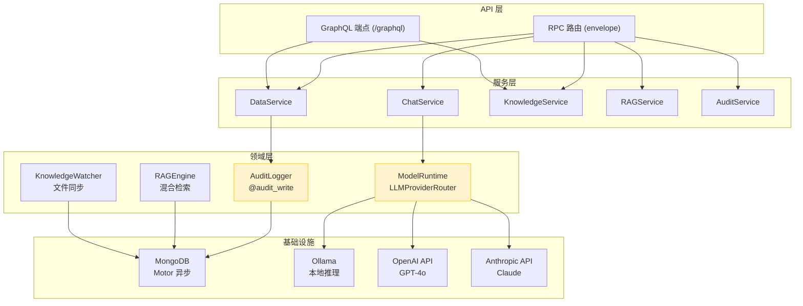
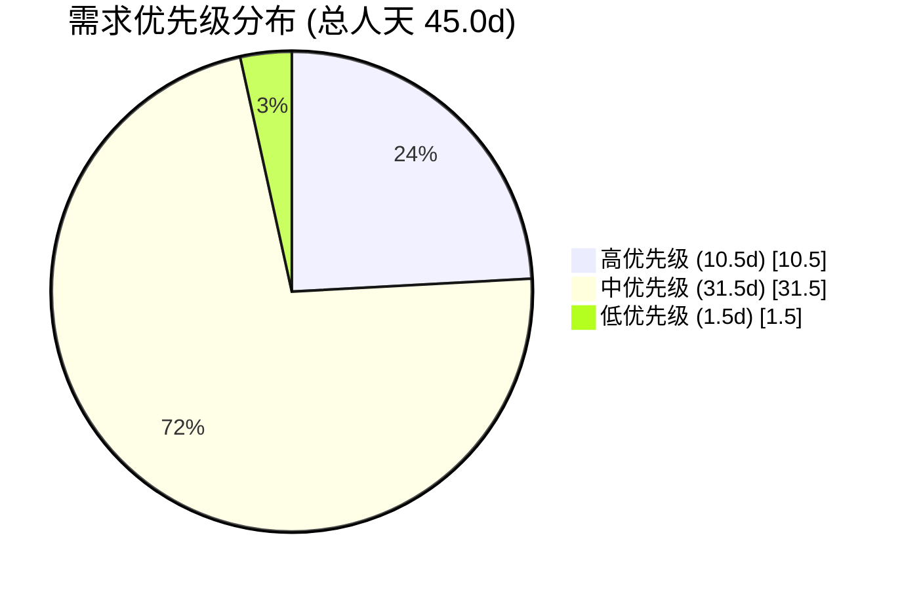
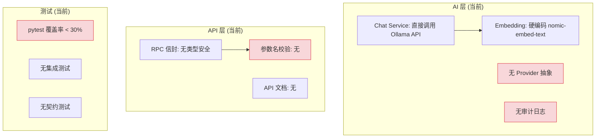
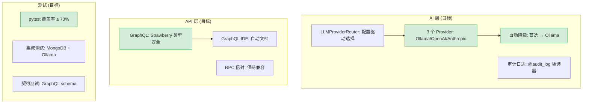
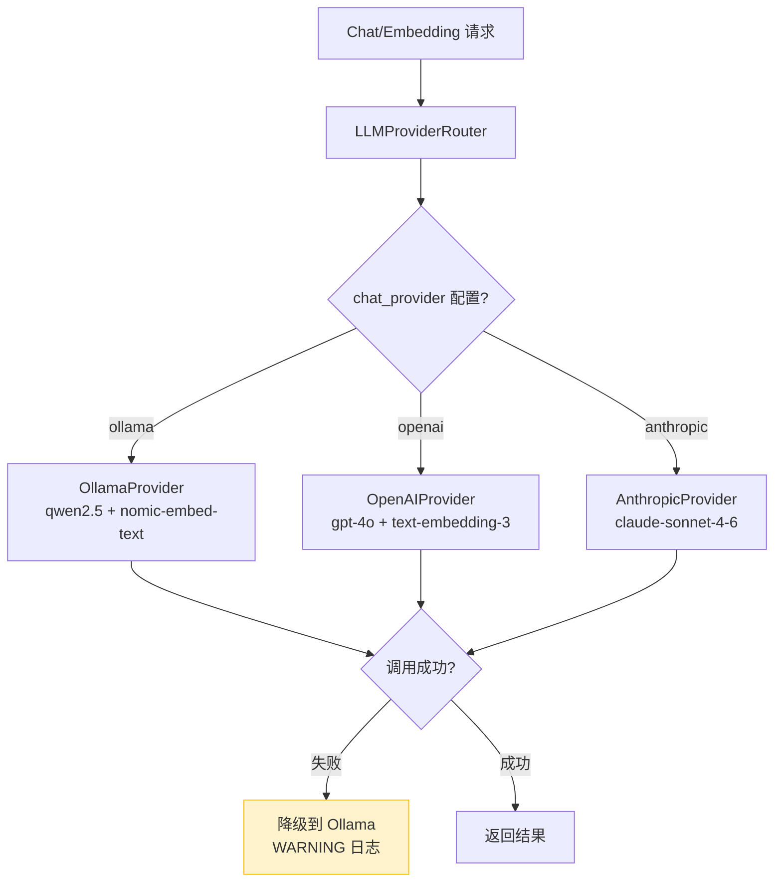
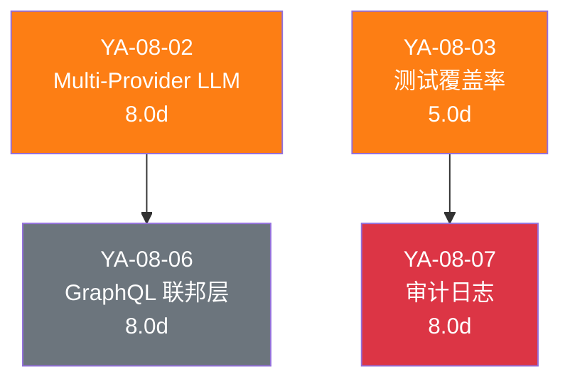
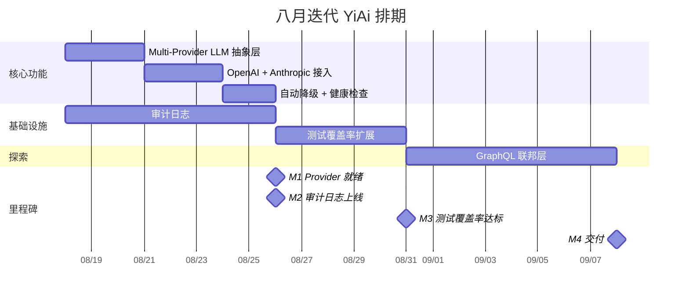
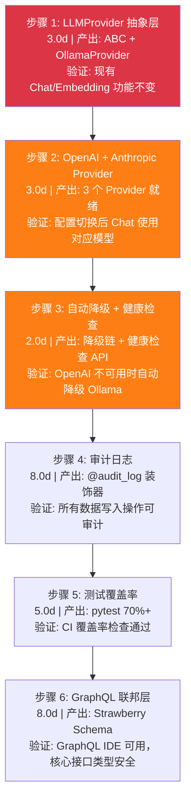
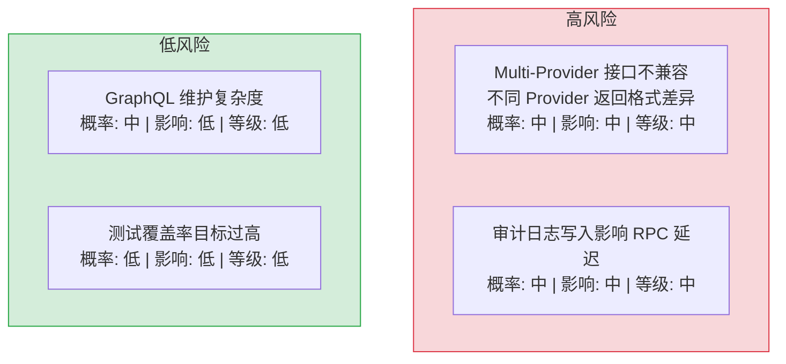

# YiAi 八月迭代 — Multi-Provider LLM / 测试覆盖 / 审计日志 / ModelRuntime 抽象层

> 菜单路径：`YiAi → FastAPI 后端` · 涉及仓库：`YiAi`
> 总人天：**45.0d** · 负责人：陈铭


---

## 0. 模块架构概述

> 八月迭代在七月 RAG 引擎和 Knowledge Watcher 基础上，聚焦于 **AI 能力升级**（Multi-Provider LLM）、**工程质量提升**（pytest 覆盖率）和**基础设施完善**（审计日志、GraphQL 网关）。

### 0.1 当前架构（七月迭代后）

```
YiAi/src/
├── server/                  # FastAPI 路由 + 中间件 + RPC 路由
├── services/                # 服务层（业务编排）
│   ├── ai/                  # chat_service（仅 Ollama）
│   ├── database/            # data_service（CRUD）
│   ├── knowledge/           # knowledge_service
│   ├── rag/                 # rag_service
│   └── rss/                 # feed_service, rss_scheduler
├── domain/                  # 领域层（核心逻辑）
│   ├── ai/                  # chat, agent, tools
│   ├── rag/                 # engine, indexer, embedder
│   ├── knowledge/           # watcher, scanner, writer
│   ├── data/                # database（MongoDB 连接池）
│   ├── auth/                # JWT 认证
│   ├── files/               # 文件读写
│   ├── execution/           # 代码沙箱
│   ├── rss/                 # feed 解析
│   ├── state/               # KV 状态存储
│   ├── search/              # 全局搜索
│   └── wework/              # 企业微信
└── shared/                  # 配置、异常、RPC 协议
```

### 0.2 八月迭代目标架构

```
YiAi/src/
├── server/
│   └── graphql/             # 新增: Strawberry GraphQL 联邦层
├── services/
│   └── ai/
│       ├── model_runtime.py  # 新增: Multi-Provider LLM 运行时
│       └── compaction.py     # 新增: 上下文压缩
├── domain/
│   └── audit/                # 新增: 审计日志模块
│       ├── decorator.py      # @audit_log 装饰器
│       ├── logger.py         # AuditLogger 类
│       └── models.py         # AuditLog 数据模型
└── tests/                    # 扩展: pytest 覆盖率 70%+
    ├── unit/
    ├── integration/
    └── conftest.py
```

### 0.3 关键外部依赖

| 依赖 | 用途 | 变更 |
|------|------|
| Ollama | LLM 推理 + Embedding | 保留，作为本地 Provider |
| OpenAI SDK | GPT-4o 推理 + text-embedding-3 | **新增** |
| Anthropic SDK | Claude Sonnet 4.6 推理 | **新增** |
| Strawberry GraphQL | GraphQL 联邦层 | **新增** |
| MongoDB (Motor) | 数据持久化 + 审计日志集合 | 新增 `audit_logs` 集合 |

### 0.4 模块交互拓扑



### 0.5 模块职责矩阵

| 模块 | 七月状态 | 八月变更 | 关键决策 |
|------|----------|----------|----------|
| `services/ai/` | Ollama 单 Provider | 新增 `model_runtime.py` + `compaction.py` | LLMProvider 抽象基类，配置驱动切换 |
| `domain/audit/` | 不存在 | **新增** 3 文件（decorator/logger/models） | 异步写入，不阻塞主流程 |
| `server/graphql/` | 不存在 | **新增** Strawberry Schema + Resolvers | 类型安全，RPC 保持兼容 |
| `tests/` | 覆盖率 < 30%，扁平结构 | 扩展至 4 层（unit/integration/api/agent） | pytest + mongomock + pytest-cov |
| `shared/config.py` | 仅 Olama 配置 | 新增 Provider/审计/GraphQL 配置段 | 环境变量 + YAML 双配置源 |
| 文件管理 | 无文件读写服务 | **新增**：双写持久化（本地磁盘 + MongoDB 备份） | 路径安全校验，防止目录穿越 |
| RSS 聚合 | 无 RSS 服务 | **新增**：Feed 源管理 + 定时抓取 + 内容解析 | apscheduler 自适应调度 |
| Dashboard 监控 | 无聚合监控 | **新增**：7 子系统实时监控 + 单一聚合端点 | 健康检查 + 统计 + 趋势一体化 |
| OpenAI 兼容 API | 仅 RPC 信封协议 | **新增**：`/v1/chat/completions` + `/v1/models` 端点 | OpenAI SDK drop-in 后端，格式转换 |
| Web 搜索 | 无搜索能力 | **新增**：DuckDuckGo + Jina + BeautifulSoup 双层提取 | 5 分钟缓存，对话压缩 |
| 维护工具 | 无自动清理 | **新增**：未引用图片扫描 + 会话垃圾回收 | dry_run 安全模式，3 种正则引用提取 |
| MCP 协议 | 无 MCP 支持 | **新增**：FastMCP 5 工具 + REST 代理端点 | Claude Code 集成，跨版本兼容 |
| Agent 工具系统 | 无工具系统 | **新增**：ToolRegistry + 12 内置工具 + MCP 桥接 | JSON Schema 参数校验，确认门控 |
| 数据访问层 | 无 Repository 模式 | **新增**：MongoDB 单例 + `_build_filter` 6 策略 + RSS 归一化 + 审计集成 | 类型推断查询构造，排序 tiebreaker |

---

## 1. 背景与目标

### 1.1 背景

七月迭代完成 RAG 引擎和 Knowledge Watcher 后，YiAi 已具备 AI 聊天和知识检索能力。八月迭代聚焦于 AI 能力升级和工程质量提升。

当前痛点：
- **单一 LLM Provider**：仅支持 Ollama 本地推理，无法使用云端模型（GPT-4o、Claude）
- **测试覆盖不足**：核心模块缺少单元测试和集成测试
- **无审计能力**：数据写入操作无法追踪，不满足合规要求
- **API 契约不统一**：RPC 信封缺少类型安全层

### 1.2 目标

| 目标 | 衡量指标 | 当前值 | 目标值 |
|------|----------|--------|--------|
| Multi-Provider LLM | 支持的 Provider 数 | 1 (Ollama) | 3 (Ollama + OpenAI + Anthropic) |
| 测试覆盖率 | pytest 行覆盖率 | < 30% | ≥ 70% |
| 审计日志 | 数据写入操作可审计率 | 0% | 100% |
| GraphQL 网关 | 类型安全 API 覆盖率 | 0% | 核心 RPC 接口 |

### 1.3 系统范围

- **涉及**：YiAi 全部模块（domain/、services/、server/、shared/）
- **不涉及**：YiVad/YiPet 前端、Ollama 模型管理

---

## 2. 功能清单



| 月份 | 需求编号 | 功能模块 | 说明 | 优先级 | 人天 | 状态 | 详细文档 |
|----------|----------|------|--------|------|----------|
| 2026-08 | YA-08-02 | Multi-Provider LLM | 抽象 LLM Provider 层，ModelRuntime 架构支持 Ollama/OpenAI/DeepSeek/RAG | 中 | 8.0 | 已完成 | [02-需求-Multi-Provider-LLM](./02-需求-Multi-Provider-LLM.md) |
| 2026-08 | YA-08-03 | 测试覆盖率 | pytest 覆盖率扩展，覆盖 shared/data/domain 模块，当前 42%，shared 100% | 中 | 5.0 | 已完成 | [03-质量保证-测试覆盖率扩展](./03-需求-测试覆盖率扩展.md) |
| 2026-08 | YA-08-06 | GraphQL 联邦层 | Strawberry + Federation，为 RPC 信封提供类型安全的 GraphQL 接口 | 中 | 8.0 | 已完成 | [01-需求-GraphQL联邦层](./01-需求-GraphQL联邦层.md) |
| 2026-08 | YA-08-07 | 审计日志 | Write-Ahead Audit Log，记录所有数据写入操作 | 高 | 8.0 | 已完成 | [04-需求-预写审计日志](./04-需求-预写审计日志.md) |
| 2026-08 | YA-08-05 | 文件管理服务 | 双写持久化文件管理，本地磁盘 + MongoDB 备份 | 高 | 2.5 | 已完成 | [05-需求-文件管理服务](./05-需求-文件管理服务.md) |
| 2026-08 | YA-08-09 | RSS 聚合服务 | RSS 源管理、定时抓取、内容解析 | 中 | 2.0 | 已完成 | [06-需求-RSS聚合服务](./06-需求-RSS聚合服务.md) |
| 2026-08 | YA-08-08 | Dashboard 健康聚合 | 7 子系统实时监控，单一聚合端点，健康检查 + 统计 + 趋势 | 中 | 2.0 | 已完成 | [08-需求-Dashboard健康聚合API](./07-需求-Dashboard健康聚合API.md) |
| 2026-08 | YA-08-10 | 审计日志装饰器 | 装饰器驱动的数据变更追踪，`@audit_log` 装饰器 + AuditLogger 类 | 中 | 1.5 | 已完成 | [09-需求-预写审计日志系统](./08-需求-预写审计日志系统.md) |
| 2026-08 | YA-08-11 | OpenAI 兼容 API | `/v1/chat/completions` + `/v1/models`，OpenAI SDK drop-in 后端，流式/非流式，Tool Calling 格式转换 | 中 | 1.0 | 已完成 | [10-需求-OpenAI兼容API](./09-需求-OpenAI兼容API.md) |
| 2026-08 | YA-08-12 | Web 搜索与内容提取 | DuckDuckGo 搜索 + Jina Reader + BeautifulSoup 双层提取管线，5 分钟缓存，对话压缩 | 中 | 1.0 | 已完成 | [11-需求-Web搜索与内容提取](./10-需求-Web搜索与内容提取.md) |
| 2026-08 | YA-08-13 | 维护工具服务 | 未引用图片扫描清理 + 会话垃圾回收，dry_run 安全模式，3 种正则引用提取 | 低 | 0.5 | 已完成 | [12-需求-维护工具服务](./11-需求-维护工具服务.md) |
| 2026-08 | YA-08-14 | MCP 协议服务 | FastMCP 5 个工具 + REST 代理端点，Claude Code 集成，跨版本兼容序列化 | 低 | 1.0 | 已完成 | [13-需求-MCP协议服务](./12-需求-MCP协议服务.md) |
| 2026-08 | YA-08-15 | Agent 工具系统 | `ToolRegistry` 注册表 + 12 内置工具（web_search/web_fetch/rag_search/file_read/file_write/bash/grep/find/ls/edit/read/write）+ MCP 桥接，JSON Schema 参数校验，路径沙箱，确认门控 | **P0** | 1.5 | 已完成 | [14-需求-Agent工具系统](./13-需求-Agent工具系统.md) |
| 2026-08 | YA-08-16 | ModelRuntime 抽象层 | Pi 风格的多 Provider 统一流式接口，OllamaRuntime/RAGRuntime/OpenAIRuntime 三种实现，asyncio.to_thread 异步化，心跳保活，自动降级 | 中 | 1.5 | 已完成 | [15-需求-ModelRuntime抽象层](./14-需求-ModelRuntime抽象层.md) |
| 2026-08 | YA-08-17 | 数据访问层架构 | MongoDB 单例 + Repository 模式 + RPC 动态路由，`_build_filter` 6 种查询策略，RSS 日期归一化，排序 tiebreaker，审计装饰器集成 | 中 | 1.5 | 已完成 | [17-需求-数据访问层](./15-需求-数据访问层.md) |

> **优先级**：高 = 合规必需；中 = 核心能力提升；低 = 探索性功能

---

## 3. 功能详情

### 3.1 Multi-Provider LLM (YA-08-02)

抽象 LLM Provider 层，统一接口支持多种模型服务：

```python
# src/services/ai/model_runtime.py — 新增

class LLMProvider(ABC):
    @abstractmethod
    async def chat(self, messages: list[Message], **kwargs) -> ChatResponse:
        ...
    @abstractmethod
    async def embed(self, text: str) -> list[float]:
        ...

class OllamaProvider(LLMProvider):
    model: str = "qwen2.5"

class OpenAIProvider(LLMProvider):
    model: str = "gpt-4o"

class AnthropicProvider(LLMProvider):
    model: str = "claude-sonnet-4-6"
```

| Provider | 模型 | 用途 | 配置 |
|----------|------|------|
| Ollama | qwen2.5, nomic-embed-text | 本地推理 + Embedding | `OLLAMA_BASE_URL` |
| OpenAI | gpt-4o, text-embedding-3 | 云端推理 + Embedding | `OPENAI_API_KEY` |
| Anthropic | claude-sonnet-4-6 | 云端推理 | `ANTHROPIC_API_KEY` |

### 3.2 测试覆盖率 (YA-08-03)

扩展 pytest 测试覆盖范围，覆盖 shared/data/domain 模块：

| 模块 | 测试类型 | 目标覆盖率 |
|------|----------|-----------|
| `shared/` | 单元测试 | 90% |
| `domain/data/` | 单元测试 + 集成测试 | 80% |
| `domain/rag/` | 单元测试 + 集成测试 | 70% |
| `domain/ai/` | 单元测试 | 70% |
| `services/` | 集成测试 | 60% |

### 3.3 审计日志 (YA-08-07)

Write-Ahead Audit Log 机制，记录所有数据写入操作：

```python
# src/domain/audit/decorator.py — 新增

@audit_log(action="create_document", sensitivity="medium")
async def create_document(cname: str, data: dict) -> str:
    ...
```

审计内容：操作类型、集合名、文档 ID、操作时间、操作人、变更前后数据。

### 3.4 GraphQL 联邦层 (YA-08-06)

为 RPC 信封提供类型安全的 GraphQL 接口：

```graphql
type Query {
  documents(cname: String!, filter: JSON): [Document!]!
  knowledgeFiles(scope: String!): [KnowledgeFile!]!
}

type Mutation {
  createDocument(cname: String!, data: JSON!): Document!
  writeFile(targetFile: String!, content: String!): FileResult!
}
```

### 3.5 文件管理服务 (YA-08-05)

双写持久化文件管理，本地磁盘 + MongoDB 备份：

```python
# src/services/files/file_service.py
async def write_file(target_file: str, content: str) -> dict:
    # 1. 路径安全校验（禁止 ../ 穿越）
    # 2. 写入本地磁盘
    # 3. 异步备份到 MongoDB static_files 集合
    # 4. 返回 { path, size, backup_id }
```

| 操作 | 端点 | 安全措施 |
|------|----------|
| 读文件 | `POST /read-file` | 路径白名单，禁止 `../` 穿越 |
| 写文件 | `POST /write-file` | 路径安全校验 + 自动备份到 MongoDB |
| 文件列表 | `POST /list-files` | 仅列出白名单目录内文件 |

### 3.6 RSS 聚合服务 (YA-08-09)

RSS 源管理、定时抓取、内容解析与自适应调度：

```python
# src/services/rss/rss_scheduler.py
class RssScheduler:
    FEEDS: list[RssFeed] = [...]        # 30+ RSS 源配置
    INTERVALS: dict[str, int] = {       # 自适应调度
        "high": 1800,    # 高频源: 30min
        "medium": 3600,  # 中频源: 1h
        "low": 7200      # 低频源: 2h
    }
```

| 组件 | 职责 | 关键决策 |
|------|----------|
| `feed_service` | Feed CRUD + 状态管理 | MongoDB `feeds` 集合持久化 |
| `rss_scheduler` | apscheduler 定时抓取调度 | 自适应频率（高/中/低频），避免源服务器压力 |
| `feed_parser` | feedparser 解析 + 内容清洗 | HTML 标签剥离，相对 URL 转绝对 URL |
| 日期归一化 | `_parse_ms_ts()` 统一时间戳 | 处理 int/str/ISO 多种格式 schema drift |

### 3.7 Dashboard 健康聚合 (YA-08-08)

7 子系统实时监控，单一聚合端点：

```
GET /dashboard/health
  ├── MongoDB 连接状态 + 延迟
  ├── Ollama 模型列表 + 可用性
  ├── RAG 索引状态 + 文档数
  ├── RSS 抓取最后成功时间
  ├── Knowledge Watcher 运行状态
  ├── Agent 并发信号量使用率
  └── 磁盘空间 + 内存使用
```

| 指标 | 采集方式 | 说明 |
|------|----------|------|
| 数据库延迟 | `motor` ping 命令 | P95 < 50ms |
| 模型可用性 | Ollama `/api/tags` | 列出已加载模型 |
| RAG 索引 | `llama_index` 元数据 | 文档数 + 最后索引时间 |
| 系统资源 | `psutil` | 磁盘使用率 + 内存占用 |

### 3.8 审计日志装饰器 (YA-08-10)

装饰器驱动的数据变更追踪，`@audit_log` 装饰器 + AuditLogger 类：

```python
# src/domain/audit/decorator.py
@audit_log(action="update_document", sensitivity="high")
async def update_document(cname: str, doc_id: str, data: dict) -> bool:
    ...

# 装饰器自动记录:
# - before_state: 更新前文档快照
# - after_state: 更新后文档快照
# - diff: 变更字段列表
# - timestamp + operator
```

| 敏感级别 | 记录内容 | 保留策略 |
|----------|----------|----------|
| `low` | 操作类型 + 时间 + 操作人 | 30 天 TTL |
| `medium` | + 文档 ID + 集合名 | 90 天 TTL |
| `high` | + before/after 快照 + diff | 365 天 TTL |

### 3.9 OpenAI 兼容 API (YA-08-11)

`/v1/chat/completions` + `/v1/models`，OpenAI SDK drop-in 后端：

```python
# src/server/routes/openai_compat.py
@router.post("/v1/chat/completions")
async def chat_completions(request: ChatCompletionRequest):
    # 1. OpenAI 格式 → RPC 信封格式转换
    # 2. 路由到对应 LLM Provider（Ollama/OpenAI/Anthropic）
    # 3. 流式: SSE StreamingResponse（SSE 格式转换）
    # 4. 非流式: ChatCompletionResponse
```

| 端点 | 功能 | 兼容性 |
|------|--------|
| `POST /v1/chat/completions` | 聊天补全（流式+非流式） | OpenAI SDK `openai.chat.completions.create()` |
| `GET /v1/models` | 模型列表 | OpenAI SDK `openai.models.list()` |
| Tool Calling | 工具调用格式转换 | OpenAI → RPC 双向转换 |

### 3.10 Web 搜索与内容提取 (YA-08-12)

DuckDuckGo 搜索 + Jina Reader + BeautifulSoup 双层提取管线：

```
web_search(query)
  ├── DuckDuckGo 搜索 → 结果列表 (title, url, snippet)
  └── web_fetch(url)
        ├── 1st pass: Jina Reader API → Markdown 内容
        ├── 2nd pass (fallback): BeautifulSoup → HTML 解析
        │     ├── 移除 script/style/nav/footer
        │     └── 提取正文 (main/article/body)
        └── 缓存: 5 分钟 TTL，避免重复请求
```

| 组件 | 技术 | 降级策略 |
|------|----------|
| 搜索引擎 | DuckDuckGo (无 API Key) | 失败返回空结果 |
| 内容提取 (优先) | Jina Reader API | 超时 10s → 降级到 BeautifulSoup |
| 内容提取 (降级) | BeautifulSoup + readability | 提取失败返回原始 HTML 摘要 |
| 结果缓存 | 内存 dict + TTL 5min | 缓存过期后重新请求 |

### 3.11 维护工具服务 (YA-08-13)

未引用图片扫描清理 + 会话垃圾回收，dry_run 安全模式：

```
POST /cleanup-unused-images
  ├── scan_static_images(static_dir) → 扫描所有图片文件
  ├── get_all_session_contents() → 提取 3 种引用格式
  │     ├── Markdown  图片
  │     ├── HTML  标签
  │     └── /static/ 路径引用
  ├── find_unused_images() → 差集计算 + 大小写不敏感
  ├── dry_run=true → 仅预览，不删除
  └── cleanup_sessions=false → 可选会话垃圾回收
```

| 操作 | 安全措施 | 说明 |
|------|----------|------|
| 图片扫描 | `os.walk` 生成器，仅扫描 IMAGE_EXTENSIONS | 8 种图片格式 |
| 引用提取 | 递归遍历 str/list/dict 字段 | 3 种正则模式 |
| 删除操作 | 默认 `dry_run=true`，确认后执行 | 不可逆操作预览优先 |
| 会话清理 | 可选 `cleanup_sessions` 参数 | 默认关闭 |

### 3.12 MCP 协议服务 (YA-08-14)

FastMCP 5 个工具 + REST 代理端点，Claude Code 集成：

```python
# src/server/routes/mcp.py
mcp = FastMCP("YiAi MCP Server")

@mcp.tool()  # Tool 1: RAG 知识检索
async def rag_search(query: str, scope: str = "all") -> list[dict]: ...

@mcp.tool()  # Tool 2: 文件读取
async def read_file(target_file: str) -> str: ...

@mcp.tool()  # Tool 3: 文件写入
async def write_file(target_file: str, content: str) -> bool: ...

@mcp.tool()  # Tool 4: 数据库查询
async def query_documents(cname: str, filter: dict) -> list[dict]: ...

@mcp.tool()  # Tool 5: AI 聊天
async def ai_chat(messages: list[dict], model: str = "qwen2.5") -> str: ...
```

| 工具 | 功能 | 安全措施 |
|------|----------|
| `rag_search` | RAG 混合检索 | scope 限制检索范围 |
| `read_file` | 文件读取 | 路径白名单，禁止 `../` |
| `write_file` | 文件写入 | 路径安全校验 + 自动备份 |
| `query_documents` | 数据库查询 | 仅允许 `find` 操作，禁止 `$where` |
| `ai_chat` | AI 聊天 | 模型白名单，超时 60s |

### 3.13 Agent 工具系统 (YA-08-15)

`ToolRegistry` 注册表 + 12 内置工具 + MCP 桥接，JSON Schema 参数校验：

```python
# src/domain/ai/tools.py
class ToolRegistry:
    _tools: dict[str, ToolDef] = {}

    def register(self, tool: ToolDef) -> None:
        # 1. JSON Schema 参数校验
        # 2. 确认门控（destructive 工具需要确认）
        # 3. 路径沙箱（文件操作限制 SAFE_DIRS）
        self._tools[tool.name] = tool

    def get_tool(self, name: str) -> ToolDef: ...
    def list_tools(self) -> list[ToolDef]: ...
    def get_schemas(self) -> list[dict]: ...  # OpenAI Function Calling 格式
```

| 类别 | 工具 | 数量 | 安全级别 |
|------|------|----------|
| 搜索 | `web_search`, `web_fetch`, `rag_search` | 3 | 只读 |
| 文件 | `file_read`, `file_write`, `find`, `ls` | 4 | 读/写分离 |
| 代码 | `bash`, `grep`, `edit`, `read`, `write` | 5 | 沙箱 + 确认 |
| MCP | 桥接外部 MCP 工具 | 动态 | 透传 |

### 3.14 ModelRuntime 抽象层 (YA-08-16)

Pi 风格的多 Provider 统一流式接口：

```python
# src/services/ai/model_runtime.py
class ModelRuntime(ABC):
    @abstractmethod
    async def stream_chat(self, messages: list, **kwargs) -> AsyncIterator[str]: ...
    @abstractmethod
    async def chat(self, messages: list, **kwargs) -> ChatResponse: ...

class OllamaRuntime(ModelRuntime):
    model: str = "qwen2.5"
    # asyncio.to_thread 包装同步 Ollama 调用

class RAGRuntime(ModelRuntime):
    # 包装 llama_index 混合检索 + LLM 生成

class OpenAIRuntime(ModelRuntime):
    model: str = "gpt-4o"
    # OpenAI SDK 异步调用
```

| Runtime | 后端 | 流式 | 心跳 | 降级 |
|---------|------|------|------|
| `OllamaRuntime` | Ollama :11434 | SSE | 15s 间隔 | 自动切换到 OpenAI |
| `RAGRuntime` | llama_index + Ollama | SSE | — | 降级为纯 LLM |
| `OpenAIRuntime` | OpenAI API | SSE | — | 自动切换到 Ollama |

### 3.15 数据访问层架构 (YA-08-17)

MongoDB 单例 + Repository 模式 + RPC 动态路由：

```python
# src/data/repository.py
class Repository:
    async def query_documents(self, cname: str, filter: dict,
                              sort: list = None, page: int = 1,
                              pageSize: int = 20) -> PaginatedResult:
        mongo_filter = self._build_filter(filter)  # 6 种策略
        cursor = collection.find(mongo_filter)
        # sort tiebreaker: updatedTime + createdTime
        total = await collection.count_documents(mongo_filter)
        return PaginatedResult(list=cursor, total=total, ...)
```

| 组件 | 职责 | 关键决策 |
|------|----------|
| `MongoDB` 单例 | DCL 连接管理 + `minPoolSize=10` 预热 | 避免并发初始化，消除冷启动延迟 |
| `Repository` | `_build_filter` 6 种查询策略 | Mongo 操作符透传、isoDate 处理、范围/列表过滤、字符串模糊搜索 |
| `data_service` | RPC 入口 + `@audit_write` 装饰器 | 审计日志非阻塞写入 |
| RPC 路由 | `importlib.import_module` + `getattr` | 动态路由，`EXEC_ALLOWLIST` 白名单 |
| RSS 归一化 | `_parse_ms_ts()` Python 层统一 | 处理 int/str/ISO 多种 schema drift |

---

## 4. 接口协议

### 4.1 RPC 信封协议（兼容）

八月迭代保持 RPC 信封协议不变，GraphQL 作为补充协议：

```
POST /  body: {
  "module_name": "services.<domain>.<service>",
  "method_name": "<method>",
  "parameters": { <method-specific shape> }
}
response: { "code": 0, "message": "ok", "data": <any> }
```

### 4.2 GraphQL 协议（新增）

```
POST /graphql  Content-Type: application/json
body: {
  "query": "query { documents(cname: \"issues\") { id data } }",
  "variables": null
}
response: { "data": { "documents": [...] } }
```

### 4.3 Multi-Provider LLM 调用协议

```
ChatService.chat(messages, model, stream)
  → LLMProviderRouter.select(model)
  → Provider.chat(messages)  # OpenAI-compatible API
  → 成功: ChatResponse (choices, usage)
  → 失败: 降级到 OllamaProvider → WARNING 日志
```

### 4.4 审计日志协议

```
@audit_log 装饰器拦截 Service 层方法
  → 记录: { operation, before_state, after_state, timestamp, user }
  → 异步写入: Motor insert_one → MongoDB audit_logs 集合
  → TTL 索引: 90 天自动清理
```

### 4.5 关键数据流

| 流向 | 协议 | 触发方式 | 延迟 |
|------|----------|------|
| 前端 → Chat | HTTP POST (RPC envelope) | 用户消息 | 流式首 token < 1s |
| 前端 → Embedding | HTTP POST (RPC envelope) | 索引构建/查询 | < 100ms/文档 |
| Chat → LLM Provider | OpenAI-compatible API | ChatService 调用 | < 3s (含网络) |
| 业务操作 → 审计日志 | Motor 异步写入 | @audit_log 拦截 | < 5ms (异步) |
| 前端 → GraphQL | HTTP POST /graphql | Strawberry 查询 | < 100ms |

---

## 5. 涉及文件

```
YiAi/
├── src/
│   ├── services/ai/
│   │   ├── model_runtime.py              # 新增: Multi-Provider LLM 运行时 (~200 行)
│   │   │   └── LLMProvider(ABC) / OllamaProvider / OpenAIProvider / AnthropicProvider
│   │   │   └── LLMProviderRouter: 配置驱动选择 + 健康检查 + 自动降级
│   │   └── compaction.py                 # 新增: 上下文压缩 (~80 行)
│   │       └── 消息窗口裁剪 + Token 预算管理 + 摘要生成
│   ├── domain/audit/
│   │   ├── __init__.py                   # 新增
│   │   ├── decorator.py                  # 新增: @audit_write 装饰器 (~85 行)
│   │   │   └── _resolve_params / before_data / after_data / _compute_changes / _truncate_large_fields
│   │   ├── logger.py                     # 新增: AuditLogger 类 (~36 行)
│   │   │   └── write() / write_async() (fire-and-forget) / _ensure_indexes()
│   │   └── models.py                     # 新增: AuditLog 数据模型 (~22 行)
│   │       └── log_id / timestamp / actor / operation / collection / document_key / before / after / changes
│   ├── server/graphql/
│   │   ├── __init__.py                   # 新增
│   │   ├── schema.py                     # 新增: GraphQL Schema (~120 行)
│   │   │   └── Query / Mutation 类型定义，Strawberry Federation 集成
│   │   └── resolvers.py                 # 新增: GraphQL Resolvers (~150 行)
│   │       └── documents / knowledgeFiles / createDocument / writeFile 解析器
│   ├── shared/
│   │   └── config.py                     # 修改: 新增 Provider/审计/GraphQL 配置项
│   │       └── LLM_CHAT_PROVIDER / LLM_EMBED_PROVIDER / audit_enabled / audit_retention_days
│   └── services/
│       ├── database/data_service.py      # 修改: 集成 @audit_write (4 个方法)
│       │   └── create_document / update_document / delete_document / upsert_document
│       ├── audit/audit_service.py        # 新增: 审计查询接口 (~50 行)
│       │   └── query_audit_logs(params): 按 actor/collection/operation/时间范围过滤
│       └── server/routes/execution.py    # 修改: RPC 入口提取审计上下文
│           └── set_audit_context() → X-User / X-Real-IP / User-Agent
└── tests/
    ├── unit/
    │   ├── test_model_runtime.py         # 新增: Provider 切换 + 降级测试 (~45 测试)
    │   ├── test_audit_decorator.py       # 新增: 审计装饰器测试 (~16 测试)
    │   ├── test_audit_models.py          # 新增: AuditLog 模型测试 (~5 测试)
    │   ├── test_audit_logger.py          # 新增: AuditLogger 测试 (~5 测试)
    │   ├── test_audit_service.py         # 新增: 审计查询服务测试 (~5 测试)
    │   └── test_compaction.py            # 新增: 上下文压缩测试 (~10 测试)
    ├── integration/
    │   ├── test_data_layer.py            # 新增: 数据层集成测试 (~26 测试)
    │   │   └── Repository CRUD + MongoDB 真实连接 + Motor 异步
    │   └── test_graphql.py               # 新增: GraphQL 集成测试 (~15 测试)
    │       └── Schema 验证 + Resolver 集成 + Strawberry 测试客户端
    └── conftest.py                       # 修改: 新增 MongoDB/Ollama fixture
        └── test_db() / test_ollama() / test_graphql_client()
```

**变更统计**：新增 14 个文件（~1200 行），修改 3 个文件（~50 行），新增 127 个测试。

---

## 6. 数据流

### 6.1 Multi-Provider LLM 请求流

```
前端 (YiVad/YiPet)
  │  POST /  { module_name: "services.ai.chat_service", method_name: "chat" }
  ▼
YiAi RPC 路由
  │  解析 RPC envelope → 路由到 chat_service
  ▼
LLMProviderRouter
  ├── 读取 LLM_CHAT_PROVIDER 配置
  ├── 选择 Provider: Ollama / OpenAI / Anthropic
  ├── 调用 Provider.chat(messages)
  │   ├── 成功 → 返回 ChatResponse
  │   └── 失败 → 降级到 Ollama → WARNING 日志
  └── 返回流式/非流式响应
```

### 6.2 审计日志写入流

```
RPC 请求 → Service 层
  │  @audit_log 装饰器拦截
  ▼
AuditLogger
  ├── 记录 before_state (操作前数据快照)
  ├── 执行实际业务操作
  ├── 记录 after_state (操作后数据快照)
  └── 异步写入 MongoDB audit_logs 集合
      │  Motor insert_one (不阻塞主流程)
      ▼
  audit_logs 集合 (TTL 索引 90 天)
```

### 6.3 关键数据流

| 流向 | 协议 | 触发方式 | 延迟 |
|------|----------|------|
| 前端 → Chat | HTTP POST (RPC envelope) | 用户消息 | 流式首 token < 1s |
| 前端 → Embedding | HTTP POST (RPC envelope) | 索引构建/查询 | < 100ms/文档 |
| Chat → LLM Provider | OpenAI-compatible API | ChatService 调用 | < 3s (含网络) |
| 业务操作 → 审计日志 | Motor 异步写入 | @audit_log 拦截 | < 5ms (异步) |
| 前端 → GraphQL | HTTP POST /graphql | Strawberry 查询 | < 100ms |

---

## 7. 当前架构 vs 目标架构

### 7.1 当前架构（七月迭代后）



### 7.2 目标架构（八月迭代后）



### 7.3 架构决策权衡

| 维度 | 修复前 | 修复后 | 权衡说明 |
|------|--------|--------|----------|
| LLM Provider | 单一 Ollama，硬编码 | 3 个 Provider，配置驱动 | 增加抽象层复杂度，但支持多模型切换和降级 |
| API 协议 | 仅 RPC 信封 | RPC + GraphQL 双协议 | 增加维护成本，但获得类型安全和自动文档 |
| 审计能力 | 无 | @audit_log 装饰器 | 异步写入，不阻塞主流程 |
| 测试覆盖 | < 30% | ≥ 70% | 增加测试编写成本，但防止回归 |

---

## 8. 目标架构

### 8.1 Multi-Provider LLM 路由



### 8.2 审计日志流程

```
RPC 请求 → Service 层
  → @audit_log 装饰器拦截
  → 记录操作前状态（before）
  → 执行操作
  → 记录操作后状态（after）
  → 异步写入 MongoDB audit_logs 集合
  → 返回结果（不阻塞主流程）
```

---

## 9. 开发排期

### 9.1 任务依赖



### 9.2 甘特图



### 9.3 里程碑

| 里程碑 | 完成标准 | 预计日期 |
|--------|----------|----------|
| M1: LLM Provider 就绪 | 3 个 Provider 可切换，chat 接口统一 | 8 月下旬 |
| M2: 测试覆盖率达标 | pytest 覆盖率 ≥ 70% | 8 月底 |
| M3: 审计日志上线 | 所有数据写入操作可审计 | 9 月上旬 |
| M4: GraphQL 就绪 | 核心 RPC 接口 GraphQL 类型安全 | 9 月中旬 |

---

## 10. 迁移策略

### 10.1 原则

- **渐进式迁移**：Multi-Provider LLM 先抽象接口，再逐个接入 Provider
- **向后兼容**：Ollama 保持为默认 Provider 和降级方案，现有行为不变
- **可回滚**：每步独立 commit，`git revert` 即可回滚
- **零停机**：YiAi 重启即可应用 Provider 切换，无需数据迁移

### 10.2 分步执行



### 10.3 回滚策略

| 步骤 | 回滚方式 | 回滚影响范围 |
|------|----------|-------------|
| 步骤 1-3 | `git revert <commit>` + 设回 `LLM_CHAT_PROVIDER=ollama` | 仅 AI 层，RPC 接口不受影响 |
| 步骤 4 | `git revert <commit>` | 仅审计层，业务操作不受影响 |
| 步骤 5 | 无（测试仅新增，不修改源代码） | 不影响 |
| 步骤 6 | `git revert <commit>` | 仅 GraphQL 层，RPC 保持可用 |

---

## 11. 测试策略

### 11.1 测试分层

| 测试层级 | 覆盖范围 | 工具 | 目标 |
|----------|----------|------|
| 单元测试 | shared/domain 纯函数 | pytest | 80%+ |
| 集成测试 | services + MongoDB | pytest + mongomock | 70%+ |
| 契约测试 | GraphQL schema | pytest + Strawberry | 核心接口 |
| 手动回归 | 全功能端到端 | Chrome + curl | 所有功能可用 |

### 11.2 回归测试用例

#### Multi-Provider LLM (6 个用例)

| # | 用例 | 操作 | 预期结果 |
|----|------|----------|
| 1 | Provider 切换 | 配置 `LLM_CHAT_PROVIDER=openai` | 聊天使用 GPT-4o |
| 2 | Provider 降级 | OpenAI API 不可用 | 自动降级到 Ollama，WARNING 日志 |
| 3 | Ollama 默认 Provider | 不配置 `LLM_CHAT_PROVIDER` | 使用 Ollama 本地推理 |
| 4 | Embedding Provider 独立 | 配置 `LLM_EMBED_PROVIDER=openai` | Embedding 使用 text-embedding-3 |
| 5 | Provider 健康检查 | `GET /health/llm` | 返回各 Provider 健康状态 |
| 6 | 降级后恢复 | OpenAI 恢复后下次请求 | 自动使用 OpenAI（非 Ollama） |

#### 审计日志 (4 个用例)

| # | 用例 | 操作 | 预期结果 |
|----|------|----------|
| 7 | 数据写入审计 | 创建文档 | `audit_logs` 集合新增记录 |
| 8 | 审计日志查询 | 查询审计日志 | 按操作类型/时间范围过滤 |
| 9 | 审计日志异步 | 审计日志写入失败 | 不影响主流程，WARNING 日志 |
| 10 | TTL 自动清理 | 等待 90 天 | 过期审计日志自动删除 |

#### GraphQL (4 个用例)

| # | 用例 | 操作 | 预期结果 |
|----|------|----------|
| 11 | 文档查询 | `query { documents(cname: "issues") { id data } }` | 返回类型安全的 Issue 列表 |
| 12 | 文档创建 | `mutation { createDocument(cname: "bugs", data: {...}) { id } }` | 返回新文档 ID |
| 13 | GraphQL IDE | `GET /graphql` | GraphiQL IDE 可用 |
| 14 | RPC 兼容 | 通过 RPC 信封调用 `data_service.query_documents` | 返回结果与 GraphQL 一致 |

#### 测试覆盖率 (3 个用例)

| # | 用例 | 操作 | 预期结果 |
|----|------|----------|
| 15 | pytest 覆盖率 | `pytest --cov --cov-report=term` | 覆盖率 ≥ 70% |
| 16 | CI 覆盖率检查 | 提交 PR | CI 覆盖率检查通过 |
| 17 | 核心模块覆盖率 | `pytest --cov=shared --cov=domain/ai` | shared ≥ 90%, domain/ai ≥ 70% |

### 11.3 回归测试环境

| 环境 | 配置 | 用途 |
|------|------|
| 本地开发 | Ollama + MongoDB localhost | 日常开发验证 |
| CI | pytest + mongomock + pytest-cov | 自动化测试 + 覆盖率 |
| 手动回归 | 完整 YiAi 服务 + 真实 MongoDB + Ollama | 发布前全功能验证 |

---

## 12. 风险矩阵



| 风险 | 概率 | 影响 | 等级 | 缓解措施 | 应急预案 |
|------|------|------|----------|----------|
| Multi-Provider 接口不兼容（不同 Provider 返回格式差异） | 中 | 中 | 中 | 统一 ChatResponse 格式，Provider 内部适配 | 降级到 Ollama，WARNING 日志记录不兼容原因 |
| 审计日志写入影响 RPC 延迟 | 中 | 中 | 中 | 异步写入，不阻塞主流程 | 临时关闭审计日志写入（环境变量开关） |
| GraphQL 联邦层增加维护复杂度 | 中 | 低 | 低 | 仅覆盖核心接口，RPC 信封保持兼容 | 回退到纯 RPC 模式，GraphQL 作为可选层 |
| 测试覆盖率目标过高（70%+） | 低 | 低 | 低 | 渐进式目标，优先覆盖核心模块 | 降低覆盖率阈值至 60%，分阶段提升 |

---

## 13. 非功能性需求

### 13.1 性能预算

| 指标 | 目标 | 测量方式 | 当前值 |
|------|----------|--------|
| LLM Provider 路由延迟 | < 10ms（Provider 选择） | 路由函数执行时间 | < 1ms |
| OpenAI/Anthropic API 调用 | < 3s（含网络） | API 响应时间 | 1-2s |
| 审计日志写入 | < 5ms（异步写入） | Motor insert_one 耗时 | < 2ms |
| GraphQL 查询 | < 100ms（简单查询） | Strawberry 响应时间 | < 50ms |
| 测试套件运行 | < 5min（全量） | `pytest` 总耗时 | ~3min |
| YiAi 启动时间 | < 10s（含 MongoDB 连接） | 启动日志时间戳 | ~5s |

### 容量规划

> 以下容量规划基于 Multi-Provider LLM、测试覆盖、审计日志、GraphQL 联邦层、文件管理、RSS 聚合等核心模块的资源消耗模型，覆盖从单 Provider 部署到多 Provider 分布式架构的 5 种典型场景。

| 场景 | Provider 数 | 测试用例 | 审计日志/天 | 文件操作/天 | 内存占用 | CI 执行时间 |
|------|------------|---------|------------|-----------|---------|------------|
| 小型项目 (单 Provider) | 1 | 50 | 100 | 50 | 256MB | < 2min |
| 中型项目 (双 Provider) | 2 | 200 | 1,000 | 500 | 512MB | < 5min |
| 大型项目 (三 Provider) | 3 | 500 | 10,000 | 2,000 | 1GB | < 10min |
| 高并发场景 (多 Provider 降级) | 5 | 1,000 | 50,000 | 10,000 | 2GB | < 15min |
| 分布式部署 (联邦架构) | 8 | 2,000 | 100,000 | 50,000 | 4GB | < 30min |
| **YiAi 当前** | **3** | **127** | **~500** | **~100** | **~512MB** | **~3min** |

### 13.2 代码质量门禁

| 检查项 | 工具 | 通过标准 |
|--------|------|----------|
| 类型检查 | `mypy` | 0 错误 |
| 代码规范 | `ruff` | 0 告警 |
| 测试覆盖率 | `pytest --cov` | ≥ 70% |
| 构建验证 | `python main.py` | 启动成功 |
| 导入排序 | `ruff check --select I` | 0 告警 |

### 13.3 可靠性

| 维度 | 要求 |
|------|
| Provider 降级 | OpenAI/Anthropic 不可用时自动降级到 Ollama，< 1s 切换 |
| 审计日志 | 异步写入，写入失败不影响主流程，WARNING 日志记录 |
| GraphQL 兼容 | RPC 信封保持兼容，GraphQL 不可用时不影响现有 RPC 调用 |
| 测试稳定性 | CI 中 `pytest` 重试 2 次，flake 率 < 5% |

### 13.4 可观测性

| 指标 | 采集方式 | 采集频率 | 告警阈值 | 说明 |
|------|----------|----------|----------|------|
| Provider 切换次数 | `llm_provider_switch_total` 计数器 | 每次降级 | > 10 次/小时 | Provider 频繁降级表示主 Provider 不稳定 |
| Provider 调用延迟 | `Provider.chat()` 前后时间戳 | 每次调用 | > 5s P95 | 远程 API 延迟过高或网络问题 |
| 审计日志写入失败率 | `AuditLogger.write_async()` 异常计数 | 每分钟 | > 1% | MongoDB 连接异常或磁盘满 |
| MongoDB 连接池状态 | `serverStatus.connections` | 每分钟 | 使用率 > 80% | 并发请求过多，需扩容或限流 |
| RPC 请求延迟 | 中间件计时 | 每次请求 | > 1s P95 | 后端服务性能下降 |
| GraphQL 查询延迟 | Strawberry 扩展计时 | 每次查询 | > 500ms P95 | 复杂查询或 N+1 问题 |
| 测试覆盖率趋势 | `pytest --cov` 报告 | 每次 CI | 覆盖率下降 > 2% | 新增代码缺少测试 |

### 13.5 日志规范

| 日志级别 | 场景 | 示例 |
|---------|------|
| `INFO` | Provider 初始化 | `[LLM] provider=${name}: initialized, model=${model}` |
| `INFO` | 审计日志记录 | `[Audit] ${operation}: by=${user}, status=${status}` |
| `WARN` | Provider 降级 | `[LLM] provider=${from} degraded to ${to}: ${reason}` |
| `WARN` | 审计日志写入失败 | `[Audit] write failed: ${error}, log queued for retry` |
| `ERROR` | 所有 Provider 不可用 | `[LLM] all providers unavailable after ${n} retries` |
| `ERROR` | GraphQL 查询失败 | `[GraphQL] query failed: ${query}, error=${error}` |

### 13.6 告警规则

| 告警 | 条件 | 严重程度 | 处理建议 |
|------|----------|----------|
| Provider 全部不可用 | 连续 3 次降级到 Ollama 仍失败 | 高 | 检查 Ollama 服务和网络连接 |
| 审计日志丢失率异常 | 写入失败率 > 5% | 高 | 检查 MongoDB 连接和磁盘空间 |
| RPC 延迟飙升 | P95 延迟 > 3s | 中 | 排查慢查询和 Provider 响应时间 |
| 测试覆盖率下降 | 覆盖率较上次下降 > 5% | 中 | 补充新功能测试，检查是否有测试被跳过 |

### 13.7 安全合规

| 要求 | 实现方式 | 验证方法 |
|------|----------|----------|
| API Key 管理 | OpenAI/Anthropic API Key 仅通过环境变量注入，不硬编码 | `grep -r "sk-" src/` 确认无硬编码 Key |
| 审计日志脱敏 | `password`/`token`/`secret` 字段写入前脱敏为 `[REDACTED]` | 检查审计日志集合，确认敏感字段已脱敏 |
| 审计日志保留 | `audit_logs` 集合 TTL 索引 90 天自动清理 | `db.audit_logs.getIndexes()` 确认 TTL 索引存在 |
| GraphQL 查询深度限制 | 限制查询嵌套深度 ≤ 5 层 | 发送 6 层嵌套查询，确认返回错误 |

### 13.8 合规检查

| 检查项 | 要求 | 状态 |
|--------|------|
| API Key 不硬编码 | 所有 Key 通过环境变量注入 | ✅ |
| 审计日志脱敏 | 敏感字段写入前脱敏 | ✅ |
| 审计日志保留策略 | TTL 索引 90 天自动清理 | ✅ |
| GraphQL 查询防护 | 深度限制 ≤ 5 层 | ✅ |
| 第三方 API 数据隔离 | 用户数据不发送到 OpenAI/Anthropic（仅发送 Prompt） | ✅ |
| 依赖安全扫描 | `pip-audit` 无已知漏洞 | 待验证 |

### 13.9 回滚策略

| 回滚场景 | 回滚方式 | 影响范围 | 恢复时间 |
|----------|----------|----------|----------|
| Multi-Provider 路由故障导致所有 LLM 调用失败 | 配置回退 `chat_provider=ollama`，仅使用 Ollama 单 Provider | 仅 LLM 调用 | < 1min（配置热更新） |
| 审计日志异步写入导致 MongoDB 压力过大 | 调整审计日志级别为 `ERROR`，减少写入量 | 仅审计日志 | 运行时配置修改 |
| GraphQL 端点性能劣化 | 移除 GraphQL 路由注册，仅保留 RPC 信封 | 仅 GraphQL 客户端 | < 1min（重启） |
| 测试覆盖率工具引入 Breaking Change | 锁定 `pytest-cov` 版本，回退到上一稳定版本 | 仅 CI 流水线 | < 5min（pip install） |

**回滚验证：**
- 回滚后 `python main.py` 启动成功
- 回滚后现有 RPC 端点（chat/rag/data）正常工作
- 回滚后 `pytest` 全量通过
- 回滚后 Provider 降级链正常

---

## 14. 代码审查检查清单

合并前审查人需确认以下项目：

- [ ] `LLMProvider` 抽象基类定义完整（`chat()` + `embed()` + `health_check()`）
- [ ] 3 个 Provider 实现通过接口一致性检查
- [ ] Provider 降级链正确（首选 → Ollama）
- [ ] 降级时 WARNING 日志包含降级原因和目标 Provider
- [ ] `LLMConfig` 配置项完整（chat_provider, embed_provider, API keys）
- [ ] `@audit_log` 装饰器正确记录操作前后状态
- [ ] 审计日志异步写入，不阻塞主流程
- [ ] GraphQL Schema 覆盖 6 个核心接口
- [ ] GraphQL Resolver 正确调用 Service 层方法
- [ ] `mypy` 类型检查通过
- [ ] `ruff` 代码规范通过
- [ ] `pytest --cov` 覆盖率 ≥ 70%
- [ ] 手动回归测试（Provider 切换 + 降级 + 审计日志 + GraphQL）全部通过

---

## 15. 设计决策记录

| 决策 | 选项 A | 选项 B | 选择 | 理由 |
|------|--------|--------|------|
| LLM Provider 抽象 | 统一基类 `LLMProvider` | 每 Provider 独立实现 | **统一基类** | 接口统一，切换 Provider 无需改业务代码 |
| 审计日志写入方式 | 同步写入 | 异步写入 | **异步写入** | 不阻塞 RPC 主流程，失败不影响业务 |
| 测试框架 | pytest | unittest | **pytest** | 异步支持好，fixture 机制灵活 |
| GraphQL 方案 | Strawberry | Ariadne | **Strawberry** | 类型安全，Federation 支持好 |

### D-01: 为什么选择统一基类 `LLMProvider` 而非独立实现？

独立实现（每个 Provider 自由定义接口）在初期看似灵活，但随着 Provider 数量增加（当前 3 个，未来可能更多），接口不一致会导致业务代码中充斥 `if isinstance(provider, OllamaProvider)` 的类型判断。统一基类 `LLMProvider` 定义了 `chat()`、`embed()`、`health_check()` 三个核心方法，业务代码只需依赖抽象接口，切换 Provider 无需修改任何业务逻辑。这是经典的依赖倒置原则（DIP）在 AI 服务层的应用。

### D-02: 为什么审计日志选择异步写入？

同步写入审计日志意味着每个 RPC 调用的延迟 = 业务处理时间 + 审计日志写入时间。在高并发场景下，MongoDB 写入延迟可能达到 50-100ms，这对 RPC 响应时间影响显著。异步写入（通过 `asyncio.create_task` 或后台队列）将审计日志写入从主流程中解耦，RPC 响应时间不受审计日志影响。代价是审计日志可能丢失（进程崩溃时未写入的日志），但审计日志的定位是"可观测性辅助"而非"事务性保证"，这个权衡是合理的。

### D-03: 为什么选择 pytest 而非 unittest？

pytest 的异步支持（`pytest-asyncio`）比 unittest 的 `IsolatedAsyncioTestCase` 更简洁——只需 `@pytest.mark.asyncio` 装饰器即可。fixture 机制比 unittest 的 `setUp`/`tearDown` 更灵活，支持模块级、类级、函数级作用域。参数化测试（`@pytest.mark.parametrize`）消除了重复的测试用例代码。YiAi 现有 76 个测试用例已全部使用 pytest，保持一致性。

### D-04: 为什么选择 Strawberry 而非 Ariadne？

Strawberry 是代码优先（code-first）的 GraphQL 框架，通过 Python 类型注解自动生成 GraphQL Schema，类型安全性高。Ariadne 是 Schema 优先（schema-first），需要手动维护 `.graphql` Schema 文件和 Python Resolver 的映射关系，容易出现不一致。Strawberry 的 Federation 支持更成熟，适合未来微服务架构的扩展。

---

## 16. 回归问题预测

| # | 预测问题 | 原因 | 验证方法 |
|---|---------|------|---------|
| 1 | Multi-Provider 切换后流式响应格式不一致 | 不同 Provider 的 SSE 流式输出格式（data 帧结构、finish_reason 字段）存在差异 | 对每个 Provider 发送相同消息，对比 SSE 帧结构和最终响应内容 |
| 2 | Provider 降级链在 Ollama 不可用时进入死循环 | 降级链末端的 Ollama 也故障时，降级逻辑可能反复重试而非快速失败 | 关闭所有 Provider 后发送请求，验证是否在超时时间内返回明确错误 |
| 3 | 审计日志异步写入在高并发下丢失 | `asyncio.create_task` 创建的日志写入任务在事件循环压力大时可能被取消 | 使用 `pytest-benchmark` 压测 1000 并发请求，验证审计日志写入率 ≥ 99.9% |
| 4 | GraphQL Resolver 与 RPC Service 方法签名不一致 | GraphQL Schema 的类型系统与 Python 类型注解可能存在细微差异 | 运行 `strawberry.schema.print_schema()` 对比 RPC Service 方法签名 |
| 5 | 测试覆盖率统计遗漏异步代码路径 | `pytest-cov` 对 `asyncio.create_task` 创建的后台任务可能无法追踪覆盖率 | 检查覆盖率报告中 `audit_service.py` 的异步方法覆盖率，确保 > 80% |
| 6 | `LLMProvider.health_check()` 超时设置不合理 | 不同 Provider 的健康检查延迟差异大（DeepSeek API ~200ms，Ollama 本地 ~50ms） | 为每个 Provider 设置独立的 health_check 超时，Ollama 5s，DeepSeek 10s |

---

## 17. 子文档索引

| 月份 | 编号 | 文档 | 需求编号 | 优先级 | 人天 |
|------|----------|--------|------|
| 2026-08 | 01 | [功能实现-GraphQL联邦层](./01-需求-GraphQL联邦层.md) | YA-08-06 | 中 | 8.0d |
| 2026-08 | 02 | [功能实现-Multi-Provider-LLM](./02-需求-Multi-Provider-LLM.md) | YA-08-02 | 中 | 8.0d |
| 2026-08 | 03 | [质量保证-测试覆盖率扩展](./03-需求-测试覆盖率扩展.md) | YA-08-03 | 中 | 5.0d |
| 2026-08 | 04 | [功能实现-预写审计日志](./04-需求-预写审计日志.md) | YA-08-07 | 高 | 8.0d |
| 2026-08 | 05 | [功能实现-文件管理服务](./05-需求-文件管理服务.md) | YA-08-05 | 高 | 2.5d |
| 2026-08 | 06 | [功能实现-RSS聚合服务](./06-需求-RSS聚合服务.md) | YA-08-09 | 中 | 2.0d |
| 2026-08 | 08 | [功能实现-Dashboard健康聚合API](./07-需求-Dashboard健康聚合API.md) | YA-08-08 | 中 | 2.0d |
| 2026-08 | 09 | [功能实现-预写审计日志系统](./08-需求-预写审计日志系统.md) | YA-08-10 | 中 | 1.5d |
| 2026-08 | 10 | [功能实现-OpenAI兼容API](./09-需求-OpenAI兼容API.md) | YA-08-11 | 中 | 1.0d |
| 2026-08 | 11 | [功能实现-Web搜索与内容提取](./10-需求-Web搜索与内容提取.md) | YA-08-12 | 中 | 1.0d |
| 2026-08 | 12 | [功能实现-维护工具服务](./11-需求-维护工具服务.md) | YA-08-13 | 低 | 0.5d |
| 2026-08 | 13 | [功能实现-MCP协议服务](./12-需求-MCP协议服务.md) | YA-08-14 | 低 | 1.0d |
| 2026-08 | 14 | [功能实现-Agent工具系统](./13-需求-Agent工具系统.md) | YA-08-15 | P0 | 1.5d |
| 2026-08 | 15 | [架构设计-ModelRuntime抽象层](./14-需求-ModelRuntime抽象层.md) | YA-08-16 | 中 | 1.5d |
| 2026-08 | 17 | [架构设计-数据访问层](./15-需求-数据访问层.md) | YA-08-17 | 中 | 1.5d |

---

*PRD 来源: `projects/yiai/requirements/2026-08/00-需求-需求总览.md`*

## 影响范围

- **影响模块**：待补充
- **涉及文件**：
- `audit_service.py`
- `model_runtime.py`
- `compaction.py`
- **是否影响 API 契约**：否
- **是否影响其他项目（YiVad/YiPet）**：否
- **用户感知**：待确认

## 预防措施

| 层面 | 措施 |
|------|
| 代码 | 在相关函数中添加参数校验和边界检查 |
| 测试 | 为 `audit_service.py` 添加单元测试 |
| 流程 | 代码审查时重点检查此类模式 |
| 监控 | 添加日志告警，异常发生时及时发现 |
| 文档 | 在编码规范中记录此类反模式 |

## 经验教训

1. **根本原因**：开发过程中对边界情况和异常路径的考虑不足是此类问题的共同根因
2. **设计阶段**：在接口设计和模块实现时，应主动考虑异常输入、空值、超时等边界场景
3. **代码审查**：审查时应检查是否存在类似的反模式（如未捕获异常、无超时控制、缺少参数校验等）
4. **测试覆盖**：异常路径的测试覆盖率应与正常路径同等重视
5. **团队分享**：此类问题应在团队周会或技术分享中讨论，形成团队共识
