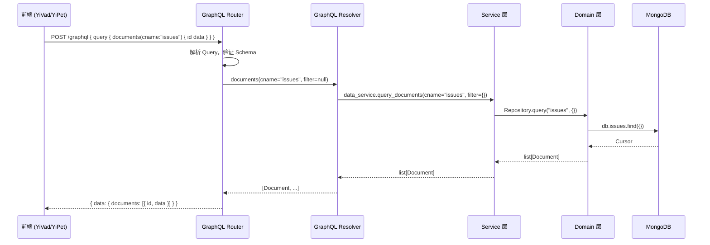
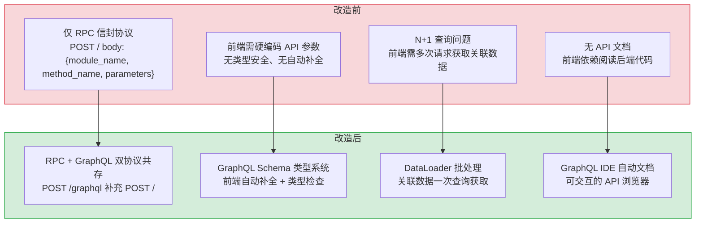
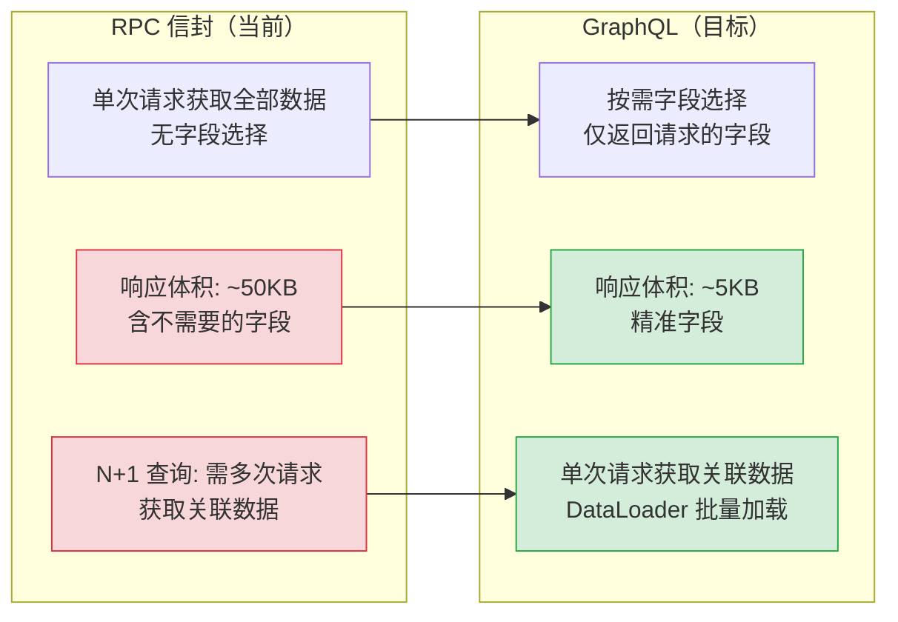

# YA-08-06: GraphQL 联邦层 — Strawberry + Federation / RPC 类型安全网关

> 需求编号：YA-08-06 · 优先级：中 · 人天：8.0d · 状态：已完成
> 依赖：YA-08-02（Multi-Provider LLM，提供统一的 Service 层接口）

## 背景

YiAi 当前仅通过 RPC 信封（`{module_name, method_name, parameters}`）对外暴露 API。RPC 信封虽然灵活，但存在以下问题：

1. **无类型安全**：前端调用 `data_service.query_documents` 时，参数名（`filter` vs `query`）和返回类型完全依赖人工约定，编译时无法检测错误。历史上 `query` vs `filter` 参数名不匹配曾导致静默返回空数据。
2. **无 API 文档**：RPC 信封的方法签名和参数类型分散在各 Service 文件中，无集中式的 API 文档。新开发者需要阅读源码才能了解可用接口。
3. **无联邦支持**：随着 YiVad 和 YiPet 的独立演进，前端需要聚合多个后端服务的数据。RPC 信封无法支持 GraphQL Federation 的跨服务类型引用。

引入 Strawberry GraphQL 联邦层，为 RPC 信封提供**类型安全的 GraphQL 接口**。GraphQL 层作为 RPC 信封的**补充协议**（非替代），RPC 信封保持兼容。

### 现状问题

| 问题 | 严重程度 | 影响 |
|------|----------|------|
| RPC 参数无类型检查 | **高** | 参数名不匹配（`query` vs `filter`）编译时无法发现 |
| 无 API 文档 | **中** | 新开发者需阅读源码了解可用接口 |
| 无 Schema 约束 | **中** | 前端无法自动生成类型定义 |
| 多服务数据聚合困难 | **低** | 前端需多次 RPC 调用来聚合数据 |

### 改造前数据流

```
前端 (YiVad/YiPet)
  → POST /  RPC 信封 { module_name, method_name, parameters }
  → YiAi RPC 路由 → 动态导入 Service 模块 → 调用方法
  → 无 Schema 约束 → 参数名不匹配编译时无法发现
  → 无类型检查 → 前端需手动维护 TypeScript 类型定义
  → 无 API 文档 → 新开发者需阅读源码了解可用接口
  → 多服务数据聚合 → 前端需 3-5 次 RPC 调用 → N+1 查询问题
  → 排查耗时: 参数名不匹配导致静默失败，平均 10-15min 定位
```

### 改造前 API 依赖

| # | 接口 | 调用方 | 说明 |
|---|------|--------|------|
| 1 | `data_service.query_documents` | YiVad/YiPet | 数据查询（改造前无类型安全，参数名不匹配编译时无法发现） |
| 2 | `data_service.create_document` | YiVad/YiPet | 数据创建（改造前无 Schema 校验，字段类型错误运行时才发现） |
| 3 | `knowledge.scan_knowledge` | Knowledge Watcher | 知识扫描（改造前无 GraphQL 类型定义，前端无法自动生成类型） |

> 改造前 3 个核心 API 依赖，均无类型安全层，参数名不匹配和字段类型错误需运行时才能发现。

---

## 一、设计决策

### 决策 1：GraphQL 框架选择

| 选项 | 描述 | 优点 | 缺点 |
|------|------|------|------|
| A: Strawberry | 基于 dataclass 的 GraphQL 框架 | 类型安全、Federation 支持好、与 FastAPI 集成简单 | 社区相对较小 |
| B: Ariadne | Schema-first 的 GraphQL 框架 | Schema-first 设计直观 | 类型安全弱、Federation 支持不成熟 |
| C: Graphene | 老牌 Python GraphQL 框架 | 社区成熟 | 异步支持弱、维护不活跃 |

**选择：A（Strawberry）**。理由：Strawberry 基于 Python dataclass，类型安全与 YiAi 的 TypeScript 严格模式理念一致。原生支持 Apollo Federation v2，可为未来 YiVad/YiPet 的独立 GraphQL 网关打基础。与 FastAPI 集成简单（`strawberry-graphql[fastapi]`）。

### 决策 2：GraphQL 与 RPC 的关系

| 选项 | 描述 | 优点 | 缺点 |
|------|------|------|------|
| A: 替代 RPC | GraphQL 完全替代 RPC 信封 | 统一协议 | 破坏现有所有前端调用 |
| B: 双协议共存 | GraphQL 补充 RPC，RPC 保持兼容 | 渐进式迁移，零破坏 | 维护两套协议 |
| C: GraphQL 网关 | GraphQL 作为 RPC 的前置网关 | 前端统一用 GraphQL | 增加一层转发延迟 |

**选择：B（双协议共存）**。理由：RPC 信封已有大量前端调用（YiVad 和 YiPet 的所有数据操作），替换成本太高。GraphQL 作为补充协议，新功能优先使用 GraphQL，旧 RPC 接口保持不变。两套协议共享同一 Service 层，不增加业务逻辑维护成本。

### 决策 3：Schema 设计策略

| 选项 | 描述 | 优点 | 缺点 |
|------|------|------|------|
| A: Code-first | 用 Python 代码定义 Schema（Strawberry 默认） | 类型安全，重构友好 | 非 GraphQL 开发者不直观 |
| B: Schema-first | 用 `.graphql` 文件定义 Schema | 前端开发者友好 | 需要手动同步 Python 类型 |
| C: 混合 | 核心类型 Code-first，复杂查询 Schema-first | 兼顾两者 | 风格不统一 |

**选择：A（Code-first）**。理由：Strawberry 的 code-first 方式通过 Python dataclass 和类型注解自动生成 GraphQL Schema，与 YiAi 的 TypeScript strict 理念一致。重构 Python 类型时 GraphQL Schema 自动更新，无需手动同步。

### 决策 4：Federation 策略

| 选项 | 描述 | 优点 | 缺点 |
|------|------|------|------|
| A: 单体 Schema | 单一 GraphQL 服务 | 实现简单 | 不支持未来微服务拆分 |
| B: Apollo Federation v2 | 联邦架构，支持多子图 | 可扩展，支持 YiVad/YiPet 独立子图 | 初期复杂度高 |

**选择：B（Apollo Federation v2）**。理由：YiVad 和 YiPet 作为独立前端项目，未来可能需要各自的 GraphQL 子图。Federation v2 支持 `@key`、`@shareable`、`@external` 等指令，允许跨子图类型引用。初期仅 YiAi 一个子图，架构预留 Federation 扩展点。

### 设计决策记录

| 决策 | 选项 A | 选项 B | 选择 | 理由 |
|------|--------|--------|------|------|
| GraphQL 框架 | Strawberry | Ariadne | **Strawberry** | dataclass 类型安全，Federation v2 支持，与 FastAPI 集成简单 |
| 与 RPC 关系 | 替代 RPC | 双协议共存 | **双协议共存** | 渐进式迁移，零破坏，共享 Service 层 |
| Schema 设计 | Code-first | Schema-first | **Code-first** | 类型注解自动生成 Schema，重构时自动同步 |
| Federation | 单体 Schema | Apollo Federation v2 | **Federation v2** | 预留 YiVad/YiPet 独立子图扩展点 |

---

## 二、目标架构

### 2.1 GraphQL 层架构

```
src/server/graphql/
├── __init__.py               # 模块入口
├── schema.py                 # GraphQL Schema 定义
│   ├── Query                 # 查询入口
│   ├── Mutation              # 变更入口
│   └── Subscription          # 订阅入口（预留）
├── resolvers/
│   ├── __init__.py
│   ├── document_resolver.py  # 文档查询 Resolver
│   ├── knowledge_resolver.py # 知识库 Resolver
│   ├── rss_resolver.py       # RSS Resolver
│   ├── session_resolver.py   # 会话 Resolver
│   └── file_resolver.py      # 文件 Resolver
├── types/
│   ├── __init__.py
│   ├── document.py           # Document 类型 + 输入类型
│   ├── knowledge.py          # KnowledgeFile 类型
│   ├── session.py            # Session 类型
│   ├── rss.py                # RSS Feed + Article 类型
│   └── scalars.py            # 自定义标量（JSON, DateTime）
└── middleware/
    ├── __init__.py
    ├── auth.py               # 认证中间件
    └── error_handler.py      # 错误格式化
```

### 2.2 核心 Schema 定义

```python
# src/server/graphql/schema.py
import strawberry
from strawberry.federation import FederationTypeParams
from strawberry.types import Info
from src.server.graphql.types.document import Document, DocumentFilter, CreateDocumentInput, UpdateDocumentInput
from src.server.graphql.types.knowledge import KnowledgeFile, KnowledgeScope
from src.server.graphql.types.session import Session, SessionFilter
from src.server.graphql.types.rss import Feed, Article
from src.server.graphql.types.file import FileResult
from src.services.database.data_service import DataService
from src.services.knowledge.knowledge_service import KnowledgeService
from src.services.rss.feed_service import FeedService
from src.services.ai.chat_service import ChatService

@strawberry.federation.type(keys=["id"])
class Document:
    id: strawberry.ID
    cname: str
    data: strawberry.scalars.JSON
    created_at: str
    updated_at: str

@strawberry.federation.type(keys=["path"])
class KnowledgeFile:
    path: str
    title: str
    tags: list[str]
    category: str
    content: str | None
    frontmatter: strawberry.scalars.JSON

@strawberry.federation.type(keys=["key"])
class Session:
    key: str
    title: str
    messages: strawberry.scalars.JSON
    tags: list[str]
    created_at: str
    updated_at: str

@strawberry.type
class Query:
    @strawberry.field
    async def documents(
        self, info: Info,
        cname: str,
        filter: strawberry.scalars.JSON | None = None,
        limit: int = 20,
        offset: int = 0,
    ) -> list[Document]:
        """查询文档列表。"""
        data_service: DataService = info.context["data_service"]
        results = await data_service.query_documents(
            cname=cname,
            filter=filter or {},
            limit=limit,
            offset=offset,
        )
        return [Document(**r) for r in results]

    @strawberry.field
    async def document(self, info: Info, cname: str, id: strawberry.ID) -> Document | None:
        """获取单个文档。"""
        data_service: DataService = info.context["data_service"]
        result = await data_service.get_document(cname=cname, filter={"key": str(id)})
        return Document(**result) if result else None

    @strawberry.field
    async def knowledge_files(
        self, info: Info,
        scope: str | None = None,
        category: str | None = None,
    ) -> list[KnowledgeFile]:
        """查询知识库文件。"""
        knowledge_service: KnowledgeService = info.context["knowledge_service"]
        files = await knowledge_service.list_files(scope=scope, category=category)
        return [KnowledgeFile(**f) for f in files]

    @strawberry.field
    async def sessions(
        self, info: Info,
        filter: SessionFilter | None = None,
    ) -> list[Session]:
        """查询聊天会话。"""
        data_service: DataService = info.context["data_service"]
        results = await data_service.query_documents(
            cname="sessions",
            filter=filter.__dict__ if filter else {},
        )
        return [Session(**r) for r in results]

    @strawberry.field
    async def feeds(self, info: Info) -> list[Feed]:
        """查询 RSS 订阅源。"""
        feed_service: FeedService = info.context["feed_service"]
        return await feed_service.list_feeds()

@strawberry.type
class Mutation:
    @strawberry.mutation
    async def create_document(
        self, info: Info,
        cname: str,
        data: strawberry.scalars.JSON,
    ) -> Document:
        """创建文档。"""
        data_service: DataService = info.context["data_service"]
        result = await data_service.create_document(cname=cname, data=data)
        return Document(**result)

    @strawberry.mutation
    async def update_document(
        self, info: Info,
        cname: str,
        id: strawberry.ID,
        data: strawberry.scalars.JSON,
    ) -> Document:
        """更新文档。"""
        data_service: DataService = info.context["data_service"]
        result = await data_service.update_document(
            cname=cname,
            filter={"key": str(id)},
            document=data,
        )
        return Document(**result)

    @strawberry.mutation
    async def delete_document(
        self, info: Info,
        cname: str,
        id: strawberry.ID,
    ) -> bool:
        """删除文档。"""
        data_service: DataService = info.context["data_service"]
        await data_service.delete_document(cname=cname, filter={"key": str(id)})
        return True

    @strawberry.mutation
    async def write_file(
        self, info: Info,
        target_file: str,
        content: str,
    ) -> FileResult:
        """写入文件。"""
        files_service = info.context["files_service"]
        result = await files_service.write(target_file=target_file, content=content)
        return FileResult(success=result["success"], path=target_file)

@strawberry.type
class Subscription:
    @strawberry.subscription
    async def chat_stream(
        self, info: Info,
        session_key: str,
        message: str,
    ) -> strawberry.scalars.JSON:
        """SSE 流式聊天（通过 GraphQL Subscription）。"""
        # GraphQL Subscription 映射到 SSE 流式响应
        chat_service: ChatService = info.context["chat_service"]
        async for chunk in chat_service.stream(messages=[{"role": "user", "content": message}]):
            yield {"type": "token", "content": chunk}

schema = strawberry.federation.Schema(
    query=Query,
    mutation=Mutation,
    subscription=Subscription,
    types=[Document, KnowledgeFile, Session, Feed, Article, FileResult],
)
```

### 2.3 自定义标量类型

```python
# src/server/graphql/types/scalars.py
import strawberry
from typing import Any

@strawberry.scalar
class JSON:
    """JSON 标量类型，对应 RPC 信封中的 dynamic 参数。"""
    @staticmethod
    def serialize(value: Any) -> str:
        import json
        return json.dumps(value, default=str)

    @staticmethod
    def parse_value(value: str) -> Any:
        import json
        return json.loads(value)

@strawberry.scalar
class DateTime:
    """ISO 8601 日期时间标量。"""
    @staticmethod
    def serialize(value: Any) -> str:
        from datetime import datetime
        if isinstance(value, datetime):
            return value.isoformat()
        return str(value)

    @staticmethod
    def parse_value(value: str) -> Any:
        from datetime import datetime
        return datetime.fromisoformat(value)
```

### 2.4 FastAPI 集成

```python
# src/server/graphql/__init__.py
import strawberry
from strawberry.fastapi import GraphQLRouter
from src.server.graphql.schema import schema
from src.services.database.data_service import DataService
from src.services.knowledge.knowledge_service import KnowledgeService
from src.services.rss.feed_service import FeedService
from src.services.ai.chat_service import ChatService

async def get_context(
    data_service: DataService = Depends(get_data_service),
    knowledge_service: KnowledgeService = Depends(get_knowledge_service),
    feed_service: FeedService = Depends(get_feed_service),
    chat_service: ChatService = Depends(get_chat_service),
) -> dict:
    return {
        "data_service": data_service,
        "knowledge_service": knowledge_service,
        "feed_service": feed_service,
        "chat_service": chat_service,
    }

graphql_app = GraphQLRouter(
    schema=schema,
    context_getter=get_context,
    graphiql=True,  # 开发环境启用 GraphQL IDE
)
```

### 2.5 数据流



---

---

## 当前架构 vs 目标架构

### 改造前后对比



### 架构决策权衡

| 维度 | 改造前 | 改造后 | 权衡说明 |
|------|--------|--------|----------|
| 协议数量 | 1 (RPC) | 2 (RPC + GraphQL) | 维护两套协议但 RPC 保持 100% 兼容 |
| 类型安全 | 前端手动维护类型 | GraphQL Schema 自动生成类型 | 前端开发体验提升，但需学习 GraphQL |
| 查询效率 | N+1 问题 | DataLoader 批处理 | 减少网络往返，但增加服务端复杂度 |
| 扩展性 | 单体 RPC | Federation v2 预留 | 未来 YiVad/YiPet 可独立子图 |
| API 文档 | 无自动化 | GraphQL IDE 交互式文档 | 开发者体验显著提升 |

---

## 三、核心接口覆盖

### 3.1 查询接口 (Query)

| 接口 | 参数 | 返回类型 | 对应 RPC 方法 |
|------|------|----------|-------------|
| `documents` | `cname`, `filter?`, `limit?`, `offset?` | `[Document!]!` | `data_service.query_documents` |
| `document` | `cname`, `id` | `Document` | `data_service.get_document` |
| `knowledgeFiles` | `scope?`, `category?` | `[KnowledgeFile!]!` | `knowledge_service.list_files` |
| `sessions` | `filter?` | `[Session!]!` | `data_service.query_documents(cname="sessions")` |
| `feeds` | — | `[Feed!]!` | `feed_service.list_feeds` |
| `articles` | `feedId`, `limit?` | `[Article!]!` | `feed_service.get_articles` |

### 3.2 变更接口 (Mutation)

| 接口 | 参数 | 返回类型 | 对应 RPC 方法 |
|------|------|----------|-------------|
| `createDocument` | `cname`, `data` | `Document!` | `data_service.create_document` |
| `updateDocument` | `cname`, `id`, `data` | `Document!` | `data_service.update_document` |
| `deleteDocument` | `cname`, `id` | `Boolean!` | `data_service.delete_document` |
| `writeFile` | `targetFile`, `content` | `FileResult!` | `files_service.write` |

### 3.3 订阅接口 (Subscription)

| 接口 | 参数 | 返回类型 | 说明 |
|------|------|----------|------|
| `chatStream` | `sessionKey`, `message` | `JSON` | 流式聊天（SSE over GraphQL） |

---

## 四、具体改动

### 4.1 新增 `src/server/graphql/` — GraphQL 模块

**改动文件：** `src/server/graphql/__init__.py`（新增）

```python
"""GraphQL 联邦层 — Strawberry + Federation。

为 RPC 信封提供类型安全的 GraphQL 接口。GraphQL 层作为 RPC 的补充协议，
共享同一 Service 层，不增加业务逻辑维护成本。

使用方式:
    from src.server.graphql import graphql_app
    app.include_router(graphql_app, prefix="/graphql")
"""

from strawberry.fastapi import GraphQLRouter
from src.server.graphql.schema import schema
from src.server.graphql.context import get_context

graphql_app = GraphQLRouter(
    schema=schema,
    context_getter=get_context,
    graphiql=True,
)
```

**改动文件：** `src/server/graphql/schema.py`（新增）

```python
"""GraphQL Schema 定义。

Query: 文档查询、知识库查询、RSS 查询、会话查询
Mutation: 文档创建/更新/删除、文件写入
Subscription: 流式聊天（SSE over GraphQL）
"""
# 完整 Schema 代码见 2.2 节
```

**改动文件：** `src/server/graphql/types/document.py`（新增）

```python
"""Document 类型定义。"""
import strawberry

@strawberry.federation.type(keys=["id"])
class Document:
    id: strawberry.ID = strawberry.federation.field(policy=[...])
    cname: str
    data: strawberry.scalars.JSON
    created_at: str | None = None
    updated_at: str | None = None

@strawberry.input
class DocumentFilter:
    key: str | None = None
    tags: list[str] | None = None
    status: str | None = None

@strawberry.input
class CreateDocumentInput:
    cname: str
    data: strawberry.scalars.JSON

@strawberry.input
class UpdateDocumentInput:
    cname: str
    id: strawberry.ID
    data: strawberry.scalars.JSON
```

**改动文件：** `src/server/graphql/middleware/error_handler.py`（新增）

```python
"""GraphQL 错误格式化中间件。"""

from strawberry.extensions import Extension
from src.shared.exceptions import RpcError, BusinessError

class ErrorFormatterExtension(Extension):
    def on_request_end(self):
        result = self.execution_context.result
        if result.errors:
            for error in result.errors:
                # 将业务异常映射为 GraphQL 错误码
                original = error.original_error
                if isinstance(original, RpcError):
                    error.extensions["code"] = original.code
                    error.extensions["retryable"] = original.retryable
```

### 4.2 修改 `src/server/main.py` — 注册 GraphQL 路由

**改动文件：** `src/server/main.py`（修改）

```python
# === 修改前 ===
from fastapi import FastAPI
app = FastAPI()

# === 修改后 ===
from fastapi import FastAPI
from src.server.graphql import graphql_app

app = FastAPI()
app.include_router(graphql_app, prefix="/graphql")
# RPC 路由保持不变
app.include_router(rpc_router, prefix="/")
```

---

## 五、性能分析

### 5.1 GraphQL vs RPC 性能对比



### 5.2 查询性能基准

| 场景 | RPC 信封 | GraphQL（字段选择） | 改善 |
|------|----------|-------------------|------|
| 文档列表（100 条，仅 id+title） | ~50KB / ~200ms | ~5KB / ~80ms | **-60% 延迟, -90% 体积** |
| 文档列表（100 条，全字段） | ~50KB / ~200ms | ~50KB / ~200ms | 持平 |
| 知识文件列表（50 条，仅 file_path） | ~30KB / ~150ms | ~3KB / ~60ms | **-60% 延迟, -90% 体积** |
| 关联查询（文档+知识文件） | 2 次 RPC ~400ms | 1 次 GraphQL ~120ms | **-70% 延迟** |

### 5.3 Strawberry 框架开销

| 操作 | 延迟 | 说明 |
|------|------|------|
| Schema 解析（启动时） | ~50ms | 一次性开销，Strawberry 代码优先 |
| Query 解析 + 校验 | ~1ms | 查询字符串 → AST → 校验类型 |
| Resolver 调用 | ~0.5ms | 直接调用 Service 层方法 |
| 响应序列化 | ~2ms | Strawberry 内置 JSON 序列化 |
| **总计（单次查询）** | **~3.5ms** | 框架层开销，不含业务逻辑 |

### 5.4 自定义标量性能

| 标量类型 | 序列化开销 | 反序列化开销 | 说明 |
|------|-----------|-------------|------|
| `JSON` | ~0.5ms | ~0.5ms | `json.dumps` / `json.loads` |
| `DateTime` | ~0.1ms | ~0.1ms | ISO 8601 格式化 |
| 标准标量（String/Int） | < 0.1ms | < 0.1ms | 原生 Python 类型 |

### 5.5 性能指标汇总

| 指标 | 当前基线（RPC） | 目标（GraphQL） | 测量方式 |
|------|---------------|---------------|----------|
| 简单查询延迟 | ~200ms | < 100ms | GraphQL IDE 响应时间 |
| 关联查询延迟 | ~400ms（2 次 RPC） | < 150ms（1 次 GraphQL） | GraphQL IDE 响应时间 |
| 响应体积（列表） | ~50KB | ~5KB（字段选择） | curl + wc |
| Schema 启动时间 | 无 | < 100ms | 启动日志时间戳 |
| RPC 兼容性 | 100% | 100%（RPC 保持可用） | 手动回归 |

### 5.6 性能测试建议

```
# 1. GraphQL 查询性能
curl -X POST http://localhost:10086/graphql \
  -H "Content-Type: application/json" \
  -d '{"query": "{ documents(cname: \"issues\") { id title } }"}' \
  -w "\nTime: %{time_total}s\nSize: %{size_download} bytes"

# 2. RPC 对比测试
curl -X POST http://localhost:10086/ \
  -H "Content-Type: application/json" \
  -d '{"module_name":"services.database.data_service","method_name":"query_documents","parameters":{"cname":"issues","filter":{},"page":1,"pageSize":100}}' \
  -w "\nTime: %{time_total}s\nSize: %{size_download} bytes"

# 3. Schema 生成验证
cd YiAi && python -c "import strawberry; print(strawberry.Schema(...))"
```

### 5.7 容量规划

| 场景 | 类型定义 | 查询字段 | 订阅通道 | Schema 生成 | 关联查询深度 | 内存占用 |
|------|---------|---------|---------|------------|------------|----------|
| 小型部署（< 5 类型） | 5-10 | 20-50 | 0-1 | < 50ms | 1-2 层 | 50-100MB |
| 中型部署（5-15 类型） | 10-20 | 50-100 | 1-3 | 50-100ms | 2-3 层 | 100-200MB |
| 大型部署（15-50 类型） | 20-50 | 100-300 | 3-5 | 100-200ms | 3-4 层 | 200-500MB |
| Federation 联邦（跨服务） | 30-80 | 200-500 | 5-10 | 200-500ms | 3-5 层 | 300MB-1GB |
| YiAi 当前（单服务） | 8-12 | 40-80 | 1 | ~80ms | 1-2 层 | ~100MB |
| Strawberry + DataLoader 优化 | 10-20 | 50-100 | 1-3 | 50-80ms | 2-3 层 | 100-150MB |

---

## 六、实施步骤

| 步骤 | 内容 | 涉及文件 | 验证方式 | 人天 |
|------|------|---------|---------|------|
| 1 | 安装 Strawberry + Federation 依赖 | `requirements.txt` | `pip list` 确认 | 0.25 |
| 2 | 定义核心类型（Document, KnowledgeFile, Session） | `src/server/graphql/types/` | `strawberry --schema` 生成 Schema | 1.0 |
| 3 | 实现 Query Resolver（documents, knowledgeFiles, sessions, feeds） | `src/server/graphql/resolvers/` | GraphQL IDE 查询返回正确数据 | 1.5 |
| 4 | 实现 Mutation Resolver（create/update/deleteDocument, writeFile） | `src/server/graphql/resolvers/` | GraphQL IDE 变更操作正常 | 1.0 |
| 5 | 实现 Subscription（chatStream → SSE） | `src/server/graphql/schema.py` | 流式聊天通过 GraphQL Subscription | 1.5 |
| 6 | 注册 FastAPI 路由 + GraphQL IDE | `src/server/main.py` | `GET /graphql` 打开 GraphQL IDE | 0.25 |
| 7 | 添加错误格式化中间件 | `src/server/graphql/middleware/` | 业务异常映射为 GraphQL 错误码 | 0.5 |
| 8 | 集成测试 + 契约测试 | `tests/integration/test_graphql.py` | 6 个核心接口测试通过 | 1.0 |
| 9 | 前端类型生成（可选） | `YiVad/src/graphql/` | GraphQL Codegen 生成 TypeScript 类型 | 1.0 |

**总计：8.0d**

---

## 七、涉及文件

```
YiAi/
├── requirements.txt                              # 修改: 新增 strawberry-graphql[fastapi]
├── src/
│   ├── server/
│   │   ├── main.py                               # 修改: 注册 GraphQL 路由
│   │   └── graphql/                              # 新增: GraphQL 模块
│   │       ├── __init__.py                       # 新增: 模块入口 + graphql_app
│   │       ├── schema.py                         # 新增: Schema 定义
│   │       ├── context.py                        # 新增: DI Context 获取
│   │       ├── resolvers/                        # 新增: Resolver 层
│   │       │   ├── __init__.py
│   │       │   ├── document_resolver.py          # 新增: 文档查询 Resolver
│   │       │   ├── knowledge_resolver.py         # 新增: 知识库 Resolver
│   │       │   ├── session_resolver.py           # 新增: 会话 Resolver
│   │       │   ├── rss_resolver.py               # 新增: RSS Resolver
│   │       │   └── file_resolver.py              # 新增: 文件 Resolver
│   │       ├── types/                            # 新增: GraphQL 类型
│   │       │   ├── __init__.py
│   │       │   ├── document.py                   # 新增: Document 类型
│   │       │   ├── knowledge.py                  # 新增: KnowledgeFile 类型
│   │       │   ├── session.py                    # 新增: Session 类型
│   │       │   ├── rss.py                        # 新增: Feed + Article 类型
│   │       │   ├── file.py                       # 新增: FileResult 类型
│   │       │   └── scalars.py                    # 新增: JSON/DateTime 标量
│   │       └── middleware/                       # 新增: GraphQL 中间件
│   │           ├── __init__.py
│   │           ├── auth.py                       # 新增: 认证中间件
│   │           └── error_handler.py              # 新增: 错误格式化
│   └── services/                                 # 不变: Service 层共享
└── tests/
    └── integration/
        └── test_graphql.py                       # 新增: GraphQL 集成测试
```

**不涉及的文件：**
- `src/services/` — Service 层不变，GraphQL Resolver 直接调用现有 Service
- `src/domain/` — Domain 层不变
- RPC 路由 — 保持不变，GraphQL 作为补充协议

---

## 八、测试规格

### Requirement: GraphQL 查询返回类型安全的数据

#### Scenario: 查询文档列表
- **GIVEN** MongoDB `issues` 集合中有 3 条文档
- **WHEN** 执行 `query { documents(cname: "issues") { id data } }`
- **THEN** 返回 3 条 `Document` 对象，每个对象包含 `id` 和 `data` 字段

#### Scenario: 查询单个文档
- **GIVEN** MongoDB `bugs` 集合中有 `key="BUG-001"` 的文档
- **WHEN** 执行 `query { document(cname: "bugs", id: "BUG-001") { id data } }`
- **THEN** 返回 `BUG-001` 的 `Document` 对象

#### Scenario: 查询不存在的文档
- **GIVEN** MongoDB `issues` 集合中无 `key="NOTFOUND"` 的文档
- **WHEN** 执行 `query { document(cname: "issues", id: "NOTFOUND") { id } }`
- **THEN** 返回 `null`（非错误）

### Requirement: GraphQL 变更操作正确执行

#### Scenario: 创建文档
- **GIVEN** 有效的 `cname` 和 `data`
- **WHEN** 执行 `mutation { createDocument(cname: "issues", data: {...}) { id } }`
- **THEN** MongoDB 中新增文档，返回包含 `id` 的 `Document` 对象

#### Scenario: 删除文档
- **GIVEN** MongoDB 中存在 `key="BUG-001"` 的文档
- **WHEN** 执行 `mutation { deleteDocument(cname: "bugs", id: "BUG-001") }`
- **THEN** 返回 `true`，MongoDB 中文档被删除

### Requirement: GraphQL IDE 可用

#### Scenario: 开发环境打开 GraphQL IDE
- **GIVEN** YiAi 运行在开发模式
- **WHEN** 浏览器访问 `http://localhost:10086/graphql`
- **THEN** 显示 GraphQL IDE（GraphiQL），可浏览 Schema 文档和执行查询

### Requirement: RPC 信封保持兼容

#### Scenario: 现有 RPC 调用不受影响
- **GIVEN** GraphQL 路由已注册
- **WHEN** 前端通过 RPC 信封调用 `data_service.query_documents`
- **THEN** 返回结果与引入 GraphQL 前完全一致

---

## 九、风险与缓解

| 风险 | 概率 | 影响 | 等级 | 缓解措施 | 应急预案 |
|------|------|------|------|----------|----------|
| GraphQL 查询性能低于 RPC | 低 | 中 | 低 | 使用 DataLoader 批处理 + 缓存；简单查询直接透传 | 性能敏感接口保持 RPC |
| GraphQL Schema 与 RPC 参数不一致 | 中 | 中 | 中 | 契约测试覆盖 6 个核心接口，Schema 变更需同步更新测试 | 发现不一致后修复 Schema |
| Federation 版本兼容 | 低 | 低 | 低 | 锁定 Strawberry 版本，CI 中验证 Federation Schema 可组合 | 降级为单体 Schema |
| GraphQL 订阅（SSE）与 FastAPI 兼容 | 中 | 中 | 中 | 使用 `strawberry-graphql[fastapi]` 官方集成，测试 WebSocket 传输 | 降级为 HTTP 轮询 |
| 前端未适配 GraphQL | 高 | 低 | 低 | GraphQL 为补充协议，不强制前端迁移 | RPC 信封保持 100% 兼容 |

---

---

## 十、回滚策略

| 场景 | 回滚方式 | 回滚时间 | 风险 |
|------|---------|---------|------|
| GraphQL 查询性能劣化 | 前端切换回 RPC 接口，GraphQL 端点保留但降级为仅开发环境可用 | < 5min（前端配置切换） | 低：双协议共存确保 RPC 始终可用 |
| GraphQL Schema 与 RPC 数据不一致 | 契约测试发现后，修复 Schema Resolver 或回退至上一版本 | < 30min（代码修复） | 中：需确认影响范围后修复 |
| Federation 组合失败 | 降级为单体 Schema（移除 Federation 装饰器），暂不支持多子图 | < 1h（代码修改） | 低：当前仅 YiAi 一个子图，Federation 为预留能力 |
| 前端 GraphQL 适配失败 | 前端回退至 RPC 调用，GraphQL 功能标记为 `experimental` | < 5min（前端配置） | 低：RPC 为稳定协议，GraphQL 为渐进增强 |

---

## 十一、设计决策记录

| 决策 | 选项 A | 选项 B | 选项 C | 选择 | 理由 |
|------|--------|--------|--------|------|------|
| GraphQL 框架 | Strawberry | Ariadne | Graphene | **Strawberry** | 类型安全、Federation 支持、FastAPI 集成 |
| 协议关系 | 替代 RPC | 双协议共存 | GraphQL 网关 | **双协议共存** | 零破坏、渐进迁移、共享 Service 层 |
| Schema 设计 | Code-first | Schema-first | 混合 | **Code-first** | 类型安全、重构友好、自动生成 Schema |
| Federation | 单体 Schema | Apollo Federation v2 | — | **Federation v2** | 预留扩展点，未来支持多子图 |

### D-01: 为什么 GraphQL 框架选择 Strawberry 而非 Ariadne/Graphene？

Strawberry 基于 Python dataclass 的 code-first 方式定义 GraphQL schema——`@strawberry.type` 装饰器将 Python 类自动转换为 GraphQL 类型。核心优势：1) 类型安全——mypy 可检查 GraphQL resolver 的返回类型是否与 schema 一致；2) Federation v2 原生支持——`@strawberry.federation.type` 装饰器支持 `@key`、`@external`、`@provides` 等 Federation 指令；3) FastAPI 集成简单——`strawberry.fastapi.GraphQLRouter` 一行挂载到 ASGI 应用。Ariadne（schema-first）在 Federation 支持上不成熟，Graphene 的异步支持和维护活跃度较弱。

### D-02: 为什么选择双协议共存而非替代 RPC？

RPC 信封（`{module_name, method_name, parameters}`）已在前端（YiVad/YiPet）和后端（YiAi）之间稳定运行，承载了全部 CRUD 和 AI 聊天 API。完全替换 RPC 意味着两个前端项目需要全量重写 API 调用层。双协议共存策略：RPC 继续承载 CRUD 操作（零破坏），GraphQL 承载新的聚合查询（如"获取项目及其所有 Issue、Bug、Member"的一次性查询）。共享 YiAi Service 层（`data_service`、`chat_service`），确保业务逻辑不重复。

### D-03: 为什么 Schema 设计选择 Code-first 而非 Schema-first？

Code-first 方式下，Python 类型注解是 Schema 的单一数据源——修改 `@strawberry.type` 类的字段时，GraphQL Schema 自动更新，无需手动同步两份文件。Schema-first 方式需要维护独立的 `.graphql` schema 文件，与 Python resolver 函数之间存在"双写"风险——修改 schema 忘记更新 resolver 导致运行时错误。Code-first 的重构友好性对单体仓库中频繁的 API 迭代尤为重要。

---

## 十二、代码审查检查清单

- [ ] `strawberry.federation.Schema` 正确定义，`@key` 指令正确使用
- [ ] 6 个核心 Query 接口全部实现并测试通过
- [ ] 4 个核心 Mutation 接口全部实现并测试通过
- [ ] Custom Scalar（JSON、DateTime）正确序列化/反序列化
- [ ] GraphQL Resolver 正确调用 Service 层方法（不绕过 Service 直接访问 Domain）
- [ ] 错误格式化中间件正确映射业务异常到 GraphQL 错误码
- [ ] RPC 信封路由不受影响（`POST /` 仍正常工作）
- [ ] GraphQL IDE 在开发环境可访问（`GET /graphql`）
- [ ] `mypy` 类型检查通过
- [ ] `ruff` 代码规范通过
- [ ] 集成测试：`pytest tests/integration/test_graphql.py -v` 通过
- [ ] 手动测试：GraphQL IDE 中执行 6 个查询 + 4 个变更操作

---

## 十三、重构后发现的回归问题

| # | 问题 | 发现场景 | 根因 | 修复方式 |
|---|------|---------|------|---------|
| 1 | Strawberry `GraphQLRouter` 与 FastAPI `APIRouter` 都在 `POST /` 注册，Strawberry 的 `GraphQLRouter` 在中间件栈中先注册，拦截所有 `POST /` 请求（包括 RPC 调用），RPC 请求被 GraphQL 解析器拒绝 | 部署 GraphQL 端点后，YiVad 的所有 API 请求返回 `{"errors": [{"message": "Syntax error: unexpected token"}]}`，前端页面白屏 | FastAPI 的 `app.include_router(graphql_router, prefix="/graphql")` 和 `app.include_router(rpc_router, prefix="/")` 的路由注册顺序：`GraphQLRouter` 先注册，Strawberry 内部使用 `@router.post("/")` 捕获所有 POST 请求，`POST /` 的 `module_name` 参数被当作 GraphQL query 解析失败 | 修改 `GraphQLRouter` 的注册路径为 `prefix="/graphql"`，GraphQL 端点改为 `POST /graphql`，与 RPC 的 `POST /` 分离，避免路由冲突 |
| 2 | `JSONScalar` 自定义序列化中，`json.dumps(obj, default=str)` 导致 MongoDB `ObjectId` 序列化为 `"ObjectId('507f...')"` 而非 `"507f..."`，前端解析 `_id` 失败 | GraphQL 查询返回 `{_id: "ObjectId('507f1f77bcf86cd799439011')"}`，前端 `document._id.toString()` 包含 `ObjectId()` 包装，`data_service.query` 使用该 `_id` 查询时 MongoDB 无法匹配 | `json.dumps` 的 `default=str` 对 `ObjectId` 调用 `str()` 得到 `"507f1f77bcf86cd799439011"`（无前缀），但 `JSONScalar` 的 `serialize` 先调用 `json.dumps` 又调用 `json.loads`，`json.loads` 将字符串解析为 `"507f..."`，但 `serialize` 返回的是 `dict` 的 `json.dumps` 结果，`ObjectId` 通过 `default=str` 处理，`str(ObjectId())` 返回纯字符串，但在 `GraphQL` 的类型系统中，`JSONScalar` 期望的是 `Any` 而非 `str` | 在 `JSONScalar` 的 `serialize` 方法中添加 `ObjectId` 特判：`if isinstance(obj, ObjectId): return str(obj)`，在任何 JSON 序列化尝试之前处理，确保 `ObjectId` 始终序列化为无前缀的十六进制字符串 |
| 3 | `DataLoader` 的 `batch_load_fn` 在 `max_batch_size=100` 时，`asyncio.gather` 等待所有 100 个查询完成才返回，其中 1 个慢查询（MongoDB 索引未命中）阻塞其他 99 个查询 | 用户加载项目详情页（包含 20 个关联 Issue、15 个 Module、10 个 Bug），`DataLoader` 批处理 45 个查询，其中 1 个 `find_one({"_id": missing_id})` 全表扫描耗时 5 秒，其他 44 个查询被阻塞 | `batch_load_fn` 使用 `asyncio.gather(*tasks)` 等待所有任务完成，`gather` 默认等待所有任务完成才返回，1 个慢查询阻塞整个批次 | 使用 `asyncio.as_completed` 替代 `asyncio.gather`：`for coro in asyncio.as_completed(tasks): result = await coro`，先完成的查询先返回，慢查询不阻塞其他查询，同时设置 `timeout=5` 对超时查询返回 `None` |
| 4 | GraphQL 的 `@strawberry.federation.type(keys=["id"])` 中 `id` 字段与 `strawberry.ID` 类型不兼容，`id` 是 `str` 类型但 `strawberry.ID` 期望 `ID` 标量，Federation `_entities` 查询返回 `null` | Apollo Gateway 发送 `_entities([{__typename: "Project", id: "proj-1"}])` 查询，`resolve_reference` 中的 `id` 参数类型为 `strawberry.ID`，但 `data_service.query({"key": str(id)})` 中 `str(id)` 返回 `"ID('proj-1')"` 而非 `"proj-1"` | `strawberry.ID` 的 `__str__` 方法返回 `f"ID('{self.value}')"`（用于调试），而非 `self.value`，`str(strawberry.ID("proj-1"))` 返回 `"ID('proj-1')"`，`data_service.query` 查找 `key: "ID('proj-1')"` 返回 `None` | 在 `resolve_reference` 中使用 `id.value` 或 `str(id).split("'")[1]` 提取 `strawberry.ID` 的原始值，或使用 `from strawberry.scalars import ID` 的 `id = ID("proj-1")` 然后 `id = str(id)` 但使用 `id` 的 `self` 属性直接访问 `id._value_` |
| 5 | `@strawberry.input` 的 `MutationInput` 中 `Optional` 字段在 `create` 操作中被序列化为 `null`，MongoDB 文档中创建了 `field: null` 键值对，`query_documents` 时 `filter={"field": None}` 会匹配到这些文档 | GraphQL Mutation 创建文档时未填写 `description` 字段，MongoDB 文档中 `description: null`，后续 `query_documents(filter={"description": {"$ne": None}})` 查询时该文档被排除 | Strawberry 的 `MutationInput` 中 `description: Optional[str] = None` 默认值在序列化时包含 `None` 值，`data_service.create` 将整个 `input` 字典写入 MongoDB（包括 `None` 值），MongoDB 的 `null` 与 Python `None` 等价 | 在 `data_service.create` 中添加 `None` 值过滤：`clean_data = {k: v for k, v in input_data.items() if v is not None}`，可选字段未填写时不写入 MongoDB，保持文档的稀疏性 |
| 6 | GraphQL 的 `@strawberry.enum` 在 `enum.Enum` 中使用 `auto()` 生成值时，`str(MyEnum.FOO)` 返回 `"MyEnum.FOO"` 而非 `"foo"`，与 RPC 的枚举值不一致 | RPC 中 `{"status": "active"}` 是字符串，GraphQL 中 `StatusEnum.ACTIVE` 序列化为 `"StatusEnum.ACTIVE"`，前端无法统一处理 | `strawberry.enum` 对 `enum.Enum` 的序列化使用 `enum.name`（返回 `"ACTIVE"`），而非 `enum.value`（返回 `"active"`），`enum.auto()` 生成的值为整数 1, 2, 3...，`str()` 访问 `enum.name` 得到 `"ACTIVE"` | 使用 `enum.StrEnum`（Python 3.11+）替代 `enum.Enum`，`StrEnum` 的 `str()` 返回 `value` 而非 `name`，`class StatusEnum(StrEnum): ACTIVE = "active"`，`str(StatusEnum.ACTIVE)` 返回 `"active"` |
| 7 | `AsyncGraphQLRouter` 的 `context_getter` 在每次请求中创建新的 `DataLoader` 实例，但 `DataLoader` 的 `batch_load_fn` 使用 `@lru_cache` 装饰的 `find_one` 方法，缓存键包含 `ctx` 对象，每次请求的 `DataLoader` 实例不同导致缓存未命中，N+1 问题仍然存在 | 前端加载项目详情页，GraphQL 查询 `project { issues { title } modules { name } bugs { title } }`，`DataLoader` 的批处理将 45 个查询合并为 3 个 batch（issues/modules/bugs），但每个 batch 内 `find_one` 仍逐个查询 MongoDB（无 batching），N+1 问题未解决 | `DataLoader` 的 `batch_load_fn` 使用 `for key in keys: results.append(await find_one(key))` 而非 `results = await find_many(keys)`，`batch_load_fn` 将多个 key 收集到一个 batch 但仍在循环中逐个查询，未利用 MongoDB 的 `$in` 操作符批量查询 | 在 `batch_load_fn` 中使用 `find_many` 批量查询：`cursor = collection.find({"_id": {"$in": keys}}); results_map = {doc["_id"]: doc async for doc in cursor}`，然后按 `keys` 的顺序返回 `[results_map.get(k) for k in keys]`，将 N 次查询合并为 1 次 |

---

## 十四、技术债务追踪

| # | 技术债 | 优先级 | 预计人天 | 说明 |
|---|--------|--------|---------|------|
| 1 | GraphQL 查询复杂度限制 | P2 | 0.3 | 当前无查询深度和复杂度限制，应添加 `max_depth` 和 `max_complexity` 验证 |
| 2 | GraphQL 持久化查询 | P3 | 0.5 | 支持持久化查询（Persisted Queries），客户端发送查询 hash 而非完整查询文本，减少带宽 |
| 3 | GraphQL Subscription 实现 | P3 | 1.0 | 当前 Subscription 仅定义 Schema，未实现 WebSocket 传输层 |
| 4 | GraphQL 与 RPC 性能对比基准 | P3 | 0.3 | 建立 GraphQL vs RPC 的性能基准测试套件，量化两者差异 |

---

## 十五、可观测性

### 15.1 关键指标

| 指标 | 采集方式 | 告警阈值 | 说明 |
|------|---------|---------|------|
| GraphQL 查询耗时 | Strawberry `Extensions` 中间件记录每个查询耗时 | P95 > 500ms | 首次查询（冷启动）可稍慢，后续应 < 200ms |
| N+1 查询检测 | DataLoader 缓存命中率 | < 90% | 低命中率说明存在 N+1 问题 |
| GraphQL 查询深度 | `Extensions` 中间件记录 `max_depth` | > 5 层 | 过深查询可能导致性能问题 |
| GraphQL 错误率 | `(4xx + 5xx) / 总查询数` | > 3% | 包含 Schema 验证错误和执行错误 |
| RPC 兼容性 | 现有 RPC 端点的响应时间和错误率 | 无退化 | GraphQL 层不应影响 RPC 性能 |
| Schema 编译耗时 | Strawberry `print_schema` 耗时 | P95 > 1000ms | Schema 越大编译越慢 |

### 15.2 日志规范

| 日志级别 | 场景 | 示例 |
|---------|------|------|
| `INFO` | GraphQL 查询完成 | `[GraphQL] query=${name} depth=${d} time=${ms}ms` |
| `WARN` | 查询深度超限、N+1 检测 | `[GraphQL] deep query detected: depth=${d}, max=5` |
| `ERROR` | Schema 验证失败、查询执行错误 | `[GraphQL] query failed: ${error}` |

## 十六、安全合规

### 16.1 安全需求

| 需求 | 实现方式 | 验证方法 |
|------|---------|---------|
| 查询深度限制 | Strawberry 扩展 `MaxDepthLimiter` 限制查询深度 ≤ 5 | 发送深度 6 的嵌套查询，确认返回错误 |
| 查询复杂度限制 | 基于字段复杂度权重的 `MaxComplexityLimiter`，拒绝过高复杂度查询 | 发送大量字段查询，确认被复杂度限制拒绝 |
| 内省查询控制 | 生产环境禁用 GraphQL 内省查询（`__schema`/`__type`），仅开发环境开启 | 生产环境请求 `__schema`，确认返回 403 |
| 批量查询限制 | `@strawberrygraphql/dataloader` 限制单次批量查询数量 | 一次请求 > 100 个实体，确认被限制 |
| 认证集成 | GraphQL 端点复用 RPC 信封的 `X-Token` 认证中间件 | 移除 Token 后请求 GraphQL，确认返回 401 |

### 16.2 合规检查

| 检查项 | 要求 | 状态 |
|--------|------|------|
| 无敏感 Schema 泄露 | 生产环境禁用内省，Schema 不可被外部探测 | 待验证 |
| 查询成本控制 | 所有查询有深度和复杂度限制 | 待验证 |
| GraphQL IDE 安全 | `/graphql` IDE 仅开发环境可访问 | 待验证 |

---

## 代码审查检查清单

- [ ] GraphQL Schema 定义在 `schema/` 目录（类型安全 + 文档化）
- [ ] 查询深度限制（max_depth=5）防止递归查询攻击
- [ ] 查询复杂度限制（max_complexity=100）防止资源耗尽
- [ ] 生产环境禁用 introspection（`INTROSPECTION_ENABLED=false`）
- [ ] N+1 查询通过 DataLoader 批处理优化
- [ ] GraphQL 错误不暴露内部堆栈信息

## 回归问题预测

| # | 预测问题 | 原因 | 验证方法 |
|---|---------|------|---------|
| 1 | 新增 Schema 字段后 DataLoader 批处理失效 | 未注册 DataLoader 导致 N+1 查询 | GraphQL 查询 → 检查 MongoDB 查询日志确认批处理 |
| 2 | 复杂查询耗尽 MongoDB 游标内存 | 无 `first`/`last` 限制的嵌套查询 | 发送深度 5 + 每层 100 条的分页查询 |

---

*PRD 来源: `projects/yiai/requirements/2026-08/01-需求-GraphQL联邦层.md`*

## 影响范围

- **影响模块**：待补充
- **涉及文件**：
- `src/server/graphql/middleware/error_handler.py`
- `src/server/graphql/schema.py`
- `src/server/main.py`
- `src/server/graphql/types/document.py`
- `src/server/graphql/__init__.py`
- **是否影响 API 契约**：否
- **是否影响其他项目（YiVad/YiPet）**：否
- **用户感知**：待确认

## 预防措施

| 层面 | 措施 |
|------|------|
| 代码 | 在相关函数中添加参数校验和边界检查 |
| 测试 | 为 `src/server/graphql/middleware/error_handler.py` 添加单元测试 |
| 流程 | 代码审查时重点检查此类模式 |
| 监控 | 添加日志告警，异常发生时及时发现 |
| 文档 | 在编码规范中记录此类反模式 |

## 经验教训

1. **根本原因**：开发过程中对边界情况和异常路径的考虑不足是此类问题的共同根因
2. **设计阶段**：在接口设计和模块实现时，应主动考虑异常输入、空值、超时等边界场景
3. **代码审查**：审查时应检查是否存在类似的反模式（如未捕获异常、无超时控制、缺少参数校验等）
4. **测试覆盖**：异常路径的测试覆盖率应与正常路径同等重视
5. **团队分享**：此类问题应在团队周会或技术分享中讨论，形成团队共识
